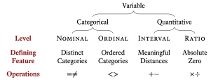
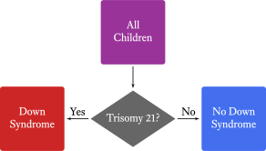
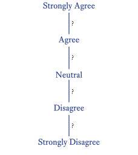

# Variables


```{r loadpacksdist2, include = F, cache=FALSE}
# source("loader.R")
```


Because there are so many different kinds of `r defword("variables", "A **variable** is an abstract category of information that can take on different values.")`, it is helpful to classify them by type so that we can think clearly about them and not use them incorrectly.  Some statistics only make sense with certain types of variables. To take a famously silly example from @zacharias1975trouble, you could calculate the average number in a telephone directory, but you wouldn't try calling it. The mean has no meaning for this kind of variable. Unfortunately, it is not always so obvious which statistics can be applied to which variables. If we unknowingly apply the wrong kind of statistic to a variable, our statistical software will give us a result, *but we will not know that it is nonsense*.

The classic `r defword("taxonomy", "A **taxonomy** is a classification system.")` for variable types [@stevens1946theory] distinguishes among nominal, ordinal, interval, and ratio scales (Figure\ \@ref(fig:Stevens)). Although it is clear that this taxonomy is incomplete [@cicchetti2006rating], there is no consensus about how exactly the list should be amended. If this book were about how to design psychological tests, we would explore this topic in depth. For our purposes, it is enough to say that the fundamentals of measurement and `r defword("scaling", "**Scaling** refers to the procedures by which we decide how to assign numbers to the attributes we measure.")` is philosophically complex and that controversies abound [@michell1997quantitative]. 

```{r Stevens, echo = F, fig.width=6.72, dev="svg", fig.align='center', out.width="100%", fig.cap="Stevens' levels of measurement"}

```

```{tikz StevensCode, button_latex = TRUE, eval=F, code=readLines("Stevens.tex")}

```


## Nominal Scales {#nominal}

In a `r defword("nominal scale", "A **nominal scale** groups observations into unordered categories.")`, we note only that some things are different from others and that they belong to two or more `r defword("mutually exclusive", "In **mutually exclusive** categories nothing belongs to more than one category (at the same time and in the same sense).")` categories. If we say that a person has Down syndrome (trisomy 21), we are implicitly using a nominal scale in which there are people with Down syndrome and people without Down syndrome. In a true nominal scale, there are no cases that fall between categories. To be sure, we might have some difficulty figuring out and reliably agreeing upon the category to which something belongs---but there is no conceptual space between categories.

In the messy world of observable reality, few true nominal variables exist as defined here. Most so-called nominal variables in psychology are merely nominal-*ish*. With respect to Down syndrome, we could say that people either have three copies of the 21st chromosome or they do not. However, if we did say that---and meant it---we'd be wrong. In point of fact, there are many cases of partial trisomy. There are other cases of Down syndrome in which part of chromosome 21 is copied to another chromosome. However, because cases like this are sufficiently rare and because such distinctions are usually not of vital importance, Down Syndrome is treated as if it were a true nominal variable. Even though Down Syndrome might technically come in degrees (both phenotypically and in terms of the underlying chromosomal abnormalities), the distinction between having the condition and not having it is not `r defword("arbitrary", "**Arbitrary** refers to things that are decided not by necessity but by preference, convenience, or whim.")`.

```{r dichotomy, echo=F, fig.cap="A (nearly) true dichotomy", fig.width=6.72, dev="svg", out.width="100%", fig.align='center'}
 
```

```{tikz dichotomyCode, button_latex = TRUE, eval=F, code=readLines("dichotomy.tex")}

```

```{r dichotomized, fig.cap="A dichomized continuum", dev="svg", echo = F, fig.align='center', fig.width=6, fig.height=4.5, out.width="100%"}
# A dichotomized continuum
ggplot() + 
  # geom_vline(xintercept = 70, linetype = "dashed") + 
  stat_function(xlim = c(40, 70), 
                fun = dnorm, 
                args = list(mean = 100, sd = 15), 
                geom = "area", 
                fill = myfills[2], 
                n = 1000) + 
  stat_function(xlim = c(70, 160), 
                fun = dnorm, 
                args = list(mean = 100, sd = 15), 
                geom = "area", 
                fill = myfills[1], 
                n = 1000) + 
  geom_segment(data = tibble(x = c(71, 69), 
                             xend = c(160, 40), 
                             y = dnorm(100, 100, 15) * 1.024),
               aes(x = x, 
                   y = y, 
                   xend = xend, 
                   yend = y), 
               color = myfills[1:2], 
               linejoin = "mitre",
               arrow = arrow(type = "closed", 
                             angle = 15, 
                             length = unit(2.25, "mm"))) + 
  geom_text(data = tibble(x = c(100, 55), 
                          y = dnorm(100, 100, 15) * 1.02,
                          l = c("No Intellectual\nDisability", 
                                "Intellectual\nDisability")),
            aes(x = x, 
                y = y,
                label = l),
            size = ggtext_size(bsize),
            vjust = -0.3, 
            lineheight = 1,
            color = myfills[1:2]) +
  annotate("segment", 
           x = 70, 
           xend = 70, 
           size = 0.25,
           y = dnorm(70, 100, 15), 
           yend = dnorm(100, 100, 15) * 1.14,
           linetype = "dashed",
           color = "gray30") +
  scale_x_continuous("IQ and Adaptive Functioning", 
                     breaks = seq(40, 160, 15),
                     expand = expansion(0)) + 
  scale_y_continuous(NULL, breaks = NULL, 
                     expand = expansion(c(.02,0))) + 
  # theme_minimal(base_size = bsize, base_family = bfont) + 
  ggthemes::theme_tufte(base_size = bsize) +
  theme(
    axis.ticks.x = element_line(size = 0.25),
        # axis.line.x = element_line(size = 0.25),
        # panel.grid = element_blank()
        ) +
  coord_cartesian(xlim = c(40, 161), clip = "off") +
  ggthemes::geom_rangeframe(data = tibble(x = c(40, 160)), aes(x = x), size = 0.25)

```


```{r dichotomousCode, button_r = T, ref.label="dichotomized"}

```


In contrast, consider the diagnosis of *intellectual disability*. We might have only two categories in our coding scheme (Intellectual Disability: Yes or No), but it is widely recognized that the condition comes in degrees (e.g., *none, borderline, mild, moderate, severe,* and *profound*). Thus, intellectual disability is not even conceptually nominal. It is a continuum that has been divided at a convenient but mostly arbitrary point (Figure\ \@ref(fig:dichotomized)). Distinguishing between a `r defword("dichotomous", "A **dichotomy** is a division of something into two categories.")` variable that is nominal by nature and one that has an underlying continuum matters because there are statistics that apply only to the latter type of variable (e.g., the tetrachoric correlation coefficient, Pearson & Heron [-@pearson1913theories]). Even so, in many procedures, the two types of dichotomies can be treated identically (e.g., comparing the means of two groups with an independent-samples *t*-test).

What if the categories in a nominal scale are not mutually exclusive? For example, suppose that we have a variable in which people can be classified as having either Down syndrome or Klinefelter syndrome (a condition in which a person has two X chromosomes and one Y chromosome). Obviously, this is a `r defword("false dichotomy", "In a **false dichotomy**, two alternatives are presented as if they are the only alternatives when, in fact, there are others available.")`. Most people have neither condition. Thus, we need to expand the nominal variable to have three categories: Down syndrome, Klinefelter syndrome, and neither. What if a person has both Down syndrome *and* Klinefelter syndrome? Okay, we just add a fourth category: both. This combinatorial approach is not so much a problem for some purposes (e.g., the ABO blood group system), but for many variables, it quickly becomes unwieldy. If we wanted to describe all chromosomal abnormalities with a single nominal variable, the number of combinations increases exponentially with each new category added. This might be okay if having two or more chromosomal abnormalities is very rare. If, however, the categories are not mutually exclusive and combinations are common enough to matter, it is generally easiest to make the variable into two or more nominal variables (Down syndrome: Yes or No; Klinefelter syndrome: Yes or No; Edwards syndrome: Yes or No; and so forth). Some false dichotomies are so commonly used that people know what you mean, even though they are incomplete (e.g., Democrat vs. Republican) or insensitive to people who do not fit neatly into any of the typical categories (e.g., male vs. female).

When we list the categories of a nominal variable, the order in which we do so is mostly arbitrary. In the variable *college major*, no major intrinsically comes before any other. It is convenient to list the categories alphabetically, but the order will change as the names of college majors evolve and will differ from language to language. However, strict alphabetical order is not always logical or convenient. For example, in a variable such as *ethnic identity*, the number of possible categories is very large, and members of very small groups are given the option of writing in their answer next to the word "other." To avoid confusion, the *other* category is placed at the end of the list rather than its alphabetical position.

## Ordinal Scales

In an `r defword("ordinal scale", "An **ordinal scale** groups observations into ordered categories.")`, things are still classified by category but the categories have a particular order. Suppose that we are conducting behavioral observations of a child in school and we record when the behavior occurred. The precise time at which the behavior occurred (e.g., 10:38\ AM) may be uninformative. If the class keeps a fairly regular schedule, it might be more helpful to divide the day into categories such as early morning, recess, late morning, lunch, and afternoon. This way it is easy to see if behavior problems are more likely to occur in some settings (or activities) than in others. It does not matter that these divisions are of unequal lengths or that they do not occur at precisely the same time each day. In a true ordinal variable, the distance between categories is either undefined, unspecified, or irrelevant. 

```{r Likert, fig.cap="In a Likert scale, the distances between categories are undefined.", fig.margin = TRUE, fig.width=4, dev="svg", out.width="100%", fig.align='default', echo=FALSE}

```

Most measurement in psychological assessment involves ordinal scales, though in many cases ordinal scales might appear to be other types of scales. Questionnaires that use Likert scales are clearly ordinal (e.g., Figure\ \@ref(fig:Likert)). Even though true/false items on questionnaires might seem like nominal scales, they are usually ordinal because the answer indicates whether a person has either more or less of an attribute. That is, *more* and *less* are inherently ordinal concepts. Likewise, ability test items are ordinal, even though *correct* vs. *incorrect* might seem like nominal categories. Ability tests are designed such that a correct response indicates more ability than an incorrect response. The ordinal nature of ability test items is especially clear in cases that allow for partial credit. 

```{tikz LikertCode, button_latex = TRUE, eval = F, code=readLines("Likert.tex")}

```

Some scales are only partially ordinal. For example, *educational attainment* is ordinal up to a certain point in most societies, but branches out as people acquire specialized training. For a career in psychology, the educational sequence is high school diploma, associate's degree, bachelor's degree, master's degree, and doctoral degree.^[Obviously, some of these degrees can be skipped and the endpoint is different for different careers in psychology. Furthermore, not all degrees fit neatly in this sequence (e.g., the school psychology specialist degree).] However, this is not the sequence for real estate agents, hair stylists, and pilots. If we wanted to compare educational degrees across professions, how would we rank them? For example, how would we compare a law degree with a doctorate in geology? Are they the same? Does one degree indicate higher educational attainment than the other? The answers depend on the criteria that we care about---and different people care about different things. Thus, it is difficult to say that we have an ordinal scale when we compare educational attainment across professions. 


```{r differentiation, fig.cap = "Anxiety is more differentiated at higher levels of distress", dev="svg", echo=FALSE, fig.width=6.72, out.width="100%",fig.align='default', fig.margin=T}
# Anxiety is more differentiated at higher levels of distress
bind_rows(
  tibble(label = "Paranoia",
         color = myfills[2],
         x = c(0, 7, 8, 10),
         y = c(4.8, 4.8, 3.5, 3.5)),
  tibble(label = "Obsession",
         color = colorspace::lighten(myfills[2], amount = 0.02),
         x = c(0, 7, 8, 10),
         y = c(4.9, 4.9, 4.5, 4.5)),
  tibble(label = "Worry",
         color = colorspace::lighten(myfills[1], amount = 0.02),
         x = c(0, 7, 8, 10),
         y = c(5.1, 5.1, 5.5, 5.5)),
  tibble(label = "Panic",
         color = myfills[1],
         x = c(0, 7, 8, 10),
         y = c(5.2, 5.2, 6.5, 6.5))) %>% 
  mutate(color = scales::col2hcl(color, c = 100 * ((x / 10) ^ 3))) %>%
  ggplot(aes(x,y)) + 
  ggforce::geom_bezier2(aes(group = label, color = color)) + 
  geom_text(aes(label = label, color = color), 
            hjust = 0,
            data = . %>% filter(x == 10), 
            nudge_x = 0.1,
            size = ggtext_size(30)) + 
  annotate("segment", 
           size = 1,
           x = 0, 
           y = 5, 
           xend = 10.5, 
           yend = 5, 
           arrow = arrow(12, type = "closed",), 
           linejoin = "mitre",
           color = "gray20") + 
  annotate(geom = "label", 
           x = 6, 
           y = 5, 
           label = "Distress Level", 
           size = ggtext_size(30, 1), 
           label.size = 0, 
           color = "gray20") +
  theme_void() + 
  theme(legend.position = "none") + 
  scale_color_identity() + 
  scale_x_continuous(expand = expansion(c(0, 0.21))) +
  scale_y_continuous(expand = expansion(c(0.07, 0.03)))
          

```

Like educational attainment, many psychological traits are more differentiated at some points in the continuum than at others. For example, as seen in Figure\ \@ref(fig:differentiation), it sometimes convenient to lump the various flavors of trait anxiety together at the low and middle range of distress and then to distinguish among them at the high end. It is difficult to say who is more anxious, a person who is extremely paranoid^[Although *paranoia* is not traditionally considered a type of anxiety, it is clear that anxiety (about the possibly malevolent intentions of others) is a core feature of the trait.] or a person with a severe case of panic disorder. We can say that each is more anxious than the average person (an ordinal comparison) but each has a qualitatively different kind of anxiety. This problem is easily solved by simply talking about two different scales (paranoia and panic). However, there are different kinds of paranoia (e.g., different mixtures of hostility, fear, and psychosis) and different kinds of panic (e.g., panic vs. fear of panic). One can always divide psychological variables into ever narrower categories, making comparisons among and across related constructs problematic. At some point, we gloss over certain qualitative differences and treat them as if they were comparable, even though, strictly speaking, they are not.

```{r differentionCode, ref.label="differentiation", button_r = TRUE}

```

## Interval Scales

With `r defword("interval scales", "In an **interval scale** the distance between numbers has a consistent meaning at every point on the scale.")`, not only are the numbers on the scale ordered, the distance between the numbers (i.e., intervals) is meaningful. A good example of an interval scale is the calendar year. The time elapsed from 1960 to 1970 is the same as the time elapsed from 1970 to 1980. In contrast, consider a standard Likert scale from a questionnaire. What is the distance between *disagree* and *agree*? Is it the same as the distance between *agree* and *strongly agree*? If it were, how would we know? In interval scales, all such mysteries disappear. 


```{r suds, fig.cap="Subjective units of distress may not be of equal length", fig.margin = TRUE, fig.align='default', dev="svg", out.width="100%", fig.align='default', echo=FALSE}
knitr::include_graphics("SUDS.svg")

```

It is not always easy to distinguish between an interval scale and an ordinal scale. Therapists sometimes ask clients to rate their distress "on a scale from 0 to 10." Probably, in the mind of the therapist, the distance between each point of the scale is equal. In the mind of the client, however, it may not work that way. In Figure\ \@ref(fig:suds), a hypothetical client thinks of the distance between 9 and 10 as much greater than the distance between 0 and 1. 


```{tikz sudsCode, button_latex = TRUE, code=readLines("SUDS.tex")}

```


It is doubtful that any subjectively scaled measurement is a true interval scale. Even so, it is clear that some ordinal scales are more interval-like than others. Using item response theory [@embretson2000item], it is possible to sum many ordinal-level items and scale the total score such that it approximates an interval scale. It is important to note, however, that item response theory does not accomplish magic. The application of item response theory in this way is justified only if the ordinal items are measuring an underlying construct that is by nature at the interval (or ratio) level. No amount of statistical wizardry can alter the nature of the underlying construct. Sure, you can apply fancy math to the numbers, but a construct that is ordinal by nature will remain ordinal no matter what you do or convince yourself that you have done.

Most of the tools used in psychological assessment make use of ordinal scales and transform them such that they are treated as if they were interval scales. Is this defensible? Yes, a defense is possible [e.g., @borsboom2004psychometrics] but not all scholars will be convinced by it [@michell1997quantitative;@michell2008psychometrics]. As an act of faith, I will assume that most of the scales used in psychological assessment (measures of abilities, personality traits, attitudes, interests, motivation, and so forth) are close enough to interval scales that they can be treated as such. In many instances, my faith may be misplaced, but where exactly can only be determined by high quality evidence. While I await such evidence, I try to balance my faith with moderate caution.

## Ratio Scales

In a `r defword("ratio scale", "A **ratio scale** has a true zero, in addition to all the properties of an interval scale.")`, zero represents something special: the absence of the quantity being measured. In an interval scale, there may be a zero, but the zero is just another number in the scale. For example, 0&deg;C happens to be the freezing point of water at sea level but it does not represent the absence of heat.^[The absence of heat occurs at &minus;273.15&deg;C or 0&deg;K.] Ratio scales do not usually have negative numbers, but there are exceptions. For example, in a checking account balance, negative numbers indicate that the account is overdrawn. Still, a checking account balance is a true ratio scale because a zero indicates that there is no money in the account.

What does a true zero have to do with ratios? In interval scales, numbers can be added and subtracted but they cannot be sensibly divided. Why not? Because when you divide one number by another, you are creating a ratio. A ratio tells you how big one number is compared to another number. Well, how big is any number? The magnitude of a real number is its distance from zero (i.e., its absolute value). If zero is not a meaningful number on a particular scale, then ratios computed from numbers on that scale will not be meaningful. Therefore, because interval scales do not have a true zero, meaningful ratios are not possible. For example, although 20&deg;C is twice as far from 0&deg;C as 10&deg;C, it does not mean that 20&deg;C is twice as hot as 10&deg;C. In contrast, these types of comparisons are possible on the Kelvin scale because 0&deg;K is a true zero representing the complete absence of heat. That is, 20&deg;K really is twice as hot as 10&deg;K.

In psychological assessment, there are a few true ratio scales that are commonly used. Whenever anything is counted (e.g., counting how often a behavior occurs in a direct observation), it is a ratio scale. However, treating counts of behavior as ratio scales can be tricky. If I observe how many times a child speaks out of turn in class and I use this as an index of impulsivity, it is no longer a ratio scale. Why? The actual variable, *number of outbursts* is a true ratio variable because 0 outbursts means the absence of outbursts. However, if I use the number of outbursts as a proxy variable for *impulsivity*, then 0 outbursts probably does not indicate the absence of impulsivity. At best it indicates lower levels of impulsivity. We can observed two children with 0 outbursts yet imagine that one child is still more impulsive than the other. This same problem exists for the measurement of reaction times. Reaction time is a true ratio scale because a reaction time of 0 means that no time has elapsed between the onset of the stimulus and the response. However, reaction time data used in clinical applications are often proxies for traits that are interval-level concepts, such as *inattention* on a continuous performance test. Why are psychological traits such as cognitive abilities, personality traits, and so forth interval-level concepts? Because we do not yet have any means of defining what, for example, zero intelligence or zero extroversion would look like. Attempts have been made [@jensen2006clocking], but they have not yet proved persuasive.

## Discrete vs. Continuous Variables {#sec:DiscreteVsContinuous}

Interval and ratio variables can be either discrete or continuous. `r defword("Discrete variables", "A **discrete variable** can only take on exact values from a specified list.")` can assume some values but not others. Once the list of acceptable values has been specified, there are no cases that fall between those values. For example, the number of bicycles a person owns is a discrete variable because the variable can assume only the non-negative integers. Fractions of bicycles are not considered. Discrete variables usually take on integer values but this is not necessarily the case. For example, one could specific a discrete variable that is divided at every half point: 0.0, 0.5, 1.0, 1.5, 2.0, 2.5, &hellip;.


```{r DiscreteContinuous, fig.cap = "Discrete variables have gaps whereas continuous variables have none.", dev="svg", fig.width=7, out.width=700, echo=FALSE, fig.align='center'}
knitr::include_graphics("DiscreteContinuous.svg")
```


```{tikz DiscreteContinuousCode, button_latex=TRUE, code=readLines("DiscreteContinuous.tex")}

```


When a variable can assume any value within a specified interval, the variable is said to be `r defword("continuous", "A **continuous variable** can take on any value within a specified range.")`. With a continuous variable, we can use fractions and decimals to achieve any level of precision that we desire. 

