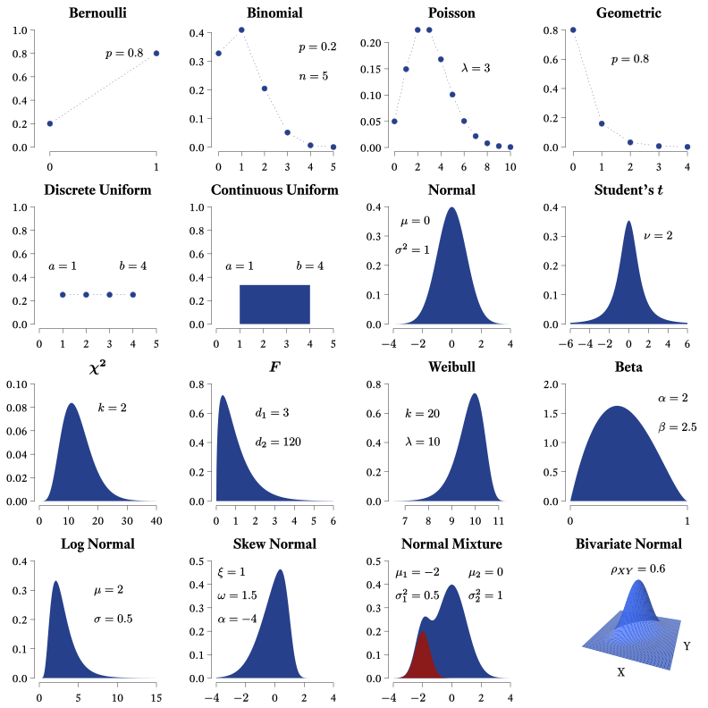
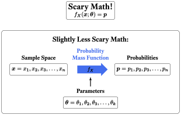
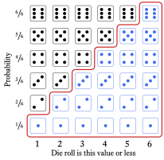
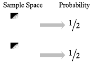
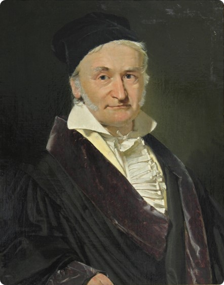
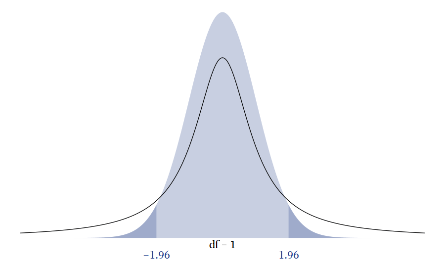

# Distributions

```{r loadpacksdist, include = F}
# source("loader.R")
```

## Random Variables

Because we first learn about variables in an algebra class, we tend to think of variables as having values that can be solved for---if we have enough information about them. If I say that $x$ is a variable and that $x+6=8$, we can use algebra to find that $x$ must equal 2.

[Random variables]{class=defword}`r tufte::margin_note("**Random variables** have values that are determined by a random process.")` are not like algebraic variables. Random variables simply take on values because of some random process. If we say that the outcome of a throw of a six-sided die is a random variable, there is nothing to "solve for." There is no equation that determines the value of the die. Instead, it is determined by chance and the physical constraints of the die. That is, the outcome must be one of the numbers printed on the die, and the six numbers are equally likely to occur. This illustrates an important point. The word *random* here does not mean "anything can happen." On a six-sided die, you will never roll a 7, 3.5, $\sqrt{\pi}$, &minus;36,000, or any other number that does not appear on the six sides of the die. Random variables have outcomes that are subject to random processes, but those random processes *do*  have constraints on them such that some outcomes are more likely than others---and some outcomes never occur at all. 

```{r randomvariable, fig.cap="Rolling a six-sided die is a process that creates a randomly ordered series of integers from 1 to 6.", echo=FALSE, fig.margin = T, fig.align='default', cache=T, warning=F, message=F, eval=T, out.width="25%"}

knitr::include_graphics("randomvariable.gif")
```

When we say that the throw of a six-sided die is a random variable, we are not talking about any particular throw of a particular die but, in a sense, *every* throw (that has ever happened or ever could happen) of *every* die (that has ever existed or could exist). Imagine an immense, roaring, neverending, cascading flow of dice falling from the sky. As each die lands and disappears, a giant scoreboard nearby records the relative frequencies of ones, twos, threes, fours, fives, and sixes. That's a random variable.

```{r randomvariableCode, button_r=TRUE, eval=FALSE}

# Function to make dice
makedice <- function(i, id) {
  x = switch(
           i,
           `1` = 0,
           `2` = c(-1, 1),
           `3` = c(-1, 1, 0),
           `4` = c(-1, 1, -1, 1),
           `5` = c(-1, 1, -1, 1, 0),
           `6` = c(-1, 1, -1, 1, -1, 1)
         )
  y = switch(
           i,
           `1` = 0,
           `2` = c(1,-1),
           `3` = c(1,-1, 0),
           `4` = c(1,-1,-1, 1),
           `5` = c(1,-1,-1, 1, 0),
           `6` = c(1,-1,-1, 1, 0, 0))
  
  tibble(id = id * 1,
         i = i,
         x = x,
         y = y) %>% 
    add_case(id = id + 0.5,
             i = 0,
             x = NA,
             y = NA)
}

# Die radius
r <- 0.35
dpos <- 1.5

# Die round arcs
dround <- tibble(x0 = c(-dpos, dpos, -dpos, dpos), 
                 y0 = c(dpos,dpos,-dpos,-dpos), 
                 r = r, 
                 start = c(-pi / 2, pi / 2, -pi, pi / 2) , 
                 end = c(0,0, -pi / 2,pi) )

# Line segments
dsegments <- tibble(x = c(-dpos, dpos + r, dpos, -dpos - r), 
                    y = c(dpos + r,dpos,-dpos - r,-dpos),
                    xend = c(dpos, dpos + r, -dpos,-dpos - r), 
                    yend = c(dpos + r,-dpos,-dpos - r, dpos))
# Number of throws
k <- 50

# Dot positions
d <- map2_df(sample(1:6,k, replace = T), 1:k, makedice)  

# Plot
p <- ggplot(d) + 
  geom_point(pch = 16, size = 50, aes(x,y))  + 
  geom_arc(aes(x0 = x0,
               y0 = y0,
               r = r,
               start = start,
               end = end,
               linetype = factor(r)),
           data = dround,
           lwd = 2) + 
  geom_segment(data = dsegments,
               aes(x = x, y = y, xend = xend, yend = yend),
               lwd = 2) +
  coord_equal() + 
  theme_void() + 
  theme(legend.position = "none") + 
  transition_manual(id) 

# Render animation
animate(p, 
        fps = 1,
        device = "svg",
        renderer = magick_renderer(), 
        width = 8,
        height = 8)
```


## Sets

A [set]{class=defword}`r tufte::margin_note("A **set** is a collection of distinct objects.")` refers to a collection of objects. Each distinct object in a set is an [element]{class=defword}.`r tufte::margin_note("An **element** is a distinct member of a set.")` 

### Discrete Sets

To show that a list of discrete elements is a set, we can use curly braces. For example, the set of positive single-digit even numbers is $\{2, 4, 6, 8\}$. With large sets with repeating patterns, it is convenient to use an ellipsis ("..."), the punctuation mark signifying an omission or pause. For example, rather than listing every two-digit positive even number, we can show the pattern like so: $\{10, 12, 14,\ldots, 98\}$.

### Interval Sets


```{r intervalnotation, fig.cap = "Interval Notation", dev="svg", echo=FALSE, fig.width=6.72, fig.height = 3.25, out.width="100%", fig.margin = T, fig.align='default'}
# Interval notation
tibble(lb = 1L,
       ub = 5L,
       y = 1:4,
       meaning = c("Includes 1 and 5",
                   "Excludes 1 and 5",
                   "Includes 1 but not 5",
                   "Includes 5 but not 1"),
       l_bracket = c("[", "(", "[", "("),
       u_bracket = c("]", ")", ")", "]")) %>% 
  mutate(Interval = paste0(l_bracket, lb, ",", ub, u_bracket) %>% 
           fct_inorder() %>% 
           fct_rev,
         l_fill = ifelse(l_bracket == "[", myfills[1], "white"),
         u_fill = ifelse(u_bracket == "]", myfills[1], "white")) %>% 
  ggplot(aes(lb, Interval)) + 
  geom_segment(aes(xend = ub, yend = Interval), 
               size = 2, 
               color = myfills[1]) +
  geom_point(aes(fill = l_fill), 
             size = 5, 
             pch = 21, 
             stroke = 2, color = myfills[1]) + 
  geom_point(aes(fill = u_fill, x = ub), 
             size = 5, 
             pch = 21, 
             stroke = 2, 
             color = myfills[1]) +
  geom_label(aes(label = meaning, x = 3), 
             vjust = -.65, 
             label.padding = unit(0,"lines"), 
             label.size = 0, 
             family = bfont, 
             size = ggtext_size(27)) +
  scale_fill_identity() +
  scale_y_discrete(expand = expansion(c(0.08, 0.25))) +
  scale_x_continuous(NULL, minor_breaks = NULL) +
  theme_minimal(base_size = 27, 
                base_family = bfont)
```


With continuous variables, we can define sets in terms of intervals. Whereas the discrete set $\{0,1\}$ refers just to the numbers 0 and 1, the interval set $(0,1)$ refers to all the numbers between 0 and 1. As shown in (Figure&nbsp;\@ref(fig:intervalnotation)), some intervals include their endpoints and others do not.

```{r intervalnotationCode, ref.label="intervalnotation", button_r=TRUE}

```


## Sample Spaces {#sec:SampleSpace}

The set of all possible outcomes of a random variable is the [sample space]{class=defword}.`r tufte::margin_note("A **sample space** is the set of all possible values that a random variable can assume.")` Continuing with our example, the sample space of a single throw of a six-sided die is the set $\{1,2,3,4,5,6\}$. *Sample space* is a curious term. Why *sample* and why *space*? With random variables, [populations]{class=defword}`r tufte::margin_note("A **population** consists of all entities under consideration.")` are infinitely large, at least theoretically. Random variables just keep spitting out numbers forever! So any time we actually observe numbers generated by a random variable, we are always observing a [sample]{class=defword};`r tufte::margin_note("A **sample** is a subset of a population.")` actual infinities cannot be observed in their entirety. A *space* is a set that has mathematical structure. Most random variables generate either integers or real numbers, both of which are structured in many ways (e.g., order).

Unlike distributions having to do with dice, many distributions have a sample space with an infinite number of elements. Interestingly, there are two kinds of infinity we can consider. A distribution's sample space might be the set of whole numbers: $\{0,1,2,...\}$, which extends to positive infinity. The sample space of all integers extends to infinity in both directions: $\{...-2,-1,0,1,2,...\}$.

The sample space of continuous variables is infinitely large for another reason. Between any two points in a continuous distribution, there is an infinite number of other points. For example, in the beta distribution, the sample space consists of all real numbers between 0 and 1: $(0,1)$. Many continuous distributions have sample spaces that involve both kinds of infinity. For example, the sample space of the [normal distribution](#sec:normal) consists of all real numbers from negative infinity to positive infinity: $(-\infty, +\infty)$.

## Probability Distributions {#sec:ProbabilityDistribution}

```{r dice, fig.cap="The probability distribution of a throw of a single die", fig.margin = TRUE, fig.align='default', fig.width=3, dev="svg", out.width=300, fig.align='default'}
knitr::include_graphics("dice.svg")
```

Each element of a random variable's sample space occurs with a particular probability. When we list the probabilities of each possible outcome, we have specified the variable's [probability distribution]{class=defword}`r tufte::margin_note("In a **probability distribution**, there is an assignment of a probability to each possible element in a variable's sample space.")`. In other words, if we know the probability distribution of a variable, we know how probable each outcome is. In the case of a throw of a single die, each outcome is equally likely (Figure&nbsp;\@ref(fig:dice)). 

```{tikz DicePMF, button_latex=TRUE}
% Dice PMF

\documentclass[tikz = true, border = 2pt]{standalone}
\usepackage{tikz}
\usepackage{xfrac}
\usetikzlibrary{shapes,calc}
\usepackage{fontspec}
\setmainfont{Equity Text A Tab}
\tikzset{
	dot hidden/.style={},
	line hidden/.style={},
	dot colour/.style={dot hidden/.append style={color=#1}},
	dot colour/.default=black,
	line colour/.style={line hidden/.append style={color=#1}},
	line colour/.default=black
}

\usepackage{xparse}
\NewDocumentCommand{\drawdie}{O{}m}{
	\begin{tikzpicture}[x=1em,y=1em,radius=0.1,#1]
	\draw[rounded corners=2,line hidden] (0,0) rectangle (1,1);
	\ifodd#2
	\fill[dot hidden] (0.5,0.5) circle;
	\fi
	\ifnum#2>1
	\fill[dot hidden] (0.25,0.25) circle;
	\fill[dot hidden] (0.75,0.75) circle;
	\ifnum#2>3
	\fill[dot hidden] (0.25,0.75) circle;
	\fill[dot hidden] (0.75,0.25) circle;
	\ifnum#2>5
	\fill[dot hidden] (0.75,0.5) circle;
	\fill[dot hidden] (0.25,0.5) circle;
	\ifnum#2>7
	\fill[dot hidden] (0.5,0.75) circle;
	\fill[dot hidden] (0.5,0.25) circle;
	\fi
	\fi
	\fi
	\fi
	\end{tikzpicture}
}  

\begin{document}	
	\begin{tikzpicture}
	\foreach \n in {1,...,6} {
		\node at ($(0,7)-(0,\n)$) {\drawdie [scale = 2]{\n}};
		\node [fill=gray!50,
		       minimum height = 2cm,
		       minimum width = 0.1cm,
		       single arrow,
		       single arrow head extend =.15cm,
		       single arrow head indent =.08cm,
		       inner sep=1mm] at ($(1.55,7)-(0,\n)$) {};
		\node  (p1) at (3,\n) {\large{$\sfrac{\text{1}}{\text{6}}$}};
	}
	\node [text centered,
	       anchor=south,
	       text height = 1.5ex,
	       text depth = .25ex] (p3) at (0,6.6) {\large{{Sample Space}}};
	\node [text centered,
	       anchor = south,
	       text height = 1.5ex,
	       text depth = .25ex] (p4) at (3,6.6) {\large{{Probability}}};
	\end{tikzpicture}	
\end{document}
```

There is an infinite variety of probability distributions, but a small subset of them have been given names. Now, one can manage one's affairs quite well without ever knowing what a Bernoulli distribution is, or what a $\chi{^2}$ distribution is, or even what a normal distribution is. However, sometimes life is a little easier if we have names for useful things that occur often. Most of the distributions with names are not really single distributions, but families of distributions. The various members of a family are unique but they are united by the fact that their probability distributions are generated by a particular mathematical function (more on that later). In such cases, the probability distribution is often represented by a graph in which the sample space is on the $X$-axis and the associated probabilities are on the $Y$-axis. In Figure&nbsp;\@ref(fig:pdfIllustration), 16 probability distributions that might be interesting and useful to clinicians are illustrated. Keep in mind that what are pictured are only particular members of the families listed; some family members look quite different from what is shown in Figure&nbsp;\@ref(fig:pdfIllustration).

```{r pdfIllustration, fig.cap = "A gallery of useful distributions",dev="svg", fig.width=12, out.width=1200, fig.fullwidth = T, fig.height=12, fig.align='default'}


```


```{r pdfIllustrationCode, button_r=TRUE, eval=FALSE}
# A gallery of useful distributions
# Run output file pdfIllustration.tex in LaTeX
# pdflatex --enable-write18 --extra-mem-bot=10000000 --synctex=1 pdfIllustration.tex
tikzpackages <- paste(
  "\\usepackage{tikz}",
  "\\usepackage{amsmath}",
  "\\usepackage[active,tightpage,psfixbb]{preview}",
  "\\PreviewEnvironment{pgfpicture}",
  collapse = "\n"
)

tikzDevice::tikz('pdfIllustration.tex',
                 standAlone = TRUE, 
                 packages = tikzpackages, 
                 width = 11, 
                 height = 11)
par(
  mar = c(1.75, 1.3, 1.75, 0),
  mfrow = c(4, 4),
  las = 1,
  xpd = TRUE,
  family = 'serif',
  pty = "s",
  mgp = c(2, 0.5, 0),
  tcl = -0.3,
  cex = 1.35
)

# Bernoulli
plot(
  c(0.2, 0.8) ~ seq(0, 1),
  type = "b",
  ylim = c(0, 1),
  bty = "n",
  col = myfills[1],
  lwd = 1,
  xlab = "",
  ylab = "",
  main = "Bernoulli",
  lty = 3,
  pch = 19,
  xaxp = c(0, 1, 1),
  xlim = c(-0.1, 1)
)
text(x = .7, y = .8, "$p=0.8$")

# Binomial
plot(
  dbinom(seq(0, 5), 5, 0.2) ~ seq(0, 5),
  type = "b",
  xlim = c(-0.1, 5),
  bty = "n",
  col = myfills[1],
  lwd = 1,
  xlab = "",
  ylab = "",
  main = "Binomial",
  lty = 3,
  pch = 19
)
text(
  x = c(3.5, 3.5),
  y = c(.35, .25),
  c("$p=0.2$", "$n=5$"),
  adj = 0
)

# Poisson
plot(
  dpois(0:10, 3) ~ seq(0, 10),
  type = "b",
  xlim = c(-0.1, 10),
  bty = "n",
  col = myfills[1],
  lwd = 1,
  xlab = "",
  ylab = "",
  main = "Poisson",
  lty = 3,
  pch = 19
)
text(x = 7, y = .15, r"($\lambda=3$)")

# Geometric
plot(
  dgeom(0:4, prob = 0.8) ~ seq(0, 4),
  type = "b",
  ylim = c(0, .8),
  xlim = c(-0.1, 4),
  bty = "n",
  col = myfills[1],
  lwd = 1,
  xlab = "",
  ylab = "",
  main = "Geometric",
  lty = 3,
  pch = 19
)
text(x = 2, y = .6, "$p=0.8$")

# Discrete Uniform
plot(
  rep(1 / 4, 4) ~ seq(1, 4),
  type = "b",
  ylim = c(0, 1),
  xlim = c(0, 5),
  bty = "n",
  col = myfills[1],
  lwd = 1,
  xlab = "",
  ylab = "",
  main = "Discrete Uniform",
  lty = 3,
  pch = 19
)
text(
  x = c(1, 4),
  y = c(.5, .5),
  c("$a=1$", "$b=4$"),
  adj = 0.5
)

# Continuous
plot(
  c(0, 1 / 3, 1 / 3, 0) ~ c(1, 1, 4, 4),
  type = "n",
  ylim = c(0, 1),
  xlim = c(0, 5),
  bty = "n",
  col = myfills[1],
  lwd = 2,
  xlab = "",
  ylab = "",
  main = "Continuous Uniform"
)
polygon(
  c(1, 1, 4, 4),
  c(0, 1 / 3, 1 / 3, 0),
  col = myfills[1],
  xpd = FALSE,
  border = NA
)
text(
  x = c(1, 4),
  y = c(.5, .5),
  c("$a=1$", "$b=4$"),
  adj = 0.5
)

# Normal
x <- seq(-4, 4, 0.02)
plot(
  dnorm(x) ~ x,
  type = "n",
  col = myfills[1],
  xlab = "",
  ylab = "",
  main = "Normal",
  lwd = 2,
  bty = "n",
  axes = F
)
polygon(
  c(min(x), x, max(x)),
  c(0, dnorm(x), 0),
  col = myfills[1],
  lwd = 1,
  xpd = FALSE,
  border = NA
)
axis(2)

text(
  x = c(-1.5, -1.5),
  y = c(.35, .25),
  c("$\\mu=0$", "$\\sigma^2=1$"),
  adj = 1
)


center_neg <- function(x) {
  signs <- sign(x)
  paste0(ifelse(signs < 0,"$",""), x, ifelse(signs < 0,"\\phantom{-}$",""))
}

all_tick_labels <- function(side = 1, at, labels = at) {
  axis(side, labels = rep("",length(at)), at = at)
for (i in 1:length(at)) axis(side, at = at[i], labels = labels[i],tick = F)
}
axis_ticks <- seq(-4,4,2)
axis_labs <- center_neg(axis_ticks)
all_tick_labels(1, at = axis_ticks, labels = axis_labs)


# Student t
x <- seq(-6, 6, 0.02)
plot(
  dt(x, 2) ~ x,
  type = "n",
  col = myfills[1],
  xlab = "",
  ylab = "",
  main = "Student's $\\boldsymbol{t}$",
  lwd = 2,
  bty = "n",
  ylim = c(0, 0.4),
  axes = F
)
polygon(
  c(min(x), x, max(x)),
  c(0, dt(x, 2), 0),
  col = myfills[1],
  lwd = 1,
  xpd = FALSE,
  border = NA
)
text(x = 3, y = .3, "$\\nu=2$")
axis(2)
axis_ticks <- seq(-6,6,2)
axis_labs <- center_neg(axis_ticks)
all_tick_labels(1, at = axis_ticks, labels = axis_labs)

# Chi-Square
x <- seq(0, 40, 0.05)
plot(
  dchisq(x, 13) ~ x,
  type = "n",
  col = myfills[1],
  xlab = "",
  ylab = "",
  main = "$\\boldsymbol{\\chi^2}$",
  lwd = 2,
  bty = "n",
  ylim = c(0, 0.1)
)
polygon(
  c(min(x), x, max(x)),
  c(0, dchisq(x, 13), 0),
  col = myfills[1],
  lwd = 1,
  xpd = FALSE,
  border = NA
)
text(x = 20, y = .08, "$k=2$", adj = 0)

# F
x <- seq(0, 6, 0.01)
plot(
  df(x, 3, 120) ~ x,
  type = "n",
  col = myfills[1],
  xlab = "",
  ylab = "",
  main = "$\\boldsymbol{F}$",
  lwd = 2,
  bty = "n",
  ylim = c(0, 0.8)
)
polygon(
  c(min(x), x, max(x)),
  c(0, df(x, 3, 120), 0),
  col = myfills[1],
  lwd = 1,
  xpd = TRUE,
  border = NA
)
text(
  x = c(2, 2),
  y = c(.6, .4),
  c("$d_1=3$", "$d_2=120$"),
  adj = 0
)

# Weibull
x <- seq(6.5, 11.5, 0.01)
plot(
  dweibull(x, 20, 10) ~ x,
  type = "n",
  col = myfills[1],
  xlab = "",
  ylab = "",
  main = "Weibull",
  lwd = 2,
  bty = "n",
  ylim = c(0, 0.8)
)
polygon(
  c(min(x), x, max(x)),
  c(0, dweibull(x, 20, 10), 0),
  col = myfills[1],
  lwd = 1,
  xpd = TRUE,
  border = NA
)
text(
  x = c(7, 7),
  y = c(.6, .4),
  c("$k=20$", "$\\lambda=10$"),
  adj = 0
)

# Beta
x <- seq(0, 1, 0.01)
plot(
  dbeta(x, 2, 2.5) ~ x,
  type = "n",
  col = myfills[1],
  xlab = "",
  ylab = "",
  main = "Beta",
  lwd = 2,
  bty = "n",
  ylim = c(0, 2),
  xaxp = c(0, 1, 1)
)
polygon(
  c(min(x), x, max(x)),
  c(0, dbeta(x, 2, 2.5), 0),
  col = myfills[1],
  lwd = 1,
  xpd = TRUE,
  border = NA
)
text(
  x = c(0.75, 0.75),
  y = c(1.75, 1.25),
  c("$\\alpha=2$", "$\\beta=2.5$"),
  adj = 0
)

# Log Normal
x <- c(seq(0, .999, 0.001), seq(1, 15, .05))
plot(
  dlnorm(x, 2, .5) ~ x,
  type = "n",
  col = myfills[1],
  xlab = "",
  ylab = "",
  main = "Log Normal",
  lwd = 2,
  bty = "n",
  ylim = c(0, 0.4)
)
polygon(
  c(min(x), x, max(x)),
  c(0, dlnorm(x, 1, 0.5), 0),
  col = myfills[1],
  lwd = 1,
  xpd = TRUE,
  border = NA
)
text(
  x = c(7, 7),
  y = c(.3, .2),
  c("$\\mu=2$", "$\\sigma=0.5$"),
  adj = 0
)


# Skew Normal
x <- seq(-4, 4, 0.01)
plot(
  sn::dsn(x, 2, 2.5) ~ x,
  type = "n",
  col = myfills[1],
  xlab = "",
  ylab = "",
  main = "Skew Normal",
  lwd = 2,
  bty = "n",
  ylim = c(0, 0.5),
  axes = F
)
polygon(
  c(min(x), x, max(x)),
  c(0, sn::dsn(
    x,
    xi = 1,
    omega = 1.5,
    alpha = -4
  ), 0),
  col = myfills[1],
  lwd = 1,
  xpd = TRUE,
  border = NA
)
text(
  x = c(-3.9, -3.9, -3.9),
  y = c(.45, .35, .25),
  c("$\\xi=1$", "$\\omega=1.5$", "$\\alpha=-4$"),
  adj = 0
)

axis(2)
axis_ticks <- seq(-4,4,2)
axis_labs <- center_neg(axis_ticks)
all_tick_labels(1, at = axis_ticks, labels =axis_labs)

# Normal Mixture
x <- seq(-4, 4, 0.01)
y <- (dnorm(x, -2, 0.5) * .25 + dnorm(x))
plot(
  y ~ x,
  type = "n",
  col = "violet",
  xlab = "",
  ylab = "",
  main = "Normal Mixture",
  lwd = 4,
  bty = "n",
  ylim = c(0, 0.5),
  axes = F
)
polygon(
  c(min(x), x, max(x)),
  c(0, y, 0),
  col = myfills[1],
  lwd = 1,
  xpd = TRUE,
  border = NA
)
polygon(
  c(min(x), x, max(x)),
  c(0, dnorm(x, -2, 0.5) * .25, 0),
  col = myfills[2],
  lwd = 1,
  xpd = TRUE,
  border = NA
)
text(
  x = c(-0.85, -0.85),
  y = c(.45, .35),
  c("$\\mu_1=-2$", "$\\sigma_1^2=0.5$"),
  adj = 1
)
text(
  x = c(3.5, 3.5),
  y = c(.45, .35),
  c("$\\mu_2=0$", "$\\sigma_2^2=1$"),
  adj = 1
)
axis(2)
axis_ticks <- seq(-4,4,2)
axis_labs <- center_neg(axis_ticks)
all_tick_labels(1, at = axis_ticks, labels =axis_labs)
# Bivariate Normal

x = seq(-4, 4, 0.1)
X = fMultivar::grid2d(x)
z = fMultivar::dnorm2d(X$x, X$y, rho = 0.6)
Z = list(x = x,
         y = x,
         z = matrix(z, ncol = length(x)))
persp(
  Z,
  theta = 20,
  phi = 25,
  col = "royalblue1",
  xlab = "\nX",
  ylab = "\nY",
  zlab = "",
  zlim = c(0, .20),
  border = NA,
  expand = .7,
  box = FALSE,
  ticktype = "simple",
  ltheta = 0,
  shade = 0.5,
  main = "Bivariate Normal",
  lwd = 0.5
)
text(c(-.11, .32), c(-.42, -.25), c("X", "Y"))
text(0, 0.25, "$\\rho_{XY}=0.6$")
dev.off()
```

## Discrete Uniform Distributions {#sec:DiscreteUniform}

The throw of a single die is a member of a family of distributions called the [discrete uniform distribution]{class=defword}.`r tufte::margin_note("A **discrete uniform distribution** is a family of random variable distributions in which the sample space is an evenly spaced sequence of numbers, each of which is equally likely to occur.")` It is "discrete" because the elements in the sample space are countable, with evenly spaced gaps between them. For example, there might be a sequence of 8, 9, 10, and 11 in the sample space but there are no numbers in between. It is "uniform" because all outcomes are equally likely. With dice, the numbers range from a lower bound of 1 to an upper bound of 6. In the family of discrete uniform distributions, the lower and upper bounds are typically integers, mostly likely starting with 1. However, any real number $a$ can be the lower bound and the spacing $k$ between numbers can be any positive real number. For the sake of simplicity and convenience, I will assume that the discrete uniform distribution refers to consecutive integers ranging from a lower bound of $a$ and an upper bound of $b$. 

This kind of discrete uniform distribution has a number of characteristics listed in Table&nbsp;\@ref(tab:uniformfeatures). I will explain each of them in the sections that follow. As we go, I will also explain the mathematical notation. For example, $a \in \{\ldots,-1,0,1,\ldots\}$ means that $a$ is an integer because $\in$ means *is a member of* and $\{\ldots,-1,0,1,\ldots\}$ is the set of all integers.^[Sometimes the set of all integers is referred to with the symbol $\mathbb{Z}$] $x \in \{a,a+1,\ldots,b\}$ means that the each member of the sample space $x$ is a member of the set of integers that include $a$, $b$, and all the integers between $a$ and $b$. The notation for the [probability mass function](#sec:pmf) and the [cumuluative distribution function](#sec:CumDist) function will be explained later in this chapter.


```{r uniformfeatures, echo = F, cache = T}
tibble::tribble(
  ~Feature, ~Symbol,
  "Lower Bound", r"($a \in \{\ldots,-1,0,1,\ldots\}$)",
  "Upper Bound", r"($b \in \{a + 1, a + 2,  \ldots\}$)",
  "Sample Space", r"($x \in\{a, a + 1,\ldots,b\}$)",
  "Number of points", r"($n=b-a+1$)",
  "Mean", r"($\mu=\frac{a+b}{2}$)",
  "Variance", r"($\sigma^2=\frac{n^2-1}{12}$)",
  "Skewness", r"($\gamma_1=0$)",
  "Kurtosis", r"($\gamma_2=-\frac{6(n^2+1)}{5(n^2-1)}$)",
  "Probability Mass Function", r"($f_X(x;a,b)=\frac{1}{n}$)",
  "Cumulative Distribution Function", r"($F_X(x;a,b)=\frac{x-a+1}{n}$)") %>% 
  knitr::kable(caption = "Features of Discrete Uniform Distributions") %>% 
  html_table_width(400)
```

### Parameters of Random Variables 

The lower bound $a$ and the upper bound $b$ are the discrete uniform distribution's [parameters]{class=defword}.`r tufte::margin_note("A **parameter** is a defining feature of a random variable's probability distribution.")` The word *parameter* has many meanings, but here it refers to a characteristic of a distribution family that helps us identify precisely which member of the family we are talking about. Most distribution families have one, two, or three parameters. 

If you have taken an algebra class, you have seen parameters before, though the word *parameter* many not have been used. Think about the formula of a line:

\begin{equation*}\label{eq:linear}
y=mx+b
\end{equation*}


Both $x$ and $y$ are variables, but what are $m$ and $b$? Well, you probably remember that $m$ is the slope of the line and that $b$ is the $y$-intercept. If we know the slope and the intercept of a line, we know exactly which line we are talking about. No additional information is needed to graph the line. Therefore, $m$ and $b$ are the line's *parameters*, because they uniquely identify the line.^[What about other mathematical functions? Do they have parameters? Yes! Most do! For example, in the equation for a parabola ($y=ax^2+bx+c$), $a$, $b$, and $c$ determine its precise shape.] All lines have a lot in common but there is an infinite variety of lines because the parameters, the slope and the intercept, can take on the value of any real number. Each unique combination of parameter values (slope and intercept) will produce a unique line. So it is with probability distribution families. All family members are alike in many ways but they also differ because of different parameter values.

The discrete uniform distribution (i.e., the typical variety consisting of consecutive integers) is defined by the lower and upper bound. Once we know the lower bound and the upper bound, we know exactly which distribution we are talking about.^[If we allow the lower bound to be any real number and the spacing to be any positive real number, the discrete uniform distribution can be specified by three parameters: the lower bound $a$, the spacing between numbers $k$ ($k>0$), and the number of points $n$ ($n$>1). The upper bound $b$ of such a distribution would be $b=a+k(n-1)$] Not all distributions are defined by their lower and upper bounds. Indeed, many distribution families are unbounded on one or both sides. Therefore, other features are used to characterize the distributions, such as the population mean (&mu;).

### Probability Mass Functions {#sec:pmf}

Many distribution families are united by the fact that their probability distributions are generated by a particular mathematical function. For discrete distributions, those functions are called [probability mass functions]{class=defword}.`r tufte::margin_note("A **probability mass function** is a mathematical expression that gives the probability that a discrete random variable will equal a particular element of the variable's sample space.")` In general, a mathematical function is an expression that takes one or more constants (i.e., parameters) and one or more input variables, which are then transformed according to some sort of rule to yield a single number.

A probability mass function transforms a random variable's sample space elements into probabilities. In Figure&nbsp;\@ref(fig:dice), the probability mass function can be thought of as the arrows between the sample space and the probabilities. That is, the probability mass function is the thing that was done to the sample space elements to calculate the probabilities. In Figure&nbsp;\@ref(fig:dice), each outcome of a throw of the the die was mapped onto a probability of &frac16;. Why &frac16;, and not some other number? The probability mass function of the discrete uniform distribution tells us the answer. 

```{r pmf, dev="svg", fig.width=6.72, out.width=672, fig.cap="Probability mass functions tell us how probable each sample space element is. That is, they are functions that convert samples spaces $(\\boldsymbol{x})$ into probabilities $(\\boldsymbol{p})$ according to specific parameters $(\\boldsymbol{\\theta}).$", fig.align='center'}

```


```{tikz scarymath, button_latex=TRUE}
% Probability mass functions tell us how probable each sample space element is

\documentclass[tikz = true, border = 2pt]{standalone}

\usepackage{amsmath}
\usepackage{tikz}
\usetikzlibrary{decorations.text, arrows}
\usetikzlibrary{shapes}
\usepackage{fontspec}
\setmainfont{Equity Text A}

\begin{document}
\begin{tikzpicture}[>=stealth,scale=0.9]
\definecolor{royalblue2}{RGB}{39,64,139};
\node [rectangle,
       draw, 
       rounded corners= 2pt,
       text depth=0.25ex, 
       minimum height = 7mm](ss) at (0,0) {$\boldsymbol{x}=x_1,x_2,x_3,\ldots,x_n$};
\node [rectangle,
       draw, 
       rounded corners= 2pt,
       text depth=0.25ex, 
       minimum height = 7mm](ps) at (7,0) {$\boldsymbol{p}=p_1,p_2,p_3,\ldots,p_n$};
\node [single arrow,
       fill=royalblue2,
       single arrow head extend=1.1ex,
       transform shape,
       minimum height=0.9cm,
       text depth=0.25ex, text=white] (fx) at (3.5,0) {$\quad\;\; f_X\quad\;\;$};
\node [text depth=2.25ex,
       text height= 5ex,
       anchor=south,
       yshift=-3.5ex](sst) at (0,0.75) {\textbf{Sample Space}};
\node [text depth=2.25ex,
       text height= 5ex,
       anchor=south,
       yshift=-3.5ex](pst) at (7,0.75) {\textbf{Probabilities}};
\node [shape=rectangle,
       text depth=2.25ex,
       color=royalblue2,
       align=center,
       text height= 5ex,
       anchor=south,
       yshift=-3.5ex](pmf) at (3.5,0.75) {\textbf{Probability}\\
	\textbf{Mass Function}};
\node [text depth=2.25ex,
       text height= 5ex,
       anchor=south,
       yshift=-3.5ex] (pt) at (3.5,-1.5) {\textbf{Parameters}};
\node [rectangle,
       draw, 
       rounded corners = 2pt,
       text depth=0.25ex, 
       minimum height = 7mm] (pts) at (3.5,-2.25) {$\boldsymbol{\theta}=\theta_1,\theta_2,\theta_3,\ldots,\theta_k$};
%\node [align=center,
%       shape=rectangle,
%       rounded corners = 3pt,
%       draw](formula) at (3.5,4) {\textbf{\Large{Scary~Math!}}\\
%	$f_X\!\left(\boldsymbol{x};\boldsymbol{\theta}\right)=\boldsymbol{p}$};
%\draw [rounded corners=5pt] (-2.5,-3) rectangle (9.5,2.65);
\node at (3.5,2) {$f_X\!\left(\boldsymbol{x};\boldsymbol{\theta}\right)=\boldsymbol{p}$};
\draw[->,>=latex', very thick] (3.5,-1.15) to (3.5,-0.5);
\end{tikzpicture}
\end{document}
```

The probability mass function of the discrete uniform distribution is fairly simple but the notation can be intimidating at first (Figure&nbsp;\@ref(fig:pmf)). By convention, a single random variable is denoted by a capital letter $X$. Any particular value of $X$ in its sample space is represented by a lowercase $x$. In other words, $X$ represents the variable in its totality whereas $x$ is merely one value that $X$ can take on. Confusing? Yes, statisticians work very hard to confuse us---and most of the time they succeed! 

The probability mass function of random variable $X$ is denoted by $f_X(x)$. This looks strange at first. It means, "When random variable $X$ generates a number, what is the probability that the outcome will be a particular value $x$?" That is, $f_X(x)=P(X=x)$, where $P$ means "What is the probability that...?" Thus, $P(X=x)$ reads, "What is the probability that random variable $X$ will generate a number equal to a particular value $x$?" So, $f_X(7)$ reads, "When random variable $X$ generates a number, what is the probability that the outcome will be 7?"

Most probability mass functions also have parameters, which are listed after a semi-colon. In the case of the discrete uniform distribution consisting of consecutive integers, the lower and upper bounds $a$ and $b$ are included in the function's notation like so: $f_X(x;a,b)$. This reads, "For random variable $X$ with parameters $a$ and $b$, what is the probability that the outcome will be $x$?" Some parameters can be derived from other parameters, as was the case with the number of points $n$ in the sample space of a discrete uniform distribution: $n=b-a+1$. The probability for each outcome in the sample space is the same and there are $n$ possible outcomes. Therefore, the probability associated with each outcome is $\frac{1}{n}$.

Putting all of this together, if $a$ and $b$ are integers and $a<b$, for all $n$ integers $x$ between $a$ and $b$, inclusive:

\begin{equation*}
f_X(x;a,b)=\frac{1}{b-a+1}=\frac{1}{n}
\end{equation*}
Where
\begin{align*}
X  &= \text{A random variable with a discrete uniform distribution}\\
f_X &= \text{The probability mass function of}~X\\
x &= \text{Any particular member of the sample space of}~X\\
a &= \text{The lower bound of the sample space}\\
b &= \text{The upper bound of the sample space}\\
n &= b-a+1~\text{(The number of points in the sample space)}
\end{align*}

You might notice that $x$ is not needed to calculate the probability. Why? Because this is a *uniform* distribution. No matter which sample space element $x$ we are talking about, the probability associated with it is always the same. In distributions that are not uniform, the position of $x$ matters and thus influences the probability of its occurrence.

### Cumulative Distribution Functions {#sec:CumDist}

The [cumulative distribution function]{class=defword}`r tufte::margin_note("A **cumulative distribution function** is a mathematical expression that gives the probability that a random variable will equal a particular element of the variable's sample space or less.")` tells us where a sample space element ranks in a distribution. Whereas the probability mass function tells us the probability that a random variable will generate a particular number, the cumulative distribution function tells us the probability that a random variable will generate a particular number or less. 

$$F_X(x) = P(X \le x)=p$$


```{r cdfDie, dev="svg", fig.width=6.72, out.width="100%", fig.cap="The cumulative distribution function of the roll of a die is $F_X(x)=\\frac{x}{6}$", fig.margin=TRUE, fig.align='default'}

```

The cumulative distribution function of the roll of a die (Figure&nbsp;\@ref(fig:cdfDie)) tells us that the probability of rolling at least a 4 is 4&frasl;6 (i.e., &frac23;).


```{tikz cdfDice, button_latex=TRUE}
% CDF Dice

\documentclass[tikz = true, border = 2pt]{standalone}
\usepackage{tikz}
\usepackage{xfrac}
\usepackage{fontspec}
\setmainfont{Equity Text A Tab}

\definecolor{firebrick}{RGB}{205,38,38}
\definecolor{royalblue}{RGB}{67,110,238}

\tikzset{
	dot hidden/.style={},
	line hidden/.style={},
	dot colour/.style={dot hidden/.append style={color=#1}},
	dot colour/.default=black,
	line colour/.style={line hidden/.append style={color=#1}},
	line colour/.default=black
}

\NewDocumentCommand{\drawdie}{O{}m}{
	\begin{tikzpicture}[x=1em,y=1em,radius=0.1,#1]
	\draw[rounded corners=2,line hidden] (0,0) rectangle (1,1);
	\ifodd#2
	\fill[dot hidden] (0.5,0.5) circle;
	\fi
	\ifnum#2>1
	\fill[dot hidden] (0.25,0.25) circle;
	\fill[dot hidden] (0.75,0.75) circle;
	\ifnum#2>3
	\fill[dot hidden] (0.25,0.75) circle;
	\fill[dot hidden] (0.75,0.25) circle;
	\ifnum#2>5
	\fill[dot hidden] (0.75,0.5) circle;
	\fill[dot hidden] (0.25,0.5) circle;
	\ifnum#2>7
	\fill[dot hidden] (0.5,0.75) circle;
	\fill[dot hidden] (0.5,0.25) circle;
	\fi
	\fi
	\fi
	\fi
	\end{tikzpicture}
}  

\begin{document}
	
\begin{tikzpicture}
\foreach \i in {1,...,6} {
	\node at (0.1,\i){$\sfrac{\text{\i}}{\text{6}}$};
	\node at (\i,0.1){\large{\i}};
	\foreach \j in {1,...,6} {
		\ifnum \j>\i
		\node at (\i,\j) {\drawdie [scale=2]{\j}};
		\else
		\node at (\i,\j) {\drawdie [scale=2,line colour=royalblue,dot colour=royalblue]{\j}};
		\fi
	}
}

\draw [firebrick,
       very thick,
       rounded corners] 
       (0.55,0.5)-- ++
       (0,1)-- ++
       (1,0)-- ++
       (0,1)-- ++
       (1,0)-- ++
       (0,1)-- ++
       (1,0)-- ++
       (0,1)-- ++
       (1,0)-- ++
       (0,1)-- ++
       (1,0)-- ++
       (0,1)-- ++
       (1,0)-- ++
       (0,-6)--cycle;
\node[rotate=90] at (-0.6,3.5) {{Probability}};
\node at (3.5,-0.5) {{Die roll is this value or less}};
\end{tikzpicture}

\end{document}
```

The cumulative distribution function is often distinguished from the probability mass function with a capital $F$ instead of a lowercase $f$. In the case of a discrete uniform distribution consisting of $n$ consecutive integers from $a$ to $b$, the cumulative distribution function is:

\begin{equation*}
F_X(x;a,b)=\frac{x-a+1}{b-a+1}=\frac{x-a+1}{n}
\end{equation*}
Where
\begin{align*}
X &= \text{A random variable with a discrete uniform distribution}\\
F_X &= \text{The cumulative distribution function of}~X\\
x &= \text{Any particular member of the sample space of}~X\\
a &= \text{The lower bound of the sample space}\\
b &= \text{The upper bound of the sample space}\\
n &= b-a+1~\text{(The number of points in the sample space)}
\end{align*}

In the case of the the six-sided die, the cumulative distribution function is 

$$F_X(x;a=1,b=6)=\frac{x-a+1}{b-a+1}=\frac{x-1+1}{6-1+1}=\frac{x}{6}$$

The cumulative distribution function is so-named because it adds all the probabilities in the probability mass function up to and including a particular member of the sample space. Figure&nbsp;\@ref(fig:pmf2cdf) shows how the each probability in the cumulative distribution function of the roll of a six-sided die is the sum of the current and all previous probabilities in the probability mass function.. 

```{r pmf2cdf, warning = F, message=F, fig.width=7, fig.height=8, fig.cap="The cumulative distribution function is the sum of the current and all previous elements of the probability mass function.", echo = F, cache=T}

knitr::include_graphics("pmf2cdf.gif")

```


```{r pmf2cdfCode, button_r=TRUE}
# The cumulative distribution function is the sum of the current 
# and all previous elements of the probability mass function
p <- crossing(id = 1:6,
         x = 1:6) %>% 
  mutate(pmf = 1 / 6) %>% 
  mutate(cdf = ifelse(id < x, 1 / 6, x / 6)) %>% 
  ggplot(aes(x = x, y = cdf)) + 
  geom_segment(aes(yend = cdf - pmf, xend = x), 
               color = myfills[2]) + 
  geom_segment(aes(y = 0, yend = pmf, xend = x), 
               color = myfills[1]) + 
  geom_line(aes(y = pmf), lty = "dotted", color = myfills[1]) +
  geom_line(data = . %>% dplyr::filter(x <= id), 
            lty = "dotted", 
            color = myfills[2] ) +
  geom_point(aes(y = pmf),
             color = myfills[1],
             size = 5) +
  geom_point(data = . %>% dplyr::filter(x <= id), 
             color = myfills[2],
             size = 3.5) +
  scale_x_continuous("Sample Space", 
                     breaks = 1:6,
                     expand = c(0.03,0),
                     minor_breaks = NULL) +
  scale_y_continuous("Probability",
                     breaks = 0:6 / 6, 
                     labels = c(0, paste0(1:5, "/", 6),1),
                     expand = c(0.03,0),
                     minor_breaks = NULL) +
  theme_minimal(base_size = 18, base_family = bfont) +
  coord_fixed(6) + 
  annotate("point",
           size = 5, 
           x = 1.2,  
           y = 5.33 / 6, 
           color = myfills[1]) + 
  annotate("point",
           size = 3.5, 
           x = 1.2,  
           y = 5.66 / 6, 
           color = myfills[2])  + 
  annotate("label",
           size = 6, 
           x = 1.33,  
           y = 5.33 / 6, 
           color = myfills[1],
           label = "Probability Mass Function",
           hjust = 0,
           family = bfont, 
           label.padding = unit(0, "lines"), 
           label.size = 0
           ) + 
  annotate("label",
           size = 6, 
           x = 1.33,  
           y = 5.66 / 6, 
           color = myfills[2],
           label = "Cumulative Distribution Function",
           hjust = 0,
           family = bfont, 
           label.padding = unit(0, "lines"), 
           label.size = 0) +
  transition_states(id,2,1) +
  ease_aes("sine-in-out")

animate(p, 
        device = "svg",
        renderer = magick_renderer(), 
        width = 8,
        height = 8)
```

### Quantile functions {#sec:Quantile}

The inverse of the cumulative distribution function is the [quantile function]{class=defword}.`r tufte::margin_note("A **quantile function** tells us which value in the sample space of a random variable is greater than a particular proportion of the values the random variable generates.")` The cumulative distribution starts with a value $x$ in the sample space and tells us $p$, the proportion of values in that distribution that are less than or equal to $x$. A quantile function starts with a proportion $p$ and tells us the value $x$ that splits the distribution such that the proportion $p$ of the distribution is less than or equal to $x$. 

```{r cdfvquantile, echo=F, dev="svg", fig.height=12, fig.width=6, cache=T, fig.margin = T, fig.align='default',fig.cap="The quantile function is the inverse of the cumulative distribution function: Just flip the X and Y axes!", warning=FALSE}
# The quantile function is the inverse of the cumulative distribution function
d <- tibble(x = seq(-4, 4, 0.01)) %>%
  mutate(p = pnorm(x))

p1 <- ggplot(d, aes(x, p)) +
  geom_path(
    arrow = arrow(type = "closed",
                  ends = "both",
                  angle = 12,
                  length = unit(0.15, "inches")),
    color = myfills[1],
    lwd = 1
  ) +
  scale_x_continuous("Sample Space (*x*)") +
  scale_y_continuous("Proportion (*p*)", labels = prob_label) +
  theme_minimal(base_size = 26, base_family = bfont) +
  coord_fixed(8) +
  annotate(
    "richtext",
    x = -2,
    y = .5 + .25 / 4,
    label = "*X* ~ <span style=\"font-family:'Lucida Calligraphy'\">N</span>(0, 1<sup>2</sup>)",
    family = bfont,
    label.size = 0,
    label.padding = unit(0, "mm"),
    size = ggtext_size(26)
  ) +
  ggtitle("Cumulative Distribution Function *F<sub>X</sub>*(*x*) = *p*") +
  theme(
    plot.title = ggtext::element_markdown(size = 26 * 0.8), 
    plot.title.position = "plot",
    axis.title.x = ggtext::element_markdown(),
    axis.title.y = ggtext::element_markdown(),
    axis.text.x = element_text(hjust = c(0.7, 0.7, 0.5, 0.5, 0.5))
  )

p2 <- ggplot(d, aes(p, x)) +
  geom_path(
    arrow = arrow(type = "closed",
                  ends = "both",
                  angle = 12,
                  length = unit(0.15, "inches")),
    color = myfills[1],
    lwd = 1
  ) +
  scale_y_continuous("Sample Space (*x*)") +
  scale_x_continuous("Proportion (*p*)", labels = prob_label) +
  theme_minimal(base_size = 26, base_family = bfont) +
  coord_fixed(1 / 8) +
  annotate(
    "richtext",
    y = 0.5,
    x = .25,
    label = "*X* ~ <span style=\"font-family:'Lucida Calligraphy'\">N</span>(0, 1<sup>2</sup>)",
    family = bfont,
    label.size = 0,
    label.padding = unit(0, "mm"),
    size = ggtext_size(26)
  ) +
  ggtitle("Quantile Function *Q*<sub>*X*</sub>(*p*) = *x*") +
  theme(plot.title = ggtext::element_markdown(size = 26 * 0.8), 
        plot.title.position = "plot",
        axis.title.x = ggtext::element_markdown(),
        axis.title.y = ggtext::element_markdown())

p1 / p2
```

$$
\begin{array}{rc}
\text{Cumulative Distribution Function:} & F_X(x) = p \\
\text{Quantile Function:} & Q_X(p) = x
\end{array}
$$

As seen in Figure&nbsp;\@ref(fig:cdfvquantile), if you see a graph of a continuous distribution function, just flip the $X$ and $Y$ axes and you have a graph of a quantile function!

```{r cdfvquantileCode, ref.label="cdfvquantile", button_r=TRUE}
```


### Generating a Random Sample in R

In R, the `sample` function generates numbers from the discrete uniform distribution. 

```{r DiscreteUniformSample, echo=F, cache=T}
# n = the sample size
n <- 6000
# a = the lower bound
a <- 1
# b = the upper bound
b <- 6
# The sample space is the sequence of integers from a to b
sample_space <- seq(a, b)
# X = the sample with a discrete uniform distribution
# The sample function selects n values
# from the sample space with replacement at random
X <- sample(sample_space, 
            size = n, 
            replace = TRUE)


```


```{r discreteplot, fig.cap="Frequency distribution of a discrete uniform random variable from 1 to 6 ($n$ = 6,000)", dev = "svg", fig.margin = T, fig.align='default', fig.asp=1, fig.align="default", cache=T}
# Frequency distribution of a discrete uniform random variable from 1 to 6 

tibble(X = factor(X)) %>% 
  group_by(X) %>% 
  summarise(Frequency = n()) %>% 
  ggplot(aes(X,Frequency, fill = X)) + 
  geom_col(width = 0.7, fill = myfills[1]) + 
  geom_label(aes(label = Frequency), 
             vjust = -0.3, 
             label.size = 0,
             label.padding = unit(0,"mm"), 
             family = bfont,
             size = 8,
             color = "gray30",
             fill = "white") + 
  theme_minimal(base_size = 28, 
                base_family = bfont) + 
  scale_y_continuous("Count", 
                     expand = expansion(c(0,0.075)), 
                     breaks = seq(0,1000,200)) + 
  scale_x_discrete(NULL) +
  theme(panel.grid.major.x = element_blank(), 
        legend.position = "none") 
```

```{r DiscreteUniformSampleCode, ref.label="DiscreteUniformSample", echo=T, eval = F}

```

The frequencies of the random sample can be seen in Figure&nbsp;\@ref(fig:discreteplot). Because of [sampling error]{class=defword}`r tufte::margin_note("Samples imperfectly represent the population from which they are drawn. **Sampling error** refers to differences between sample statistics and population parameters.")`, the frequencies are approximately the same, but not exactly the same.

```{r discreteplotCode, ref.label="discreteplot", button_r=TRUE}

```


## Bernoulli Distributions {#sec:BernoulliDist}

```{r bernoullipic, fig.margin = TRUE, fig.align='default', fig.cap="Jakob Bernoulli (1654--1705)<br>[Image Credits](https://en.wikipedia.org/wiki/File:Jakob_Bernoulli.jpg)"}

knitr::include_graphics("Jakob_Bernoulli2.jpg")

```


```{marginfigure notation_note, echo = T}
**Notation note:** Whereas $\{a,b\}$ is the set of just two numbers, $a$ and $b$, $[a,b]$ is the set of all real numbers between $a$ and $b$.
```


```{r bernoullifeatures, cache=T}
tibble::tribble(
  ~Feature, ~Symbol,
  "Sample Space:", r"($x \in \{0,1\}$)",
  'Probability that $x=1$', r"($p \in {[0,1]}$)",
  'Probability that $x=0$', r"($q = 1 - p$)",
  "Mean" , r"($\mu = p$)",
"Variance" , r"($\sigma^2 = pq$)",
"Skewness" , r"($\gamma_1 = \frac{1 - 2p}{\sqrt{pq}}$)",
"Kurtosis" , r"($\gamma_2 = \frac{1}{pq} - 6$)",
"Probability Mass Function" , r"($f_X(x;p) = p^xq^{1 - x}$)",
"Cumulative Distribution Function", r"($F_X(x;p) = x+p(1 - x)$)" ) %>%
  knitr::kable(caption = "Features of Bernoulli Distributions") %>% 
  html_table_width(400)
```

```{r coin, fig.cap = "The probability distribution of a coin toss", dev="svg", fig.width=3, out.width=300, fig.margin = T, fig.align='default', cache=T}



```

The toss of a single coin has the simplest probability distribution that I can think of---there are only two outcomes and each outcome is equally probable (Figure&nbsp;\@ref(fig:coin)). This is a special case of the [Bernoulli distribution]{class=defword}.`r tufte::margin_note("In the **Bernoulli distribution**, there are only two outcomes: a &ldquo;success&rdquo; (1) and a &ldquo;failure&rdquo; (0). If a success has a probability $p$ then a failure has a probability of $q = 1 - p$.")` The Bernoulli distribution can describe any random variable that has two outcomes, one of which has a probability $p$ and the other has a probability $q=1-p$. In the case of a coin flip, $p=0.5$. For other variables with a Bernoulli distribution, $p$ can range from 0 to 1.

```{tikz coinbernoulli, button_latex=TRUE}
% Coin toss Bernoulli
\documentclass[tikz = true, border = 2pt]{standalone}
\usepackage{fontspec}
\setmainfont{Equity Text A Tab}
\usepackage{tikz}
\usetikzlibrary{shapes}
\usepackage{xfrac}

\begin{document}
		\begin{tikzpicture}[scale=0.9]
		\node (H) at (0,2) {
			\includegraphics [width=1.5cm]{../QuarterHeads.png}
		};
		\node (T) at (0,0) {
			\includegraphics [width=1.5cm]{../QuarterTails.png}
		};
		\node [fill=gray!50, 
		       minimum height=1.5cm, 
		       minimum width=0.1cm, 
		       single arrow, 
		       single arrow head extend=.15cm, 
		       single arrow head indent=.08cm, 
		       inner sep=1mm] (arrowtails1) at (1.9,2) {};
		\node [fill=gray!50, 
		       minimum height=1.5cm, 
		       minimum width=0.1cm, 
		       single arrow, 
		       single arrow head extend=.15cm, 
		       single arrow head indent=.08cm, 
		       inner sep=1mm] (arrowheads2) at (1.9,0) {};
		\node  (p1) at (3.4,2) {\huge{$\sfrac{\text{1}}{\text{2}}$}};
		\node  (p2) at (3.4,0) {\huge{$\sfrac{\text{1}}{\text{2}}$}};
		\node [text centered,
		       anchor=south,
		       text height=1.5ex,
		       text depth=.25ex] (p3) at (0,3) {\large{Sample Space}};
		\node [text centered,
		       anchor=south,
		       text height=1.5ex,
		       text depth=.25ex] (p4) at (3.4,3) {\large{Probability}};
		\end{tikzpicture}

\end{document}
```

In psychological assessment, many of the variables we encounter have a Bernoulli distribution. In ability test items in which there is no partial credit, examinees either succeed or fail. The probability of success on an item (in the whole population) is $p$. In other words, $p$ is the proportion of the entire population that correctly answers the question. Some ability test items are very easy and the probability of success is high. In such cases, $p$ is close to 1. When $p$ is close to 0, few people succeed and items are deemed hard. Thus, in the context of ability testing, $p$ is called the [difficulty parameter]{class=defword}.`r tufte::margin_note("The **difficulty parameter** is the proportion of people who succeed on an item (or say 'Yes' or 'True' or otherwise score a 1 on a random variable with a Bernoulli distribution.).")` This is confusing because when $p$ is high, the item is easy, not difficult. Many people have suggested that it would make more sense to call it the "easiness parameter" but the idea has never caught on.

True/False and Yes/No items on questionnaires also have Bernoulli distributions. If an item is frequently endorsed as true ("I like ice cream."), $p$ is high. If an item is infrequently endorsed ("I like black licorice and mayonnaise in my ice cream."), $p$ is very low. Oddly, the language of ability tests prevails even here. Frequently endorsed questionnaire items are referred to as "easy" and infrequently endorsed items are referred to as "difficult," even though there is nothing particularly easy or difficult about answering them either way.

### Generating a Random Sample from the Bernoulli Distribution

In R, there is no specialized function for the Bernoulli distribution because it turns out that the Bernoulli distribution is a special case of the [binomial distribution](#sec:binomial), which will be described in the next section. With the function `rbinom`, we can generate data with a Bernoulli distribution by setting the `size` parameter equal to 1.

```{r BernoulliSample, eval=T, echo = F, fig.cap="Counts of a Random Variable with a Bernoulli Distribution $(p = 0.8, n = 1000)$", fig.margin = T, fig.align='default', fig.height=4, fig.width=4, dev="svg", out.width="100%", cache=T}
# Counts of a Random Variable with a Bernoulli Distribution
set.seed(4)
# n = sample size
n <- 1000
# p = probability
p <- 0.8
# X = sample
X <- rbinom(n, size = 1, prob = p)
# Make a basic plot
ggplot(tibble(X = factor(X)), aes(X)) +
  geom_bar(fill = myfills[1]) +
  scale_x_discrete(NULL) + 
  scale_y_continuous(NULL, expand = expansion(c(0.01,0.1))) +
  geom_text(aes(label = ..count..), 
            stat = "count", 
            vjust = -0.4, 
            size = ggtext_size(18),
            family = bfont,
            color = "gray10") + 
    theme_minimal(18, bfont) + 
  theme(panel.grid.major.x = element_blank())
```


```{r BernoulliSampleCode, eval = FALSE, echo=TRUE}
# n = sample size
n <- 1000
# p = probability
p <- 0.8
# X = sample
X <- rbinom(n, size = 1, prob = p)
# Make a basic plot
barplot(table(X))
```

```{r BernoulliSampleCodeFigure, button_r=TRUE, ref.label="BernoulliSample"}

```


## Binomial Distributions {#sec:binomial}

```{r binomialfeatures, cache=T}
tibble::tribble(
  ~Feature, ~Symbol,
  "Number of Trials", r"($n \in \{1,2,3,\ldots\}$)",
  'Sample Space', r"($x \in \{0,...,n\}$)",
  "Probability of success in each trial", r"($p \in [0,1]$)",
  "Probability of failure in each trial", r"($q = 1 - p$)",
  "Mean", r"($\mu = np$)",
  "Variance", r"($\sigma = npq$)",
  "Skewness", r"($\gamma_1 = \frac{1-2p}{\sqrt{npq}}$)",
  "Kurtosis", r"($\gamma_2 = \frac{1}{npq} - \frac{6}{n}$)",
  "Probability Mass Function", r"($f_X(x;n,p)=\frac{n!}{x!\left(n-x\right)!}p^x q^{n-x}$)",
  "Cumulative Distribution Function",r"($F_X(x;n,p)=\sum_{i=0}^{x}{\frac{n!}{i!(n-i)!} p^i q^{n-i}}$)"
   ) %>%
  knitr::kable(caption = "Features of Binomial Distributions") %>% 
  html_table_width(400)
```

```{r twocoin, fig.margin = T, fig.align='default', dev='svg', fig.width=4, out.width="100%", fig.cap="Probability distribution of the number of heads observed when two coins are tossed"}
knitr::include_graphics("twocoin.svg")
```


Let's extend the idea of coin tosses and see where it leads. Imagine that two coins are tossed at the same time and we count how many heads there are. The outcome we might observe will be zero, one, or two heads. Thus, the sample space for the outcome of the tossing of two coins is the set $\{0,1,2\}$ heads. There is only one way that we will observe no heads (both coins tails) and only one way that we will observe two heads (both coins heads). In contrast, as seen in Figure&nbsp;\@ref(fig:twocoin), there are two ways that we can observe one head (heads-tails \& tails-heads).


```{tikz twocoinCode, button_latex=TRUE}
% Probability distribution of the number of heads observed when two coins are tossed
\documentclass[tikz = true,border = 2pt]{standalone}
\usepackage{tikz}
\usepackage{fontspec}
\setmainfont{Equity Text A Tab}
\definecolor[named]{fillColor}{RGB}{39,64,139}
\begin{document}
\begin{tikzpicture}[x=1pt,
                      y=1pt,
                      xscale=.4,
                      yscale=.66,
                      axisline/.style={
                      	draw=black,
                      	line width= 0.4pt,
                      	line join=round,
                      	line cap=round},
                      axislabel/.style={
                      	text=black,
                      	inner sep=0pt, 
                      	outer sep=0pt,
                      	anchor=east},
                      xaxislabel/.style={
                      	text=black,
                      	inner sep=0pt, 
                      	outer sep=0pt},
                       bar/.style={
                      	draw=white,
                      	line width= 0.4pt,
                      	line join=round,
                      	line cap=round,
                      	fill=fillColor,
                        rounded corners = 1.5pt}                ]

% X-axis
\node[xaxislabel] at (100, 39) {0};
\node[xaxislabel] at (200, 39) {1};
\node[xaxislabel] at (300, 39) {2};
\node[scale= 1.14] at (204.07, 19) {Number of Heads};

% Y-axis
\path[axisline] ( 42, 50) -- ( 42,250);
\path[axisline] ( 40, 50) -- ( 42, 50);
\path[axisline] ( 40,150) -- ( 42,150);
\path[axisline] ( 40,250) -- ( 42,250);
\node[axislabel] at ( 37, 50) {0};
\node[axislabel] at ( 37,150) {.25};
\node[axislabel] at ( 37,250) {.50};

% Bars
\path[bar] (50, 50.00) rectangle (150,150);
\path[bar] (150, 50.00) rectangle (250,250);
\path[bar] (250, 50.00) rectangle (350,150);
\node at (100,  80) {\includegraphics [width=36pt]{../QuarterTails.png}};
\node at (100, 120) {\includegraphics [width=36pt]{../QuarterTails.png}};
\node at (200,  80) {\includegraphics [width=36pt]{../QuarterHeads.png}};
\node at (200, 120) {\includegraphics [width=36pt]{../QuarterTails.png}};
\node at (200, 180) {\includegraphics [width=36pt]{../QuarterTails.png}};
\node at (200, 220) {\includegraphics [width=36pt]{../QuarterHeads.png}};
\node at (300,  80) {\includegraphics [width=36pt]{../QuarterHeads.png}};
\node at (300, 120) {\includegraphics [width=36pt]{../QuarterHeads.png}};

\end{tikzpicture}
\end{document}
```


The probability distribution of the number of heads observed when two coins are tossed at the same time is a member of the *binomial distribution* family. The binomial distribution occurs when *independent*`r tufte::margin_note("Two random variable are said to be *independent* if the outcome of one variable does not alter the probability of any outcome in the other variable.")` random variables with the same [Bernoulli distribution](#sec:BernoulliDist) are added together. In fact, Bernoulli discovered the binomial distribution as well as the Bernoulli distribution.

Imagine that a die is rolled 10 times and we count how often a 6 occurs.^[Wait! Hold on! I thought that throwing dice resulted in a (discrete) *uniform* distribution. Well, it still does. However, now we are asking a different question. We are only concerned with two outcomes each time the die is thrown: 6 and not 6. This is a Bernoulli distribution, not a uniform distribution, because the probability of the two events is unequal: {&frac16;,&frac56;}] Each roll of the die is called a [trial]{class=defword}.`r tufte::margin_note("Every time a random variable generates a number, that instance of the variable is called a **trial**, which is also known as an **experiment**.")` The sample space of this random variable is $\{0,1,2,...,10\}$. What is the probability that a 6 will occur 5 times? or 1 time? or not at all? Such questions are answered by the binomial distribution's [probability mass function](#sec:pmf):


\begin{equation*}
f_X(x;n,p)=\frac{n!}{x!\left(n-x\right)!}p^x\left(1-p\right)^{n-x}
\end{equation*}

Applied to this example, 

\begin{align*}
X &= \text{The random variable (the number of sixes from 10 throws of the die)}\\
x &= \text{Any particular member of the sample space (i.e., } x \in \{0,1,2,...,10\}\text{)}\\
n &= \text{The number of times that the die is thrown (i.e., } n=10 \text{)}\\
p &= \text{The probability that a six will occur on a single throw of the die (i.e., } p=\frac{1}{6}\text{)}.
\end{align*}

```{r pmf6base,echo=FALSE, fig.margin = T, fig.align='default', fig.cap="The probability distribution of the number of sixes observed when a six-sided die is thrown 10 times.", fig.height=7, cache=T, eval=F}
# Probability of sixes

# Graphics parameters
par(
  xpd = TRUE,
  cex = 2.3,
  mar = c(2.3, 3, 0, 0),
  family = "serif",
  mgp = c(0, 0.1, 0),
  pty = "s"
  )
# Sample Space
x <- 0:10
# probability mass function
p <- dbinom(x, 10, 1 / 6)
# Add names to p so that R knows how to graph it
names(p) <- as.character(x)
barplot(
  p,
  col = myfills[1],
  las = 1,
  ylim = c(0, 0.42),
  axes = FALSE,
  border = NA
)
axis(2,
     at = seq(0, 0.4, 0.1),
     las = 2,
     mgp = c(3.2, 0.4, 0),
     tcl = -0.3)
title(
  ylab = "Probability", 
  mgp = c(1.8, 0.1, 0)
  )
title(
  xlab = "Number of Sixes", 
  mgp = c(1.1, 0.2, 0)
  )
text(
  1.2 * x + .65,
  p + .01,
  labels = formatC(p, digits = 2, format = "fg"),
  srt = 90,
  adj = 0,
  cex = 0.8,
  col = myfills[1]
  )


```

```{r pmf6,echo=FALSE, fig.margin = T, fig.align='default', fig.cap="The probability distribution of the number of sixes observed when a six-sided die is thrown 10 times.", fig.height=7, cache=T}
# Probability of sixes

tibble(sample_space = 0:10) %>% 
  mutate(
    probability = dbinom(
      sample_space, 
      size = max(sample_space), 
      prob = 1 / 6),
    probabiltiy_label = prob_label(probability, digits = 2)) %>% 
  ggplot(aes(factor(sample_space), probability)) +
  geom_col(fill = myfills[1]) + 
  ggtext::geom_richtext(aes(label = probabiltiy_label), 
                       size = ggtext_size(30),
                       angle = 90, 
                       hjust = 0,
                       family = bfont, 
                       label.margin = unit(c(0,0,0,1), "mm"),
                       label.padding = unit(c(1.6,0,0,0),"mm"), 
                       label.colour = NA,
                       color = "gray40") +
  theme_minimal(base_family = bfont, base_size = 30) + 
  scale_y_continuous("Probability", 
                     expand = expansion(c(0,.09)), 
                     labels = prob_label) + 
  scale_x_discrete("Sample Space") + 
  theme(panel.grid.major.x = element_blank()) 
```


Since $n=10$ and $p=\frac{1}{6}$, the probability mass function simplifies to:

\begin{equation*}
f_X(x)=\frac{n!}{x!\left(n-x\right)!}\left(\frac{1}{6}\right)^x\left(\frac{5}{6}\right)^{10-x}
\end{equation*}


If we take each element $x$ of the sample space from 0 to 10 and plug it into the equation above, the probability distribution will look like Figure&nbsp;\@ref(fig:pmf6).

```{r pmf6Code, ref.label="pmf6", button_r=TRUE}

```

### Clinical Applications of the Binomial Distribution 

When would a binomial distribution be used by a clinician? One particularly important use of the binomial distribution is in the detection of [malingering]{class=defword}.`r tufte::margin_note("A person who **malingers** is pretending to be sick to avoid work or some other responsibility.")` Sometimes people pretend to have memory loss or attention problems in order to win a lawsuit or collect insurance benefits. There are a number of ways to detect malingering but a common method is to give a very easy test of memory in which the person has at least a 50\% chance of getting each test item correct even if the person guesses randomly. 

Suppose that there are 20 questions. Even if a person has the worst memory possible, that person is likely to get about half the questions correct. However, it is possible for someone with a legitimate memory problem to guess randomly and by bad luck answer fewer than half of the questions correctly. Suppose that a person gets 4 questions correct. How likely is it that a person would, by random guessing, only answer 4 or fewer questions correctly?

We can use the binomial distribution's cumulative distribution function. However, doing so by hand is rather tedious. Using R, the answer is found with the `pbinom` function:

```{r pbinom,echo=TRUE, cache=T}
p <- pbinom(4,20,0.5)
```

We can see that the probability of randomly guessing and getting 4 or fewer items correct out of 20 items total is approximately `r round(p,3)`, which is so low that the hypothesis that the person is malingering seems plausible. Note here that there is a big difference between these two questions:

* If the person is guessing at random (i.e., not malingering), what is the probability of answering correctly 4 questions or fewer out of 20?
* If the person answers 4 out of 20 questions correctly, what is the probability that the person is guessing at random (and therefore not malingering)?

Here we answer only the first question. It is an important question, but the answer to the second question is probably the one that we really want to know. We will answer it in another chapter when we discuss positive predictive power. For now, we should just remember that the questions are different and that the answers can be quite different.

### Graphing the binomial distribution

Suppose that there are $n=10$ trials, each of which have a probability of $p=0.8$. The sample space is the sequence of integers from 0 to 10, which can be generated with the `seq` function (i.e., `seq(0,10)`) or with the colon operator `0:10`.  First, the sample space is generated (a sequence from 0 to 10.), using the `seq` function. The associated probability mass function probabilities are found using the `dbinom` function. The cumulative distribution function probabilities are found using the `pbinom` function.

```{r binomGraphSimple,echo=-1,eval=T, cache=T}
par(mar = c(4,4,0.5,0.5), las = 1, family = bfont, lty = 3, pch = 16, bty = "L")
# Make a sequence of numbers from 0 to 10
SampleSpace <- seq(0, 10)
# Probability mass distribution for binomial distribution (n = 10, p = 0.8)
pmfBinomial <- dbinom(SampleSpace, size = 10, prob = 0.8)
# Generate a basic plot of the probability mass distribution
plot(pmfBinomial ~ SampleSpace, type = "b")
# Cumulative distribution function for binomial distribution (n = 10, p = 0.8)
cdfBinomial <- pbinom(SampleSpace, size = 10, prob = 0.8)
# Generate a basic plot of the cumulative distribution function
plot(cdfBinomial ~ SampleSpace, type = "b")
```

However, making the graph look professional involves quite a bit of code that can look daunting at first. However, the results are often worth the effort. Try running the code below to see the difference. For presentation-worthy graphics, export the graph to the .pdf or .svg format. An .svg file can be imported directly into MS Word or MS PowerPoint. 

```{r BinomialDistribution, dev='svg', fig.width=7, fig.height=7, fig.cap="Probability Mass Function and Cumulative Distribution Function of the Binomial Distribution $(n = 10,~p = 0.8)$", cache=T}
# Probability Mass Function and Cumulative Distribution 
# Function of the Binomial Distribution
tibble(SampleSpace = 0:10,
       pmf = dbinom(SampleSpace, 10, 0.8),
       cdf = pbinom(SampleSpace, 10, 0.8)) %>%
  gather(key = "Function", value = "Proportion",-SampleSpace) %>%
  mutate(Function = factor(Function, levels = c("pmf", "cdf")) ) %>%
  arrange(desc(Function)) %>%
  ggplot(aes(x = SampleSpace,
             y = Proportion,
             color = Function)) +
  geom_line(lty = "dotted") +
  geom_point(aes(size = Function)) +
  theme_minimal(base_family = "serif",
                base_size = 18) +
  scale_color_manual(values = myfills) +
  scale_x_continuous("Sample Space",
                     breaks = seq(0, 10, 2),
                     expand = expansion(0.02)) +
  scale_y_continuous(expand = expansion(0.02), 
                     labels = prob_label) +
  scale_size_manual(values = c(3, 4.5)) +
  theme(legend.position = "none") +
  annotate(
    x = 10 - 0.16,
    y = dbinom(10, 10, 0.8),
    geom = "label",
    label = "Probability Mass Function",
    hjust = 1,
    size = 4.75,
    color = myfills[1],
    label.size = 0,
    family = "serif",
    label.padding = unit(0, "mm")
  ) +
  annotate(
    x = 10 - 0.2,
    y = 1,
    geom = "label",
    label = "Cumulative Distribution Function",
    hjust = 1,
    size = 4.75,
    color = myfills[2],
    label.size = 0,
    family = "serif",
    label.padding = unit(0, "mm")
  )


```

```{r BinomialDistributionCode, button_r=TRUE}
tibble(SampleSpace = 0:10,
       pmf = dbinom(SampleSpace, 10, 0.8),
       cdf = pbinom(SampleSpace, 10, 0.8)) %>%
  gather(key = "Function", value = "Proportion",-SampleSpace) %>%
  mutate(Function = factor(Function, levels = c("pmf", "cdf")) ) %>%
  arrange(desc(Function)) %>%
  ggplot(aes(x = SampleSpace,
             y = Proportion,
             color = Function)) +
  geom_line(lty = "dotted") +
  geom_point(aes(size = Function)) +
  theme_minimal(base_family = "serif",
                base_size = 18) +
  scale_color_manual(values = myfills) +
  scale_x_continuous("Sample Space",
                     breaks = seq(0, 10, 2),
                     expand = expansion(0.02)) +
  scale_y_continuous(expand = expansion(0.02), labels = prob_label, breaks = seq(0,1,0.2)) +
  scale_size_manual(values = c(3, 4.5)) +
  theme(legend.position = "none") +
  annotate(
    x = 10 - 0.16,
    y = dbinom(10, 10, 0.8),
    geom = "label",
    label = "Probability Mass Function",
    hjust = 1,
    size = 4.75,
    color = myfills[1],
    label.size = 0,
    family = "serif",
    label.padding = unit(0, "mm")
  ) +
  annotate(
    x = 10 - 0.2,
    y = 1,
    geom = "label",
    label = "Cumulative Distribution Function",
    hjust = 1,
    size = 4.75,
    color = myfills[2],
    label.size = 0,
    family = "serif",
    label.padding = unit(0, "mm")
  )
```


## Poisson Distributions

```{marginfigure positive-reals, echo = T}
**Notation note**: The notation $(0,\infty)$ means all real numbers greater than 0.
```


```{r PoissonFeatures, cache=T}
tibble::tribble(
  ~Feature, ~Symbol,
  "Parameter", r"($\lambda \in (0,\infty)$)",
  "Sample Space", r"($x\in \{0,1,2,\ldots\}$)",
  "Mean", r"($\mu = \lambda$)",
  "Variance", r"($\sigma^2 = \lambda$)",
  "Skewness", r"($\gamma_1 = \frac{1}{\sqrt{\lambda}}$)",
  "Kurtosis", r"($\gamma_2 = \frac{1}{\lambda}$)",
  "Probability Mass Function", r"($f_X(x;\lambda) = \frac{\lambda^x}{e^{\lambda} x!}$)",
  "Cumulative Distribution Function", r"($F_X(x;\lambda) =  \sum_{i=0}^{x}{\frac{\lambda^i}{e^{\lambda} i!}}$)"
   ) %>%
  knitr::kable(caption = "Features of Poisson Distributions") %>% 
  html_table_width(400)
```

Imagine that an event happens sporadically at random and we measure how often it occurs in regular time intervals (e.g., events per hour). Sometimes the event does not occur in the interval, sometimes just once, and sometimes more than once. However, we notice that over many intervals, the average number of events is constant. The distribution of the number of events in each interval will follow a [Poisson distribution]{class=defword}.`r tufte::margin_note("The **Poisson distribution** is a discrete distribution used to model how often an event will occur during a partiuclar interval of time.")` Although "Poisson" means "fish" in French, fish have nothing to do with it. This distribution was named after the scholar who discovered it, Siméon Denis Poisson. 

```{r PoissonPortrait, cache=T, fig.margin = TRUE, fig.align='default', fig.cap="Siméon Denis Poisson (1781--1840)<br>[Image Credits](https://en.wikipedia.org/wiki/File:Simeon_Poisson.jpg)"}
knitr::include_graphics("Simeon_Poisson.jpg")
```


The Poisson distribution has a single parameter *&lambda;*, the average number of events per time interval. Interestingly, *&lambda;* is both the mean and the variance of this distribution. The distribution shape will differ depending on how long our interval is. If an event occurs on average 30 times per hour, *&lambda;* = 30. If we count how often the event occurs in 10-minute intervals, the same even will occur about 5 times per interval, on average (i.e., *&lambda;* = 1). If we choose to count how often the same event occurs every minute, then *&lambda;* = 0.5.

```{r samelambda, fig.cap="The shape of the Poisson Distribution depends on the interval used for counting events. Here, the event occurs once per minute, on average.",  dev = 'svg', fig.width=8, fig.height=9, warning=FALSE, cache=T}
# The shape of the Poisson Distribution
crossing(lambda = c(0.5, 5, 30), x = 0:60) %>%
  mutate(p = dpois(x, lambda)) %>%
  mutate(lambda = factor(lambda, labels = paste0(
    "Every ",
    c("30 Seconds", "5 Minutes", "Half Hour"),
    " (\u03BB = ",
    c(0.5, 5, 30),
    ")"
  ))) %>%
  ggplot(aes(x, p, color = lambda)) +
  geom_point(size = 1) +
  geom_line(lty = 3, lwd = 0.1) +
  facet_grid(lambda ~ ., scales = "free") +
  scale_x_continuous("Number of Events", breaks = seq(0, 120, 20)) +
  scale_color_manual(values = c(myfills[1], "darkorchid", myfills[2])) +
  theme_light(base_size = 20, base_family = bfont) +
  theme(legend.position = "none") +
  scale_y_continuous("Probability", labels = prob_label)
```


```{r samelambdaCode, ref.label="samelambda", button_r=TRUE}

```


### A clinical application of the the Poisson distribution

Suppose that you begin treating an adult male client who has panic attacks that come at unpredictable times.  Some weeks there are no panic attacks and some weeks there are many, but on average he has 2 panic attacks each week. The client knows this because he has kept detailed records in a spreadsheet for the last 5 years. The client had sought treatment once before, but terminated early and abruptly because, according to him, "It wasn't working." After sensitive querying, you discover that he expected that treatment should have quickly reduced the frequency of panic attacks to zero. When that did not happen, he became discouraged and stopped the treatment.

Because your client is well educated and quantitatively inclined, you decide to to use the data he has collected as part of the intervention and to set a more realistic set of expectations.

You plot the frequency of how often he had 0 panic attacks in a week, 1 panic attack in a week, 2 panic attacks in a week, and so forth, as shown in red in Figure&nbsp;\@ref(fig:PanicFrequency). Because you have read this book, you immediately recognize that this is a Poisson distribution with *&lambda;* = 2. When you graph an actual Poison distribution and compare it with your client's data, you see that it is almost a perfect match.^[Note that I am **not** claiming that all clients' panic attack frequencies have this kind of distribution. It just so happens to apply in this instance.] Then you explain that although the goal is permanent cessation of the panic attacks, sometimes an intervention can be considered successful if the frequency of panic attacks is merely reduced. For example, suppose that in the early stages of treatment the frequency of panic attacks were reduced from twice per week to once every other week (*&lambda;* = 0.5), on average. If such a reduction were achieved, there would still be weeks in which two or more panic attacks occur. According to Figure&nbsp;\@ref(fig:PanicCumulativeFrequency), this will occur about `r round(100-100*ppois(1,0.5))`\% of the time.

```{r PanicFrequency,echo=FALSE, fig.cap="The variability of a hypothetical client's panic attack frequency before and after treatment", fig.height=6, warning=FALSE, cache=T}
# The variability of a hypothetical client's panic attack frequency
d_label <- tibble(
  x = c(0, 2),
  Time = c("After", "Before"),
  Proportion = dpois(x, lambda = c(0.5, 2)),
  Label = c("After Treatment: \u03BB = 0.5",
            "Before Treatment: \u03BB = 2")
)

tibble(
  x = seq(0, 7),
  Before = dpois(x, lambda = 2),
  After = dpois(x, lambda = 0.5)
) %>%
  gather(key = Time, value = Proportion,-x) %>%
  ggplot(aes(x, Proportion, color = Time)) +
  geom_line(linetype = "dotted") +
  geom_point(size = 3) +
  geom_label(
    data = d_label,
    aes(label = Label),
    hjust = 0,
    nudge_x = 0.2,
    family = bfont,
    label.padding = unit(0, "lines"),
    label.size = 0,
    size = 6
  ) +
  scale_color_manual(values = myfills) +
  scale_x_continuous("Panic Attacks Per Week",
                     breaks = 0:7,
                     minor_breaks = NULL) +
  scale_y_continuous(labels = . %>% prob_label(., 0.1)) +
  theme_minimal(base_size = 20, base_family = bfont) +
  theme(legend.position = "none")
```


```{r PanicFrequencyCode, ref.label="PanicFrequency", button_r=TRUE}

```


In R, you can use the `dpois` function to plot the Poisson probability mass function. For example, if the average number of events per time period is &lambda; = 2, then the probability that there will be 0 events is `dpois(x = 0, lambda = 2)`, which evaluates to `r round(dpois(x = 0, lambda = 2),4)`.

To calculate the cumulative distribution function of Poisson distribution in R, use the `ppois` function. For example, if we want to estimate the probability of having 4 panic attacks or more in a week if &lambda; = 2, we must subtract the probability of having 3 panic attacks or less from 1, like so:

```{r ppoisCode, eval = F, echo = T}
1 - ppois(q = 3, lambda = 2)
```

$p = `r round(1 - ppois(q = 3, lambda = 2),3)`$

Here is a simple way to plot the probability mass function and the cumulative distribution function using the `dpois` and `ppois` functions:

```{r Panicpmf, echo=-1,  eval=T, fig.cap="Poisson Probability Mass Function $(\\lambda=2)$", cache=T}
par(mar = c(4,4,0.5,0.5), las = 1, family = bfont, lty = 3, pch = 16, bty = "L")
# Make a sequence of integers from 0 to 7
PanicAttacks <- seq(0, 7)

# Generate the probability mass function with lambda = 2
Probability <- dpois(PanicAttacks, 2)

# Basic plot of the Poisson distribution's probability mass function
plot(Probability ~ PanicAttacks, type = "b") 
```

```{r PanicCDF, echo=-1,  eval=T, fig.cap="Poisson Cumulative Distribution Function $(\\lambda=2)$", cache=T}
par(mar = c(4,4,0.5,0.5), las = 1, family = bfont, lty = 3, pch = 16, bty = "L")
# Generate the cumulative distribution function with lambda = 2
CumulativeProbability <- ppois(PanicAttacks, 2)

# Basic plot of the Poisson distribution's cumulative distribution function
plot(CumulativeProbability ~ PanicAttacks, type = "b") 
```

With an additional series with $\lambda = 0.5$, the plot can look like Figure&nbsp;\@ref(fig:PanicCumulativeFrequency).

```{r PanicCumulativeFrequency, echo=FALSE, fig.cap = "The cumulative distribution function of a hypothetical client's panic attack frequency before and after treatment", warning=FALSE, fig.height=7, cache=T}
# The cumulative distribution function of a hypothetical client's
# panic attack frequency before and after treatment
d_label <- tibble(
  x = c(0, 0),
  Time = c("After", "Before"),
  Proportion = ppois(x, lambda = c(0.5, 2)),
  Label = c("After Treatment: *&lambda;* = 0.5",
            "Before Treatment: *&lambda;* = 2")
)

tibble(
  x = seq(0, 7),
  Before = ppois(x, lambda = 2),
  After = ppois(x, lambda = 0.5)
) %>%
  gather(key = Time, value = Proportion,-x) %>%
  ggplot(aes(x, Proportion, color = Time)) +
  geom_line(linetype = "dotted") +
  geom_point(size = 3) +
  geom_richtext(
    data = d_label,
    aes(label = Label),
    hjust = 0,
    nudge_x = 0.2,
    family = bfont,
    label.padding = unit(0, "lines"),
    label.size = 0,
    size = ggtext_size(20)
  ) +
  scale_color_manual(values = myfills) +
  scale_y_continuous(breaks = seq(0, 1, 0.2), 
                     limits = c(0, 1),
                     labels = . %>% prob_label(., 0.1)) +
  scale_x_continuous("Panic Attacks Per Week",
                     breaks = 0:7,
                     minor_breaks = NULL) +
  theme_minimal(base_size = 20, base_family = bfont) +
  theme(legend.position = "none")
```


```{r PanicCumulativeFrequencyCode, ref.label="PanicCumulativeFrequency", button_r=TRUE}

```

## Geometric Distributions

```{r GeometricFeatures, cache=T}
tibble::tribble(
  ~Feature, ~Symbol,
  "Probability of success in each trial", r"($p\in[0,1]$)",
  "Sample Space", r"($x \in \{1,2,3,\ldots\}$)",
  "Mean", r"($\mu = \frac{1}{p}$)",
  "Variance", r"($\sigma^2 = \frac{1-p}{p^2}$)",
  "Skewness", r"($\gamma_1 = \frac{2-p}{\sqrt{1-p}}$)",
  "Kurtosis", r"($\gamma_2 = 6 + \frac{p^2}{1-p}$)",
  "Probability Mass Function", r"($f_X(x;p) = (1-p)^{x-1}p^x$)",
  "Cumulative Distribution Function", r"($F_X(x;p) = 1-(1-p)^x$)") %>% 
  knitr::kable(caption = "Features of Geometric Distributions") %>% 
  html_table_width(400)

```

Atul Gawande [-@gawande2007better, pp. 219--223] tells a marvelous anecdote about how a doctor used some statistics to help a young patient with cystic fibrosis to return to taking her medication more regularly. Because the story is full of pathos and masterfully told, I will not repeat a clumsy version of it here. However, unlike Gawande, I *will* show how the doctor's statistics were calculated. 

According to the story, if a patient fails to take medication, the probability that a person with cystic fibrosis will develop a bad lung illness on any particular day is .005. If medication is taken, the risk is .0005. Although these probabilities are both close to zero, over the the course of a year, they result in very different levels of risk. Off medication, the patient has about an `r round(100 * pgeom(365,0.005),0)`% chance of getting sick within a year's time. On medication, the patient's risk falls to `r round(100 * pgeom(365,0.0005),0)`%. As seen in Figure&nbsp;\@ref(fig:WithMedicationCDF), the cumulative risk over the course of 10 years is quite different. Without medication, the probability of becoming seriously ill within 10 years at least once is almost certain. With medication, however, a small but substantial percentage (~`r 100-round(100*pgeom(10*365,0.0005))`%) of patients will go at least 10 years without becoming ill. 


```{r WithMedicationCDF,echo=FALSE, fig.cap="The cumulative risk of serious lung disease with and without medication", dev="svg", fig.height=7, fig.width=7, fig.align="center", cache=T}
# The cumulative risk of serious lung 
# disease with and without medication
total_years <- 10

tibble(Days = seq(0, total_years * 365, 10),
       WithoutMeds = pgeom(Days, 0.005),
       WithMeds = pgeom(Days, 0.0005)) %>% 
  gather(Meds, p, -Days) %>% 
  mutate(Years = Days / 365) %>% 
  ggplot(aes(Years, p, color = Meds)) + 
  geom_line() + 
  theme_minimal(base_size = 18, base_family = bfont) + 
  theme(legend.position = "none") +
  scale_x_continuous(breaks = seq(0,total_years,2)) + 
  scale_y_continuous("Cumulative Risk", breaks = seq(0,1,0.2),
                     labels = . %>% prob_label(., 0.1)) +
  scale_color_manual(values = myfills) +
  coord_fixed(ratio = 10) +
  annotate(x = 4, y = 0.93, 
           label = "Without Medication\nDaily Risk = .005",
           geom = "label", 
           color = myfills[2],
           label.padding = unit(0,"lines"),
           label.size = 0,
           family = bfont,
           size = 5.2
           ) +
  annotate(x = 6.25, y = 0.535, 
           label = "With Medication\nDaily Risk = .0005",
           geom = "label", 
           color = myfills[1],
           label.padding = unit(0,"lines"),
           label.size = 0,
           family = bfont,
           size = 5.2
           )
 
```


```{r WithMedicationCDFCode, button_r=TRUE, ref.label="WithMedicationCDF"}

```


Such calculations make use of the *geometric distribution*. Consider a series of [Bernoulli trials](#sec:BernoulliDist) in which an event has a probability $p$ of occurring on any particular trial. The probability mass function of the geometric distribution will tell us the probability that the x^th^ trial will be the first time the event occurs. 

\begin{equation*}
f_X(x;p)=(1-p)^{x-1}p^x
\end{equation*}
Where
\begin{align*}
X &= \text{A random variable with a geometric distribution}\\
f_X &= \text{The probability mass function of}~X\\
x &= \text{The number of Bernoulli trials on which the event first occurs}\\
p &= \text{The probability of an event occurring on a single Bernoulli trial}\\
\end{align*}

In R, the probability mass function of the geometric distribution is calculated with the `dgeom` function:

```{r GeometricPMF,echo=-1, eval=T, fig.cap="Geometric Probability Mass Function (*p*&nbsp;=&nbsp;.6)", cache=T}
par(mar = c(4,4,0.5,0.5), las = 1, family = bfont, lty = 3, pch = 16, bty = "L")
# Make a sequence of integers from 1 to 10
x <- seq(1, 10)

# Generate the probability mass function with p = 0.6
Probability <- dgeom(x, prob = 0.6)

# Basic plot of the geometric distribution's probability mass function
plot(Probability ~ x, type = "b") 
```

The cumulative distribution function of the geometric distribution was used to create Figure&nbsp;\@ref(fig:WithMedicationCDF). It tells us the probability that the event will occur on the $x^{th}$ trial or earlier:

\begin{equation*}
F_X(x;p)=1-(1-p)^x
\end{equation*}

In R, the cumulative distribution function of the geometric distribution uses the `pgeom` function:

```{r GeometricCDF,echo=-1, eval=T, fig.cap="Geometric Cumulative Distribution Function (*p*&nbsp;=&nbsp;.6)", cache=T}
par(mar = c(4,4,0.5,0.5), las = 1, family = bfont, lty = 3, pch = 16, bty = "L")
# Generate the cumulative distribution function with p = 0.6
CumulativeProbability <- pgeom(x, prob = 0.6)

# Basic plot of the geometric distribution's cumulative distribution function
plot(CumulativeProbability ~ x, type = "b") 
```

## Probability Density Functions {#sec:pdf}

Although there are many more discrete distribution families, we will now consider some continuous distribution families. Most of what we have learned about discrete distributions applies to continuous distributions. However, there is a need of a name change for the probability mass function. In a discrete distribution, we can calculate an actual probability for a particular value in the sample space. In continuous distributions, doing so can be tricky. We can always calculate the probability that a score in a particular interval will occur. However, in continuous distributions, the intervals can become very small, approaching a width of 0. When that happens, the probability associated with that interval also approaches 0. Yet, some parts of the distribution are more probable than others. Therefore, we need a measure of probability that tells us the probability of a value *relative* to other values: the [probability density function]{class=defword}.`r tufte::margin_note("The **probability density function** is function that can show relative likelihoods of sample space elements of a continuous random variable.")` 

Considering the entire sample space of a discrete distribution, all of the associated probabilities from the probability mass function sum to 1. In a probability density function, it is the area under the curve that must sum to 1. That is, there is a 100\% probability that a value generated by the random variable will be somewhere under the curve. There is nowhere else for it to go!

However, unlike probability mass functions, probability density functions do not generate probabilities. Remember, the probability of any value in the sample space of a continuous variable is infinitesimal. We can only compare the probabilities to each other. To see this, compare the discrete uniform distribution and continuous uniform distribution in Figure&nbsp;\@ref(fig:pdfIllustration). Both distributions range from 1 to 4. In the discrete distribution, there are 4 points, each with a probability of 0.25. It is easy to see that these probabilities sum to 1. Because of the scale of the figure, it is not easy to see exactly how high the probability density function is in the continuous distribution. It happens to be &frac13;. Why? First, it does not mean that each value has a &frac13; probability. There are an infinite number of points between 1 and 4 and it would be absurd if each of them had a &frac13; probability. The distance between 1 and 4 is 3. In order for the rectangle to have an area of 1, its height must be &frac13;. What does that &frac13; mean, then? In the case of a single value in the sample space, it does not mean much at all. It is simply a value that we can compare to other values in the sample space. It could be scaled to any value but for the sake of convenience it is scaled such that the area under the curve is 1. 

Note that some probability density functions can produce values greater than 1. If the range of a continuous uniform distribution is less than 1, at least some portions of the curve must be greater than 1 to make the area under the curve equal 1. For example, if the bounds of a continuous distribution are 0 and &frac13;, the average height of the probability density function would need to be 3 so that the total area is equal to 1.

## Continuous Uniform Distributions {#sec:Uniform}

```{r discretefeatures, cache=T}
tribble(
    ~Feature, ~Symbol,
    "Lower Bound", r"($a  \in (-\infty,\infty)$)",
    "Upper Bound", r"($b \in (a,\infty)$)",
    "Sample Space", r"($x \in \lbrack a,b\rbrack$)",
    "Mean", r"($\mu = \frac{a+b}{2}$)",
    "Variance", r"($\sigma^2 = \frac{(b-a)^2-1}{12}$)" ,
    "Skewness", r"($\gamma_1 = 0$)",
    "Kurtosis", r"($\gamma_2 = -\frac{6}{5}$)",
    "Probability Density Function", r"($f_X(x;a,b) = \frac{1}{b-a}$)",
    "Cumulative Distribution Function", r"($F_X(x;a,b) = \frac{x-a}{b-a}$)") %>% 
  knitr::kable(caption = "Features of Continuous Discrete Distributions")
```


Unlike the [discrete uniform distribution](#sec:DiscreteUniform), the uniform distribution is [continuous](#sec:DiscreteVsContinuous).^[For the sake of clarity, the uniform distribution is often referred to as the *continuous uniform distribution*.] In both distributions, there is an upper and lower bound and all members of the sample space are equally probable.

### Generating random samples from the continuous uniform distribution

To generate a sample of $n$ numbers with a continuous uniform distribution between $a$ and $b$, use the `runif` function like so:

```{r uniformdist, cache = T, fig.margin = T, fig.align='default', fig.cap="Random sample (*n* = 1000) of a continuous uniform distribution between 10 and 30. Points are randomly jittered to show the distribution more clearly.", fig.width=4, fig.height=1.5, echo = T}
# Sample size
n <- 1000
# Lower and upper bounds
a <- 10
b <- 30
# Sample
x <- runif(n, min = a, max = b)
# Plot
tibble(x) %>% 
ggplot(aes(x, y = 0.5)) + 
  geom_jitter(size = 0.1, 
              color = myfills[1], 
              height = 0.4) +
  scale_y_continuous(NULL, 
                     breaks = NULL, 
                     limits = c(0,1)) + 
  theme_minimal()

```


### Using the continuous uniform distribution to generate random samples from other distributions

Uniform distributions can begin and end at any real number but one member of the uniform distribution family is particularly important---the uniform distribution between 0 and 1. If you need to use Excel instead of a statistical package, you can use this distribution to generate random numbers from many other distributions. 

The cumulative distribution function of any continuous distribution converts into a continuous uniform distribution. A distribution's [quantile function](#sec:Quantile) converts a continuous uniform distribution into that distribution. Most of the time, this process also works for discrete distributions. This process is particularly useful for generating random numbers with an unusual distribution. If the distribution's quantile function is known, a sample with a continuous uniform distribution can easily be generated and converted.

For example, the `RAND` function in Excel generates random numbers between 0 and 1 with a continuous uniform distribution. The `BINOM.INV` function is the binomial distribution's quantile function. Suppose that $n$ (number of Bernoulli trials) is 5 and $p$ (probability of success on each Bernoulli trial) is 0.6. A randomly generated number from the binomial distribution with $n=5$ and $p=0.6$ is generated like so:

`=BINOM.INV(5,0.6,RAND())`

Excel has quantile functions for many distributions (e.g., `BETA.INV, BINOM.INV, CHISQ.INV, F.INV, GAMMA.INV, LOGNORM.INV, NORM.INV, T.INV`). This method of combining `RAND` and a quantile function works reasonably well in Excel for quick-and-dirty projects, but when high levels of accuracy are needed, random samples should be generated in a dedicated statistical package .

## Normal Distributions {#sec:normal}

```{r GaussImage, cache = T, fig.margin = TRUE, fig.align='default', fig.cap="Carl Friedrich Gauss (1777--1855)<br>[Image Credits](https://en.wikipedia.org/wiki/File:Carl_Friedrich_Gauss_1840_by_Jensen.jpg)"}

```


```{r normalfeatures}
tribble(
  ~Feature, ~Symbol,
  "Sample Space", r"($x \in (-\infty,\infty)$)",
  "Mean", r"($\mu = \text{E}\left(X\right)$)",
  "Variance", r"($\sigma^2 = \text{E}\left(\left(X - \mu\right)^2\right)$)",
  "Skewness", r"($\gamma_1 = 0$)",
  "Kurtosis", r"($\gamma_2 = 0$)",
  "Probability Density Function", r"($f_X(x;\mu,\sigma^2) = \frac{1}{\sqrt{2 \pi \sigma ^ 2}} e^{-\frac{1}{2}\left(\frac{x-\mu}{\sigma}\right)^2}$)",
  "Cumulative Distribution Function", r"($F_X(x;\mu,\sigma^2) = \frac{1}{\sqrt{2\pi\sigma^2}} {\displaystyle \int_{-\infty}^{x} e ^ {-\frac{1}{2}\left(\frac{x-\mu}{\sigma}\right)^2}dx}$)") %>% 
  knitr::kable(caption = "Features of Normal Distributions") %>% 
  html_table_width(400)
```

The normal distribution is probably the most important distribution in statistics and in psychological assessment. In the absence of other information, assuming that an individual difference variable is normally distributed is a good bet. Not a sure bet, of course, but a good bet. Why? What is so special about the normal distribution? To get a sense of the answer to this question, consider what happens to the binomial distribution as the number of events ($n$) increases. To make the example more concrete, let's assume that we are tossing coins and counting the number of heads ($p=0.5$). In Figure&nbsp;\@ref(fig:ManyCoins), the first plot shows the probability mass function for the number of heads when there is a single coin ($n=1$). In the second plot, $n=2$ coins. That is, if we flip 2 coins, there will be 0, 1, or 2 heads. In each subsequent plot, we double the number of coins that we flip simultaneously. Even with as few as 4 coins, the distribution begins to resemble the normal distribution, although the resemblance is very rough. With 128 coins, however, the resemblance is very close.

This resemblance to the normal distribution in the example is not coincidental to the fact that $p=0.5$, making the binomial distribution symmetric. If $p$ is extreme (close to 0 or 1), the binomial distribution is asymmetric. However, if $n$ is large enough, the binomial distribution eventually becomes very close to normal.

Many other distributions (e.g., Poisson, Student's T, F, and $\chi^2$) have distinctive shapes under some conditions but approximate the normal distribution in others. Why? In the conditions in which non-normal distributions approximate the normal distribution, it is because, like in Figure&nbsp;\@ref(fig:ManyCoins), many independent events are summed.


```{r ManyCoins,warning=FALSE,fig.height=5,fig.width=7,echo=FALSE, fig.cap="The binomial distribution begins to resemble the normal distribution when the number of events is large.", cache=T, out.width="100%", fig.fullwidth=T}

x_breaks <- function(x) { 
  if (max(x) < 10) {
    seq(0, 10)
  } else {
    m <- mean(x)
    d <- ifelse(max(x) < 32, 4, 8)
    
      seq(m - d * 5, m + d * 5, d) }
}


y_breaks <- function(x) {
  if (max(x) == 0.5) {
    seq(0,.5, 0.1)
    } else {
    if (max(x) == 0.2) seq(0, .2, 0.05)
  }
}


tibble(coins = as.integer(2 ^ seq(0, 7))) %>% 
  mutate(Heads = map(coins, seq, from = 0)) %>% 
  unnest(Heads) %>% 
  mutate(p = dbinom(x = Heads, size = coins, prob = 0.5),
         coin_label = paste0(coins, 
                             " Coin", 
                             ifelse(coins > 1, "s", "")) %>% 
           fct_inorder(),
         highest = case_when(coins == 1 ~ 0.5,
                             coins == 16 ~ 0.2,
                             coins > 16 ~ 0.19999999999,
                             TRUE ~ .49999999999999)) %>% 
  dplyr::filter(p > 0.0001) %>% 
  ggplot(aes(Heads, p)) + 
  geom_col(fill = myfills[1], 
           width = 1, 
           color = "white", 
           size = 0.1) +
  facet_wrap(~coin_label, scales = "free", nrow = 2) + 
  scale_y_continuous("Probability", 
                     breaks = y_breaks, 
                     expand = expansion(c(0,NA)), 
                     labels = prob_label) +
  scale_x_continuous("Number of Heads", 
                     breaks = x_breaks, 
                     minor_breaks = NULL) + 
  theme_minimal(base_size = bsize, 
                base_family = bfont) +
  theme(panel.grid = element_blank()) + 
  geom_blank(aes(y = highest))
```


In the distribution in Figure&nbsp;\@ref(fig:twocoin), because there is a 50\% chance of heads, $p = 0.5$. Because there are two coins, $n = 2$. We can use the [binomial distribution's probability mass function](#sec:binomial) to see how the shape of the distribution changes as we increase the number of coins tossed (Figure&nbsp;\@ref(fig:ManyCoins)).


```{r nearlynormal, fig.height=8, fig.width=7, warning=F, message=F, cache=TRUE}
textsize = 5

chi8 <- tibble(x = seq(0,30,0.01), 
       y = dchisq(x,df = 8), 
       distribution = "chi^2",
       NN = "Not~Normal") %>% 
  mutate(y = y / max(y)) %>% 
  ggplot(aes(x,y)) + 
  geom_area(fill = myfills[1]) + 
  theme_void(base_family = bfont, 
             base_size = 20) + 
  ggtitle("Not Normal") +
  theme(
    plot.title = element_text(hjust = 0.5, 
                              margin = margin(b = 10),
                              family = bfont)) +
  annotate(geom = "text", x = 8, 
           y = 0.10, 
           label = "chi^2 * (italic(df) == 4)", 
           parse = T, 
           size = textsize, 
           family = bfont, 
           color = "white")

chi80 <- tibble(x = seq(100,220,0.01), 
       y = dchisq(x,df = 160), 
       distribution = "chi^2",
       NN = "Not~Normal") %>% 
  mutate(y = y / max(y)) %>% 
  ggplot(aes(x,y)) + 
  geom_area(fill = myfills[1]) + 
  theme_void(base_family = bfont, 
             base_size = 20) + 
  theme(
    plot.title = element_text(hjust = 0.5, 
                              margin = margin(b = 10), 
                              family = bfont)) +
  ggtitle("Nearly Normal") +
  annotate(geom = "text", 
           x = 160, 
           y = 0.10, 
           label = "chi^2 * (italic(df) == 160)", 
           parse = T, 
           size = textsize, 
           family = bfont, 
           color = "white")

pois3 <- tibble(x = seq(0,8), 
       y = dpois(x,lambda = 3), 
       distribution = "poisson",
       NN = "Not~Normal") %>% 
  mutate(y = y / max(y)) %>% 
  ggplot(aes(x,y)) + 
  geom_line(linetype = "dotted") +
  geom_point(color = myfills[1], 
             pch = 16, 
             size = 3) + 
  theme_void() + 
  scale_y_continuous(limits = c(0,1)) +
  annotate(geom = "text", 
           x = 3.5, 
           y = 0.1, 
           label = "Poisson~ (lambda == 3)", 
           parse = T, 
           size = textsize, 
           family = bfont)


pois30 <- tibble(x = seq(10,50), 
       y = dpois(x,lambda = 30), 
       distribution = "poisson",
       NN = "Not~Normal") %>% 
  mutate(y = y / max(y)) %>% 
  ggplot(aes(x,y)) + 
  geom_line(linetype = "dotted") +
  geom_point(color = myfills[1], 
             pch = 16, 
             size = 3) + 
  theme_void() + 
  scale_y_continuous(limits = c(0,1)) +
  annotate(geom = "text", 
           x = 30.1, 
           y = 0.1, 
           label = "Poisson~ (lambda == 30)", 
           parse = T, 
           size = textsize, 
           family = bfont)

t2 <- tibble(x = seq(-6,6,0.01), 
       y = dt(x,df = 2), 
       distribution = "t",
       NN = "Not~Normal") %>% 
  mutate(y = y / max(y)) %>% 
  ggplot(aes(x,y)) + 
  geom_area(fill = myfills[1]) + 
  theme_void() + 
  scale_y_continuous(limits = c(0,1)) +
  annotate(geom = "text", 
           x = 0, 
           y = 0.1, 
           label = "italic(t)~ (italic(df) == 2)", 
           parse = T, 
           size = textsize, 
           family = bfont, 
           color = "white")

t30 <- tibble(x = seq(-5,5,0.01), 
       y = dt(x,df = 30), 
       distribution = "t",
       NN = "Not~Normal") %>% 
  mutate(y = y / max(y)) %>% 
  ggplot(aes(x,y)) + 
  geom_area(fill = myfills[1]) + 
  theme_void() + 
  scale_y_continuous(limits = c(0,1)) +
  annotate(geom = "text", 
           x = 0, 
           y = 0.1, 
           label = "italic(t)~ (italic(df) == 30)", 
           parse = T, 
           size = textsize, 
           family = bfont, 
           color = "white")


(chi8 + chi80) /
  (pois3 + pois30) /
  (t2 + t30)
```

### Notation for Normal Variates

Statisticians write about variables with normal distributions so often that a compact notation for specifying a normal variable's parameters was useful to develop. There are several common variations to this notation, but I will use this one: 

$$X \sim \mathcal{N}(\mu, \sigma^2)$$ 

* $X$ is a random variable.
* $\sim$ means "is distributed as." It can be applied to any kind of distribution, not just the normal distribution.
* $\mathcal{N}$ means that the variable has a normal distribution. Instead of $\mathcal{N}$, the notation for a normal variable is often simply $N$.
* $\mu$ is the mean.
* $\sigma^2$ is the variance. 

Many authors list the standard deviation $\sigma$ instead of the variance $\sigma^2$. When I specify normal distributions with specific means and variances, I will avoid ambiguity by always showing the variance as the standard deviation squared. For example, a normal variate with a mean of 10 and a standard deviation of 3 will be written as $X \sim \mathcal{N}(10,3^2)$.

```{r PercentileContinuous,dev="svg",fig.height=7,echo=FALSE, fig.cap = "Percentiles convert a distribution into a uniform distribution", cache=T, fig.fullwidth = T, fig.width=10.50, out.width=1050}

par(mar = c(4, 0, 4, 0), family = bfont)
p <- seq(5, 95, 5) / 100
z <- qnorm(p)

x <- seq(-4, 4, 0.01)
y <- dnorm(x)
plot(
  y ~ x,
  type = "n",
  axes = FALSE,
  ylim = c(0, .5),
  xlab = NA,
  ylab = NA
)
polygon(
  c(min(x), x, max(x)),
  c(0, y, 0),
  col = myfills[1],
  lwd = 1,
  xpd = FALSE,
  border = NA
)

p1 <- seq(1, 99, 1) / 100
z1 <- qnorm(p1)
for (zi in z1) {
  lines(c(zi, zi), c(0, dnorm(zi)), lwd = 1, col = "gray80")
}
for (zi in z) {
  lines(c(zi, zi), c(0, dnorm(zi)), lwd = 1)
}


ps1 <- seq(-4 * 49 / 50, 4 * 49 / 50, 0.08)
for (i in 1:99) {
  lines(c(ps1[i], z1[i]), c(.52, dnorm(z1[i])), xpd = TRUE, col = "gray80")
}
ps <- seq(-3.6, 3.6, 0.4)
for (i in 1:19) {
  lines(c(ps[i], z[i]), c(.52, dnorm(z[i])), xpd = TRUE, lwd = 1)
}
axis(
  1, 
  at = seq(-4, 4), 
  line = -0.5, 
  cex.axis = 1.8)
axis(
  3,
  line = -0.3, 
  at = seq(-4, 4, 0.8),
  labels = seq(0, 100, 10),
  tick = FALSE, 
  cex.axis = 1.8
)
axis(
  3,
  at = seq(-4, 4, 0.08),
  labels = NA,
  lwd = 1,
  col = "gray80"
)
axis(3,
     at = seq(-4, 4, 0.4),
     labels = NA,
     lwd = 1)
#axis(3,at=z,labels=p*100)
mtext("Percentiles", side = 3, line = 2.2, 
      cex = 2)
mtext("z-scores", side = 1, line = 1.8, 
      cex = 2)
```


```{r percentileuneven, fig.height=8, fig.width=8, out.width="100%", dev='ragg_png'}


tibble(y = seq(0.01,.99, 0.01),
       x = qnorm(y, 100, 15)) %>% 
ggplot(aes(x, y)) + 
  geom_segment(aes(xend = 60, yend = y), color = myfills[1], size = 0.2) +
  geom_segment(aes(xend = x, yend = 0), color = myfills[2], size = 0.2) + 
  stat_function(xlim = c(60,140), fun = function(x) pnorm(x, 100, 15)) + 
  scale_x_continuous("Standard Score", breaks = seq(60, 140, 10), 
                     expand = expansion(c(0.01,NA))) + 
  scale_y_continuous("Percentile Rank", 
                     breaks = seq(0,1, 0.1), 
                     expand = expansion(c(0.01,NA)),
                     limits = c(0,1),
                     labels = function(x) scales::percent(x, suffix = "", 
                                                          accuracy = 1)) + 
  coord_flip(ylim = c(0,1.01)) +
  theme(panel.grid = element_blank(), axis.ticks = element_line(size = 0.25)) +
  ggfx::with_outer_glow(
    colour = "white",
    expand = 3,
    annotate(x = 100, 
             y = .02, 
             color = myfills[2],
             hjust = 0,
             lineheight = 0.9, 
             size = ggtext_size(20),
             label = "Standard scores tightly\nbunched near the mean", 
             geom = "text")) +
  annotate(x = mean(c(qnorm(.99, 100, 15), qnorm(0.98, 100, 15))), 
           y = .01, 
           color = myfills[2],
           hjust = 0,
           lineheight = 0.9, 
           size = ggtext_size(20),
           label = "Standard scores spread out at the extremes", geom = "text") +
  ggfx::with_outer_glow(
    colour = "white",
    expand = 4,
    annotate(x = 80, 
             y = .5,
             color = myfills[1],
             lineheight = 0.9, 
             size = ggtext_size(20), 
             label = "Evenly spaced percentile ranks", 
             geom = "text"))

tibble(x = seq(60,140, 1),
       y = pnorm(x, 100, 15)) %>% 
ggplot(aes(x, y)) + 
  geom_segment(aes(xend = 60, yend = y), color = myfills[1], size = 0.2) +
  geom_segment(aes(xend = x, yend = 0), color = myfills[2], size = 0.2) +
  stat_function(xlim = c(60,140), fun = function(x) pnorm(x, 100, 15)) + 
  scale_x_continuous("Standard Score", 
                     breaks = seq(60, 140, 10),
                     expand = expansion(c(0.01,0.02))) +
  scale_y_continuous("Percentile Rank", 
                     breaks = seq(0,1, 0.1), 
                     expand = expansion(c(0.01,NA)),
                     limits = c(0,1),
                     labels = function(x) scales::percent(x, suffix = "", 
                                                          accuracy = 1)) +
  theme(panel.grid = element_blank(), axis.ticks = element_line(size = 0.25)) +
  ggfx::with_outer_glow(
    colour = "white",
    expand = 4,
    annotate(x = 61, 
             y = .5, 
             color = myfills[1],
             hjust = 0,
             lineheight = 0.9, 
             size = ggtext_size(20),
             label = "Percentile ranks spread\nthin near the mean", 
             geom = "text")) +
  ggfx::with_outer_glow(
    colour = "white",
    expand = 2,
    annotate(x = 61, 
             y = .95,
             hjust = 0,
             color = myfills[1],
             size = ggtext_size(20),
             lineheight = 0.9, 
             label = "Percentile ranks densely packed at the extremes", 
             geom = "text")) +
  ggfx::with_outer_glow(
    colour = "white",
    expand = 4,
    annotate(x = 120, 
             y = .5, 
             color = myfills[2],
             size = ggtext_size(20),
             lineheight = 0.9, 
             label = "Evenly spaced\nstandard scores", 
             geom = "text"))

```


## Half-Normal Distribution

```{r halfnormal, fig.height=8, fig.margin=TRUE, fig.align='default', fig.cap = "The half-normal distribution is the normal distribution with the left half of the distribution stacked on top of the right half of the distribution.", cache=TRUE, dev='svg'}
# Half normal distribution
xlim <- 4
n <- length(seq(-xlim, 0, 0.01))
t1 <- tibble(
  x = c(0,-xlim,
        seq(-xlim, 0, 0.01),
        0,
        0,
        seq(0, xlim, 0.01),
        xlim,
        0),
  y = c(0,
        0,
        dnorm(seq(-xlim, 0, 0.01)),
        0,
        0,
        dnorm(seq(0, xlim, 0.01)),
        0,
        0),
  side = c(rep(F, n + 3), rep(T, n + 3)),
  Type = 1
)
t2 <- t1 %>%
  mutate(y = if_else(side, y, 2 * y)) %>%
  mutate(x = abs(x),
         Type = 2)

bind_rows(t1, t2) %>%
  mutate(Type = factor(Type)) %>%
  ggplot(aes(x, y, fill = side)) +
  geom_polygon() +
  geom_text(
    data = tibble(
      x = 0,
      y = dnorm(0) * c(1, 2) + 0.14,
      Type = c(1,2),
      label = c(
        "Normal",
        "Half-Normal"),
      side = T),
    aes(label = label),
    family = bfont, fontface = "bold",
    size = ggtext_size(30), 
    vjust = 1
  ) +
  geom_richtext(
    data = tibble(
      x = 0,
      y = dnorm(0) * c(1, 2) + 0,
      Type = c(1,2),
      label = c(
        "*X* ~ <span style=\"font-family:'Lucida Calligraphy'\">N</span>(*<span style=\"font-family:'Times New Roman'\">&mu;</span>*, *<span style=\"font-family:'Times New Roman'\">&sigma;</span>*<sup>2</sup>)",
        "*X* ~ |<span style=\"font-family:'Lucida Calligraphy'\">N</span>(0, *<span style=\"font-family:'Times New Roman'\">&sigma;</span>*<sup>2</sup>)| + *<span style=\"font-family:'Times New Roman'\">&mu;</span>*"),
      side = T),
    aes(label = label),
    family = c("Equity Text A"),
    size = ggtext_size(30), 
    vjust = 0, 
    label.padding = unit(0,"lines"), 
    label.color = NA,
    fill = NA) +
  theme_void(base_size = 30,
                base_family = bfont) +
  theme(
    legend.position = "none",
    strip.text = element_blank()
  ) +
  scale_fill_manual(values = myfills) +
  facet_grid(Type ~ ., space = "free_y", scales = "free_y") 
  


```

Suppose that $X$ is a normally distributed variable such that $X \sim \mathcal{N}(\mu, \sigma^2)$. Variable $Y$ then has a half-normal distribution such that $Y = |X-\mu|+\mu$. In other words, imagine that a normal distribution is folded at the mean with the left half of the distribution now stacked on top of the right half of the distribution (See Figure&nbsp;\@ref(fig:halfnormal)).


```{r halfnormalCode, ref.label="halfnormal", button_r=TRUE}

```


```{r halfnormalfeatures}
tribble(
  ~Feature, ~Symbol,
  "Sample Space", r"($x \in [\mu,\infty)$)",
  "Mu", r"($\mu \in (-\infty,\infty)$)",
  "Sigma", r"($\sigma \in [0,\infty)$)",
  "Mean", r"($\mu + \sigma\sqrt{\frac{2}{\pi}}$)",
  "Variance", r"($\sigma^2\left(1-\frac{2}{\pi}\right)$)",
  "Skewness", r"($\sqrt{2}(4-\pi)(\pi-2)^{-\frac{3}{2}}$)",
  "Kurtosis", r"($8(\pi-3)(\pi-2)^{-2}$)",
  "Probability Density Function", r"($f_X(x;\mu,\sigma) = \sqrt{\frac{2}{\pi \sigma ^ 2}} e^{-\frac{1}{2}\left(\frac{x-\mu}{\sigma}\right)^2}$)",
  "Cumulative Distribution Function", r"($F_X(x;\mu,\sigma) = \sqrt{\frac{2}{\pi\sigma}} {\displaystyle \int_{\mu}^{x} e ^ {-\frac{1}{2}\left(\frac{x-\mu}{\sigma}\right)^2}dx}$)") %>% 
  knitr::kable(caption = "Features of Half-Normal Distributions") %>% 
  html_table_width(400)

```


## The Student's *t* Distribution

```{r gosset, fig.cap='"Student" statistician, William Sealy Gosset (1876--1937)<br>[Image Credit](https://en.wikipedia.org/wiki/File:William_Sealy_Gosset.jpg)', echo = F, fig.margin = T, fig.width=3, fig.align='default', cache=TRUE}
knitr::include_graphics("william_sealy_gosset.jpg")
```

Guinness Beer gets free advertisement every time the origin story of the Student *t* distribution is retold, and statisticians retell the story often. The fact that original purpose of the *t* distribution was to brew better beer seems too good to be true. 

William Sealy Gosset (1876--1937), self-trained statistician and head brewer at Guinness Brewery in Dublin, continually experimented on small batches to improve and standardize the brewing process. With some help from statistician Karl Pearson, Gosset used then-current statistical methods to analyze his experimental results. Gosset found that Pearson's methods required small adjustments when applied to small samples. With Pearson's help and encouragement (and later from Ronald Fisher), Gosset published a series of innovative papers about a wide range of statistical methods, including the *t* distribution, which can be used to describe the distribution of sample means.

Worried about having its trade secrets divulged, Guinness did not allow its employees to publish scientific papers. Thus, Gosset published his papers under the pseudonym, "A Student." The straightforward names of most statistical concepts need no historical treatment. Few of us who regularly use the Bernoulli, Pareto, Cauchy, and Gumbell distributions could tell you anything about the people who discovered them. But the oddly named "Student's *t* distribution" cries out for explanation. Thus, in the long run, it was Gosset's anonymity that made him famous. 

```{marginfigure tnotation, echo = T}
**Notation note**: $\Gamma$ is the gamma function. $_2F_1$ is the hypergeometric function.
```

```{r tfeatures}

tribble(
  ~Feature, ~Symbol,
  "Sample Space", r"($x \in (-\infty,\infty)$)",
  "Degrees of Freedom", r"($\nu \in (0,\infty)$)",
  "Mean", r"($\left\{
\begin{array}{ll}
      0 & \nu > 1 \\
      \text{Undefined} & \nu \le 1 \\
\end{array} 
\right.$)",
  "Variance", r"($\left\{
\begin{array}{ll}
      \frac{\nu}{\nu-2} & \nu>2 \\
      \infty & 1<\nu \le 2\\
      \text{Undefined} & \nu \le 1 \\
\end{array} 
\right.$)",
  "Skewness", r"($\left\{
\begin{array}{ll}
      0 & \nu > 3 \\
      \text{Undefined} & \nu \le 3 \\
\end{array} 
\right.$)",
  "Kurtosis", r"($\left\{
\begin{array}{ll}
      \frac{6}{\nu-4} & \nu>4 \\
      \infty & 2<\nu \le 4\\
      \text{Undefined} & \nu \le 2 \\
\end{array} 
\right.$)",
  "Probability Density Function", r"($f_X(x; \nu) = \frac{\Gamma(\frac{\nu+1}{2})} {\sqrt{\nu\pi}\,\Gamma(\frac{\nu}{2})} \left(1+\frac{x^2}{\nu} \right)^{-\frac{\nu+1}{2}}$)",
  "Cumulative Distribution Function", r"($F_X(x; \nu)=\frac{1}{2} + x \Gamma \left( \frac{\nu+1}{2} \right)  \frac{\,_2F_1 \left(\frac{1}{2},\frac{\nu+1}{2};\frac{3}{2};-\frac{x^2}{\nu} \right)} {\sqrt{\pi\nu}\,\Gamma \left(\frac{\nu}{2}\right)}$)") %>% 
  knitr::kable(caption = "Features of *t* Distributions", escape = F) %>% 
  html_table_width(400)
```


```{r tnorm, fig.cap="The *t* distribution approaches the standard normal distribution as the degrees of freedom (*df*) parameter increases.", cache=T, warning=F, message=F, eval=T}

```

```{r tnormCode, button_r=TRUE, eval=FALSE}
# The t distribution approaches the normal distribution
d <- crossing(x = seq(-6,6,0.02), 
         df = c(seq(1,15,1),
                seq(20,45,5),
                seq(50,100,10),
                seq(200,700,100))) %>%
  mutate(y = dt(x,df),
         Normal = dnorm(x)) 

d_label <- d %>% 
  select(df) %>% 
  unique() %>% 
  mutate(lb = qt(.025, df),
         ub = qt(0.975, df)) %>% 
  pivot_longer(c(lb, ub), values_to = "x", names_to = "bounds") %>% 
  mutate(label_x = scales::number(x, .01),
         y = 0,
         yend = dt(x, df))

p <- ggplot(d, aes(x, y)) + 
  geom_area(aes(y = Normal), alpha = 0.25, fill = myfills[1]) +
  geom_line() +
  geom_area(data = . %>% filter(x >= 1.96), 
            alpha = 0.25, 
            fill = myfills[1],
            aes(y = Normal)) +
  geom_area(data = . %>% filter(x <= -1.96), 
            alpha = 0.25, 
            fill = myfills[1],
            aes(y = Normal)) +
  geom_text(data = d_label, 
            aes(label = label_x), 
            family = bfont, 
            vjust = 1.25,
            size = ggtext_size(24)) + 
  geom_text(data = d_label %>% select(df) %>% unique,
            aes(x = 0, y = 0, label = paste0("df = ", df)), 
            vjust = 1.25, 
            family = bfont,
            size = ggtext_size(24)) + 
  geom_segment(data = d_label, aes(xend = x, yend = yend)) +
  transition_states(states = df, 
                    transition_length =  1, 
                    state_length = 2) +
  theme_void(base_size = 24, base_family = bfont) +
  # labs(title = "df = {closest_state}") +
  annotate(x = qnorm(c(0.025, 0.975)), 
           y = 0, 
           label = round(qnorm(c(0.025, 0.975)), 2), 
           geom = "text", 
           size = ggtext_size(24),
           color = myfills[1],
           vjust = 2.5, 
           family = bfont) + 
  coord_cartesian(xlim = c(-6,6), ylim = c(-.03, NA)) 
animate(p, 
        renderer = magick_renderer(), 
        device = "svglite", 
        fps = 2, 
        height = 6, 
        width = 10)
gganimate::anim_save("tdist_norm.gif")
```


