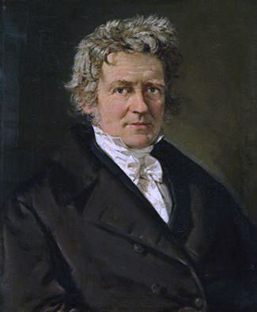

```{r loadpacksdist3, include = F}
# source("loader.R")
```

# Descriptives

When we encounter large lists of unsorted numbers, we have no natural capacity to perceive the list's fundamental characteristics such as its average or its variability. Therefore, we need `r defword("descriptive statistics", "**Descriptive statistics** summarize noteworthy characteristics of samples.")` to quantify salient characteristics of distributions, or we need to display the numbers in a plot, making them easier to understand and communicate.

## Frequency Distribution Tables

A simple way to describe a distribution is to list how many times each value in the distribution occurs. For example, in this distribution: $\{10, 3, 4, 10, 6, 4, 6, 4\}$, there is 1 three, 3 fours, 2 sixes, and 2 tens. The value that occurs most often is four. A `r defword("frequency distribution table","A **frequency distribution table** summarises a sample by showing the frequency counts of each member of the sample space.")` displays the number of times each value occurs, as in Table\ \@ref(tab:frequencydistributiontable).

```{r frequencydistributiontable, fig.margin=T, fig.align='default', fullwidth=T}
X <- c(3,4,6,10)
reps <- c(1,3,2,2)
d <- map2(X, reps, rep) %>% unlist %>% 
  tibble(X = .) %>% 
  group_by(X) %>% 
  summarise(f = n()) %>% 
  mutate(cf = cumsum(f),
         p = (f / sum(f)) , 
         cp = cumsum(p) %>% prob_label(accuracy = .001)) %>% 
  mutate(p = prob_label(p, accuracy = .001))

sixes <- reps[X == 6]
sample_size = sum(reps)

knitr::kable(d, caption = "Frequency Distribution Table<br>The median is 5, halfway between the two middle scores of 4 and 6.",
               col.names = c("$X$","Frequency", "Cumulative<br>Frequency" ,"Proportion", "Cumulative<br>Proportion"), align = "rrrrr", escape = F)
```

It is common to include alongside the frequencies of each value the proportion (or percentage) of times a value occurs. If the frequency of sample space element $i$ is $f_i$, and the total sample size is $n$, then the proportion of sample space element $i$ is

$$p_i = \frac{f_i}{n}$$

In Table\ \@ref(tab:frequencydistributiontable), the frequency of sixes is $f=`r sixes`$ and there are $n = `r sample_size`$ numbers in the distribution, thus the proportion of sixes is $p = \frac{`r sixes`}{`r sample_size`} = `r WJSmisc::remove_leading_zero(sixes / sample_size)`$.

It is also common to supplement frequency distribution tables with additional information such as the `r defword("cumulative frequency","The **cumulative frequency** tells us the number of scores in a distribution that are equal to or lower than a particular sample space element.")`. For each sample space element, the cumulative frequency $(cf)$ is the sum of the frequencies $(f)$ of the current and all previous sample space elements.

$$cf_i= \sum_{j=1}^{i}{f_j}$$

Ordinal, interval, and ratio variables can have cumulative frequencies, but not nominal variables. To calculate cumulative frequencies, the sample space needs to be sorted in a meaningful way, which is not possible with true nominal variables. That is, there are no scores "below" any other scores in nominal variables.

The cumulative proportion $(cp)$ is the proportion of scores less than or equal to a particular sample space element.

$$cp_i = \frac{cf_i}{n}$$

### Frequency Distribution Tables in R

Let's start with a data set from @garcia2010women, which can accessed via the psych package. 

```{r garcia, echo = TRUE}
# Get the Garcia data set from the psych package
d <- psych::Garcia

```

The sjmisc package [@R-sjmisc] provides a quick and easy way to create a frequency distribution table with the `frq` function.

```{r frq, echo = TRUE}
sjmisc::frq(d$anger)
```

Typically we use frequency distribution tables to check whether the values of a variable are correct and that the distribution makes sense to us. Thus the `frq` function is all we need most of the time. However, if you need a publication-ready frequency distribution table, you will probably have to make it from scratch (See Table\ \@ref(tab:freqtablepub)).

```{r freqtablepub}
# Publication-quality frequency table
d %>% 
  rename(X = anger) %>% 
  count(X, name = "f") %>% 
  mutate(cf = cumsum(f),
         p = f / sum(f),
         cp = cumsum(p)) %>% 
  mutate(across(
    .cols = p:cp,
    .fns = function(x) scales::number(x, .01) %>% 
      str_remove("^0"))) %>% 
  rename_with(
    .fn = function(x) paste0("*",x,"*"), 
    .cols = -X) %>% 
  mutate(` ` = "") %>% 
  kable(
    caption = "Frequency Distribution Table for Anger<br>
    *f*&nbsp;=&nbsp;Frequency
    , *cf*&nbsp;=&nbsp;Cumulative Frequency
    , *p*&nbsp;=&nbsp;Proportion
    , and *cp*&nbsp;=&nbsp;Cumulative Proportion",
    digits = 2,
    align = "r",
    format = "html"
  ) %>%
  html_table_width(c(30, rep(100, 4), 20))
```


```{r freqtablepubCode, button_r=TRUE, ref.label="freqtablepub"}

```

### Frequency Distribution Bar Plots

```{r freqbarplot, fig.height=7, fig.cap="Frequency Distribution Bar Plot", fig.margin = TRUE, fig.align='default'}
# Make frequency data
d_freq <- d %>% 
  rename(Anger = anger) %>% 
  count(Anger, name = "f") %>% 
  mutate(cf = cumsum(f),
         p = f / sum(f),
         cp = cumsum(p))

# Frequency Bar Plot
d_freq %>% 
  ggplot(aes(Anger, f)) + 
  geom_col(fill = myfills[1]) + 
  geom_text_fill(aes(label = f), 
                 vjust = -0.5, 
                 size = ggtext_size(30)) +
  scale_x_continuous(breaks = 1:7, 
                     minor_breaks = NULL) + 
  scale_y_continuous("Frequency", 
                     expand = expansion(c(0, 0.09))) +
  theme_minimal(base_size = 30, 
                base_family = bfont) + 
  theme(panel.grid.major.x = element_blank())       
```


```{r freqstackedbarplot, fig.width=2.25, fig.margin = TRUE, fig.align='default', warning=FALSE, fig.cap="Cumulative Frequency Stacked Bar Plot"}
# Stacked Frequency Bar Plot
d_freq %>% 
  ggplot(aes(factor("Anger"), cf - f / 2)) + 
  geom_tile(aes(height = f, fill = factor(Anger)), 
            width = 1.2) +
  geom_text(aes(label = paste0(
    Anger, 
    " (", 
    f, 
    ", ",
    scales::percent(p, accuracy = 1),
    ")"))) + 
  scale_y_continuous(
    "Cumulative Frequency",
    breaks = c(0, d_freq$cf),
    minor_breaks = NULL,
    expand = expansion(c(0, .04)),
    sec.axis = sec_axis(
      trans = ~ .x,
      labels = scales::percent(c(0, d_freq$cp), 
                               accuracy = 1),
      breaks = c(0, d_freq$cf),
      name = NULL))  +
  scale_fill_manual(values = tinter::tinter(myfills[1], 9)) +
  scale_x_discrete(NULL) +
  theme(
    legend.position = "none",
    panel.grid = element_blank(),
    axis.text.y = element_text(vjust = c(rep(0.5, 7),-0.3))
  ) 
```


```{r freqstepplot, fig.cap="Cumulative Frequency Step Plot", fig.height=7, fig.margin=TRUE, fig.align='default'}
# Frequency Step Plot
d_freq %>%
  ggplot(aes(Anger, cf)) +
  geom_step(direction = "mid",
            color = myfills[1],
            size = 0.5) +
  geom_text_fill(
    aes(label = cf),
    vjust = -0.5,
    color = myfills[1],
    size = ggtext_size(30)
  ) +
  geom_text_fill(
    aes(label = signs::signs(
      f, accuracy = 1, add_plusses = T
    )),
    vjust = 1.5,
    color = "gray40",
    size = ggtext_size(30)
  ) +
  scale_x_continuous(breaks = 1:7,
                     expand = expansion()) +
  scale_y_continuous(
    "Cumulative Frequency",
    limits = c(0, NA),
    breaks = 0,
    minor_breaks = NULL,
    expand = expansion(mult = c(0.001, 0.07))
  ) +
  theme_minimal(base_size = 30, base_family = bfont) +
  theme(panel.grid.major.x = element_blank()) +
  annotate(
    geom = "segment",
    x = 0.5,
    y = 0,
    xend = 0.5,
    yend = 73,
    color = myfills[1],
    size = 1
  ) +
  annotate(
    geom = "segment",
    x = 0.5,
    y = 73,
    xend = 1,
    yend = 73,
    color = myfills[1],
    size = 0.5
  ) +
  annotate(
    geom = "segment",
    x = 7,
    y = 129,
    xend = 7.5,
    yend = 129,
    color = myfills[1],
    size = 0.5
  ) 
  
```

In Figure\ \@ref(fig:freqbarplot), the frequency distribution from Table\ \@ref(tab:freqtablepub) is translated into a standard bar plot in which each bar is proportional to the frequency of each response. A column bar plot allows for easy comparison of the frequency of each category. For example, in Figure\ \@ref(fig:freqbarplot), the most frequent response to the Anger question---1 (low)---draws your attention immediately. In contrast to the mental effort needed to scan frequencies listed in a table, the relative height of each frequency in the bar plot is perceived, compared, and interpreted almost effortlessly. With a single glance at Figure\ \@ref(fig:freqbarplot), no calculation is required to know that none of the other responses is even half as frequent as 1.


```{r freqbarplotCode, ref.label='freqbarplot', button_r=TRUE}

```


In a standard bar plot, one may easily compare frequencies to each other, but that may not be what you wish the reader to notice first. A stacked bar plot emphasizes the proportions of each category as it relates to the whole. It also allows for the visual display of the cumulative frequencies and proportions. For example, in Figure\ \@ref(fig:freqstackedbarplot), it is easy to see that more than half of participants have an anger level of 1, and three quarters have an anger level of 2 or less.


```{r freqstackedbarplotCode, ref.label='freqstackedbarplot', button_r=TRUE}

```

A step line plot can show the cumulative frequency's relationship with the variable. For example, in  Figure\ \@ref(fig:freqstepplot), it appears that the cumulative frequency rises quickly at first but then rises slowly and steadily thereafter.

```{r freqstepplotCode, ref.label='freqstepplot', button_r=TRUE}

```

## Measures of Central Tendency

If we need to summarize an entire distribution with a single number with the least possible information loss, we use a measure of central tendency---usually the mode, the median, or the mean. Although these numbers are intended to represent the entire distribution, they often require accompaniment from other statistics to perform this role with sufficient fidelity. 

Our choice of which measure of central tendency we use to summarize a distribution depends on which type of variable we are summarizing (i.e., nominal, ordinal, interval, or ratio) and also a consideration of each central tendency measure's strengths and weaknesses in particular situations.

### Mode

The `r defword("mode","The **mode** is the value in a distribution that occurs most often.")` is the most frequent score in a distribution. Suppose we have a distribution that looks like this: 

$$\{1,2,2,2,2,3,3\}$$

Because 2 occurs more frequently than the other values in the distribution, the mode is 2. 

```{r d_mode}
d_mode <- d %>% 
  dplyr::select(anger) %>% 
  dplyr::group_by(anger) %>% 
  dplyr::count() %>% 
  dplyr::ungroup() %>% 
  dplyr::filter(n == max(n))
```

In a frequency distribution table, the mode is the value with the highest value in the $f$ (frequency) column. In Table\ \@ref(tab:freqtablepub), the mode is `r d_mode$anger` because it has the highest frequency $(f = `r pull(d_mode, n)`)$. 

In a bar plot, histogram, or probability density plot, the mode is the value that corresponds to the highest point in the plot. For example, in Figure\ \@ref(fig:freqbarplot), the modal value is 1 because its frequency of 73 is the highest point in the bar plot. In Figure\ \@ref(fig:bimodal), the mode is &minus;1 because that is the highest point in the density plot. 

If two values tie, both values are the mode and the distribution is `r defword("bimodal", "A **bimodal** distribution has two modes.")`. Sometimes a distribution has two distinct clusters, each with its own local mode. The greater of these two modes is the *major mode*, and the lesser is the *minor mode* (See Figure\ \@ref(fig:bimodal)).

```{r bimodal, fig.cap="A Bimodal Distribution", fig.margin = TRUE, fig.align='default'}
# A bimodal distribution
tibble(x = seq(-3, 3.5, .01),
       y = dnorm(x,-1, 0.5) / 0.8 + 
         dnorm(x, 1, 0.75)) %>%
  ggplot(aes(x, y)) +
  geom_area(fill = myfills[1]) +
  geom_text(
    data = . %>% dplyr::filter(x == -1),
    vjust = -0.25,
    label = "Major\nMode",
    size = 8,
    lineheight = 0.9
  ) +
  geom_text(
    data = . %>% dplyr::filter(x == 1),
    vjust = -0.25,
    label = "Minor\nMode",
    size = 8,
    lineheight = 0.9
  ) +
  scale_x_continuous(NULL,
                     minor_breaks = NULL,
                     breaks = seq(-3, 3)) +
  scale_y_continuous(NULL,
                     breaks = NULL,
                     expand = expansion(c(0, .25))) +
  theme_minimal(base_size = 30,
                base_family = bfont) +
  theme(panel.grid.major.x = element_blank()) 
```

```{r bimodalCode, ref.label='bimodal', button_r=TRUE}

```


The mode is the only measure of central tendency that be computed for all variable types and is the only choice for nominal variables (See Table\ \@ref(tab:proconCT)).

To compute the mode of a variable, use the `mfv` (most frequent value) function from the modeest package [@R-modeest]. In this example, the 2 occurs four times.

```{r mode, echo=TRUE}
# Data
x <- c(1,2,2,2,2,3,3)
# Mode
modeest::mfv(x)
```

The `mfv` function will return all modes if there is more than one. In this example, the 1, 3, and 4 all occur twice.

```{r multiplemode, echo=TRUE}
# Data
x <- c(1,1,3,3,4,4,5,6)
# Mode
modeest::mfv(x)
```

### Median

The `r defword("median", "The **median** is the point that divides the lower 50 percent of a distribution from the upper 50 percent.")` is midpoint of a distribution, the point that divides the lower half of the distribution from the upper half. To calculate the median, you first need to sort the scores. If there is an odd number of scores, the median is the middle score. If there an even number of scores, it is the mean of the two middle scores. There are other definitions of the median that are a little more complex, but rarely is precision needed for calculating the median.

To find the median using a frequency distribution table, find the first sample space element with a cumulative proportion greater than 0.5. For example, in the distribution shown in Table\ \@ref(tab:mediantable), the first cumulative proportion greater than 0.5 occurs at 5, which is therefore the median.

```{r mediantable}
X <- c(1, 5, 7, 9)
reps <- c(1, 3, 1, 2)
map2(X, reps, rep) %>% unlist %>%
  tibble(X = .) %>%
  group_by(X) %>%
  summarise(f = n()) %>%
  mutate(cf = cumsum(f),
         p = f / sum(f),
         cp = cumsum(p)) %>%
  mutate(across(
    .cols = p:cp,
    .fns = function(x)
      scales::number(x, .01) %>%
      str_remove("^0")
  )) %>%
  knitr::kable(
    caption = "Finding the Median in a Frequency Distribution Table.<br>In this case, the median is 5 because it has the first cumulative proportion that is greater than 0.5.",
    digits = 2,
    align = "r",
    col.names = c(
      "*X*",
      "Frequency",
      "Cumulative Frequency" ,
      "Proportion",
      "Cumulative Proportion"
    )
  )
```

If a sample space element's cumulative proportion is exactly 0.5, average that sample space element with the next highest value. For example, in the distribution in Table\ \@ref(tab:frequencydistributiontable), the cumulative proportion for 4 is exactly 0.5 and the next value is 6. Thus the median is 

$$\frac{4+6}{2}=5$$

The median can be computed for ordinal, interval, and ratio variables, but not for nominal variables (See Table\ \@ref(tab:proconCT)). Because nominal variables have no order, no value is "between" any other value. Thus, because the median is the middle score and nominal variables have no middle, nominal variables cannot have a median.

For ordinal variables, the median is the preferred measure of central tendency because it is usually more stable from one sample to the next compared to the mode.

In R, the `median` function can compute the median:

```{r median, echo=TRUE}
median(c(1,2,3))
```


### Mean

The `r defword("arithmetic mean", "The **arithmetic mean** is the balance point of a disribution.")` is the sum of all values of a distribution divided by the size of the distribution.

$$\mu_X = \frac{\sum_{i = 1}^n {X_i}}{n}$$

Where \begin{align*}
  \mu_X &= \text{The population mean of } X\\
  n &= \text{The number of values in } X
\end{align*}

The arithmetic mean can only be calculated with interval or ratio variables. Why? The formula for the mean requires adding numbers, and the operation of addition is not defined for ordinal and nominal values.

The arithmetic mean is usually the preferred measure of central tendency for interval and ration variables because it is usually more stable from sample to sample than the median and the mode. In Figure\ \@ref(fig:centraltendency), it can be seen that the sampling distributions of the mean is narrower than that of the median and the mode. In other words, it has a smaller `r defword("standard error", "The **standard error** is the standard deviation of a sampling distribution.")`.

```{r centraltendency, fig.cap="Sampling Distributions of Central Tendency Measures.<br>The standard normal distribution, $\\mathcal{N}(0,1),$ was used to generate 10,000 samples with a sample size of 100. The distribution of sample means is slightly narrower than the distribution of sample medians, meaning that the mean is slightly more stable than the median. The distribution of sample modes is very wide, meaning that the mode is much less stable than the mean and median."}

# Central tendency function
ct <- function(sample_size = 100) {
  x <- rnorm(sample_size)
  mo <- DescTools::Mode(round(x,2))
  
  c(Mean = mean(x), 
       Median = median(x), 
       Mode = sample(mo, 1))
}

# Replicate samples
d_ct <- replicate(10000, ct(100)) %>% 
  t() %>% 
  as_tibble() %>% 
  pivot_longer(cols = everything(), 
               names_to = "CentralTendency",
               values_to = "Value") %>% 
  mutate(y = recode(CentralTendency, 
                    `Mode` = 0.025, 
                    `Median` = 0.055, 
                    `Mean` = 0.105))

# Summary data
d_sum <- d_ct %>% 
  filter(!is.na(Value)) %>% 
  group_by(CentralTendency) %>% 
  summarise(x = mean(Value),
            y = mean(y),
            ub = quantile(Value, 0.975),
            lb = quantile(Value, 0.025)) %>% 
  rename(Value = x)

# Plot
d_ct %>% 
  filter(!is.na(Value)) %>% 
  ggplot(aes(Value, y)) +
  stat_function(geom = "area", 
                fun = function(x) dnorm(x, 0, 1), 
                n = 1000, 
                color = NA, 
                fill = "gray50", 
                alpha = 0.2)  +
  ggdist::stat_halfeye(aes(fill = CentralTendency), 
                       scale = 1.2, 
                       color = "gray20") +
  geom_text(data = d_sum,
            aes(label = CentralTendency),
            vjust = 1.5,
            size = ggtext_size(18),
            color = "gray20") +
  scale_x_continuous(name = NULL, 
                     limits = c(-3.5,3.5), 
                     breaks = seq(-4,4),
                     labels = \(x) signs::signs(x, accuracy = 1)) +
  theme_minimal(base_size = 18, 
                base_family = bfont) +
  theme(legend.position = "none", 
        panel.grid = element_blank()) +
  scale_y_continuous(NULL, breaks = NULL, 
                     expand = expansion()) + 
  scale_fill_manual(values = scales::muted(
    rep(myfills[1], 3),
    l = c(65, 55, 40)))

# ggsave("centraltendencystability.svg", height = 5, width = 7)
# fs::file_show("centraltendencystability.svg")

```

```{r centraltendencyCode, ref.label="centraltendency", button_r=TRUE}

```


In R, the `mean` function can compute the median:

```{r meanfunction, echo=TRUE}
mean(c(1,2,3))
```

Watch out for missing values in R. If the distribution has even a single missning value, the `mean` function will return `NA`, as will most other summary functions in R (e.g., `median`, `sd`, `var`, and `cor`).


```{r meanfunctionNA, echo=TRUE}
mean(c(1,NA,3))
```

To calculate the mean of all non-missing values, specify that all missing values shoule be removed prior to calculation like so:

```{r meanfunctionnarm, echo=TRUE}
mean(c(1,NA,3), na.rm = TRUE)
```

```{r proconCT}
tibble::tribble(
  ~Feature,    ~Mode,   ~Median,      ~Mean,
  "Computable for Nominal Variables",    "Yes",      "No",       "No",
  "Computable for Ordinal Variables",    "Yes",     "Yes",       "No",
  "Computable for Interval Variables",    "Yes",     "Yes",      "Yes",
  "Computable for Ratio Variables",    "Yes",     "Yes",      "Yes",                             
  "Standard Error", "Larger", "Smaller", "Smallest",
  "Algebraic Formula",     "No",      "No",      "Yes",
  "Unique Value",     "No",     "Yes",      "Yes",
  "Sensitive to Outliers/Skewness",     "No",      "No",      "Yes"
  ) %>% 
  kable(caption = "Comparing Central Tendency Measures")
```

Table\ \@ref(tab:proconCT) has a list of comparative features of each of the three major central tendency measures.

## Expected Values

(Section Still Unfinished)

At one level, the concept of the `r defword("expected value", "The **expected value** of a random variable is the population mean of the values that the random variable generates.")` of a random variable is really simple; it is just the population mean of the variable. So why don't we just talk about population means and be done with this "expected value" business? It just complicates things! True. In this case, however, there is value in letting some simple things appear to become complicated for a while so that later we can show that some apparently complicated things are actually simple.

Why can't we just say that the expected value of a random variable is the population mean? You are familiar, of course, with the formula for a mean. You just add up the numbers and divide by the number of numbers $n$:

$$
m_X=\frac{\sum_{i=1}^{n} {x_i}}{n}
$$

Fine. Easy. Except...hmm...random variables generate an infinite number of numbers. Dividing by infinity is tricky. We'll have to approach this from a different angle...

The expected value of a random variable is a weighted mean. A mean of what? Everything in the sample space. How are the sample space elements weighted? Each element in the sample space is multiplied by its probability of occurring.

```{r pmfX,echo=FALSE, fig.margin = T, fig.align='default', fig.cap="Probability Distribution of a Hypothetical Random Variable", fig.height=4, fig.width=4, warning=F}
tibble(x = factor(c(2,4,8), levels = 1:8),
       p = c(0.3, 0.2, 0.5)) %>% 
  ggplot(aes(x,p)) + 
  geom_col(fill = myfills[1]) + 
  geom_text(aes(label = prob_label(p)), 
            vjust = -0.4, 
            family = bfont, 
            size = ggtext_size(18)) + 
  theme_minimal(base_family = bfont, 
                base_size = 18) + 
  scale_y_continuous("Probability", 
                     expand = expansion(mult = c(.01, .10)),
                     breaks = seq(0,1,.1),
                     labels = prob_label
                     ) + 
  scale_x_discrete("Sample Space", drop = F ) + 
  theme(panel.grid.major.x = element_blank())

```


Suppose that the sample space of a random variable *X* is {2, 4, 8} with respective probabilities of {0.3, 0.2, 0.5}, as shown in Figure\ \@ref(fig:pmfX). 

```{r pmfXCode, button_r=TRUE, ref.label='pmfX'}

```


The notation for taking the expected value of a random variable $X$ is $\mathcal{E}(X)$. Can we find the mean of this variable $X$ even if we do not have any samples it generates? Yes. To calculate the expected value of $X$, multiply each sample space element by its associated probability and then take the sum of all resulting products. Thus,

$$
\begin{align*}
\mathcal{E}(X)&=\sum_{i=1}^{3}{p_i x_i}\\
&= p_1x_1+p_2x_2+p_3x_3\\
&= (.3\times 2)+(.2\times 4)+(.5\times 8)\\
&=5.4
\end{align*}
$$

The term *expected value* might be a little confusing. In this case, 5.4 is the expected value of $X$ but $X$ never once generates a value of 5.4. So the expected value is not "expected" in the sense that we expect to see it often. It is expected to be close to the mean of any randomly selected sample of the variable that is sufficiently large:

```{r thinbins,fig.width=5,fig.height=7,echo=FALSE, fig.cap="Slicing the Standard Normal Distribution into Ever Thinner Bins", warning = F, fig.fullwidth = T, eval=TRUE, echo=FALSE, cache=TRUE, out.width="100%", fig.margin = T, fig.align='default'}
# Slicing the standard normal distribution into ever thinner bins
make_bins <- function(binPower, binWidth, LowerBound, UpperBound) {
  tibble(x = seq(LowerBound, UpperBound, binWidth), binPower, binWidth)
}

pmap_df(tibble(binPower = 0:4, 
               binWidth = 2 ^ (-1 * binPower), 
               LowerBound = -4, 
               UpperBound = 4), 
        make_bins) %>% 
  mutate(p = pnorm(x + binWidth / 2) - pnorm(x - binWidth / 2),
         width_label = factor(2 ^ binPower, 
                              levels = 2 ^ (0:4),
                              labels = c("Width = 1",
                                         paste0("Width = 1/",
                                                2 ^ (1:4))))) %>%
  ggplot(aes(x, p)) + 
  geom_col(aes(width = binWidth), 
           fill = myfills[1], 
           color = "white", 
           lwd = 0.1) + 
  facet_grid(width_label ~ .,  
             scales = "free") + 
  theme_light(base_size = 24, 
              base_family = bfont) + 
  scale_x_continuous(NULL, 
                     breaks = -4:4, 
                     labels = function(x) signs::signs(x, accuracy = 1),
                     # labels =  paste0(if_else(-4:4 < 0,"−",""), abs(-4:4)),
                     # sec.axis = dup_axis(),
                     expand = c(0.01,0)) + 
  scale_y_continuous(NULL, 
                     breaks = NULL) +
  theme(panel.grid = element_blank(), 
        # strip.text.y = element_blank(), 
        strip.placement = "outside",
        strip.text.y = element_text(angle = 0),
        axis.text.x = element_text(hjust = c(rep(.75,4),rep(0.5,5))))

```


$$
\mathcal{E}(X)=\lim_{n \to \infty} \frac{1}{n}\sum_{i=1}^{n} {x_i}
$$

If a random variable $X$ is discrete, its expected value $\mathcal{E}(X)$ is the sum of each member of the sample space $x_i$ multiplied by its probability of occurring $p_i$. The probability of occurring is the output of $X$'s probability density function at that location: $p_i=f_X(x_i)$. Thus,

$$
\mathcal{E}(X)=\sum_{i=-\infty}^{\infty}{x_i f_X(x_i)}
$$

With continuous variables, the number of elements in a sample is infinite. Fortunately, calculus was designed to deal with this kind of infinity. The trick is to imagine that the continuous variable is sliced into bins and that the bins are sliced ever more thinly. If a continuous random variable has probability density function $f_X(x)$, the expected value is

$$
\mathcal{E}(X)=\int_{-\infty}^{\infty} {x f_X(x)\,\mathrm{d}x}
$$


If we multiply each value of $X$ by the height of its bin ($p$), we get the mean of the binned distribution. If the bins become ever thinner, as in Figure\ \@ref(fig:thinbins), the product of $X$ and $p$ approximates the expected value of the smooth continuous distribution.

```{r thinbinsCode,ref.label="thinbins", button_r=TRUE}

```

```{r thinbins_animate, cache=TRUE, fig.cap="Slicing the standard normal distribution into ever thinner bins", fig.width=10, warning=FALSE, message=FALSE, fig.fullwidth = T, eval=FALSE, echo=FALSE}


make_bins <- function(binPower, binWidth, LowerBound, UpperBound) {
  tibble(x = seq(LowerBound, UpperBound, binWidth), binPower, binWidth)
}
library(gganimate)
max_power <- 6

d <- pmap_df(tibble(binPower = 0:max_power, 
               binWidth = 2 ^ (-1 * binPower), 
               LowerBound = -4, 
               UpperBound = 4), 
        make_bins) %>% 
  mutate(p = pnorm(x + binWidth / 2) - pnorm(x - binWidth / 2),
         width_label = factor(2 ^ binPower, 
                              levels = 2 ^ (0:max_power),
                              labels = c("Bin~Width == 1", 
                                         paste0("Bin~Width == frac(1,",
                                                2 ^ (1:max_power),")")))) %>%
  group_by(binPower) %>% 
  mutate(max_p = max(p)) %>% 
  mutate(p = p / max_p) 

p <- d %>% 
  ggplot(aes(x, p, group = x)) + 
  geom_col(aes(width = binWidth), 
           fill = myfills[1], 
           color = "white", 
           lwd = 0.1) + 
   transition_components(time = binPower, 
                         enter_length = 1L,
                         exit_length = 1L) +
  enter_fade() + 
  exit_fade() +
  ease_aes('cubic-in-out') +
  theme_minimal(base_size = 24, 
              base_family = bfont) + 
  scale_x_continuous(NULL, 
                     breaks = -4:4, 
                     expand = c(0.01,0)) + 
  scale_y_continuous(NULL, 
                     breaks = NULL,
                     expand = c(0,0)) +
  theme(panel.grid = element_blank(), 
        axis.text.x = element_text(hjust = c(rep(.7,4),
                                             rep(0.5,5)))) +
  geom_text(data = d %>% dplyr::filter(x == -4), 
            aes(x = -2, 
                y = 0.95, 
                label = width_label), 
            hjust = 0,
            family = bfont,
            size = 8, parse = T)
 

animate(p, 
        fps = 10,
        nframes = 300,
        device = "svg",
        renderer = magick_renderer(),
        width = 16,
        height = 8,
        pointsize = 18)
```


## Measures of Variability

### Variability of Nominal Variables

For most purposes, the visual inspection of a frequency distribution table or bar plot is all that is needed to understand a nominal variable's variability. I have never needed a statistic that measures the variability of a nominal variable, but if you need one, there are [many from which to choose](https://en.wikipedia.org/wiki/Qualitative_variation). For example, @Wilcox1973 presented this analog to variance for nominal variables:

$$
\text{VA} = 1-\frac{1}{n^2}\frac{k}{k-1}\sum_{i=1}^k\left(f_i-\frac{n}{k}\right)^2
$$

The qualvar package [@R-qualvar] can compute the primary indices of qualitative variation presented by Wilcox.

```{r nominalvar, fig.cap="The Variance Analog (VA) index of qualitative variation ranges from 0 to 1. It equals 0 when every data point is assigned to the same category and 1 when each category has the same frequency.", fig.height=7, fig.margin=T, fig.align='default'}
# The Variance Analog (VA) index of qualitative variation
low_var <- c(A = 100, B = 0, C = 0, D = 0)
mid_var =  c(A = 60, B = 10, C = 25, D = 5)
high_var = c(A = 25, B = 25, C = 25, D = 25)


tibble(Variability = c("Low", "Middle", "High"),
       Frequency = list(low_var, mid_var, high_var),
       VA = map_dbl(Frequency, VA)) %>% 
  mutate(Frequency = map(Frequency, function(d) as.data.frame(d) %>% 
                           tibble::rownames_to_column("Category")),
         Variability = paste0(Variability, 
                              "\nVA = ", 
                              prob_label(VA)) %>% 
           fct_inorder()) %>% 
  unnest(Frequency) %>%  
  rename(Frequencies = d) %>% 
  ggplot(aes(Category, Frequencies)) +
  geom_col(aes(fill = Variability)) + 
  geom_text_fill(aes(label = Frequencies), 
             vjust = -.3, 
             color = "gray30", 
             size = ggtext_size(30)) +
  scale_y_continuous(expand = expansion(mult = c(0, 0.08)), 
                     breaks = seq(0,100,20), 
                     minor_breaks = seq(0,100,10)) +
  scale_fill_manual(values = myfills) +
  facet_grid(cols = vars(Variability)) + 
  theme_light(base_family = bfont, base_size = 30) + 
  theme(panel.grid.major.x = element_blank(), 
        legend.position = "none")
```

```{r qualvar, echo=TRUE}
library(qualvar)

# Frequencies
frequencies =  c(A = 60, B = 10, C = 25, D = 5)

# VA
VA(frequencies)
```


In all of these indices of qualitative variation, the lowest value is 0 when every data point belongs to the same category (See Figure\ \@ref(fig:nominalvar), left panel). Also, the maximum value is 1 when the data points are equally distributed across categories (See Figure\ \@ref(fig:nominalvar), right panel).

```{r nominalvarCode, ref.label="nominalvar", button_r=TRUE}

```


### Interquartile Range

As with nominal variables, a bar plot or frequency distribution table can tell you most of what you want to know about the variability of an ordinal variable. If you need a quantitative measure of how much an ordinal variable varies, you have many options. The most important of these is the `r defword("interquartile range","The **interquartile range** (IQR) is the distance from the score at the 25th percentile to the score at the 75th percentile.")`.

```{r normalIQR, fig.cap="In a normal distribution with a mean of 100 and a standard deviation of 15, the interquartile range is about 20.2, the distance between 89.9 and 110.1.", fig.margin = TRUE, fig.align='default'}
IQR_bounds <- qnorm(c(.25, .75), mean = 100, sd = 15)
l_height = .05
ggplot(data = tibble(x = c(40, 160), y = pnorm(x, 100, 15)), aes(x)) +
  stat_function(fun = \(x) dnorm(x, 100, 15),
                geom = "area",
                alpha = 0.1) +
  stat_function(
    fun = \(x) dnorm(x, 100, 15),
    geom = "area",
    xlim = qnorm(c(.25, .75), mean = 100, sd = 15),
    fill = myfills[1],
    alpha = 0.5
  ) +
  scale_y_continuous(NULL, breaks = NULL, expand = expansion()) +
  scale_x_continuous(NULL, breaks = seq(40, 160, 15)) +
  theme_minimal(base_size = 30, base_family = bfont) +
  theme(
    panel.grid.major.x = element_blank(),
    panel.grid.minor.x = element_blank(),
    axis.ticks.x = element_line(color = "gray30"), plot.margin = margin()
  ) +
  annotate(
    x = IQR_bounds,
    y = 0,
    size = ggtext_size(30),
    geom = "richtext", label.color = NA, fill = NA,
    label = paste0("**", round(IQR_bounds, 1),"**<br><span style='font-size:22pt'>", c(25, 75), "<sup>th</sup><br>percentile"),
    hjust = c(1, 0),
    lineheight = .9,
    vjust = 0
  ) + 
  annotate(x = IQR_bounds[1] + 1.5, 
           y = 0, 
           xend = IQR_bounds[2] - 1.5, 
           yend = 0, 
           size = 1.5, linejoin = "mitre",
           geom = "segment", arrow = arrow(length = unit(5, units = "mm"), 
                                           angle = 15,
                                           ends = "both", 
                                           type = "closed")) + 
  annotate(x = 100, 
           y = 0,
           size = ggtext_size(30),
           label = paste0("*IQR*<br>=", round(IQR_bounds[2] - IQR_bounds[1], 1)),
           geom = "richtext", fill = NA, label.color = NA,
           vjust = 0) + 
  coord_cartesian(clip = "off")
  
```


When median is a good choice for our central tendency measure, the interquartile range is usually a good choice for our variability measure. Whereas the median is the category that contains the 50th percentile in a distribution, the interquartile range is the distance between the categories that contain the 25th and 75th percentile. That is, it is the range of the 50 percent of data in the middle of the distribution. For example, in Figure\ \@ref(fig:normalIQR), the shaded region is the space between the 25th and 75th percentiles in a normal distribution. The IQR is the width of the shaded region, about 20.2.

```{r normalIQRCode, ref.label='normalIQR', button_r=TRUE}

```

In ordinal data, there is no distance between categories, thus we cannot report the interquartile range *per se*. However, we can report the categories that contain the 25th and 75th percentiles. In Figure\ \@ref(fig:ordinalIQR), the interquartile range has its lower bound at *Disagree* and its upper bound at *Slightly Agree*."

```{r ordinalIQR, fig.cap="In this ordinal variable, the interquartile range has a lower bound at *Disagree* (which contains the 25th percentile) and an upper bound at *Slightly Agree* (which contains the 75th percentile).", fig.margin = TRUE, fig.align='default', fig.width=3.5}
d <- tibble(
  Agreement = c(
    "Strongly Disagree",
    "Disagree",
    "Slightly Disagree",
    "Slightly Agree",
    "Agree",
    "Strongly Agree"
  ),
  n = c(23, 85, 93, 121, 20, 26),
  p = n / sum(n),
  cp = cumsum(p),
  ymin = lag(cp, default = 0),
  ytext = ymin + p / 2
) 

d %>% 
  mutate(Agreement = fct_inorder(Agreement) %>% fct_rev()) %>% 
  ggplot(aes(p,cp)) + 
  geom_rect(aes(ymin = ymin, 
                ymax = cp, 
                xmin = 0, 
                xmax = 1, 
                fill = Agreement)) + 
  geom_label(aes(x = 1, label = paste0(round(cp * 100), "%")), hjust = 0, label.size = 0, color = "gray30") +
  geom_text(aes(x = 0.5, y = ytext, 
                label = paste0(Agreement, 
                               " (", 
                               round(100 * p), "%)")),
            size = WJSmisc::ggtext_size(18),
            color = "gray10") + 
  # geom_hline(yintercept = c(0.25, 0.5, .75), size = 0.2, color = "gray30") +
  scale_y_continuous("Cumulative Proportion", 
                     minor_breaks = NULL, 
                     labels = \(x) paste0(round(x * 100), "%"), 
                     expand = expansion(), limits = c(0,1)) + 
  scale_x_continuous("Agreement", breaks = NULL, expand = expansion(add = c(0,.2))) + 
  scale_fill_manual(values = rev(c(rev(tinter(myfills[1], steps = 4)[1:3]), 
                               tinter(myfills[2], steps = 4)[1:3]))) + 
  theme(legend.position = "none", axis.ticks.y = element_line("gray30"), panel.grid.major.y = element_blank()) +
  coord_cartesian(clip = "off")
```

```{r ordinalIQRCode, ref.label='ordinalIQR', button_r=TRUE}

```

The median and the interquartile range are displayed in box and whiskers plots like Figure\ \@ref(fig:IQRboxplot). The height of the box is the interquartile range, and the horizontal line is the median. The top "whisker" extends no higher than 1.5 &mult; *IQR* above the 75th percentile. The bottom "whisker" extends no lower than 1.5 &mult; *IQR* below the 25th percentile. Any data points outside the whiskers can be considered outliers.

```{r IQRboxplot, fig.width=8, fig.height=7, fig.align='default', fig.cap="A Tukey-style Box and Whiskers Plot with Medians and Interquartile Ranges."}
set.seed(2)
d <-
  tibble(A = rnorm(100, 50, 10),
       C = rchisq(100, 4) + 50,
       B = rbeta(100, 4.5, .5) * 80 ) %>% 
  pivot_longer(cols = everything(), names_to = "grp", values_to = "x") %>% 
  mutate(grp = factor(grp)) %>% 
  group_by(grp) %>% 
  mutate(md = median(x), IQR = IQR(x),
         q25 = quantile(x, .25),
         q75 = quantile(x, .75)) %>% 
    ungroup() %>% 
    mutate(outlier = ifelse(x > md, 
                            x - q75 > IQR * 1.5,
                            q25 - x >  IQR * 1.5))

d_stats <- d %>% 
  group_by(grp) %>% 
  summarise(md = median(x),
            q25 = quantile(x, .25),
            q75 = quantile(x, 0.75)) %>% 
  pivot_longer(cols = -grp, names_to = "stats", values_to = "x") %>% 
  mutate(st = case_when(stats == "md" ~ " (Median)",
                        stats == "q25" ~ " (1<sup>st</sup> Quartile)",
                        stats == "q75" ~ " (3<sup>rd</sup> Quartile)"))

width = .3

d %>% 
  ggplot(aes(grp, x)) + 
  geom_boxplot(aes(fill = grp), outlier.color = NA, width = width * 2) + 
  geom_richtext(data = d_stats, 
            aes(label = paste0(scales::number(x, .1), ifelse(grp == "A", st, ""))), 
            nudge_x = width + .01, 
            label.color = NA,
            hjust = 0, 
            color = "gray20") + 
  geom_segment(data = select(d, grp, q25, q75) %>% unique(),
               aes(yend = q75,
                   y = q25,
                   x = as.numeric(grp) - width - 0.05,
                   xend = as.numeric(grp) - width - 0.05),
               arrow = arrow(angle = 15, length = unit(3, "mm"), ends = "both", type = "closed")) +
    geom_richtext(data = select(d, grp, q25, q75, IQR) %>% unique(),
               aes(x = as.numeric(grp) - width - 0.05,
                   y = (q25 + q75) / 2,
                   label = paste0(ifelse(grp == "A", "*IQR* = ",""), scales::number(IQR, .1))), 
               angle = 90, 
               vjust = -0.2,
               label.color = NA,
               label.padding = margin(t = 3)) +
  ggbeeswarm::geom_quasirandom(pch = 16, size = 1, aes(color = outlier), width = .3) +
  scale_x_discrete("Group") + 
  scale_y_continuous(NULL) +
  scale_fill_manual(values = myfills %>% scales::alpha(.5)) + 
  scale_color_manual(values = c("gray20", "firebrick")) +
  theme(legend.position = "none") 
  
```

```{r IQRboxplotCode, ref.label='IQRboxplot', button_r=TRUE}

```

### Variance 

A `r defword("deviation", "A **deviation** is the distance of a score from the score's mean.")` is computed by subtracting a score from its mean:

$$X-\mu$$

We would like to know the typical size of the deviation $X-\mu$. To do so, it might seem intuitively correct to take the average (i.e., expected value) of the deviation, but this quantity is always 0:

$$
\begin{align}
\mathcal{E}(X-\mu)&=\mathcal{E}(X)-\mathcal{E}(\mu)\\
&=\mu-\mu\\
&=0
\end{align}
$$
Because the average deviation is always 0, it has no utility as a measure of variability. It would be reasonable to take the average absolute value of the deviations, but absolute values often cause algebraic difficulties later when we want to use them to derive other statistics. A more mathematically tractable solution is to make each deviation positive by squaring them.

`r defword("Variance", "**Variance** is a measure of variability that gives the size of the average squared deviation from the mean.")` $\left(\sigma^2\right)$ is the expected value of squared deviations from the mean $\left(\mu\right)$:

$$
\begin{align}
\sigma^2&=\mathcal{E}\!\left(\left(X-\mu\right)^2\right)\\
&=\mathcal{E}\!\left(X^2-2X\mu+\mu^2\right)\\
&=\mathcal{E}\!\left(X^2\right)-\mathcal{E}\!\left(2X\mu\right)+\mathcal{E}\!\left(\mu^2\right)\\
&=\mathcal{E}\!\left(X^2\right)-2\mu\,\mathcal{E}\!\left(X\right)+\mu^2\\
&=\mathcal{E}\!\left(X^2\right)-2\mu\mu+\mu^2\\
&=\mathcal{E}\!\left(X^2\right)-2\mu^2+\mu^2\\
&=\mathcal{E}\!\left(X^2\right)-\mu^2\\
\end{align}
$$
If all elements of a population with mean $\mu$ are known, the population variance is calculated like so:

$$
\sigma^2=\frac{\sum_i^n{\left(x_i-\mu\right)^2}}{n}
$$

Notice that the population variance's calculation requires knowing the precise value of the population mean. Most of the time, we need to estimate the population mean $\mu$ using a sample mean $m$. A sample variance $\left(s^2\right)$  for a sample size $n$ can be calculated like so:

$$
s^2=\frac{\sum_i^n{\left(x_i-m\right)^2}}{n-1}
$$

```{r besselpic, fig.margin = TRUE, fig.align='default', fig.cap="Friedrich Wilhelm Bessel (1784--1846)<br>[Image Credits](https://en.wikipedia.org/wiki/File:Friedrich_Wilhelm_Bessel_(1839_painting).jpg)"}



```

Unlike with the population variance, we do not divide by the sample size $n$ to calculate the sample variance. If we divided by $n$, the sample variance would be negatively biased (i.e., it is likely to underestimate the population variance). In what is known as Bessel's correction (i.e, dividing by $n-1$ instead of by $n$), we get an unbiased estimate of the variance. 

Variance is rarely used for descriptive purposes because it is a squared quantity with no direct connection to the width of the distribution it describes. We mainly use variance as a stepping stone to compute other descriptive statistics (e.g., standard deviations and correlation coefficients) and as an essential ingredient in inferential statistics (e.g., analysis of variance, multiple regression, and structural equation modeling). However, Figure\ \@ref(fig:variancevisualization) attempts a visualization what variance represents. Along the $X$-axis, the values of a normally distributed variable $X$ are plotted as points. The $Y$-axis represents the deviations of variable $X$ from $\mu$, the mean of $X$. For each value of $X$, we can create a square with sides as long as the deviations from $\mu$. The red squares have a positive deviation and the blue squares have a negative deviation. The darkness of the color represents the magnitude of the deviation. The black square has an area equal to the average area of all the squares. Its sides have a length equal to the standard deviation, the square root of variance.

```{r variancevisualization, fig.height=6, fig.width=7, fig.cap="Visualizing Variance.<br>The values of variable *X* are plotted with the deviations of *X*. Each square is a deviation from the mean of *X*. Darker squares have larger deviations. The area of the thick black square is the variance&mdash;the average size of the squared deviations.", out.width="100%"}

# Visualizing Variance

set.seed(1)
x <- rnorm(70, 10, 3)
mu <- mean(x)
sigma <- sd(x)
xbreaks <- pretty(x)
ybreaks <- pretty(x - mu)

tick_width <- .04 * sigma

tibble(x = x,
       deviations = x - mu,
       abval = abs(deviations)) |>
  arrange(-abval) |>
  ggplot(aes(x, deviations)) +
  geom_rect(
    aes(
      xmax = x,
      xmin = mu,
      ymax = deviations,
      ymin = 0,
      fill = deviations
    ),
    color = "gray95",
    size = .1
  ) +
  annotate(
    "segment",
    yend = max(ybreaks) + tick_width,
    y = min(ybreaks) - tick_width,
    x = mu,
    xend = mu,
    color = "gray30"
  ) +
  annotate(
    "segment",
    xend = max(xbreaks) + tick_width,
    x = min(xbreaks) - tick_width,
    y = 0,
    yend = 0,
    color = "gray30"
  ) +
  coord_equal() +
  annotate(
    "rect",
    xmax = mu + sigma,
    xmin = mu,
    ymax = sigma,
    ymin = 0,
    fill = NA,
    color = "gray10",
    size = 1
  ) + 
  annotate(
    "richtext",
    x = mu + sigma / 2,
    y = sigma,
    label = paste0("*",span_style("&sigma;"),"* = ", 
                   scales::number(sigma, accuracy = .01)),
    label.color = NA,
    fill = NA,
    vjust = 0,
    family = bfont,
    size = ggtext_size(16),
    color = "gray20"
  ) + 
  annotate(
    "richtext",
    x = mu + sigma,
    y = sigma / 2,
    angle = 90,
    label = paste0("*",span_style("&sigma;"),"* = ", 
                   scales::number(sigma, accuracy = .01)),
    label.color = NA,
    fill = NA,
    vjust = 1.1,
    family = bfont,
    size = ggtext_size(16),
    color = "gray20"
  ) +
  geom_richtext(
    data = tibble(
      x = xbreaks,
      deviations = 0,
      vjust = ifelse(xbreaks < mu, 0, 1.05)
    ),
    aes(label = x, vjust = vjust),
    family = bfont,
    label.color = NA,
    label.padding = unit(c(.2, 0, .2, 0), "lines"),
    fill = NA,
    size = ggtext_size(16),
    color = "gray20"
  ) +
  geom_richtext(
    data = tibble(
      deviations = ybreaks,
      x = mu,
      hjust = ifelse(ybreaks < 0, 0, 1.05)
    ) |>
      dplyr::filter(deviations != 0),
    aes(
      label = signs::signs(deviations, accuracy = 1),
      hjust = hjust
    ),
    family = bfont,
    label.color = NA,
    fill = NA,
    label.padding = unit(c(0, .4, 0, .4), "lines"),
    size = ggtext_size(16),
    color = "gray20"
  ) + annotate("point",
               x = mu,
               y = 0,
               size = 3) +
  annotate(
    "richtext",
    x = mu,
    y = 0,
    label = paste0(
      "*",
      span_style("&mu;"),
      "* = ",
      scales::number(mu, accuracy = .01),
      ""
    ),
    label.color = NA,
    fill = NA,
    vjust = 0.5,
    hjust = -.1,
    angle = -45,
    family = bfont,
    size = ggtext_size(bsize),
    color = "gray20"
  ) +
  geom_segment(
    data = tibble(x = xbreaks),
    aes(
      x = xbreaks,
      y = tick_width,
      yend = -tick_width,
      xend = xbreaks
    ),
    color = "gray20"
  ) +
  geom_segment(
    data = tibble(y = ybreaks) |> dplyr::filter(y != 0),
    aes(
      y = y,
      x = mu + tick_width,
      xend = mu - tick_width,
      yend = y
    ),
    color = "gray20"
  ) +
  theme_void(base_family = bfont, base_size = bsize) +
  theme(legend.position = "right",
        legend.title = element_text(angle = 90, 
                                    margin = margin(l = -15, r = -24))) +
  scale_fill_gradient2(
    "Deviations",
    midpoint = 0,
    low = myfills[1],
    high = myfills[2],
    mid = "white",
    breaks = ybreaks,
    limits = c(-8, 8),
    labels = \(x) signs(x, accuracy = 1)
  ) +
  guides(
    fill = guide_colorbar(
      title = "Deviations",
      label.position = "right",
      title.position = "left",
      title.hjust = 0.5,
      direction = "vertical",
      barheight = unit(.9, "npc")
    )
  ) +
  annotate(
    "text",
    x = min(xbreaks) - tick_width * 4,
    y = 0,
    label = "X",
    family = bfont,
    color = "gray20",
    fontface = "italic",
    size = ggtext_size(bsize, 1)
  ) + 
  annotate("richtext",
           label.color = NA,
           fill = NA,
           x = mu + sigma / 2,
           y = sigma / 2,
           vjust = 0.5,
           size = ggtext_size(bsize),
           label = paste0("*", 
                          span_style("&sigma;"), 
                          "*<sup>2</sup> = ", 
                          scales::number(sigma ^ 2, accuracy = .01)),
           family = bfont,
           color = "gray20") +
  geom_point(pch = 16, size = 1.7, color = "black", y = 0, alpha = .8) 


```

```{r variancevisualizationCode,ref.label="variancevisualization", button_r=TRUE}

```


### Standard Deviation

The `r defword("standard deviation", "The **standard deviation** is a measure of variabily that estimates the typical distance of a score from its own mean.")` is by far the most common measure of variability. The standard deviation $\sigma$ is the square root of the variance $\sigma^2$.

$$
\begin{aligned}
\sigma&=\sqrt{\sigma^2}=\sqrt{\frac{\sum_i^n{\left(x_i-\mu\right)^2}}{n}}\\
s&=\sqrt{s^2}=\sqrt{\frac{\sum_i^n{\left(x_i-m\right)^2}}{n-1}}
\end{aligned}
$$


Although it is not an arithmetic average of the deviations, it can be thought of as representing the typical size of the deviations. Technically, it is the square root of the average squared deviation.

In a normal distribution, the standard deviation is the distance from the mean to the two `r defword("inflection points", "An **inflection point** in a curve is the point at which the curvature changes from upward to downward or vice versa.")` in the probability density curve (see Figure\ \@ref(fig:normalinflection)).

```{r normalinflection, fig.width = 8, fig.height=5, fig.cap="The inflection points in the normal curve are 1 standard deviation from the mean."}

# The inflection points in the normal curve 
# are 1 standard deviation from the mean.

ggplot(tibble(x = c(-4,4)), aes(x)) + 
  stat_function(fun = dnorm, geom = "area", alpha = 0.4, fill = myfills[1], xlim = c(-4,-1)) +
  stat_function(fun = dnorm, geom = "area", alpha = 0.4, fill = myfills[2], xlim = c(-1,1)) +
  stat_function(fun = dnorm, geom = "area", alpha = 0.4, fill = myfills[1], xlim = c(1,4)) +
  annotate(x = c(-1,1), y = dnorm(c(-1,1)), geom = "point") + 
  scale_x_continuous("Standard Deviation Units", 
                     breaks = -4:4, 
                     labels = paste0(signs::signs(-4:4, 
                                                  accuracy = 1, 
                                                  label_at_zero = "blank", 
                                                  add_plusses = T),
                                     "*",
                                     span_style(c(rep("&sigma;", 4), "&mu;", rep("&sigma;", 4))), 
                                     "*")) +
  scale_y_continuous(NULL, breaks = NULL, limits = c(0,NA), expand = expansion()) +
  coord_fixed(12)  +
  annotate(x = -1, 
           y = dnorm(1), 
           label = paste0("Inflection point at &minus;1*", span_style("&sigma;"), "*"), 
           geom = "richtext", 
           hjust = 1, 
           vjust  = 0, 
           label.padding = unit(c(0, 0.25, 0, 0), "lines"),
           label.color = NA, 
           label.r = unit(2, "mm")) +
  annotate(x = 1, 
           y = dnorm(1), 
           label = paste0("Inflection point at +1*", span_style("&sigma;"), "*"), 
           geom = "richtext", 
           hjust = 0, 
           vjust  = 0, 
           label.padding = unit(c(0, 0,0, 0.25), "lines"),
           label.color = NA, 
           label.r = unit(2, "mm")) + 
  annotate(x = -1.4, 
           y = dnorm(-1.4), 
           label = "Upward curve", 
           geom = "richtext", 
           angle = 68,
           hjust = 0.5, 
           vjust  = -0.1, 
           color = myfills[1],
           label.padding = unit(c(0, 0, 0.21, 0), "lines"),
           label.color = NA, 
           label.r = unit(1, "mm")) + 
    annotate(x = 1.4, 
           y = dnorm(1.4), 
           label = "Upward curve", 
           geom = "richtext", 
           angle = -68,
           hjust = 0.5, 
           vjust  = -0.1, 
           color = myfills[1],
           label.padding = unit(c(0, 0, 0.21, 0), "lines"),
           label.color = NA, 
           label.r = unit(1, "mm")) + 
    annotate(x = -.65, 
           y = dnorm(-.65), 
           label = "Downward curve", 
           geom = "richtext", 
           angle = 67,
           hjust = 0.5, 
           vjust  = -0.05, 
           color = myfills[2],
           label.padding = unit(c(0, 0, 0.21, 0), "lines"),
           label.color = NA, 
           label.r = unit(1, "mm")) + 
      annotate(x = .65, 
           y = dnorm(.65), 
           label = "Downward curve", 
           geom = "richtext", 
           angle = -67,
           hjust = 0.5, 
           vjust  = -0.05, 
           color = myfills[2],
           label.padding = unit(c(0, 0, 0.21, 0), "lines"),
           label.color = NA, 
           label.r = unit(1, "mm")) + 
  geom_vline(xintercept = 0, color = "gray30") +
  theme(panel.grid = element_blank(), axis.text.x = element_markdown())
```

```{r normalinflectionCode,ref.label="normalinflection", button_r=TRUE}

```


### Absolute Deviation

(Section Still Unfinished)

## Skewness

(Section Still Unfinished)

## Kurtosis

(Section Still Unfinished)
