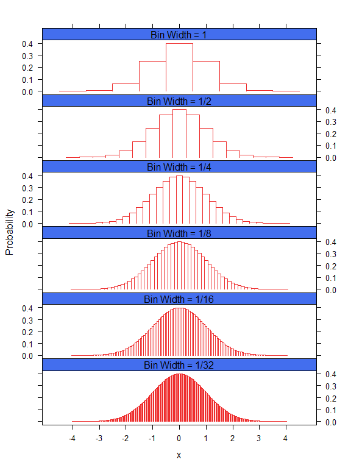

--- 
title: "Practical Psychometrics: A Psychological Assessment Toolkit"
author: "W. Joel Schneider"
date: "2018-08-30"
site: bookdown::bookdown_site
output:
  bookdown::tufte_html_book:
    toc: yes
    css: [toc.css,equity.css,mycss.css]
    margin_references: true
    tufte_features: []
    keep_md: true
    split_by: chapter
    mathjax: "MathJax/MathJax.js"
    highlight: pygments
    includes: 
      in_header: mj_config.html
documentclass: book
bibliography: [book.bib, packages.bib]
biblio-style: apalike
csl: apa.csl
link-citations: yes
github-repo: wjschne/psychtoolkit
description: "This is a minimal example of using the bookdown package to write a book. The output format for this example is bookdown::gitbook."
---

# Preface {-}

Placeholder

<!--chapter:end:index.Rmd-->

# Notation {-}

Placeholder

## Random variables, vectors, and matrices
## Sets and intervals
## Summation 
## Other 

<!--chapter:end:01-notation.Rmd-->

# Introduction {#intro}

Although great painters can make good art with cheap brushes, they need high quality tools to work at the upper limits of their craft. On the other hand, giving an untrained person an expensive set of brushes is unlikely to result in noticeably better art. So it is with these tools. They are of little use to unprepared hands---and in foolish hands, they might even be dangerous. But in hands caring and competent, they can make reasoning more rigorous, results more robust, and recommendations more relevant.

It takes a really long time to complete a comprehensive psychological assessment. Interviews, test administration, and behavioral observations take many hours. Scoring tests and integrating test information can take even more time. Then there is the considerable task of actually writing the report.^[Putting together my first psychological evaluation report one summer in Texas, I labored, fretted, and sweated for more than 30 hours! Even now, at my fastest, it still takes me about 3 hours of uninterrupted work to write what I consider to be a good report.] Finally, the results of the report are presented to the client and other decision-makers. If this much time is put into the process, it makes sense to make the most of it. Unfortunately, while making the most of it, it is easy to go too far---making reckless recommendations from iffy inferences and flights of fancy.

Humans are very very good at some things that are extraordinarily complex, such as pattern recognition. Humans are not so great at combining numeric data in their heads to come to valid conclusions. When Andy  @clark2004natural [p. 5] said that biological brains are "to put it bluntly, bad at logic, good at Frisbee," it was no insult to Frisbee aficionados---robots are no match for humans at the sport. Furthermore, certain kinds of formal logic, though once considered to be the pinnacle of human intellect, are actually fairly simple for computers. Thus, we should let computers do what they do best: calculate. We humans have the job of deciding which calculations the computers should perform, interpreting what the results mean, and deciding how the new information should be used.

Most introductory psychometrics textbooks are designed to help researchers create well constructed tests and therefore cover many details that are not useful to clinicians and fail to cover many practical issues that clinicians should know about. This book is intended to help you extract useful information from the data you already have in ways that you may not have known were possible. That my emphasis is on the practical in no way implies that this book is dumbed down. My aim is to make psychometrics useful to clinicians. If some useful ideas are complex, I hope to make them accessible---but without resorting to superficial glossing. Some background knowledge of psychometrics is necessary to understand how these tools work and, more importantly, when their underlying assumptions have been violated.

This book probably never would have been written had I not several years ago stumbled across Ley's [-@ley1972quantitative]  *Quantitative aspects of psychological assessment*. I admire the book's blend of clarity, practicality, and depth. Why did I write my own book instead of recommending that clinicians download and use Ley's book?^[Although *Quantitative aspects of psychological assessment* is out of print, Ley has been made it freely available for download: [www.psychassessment.com.au/](http://www.psychassessment.com.au/)] Well, I do recommend reading Ley's book. In contrast to my approach, Ley often takes time to gently lay out mathematical proofs of many ideas. Thus Ley's book is a great introduction to the often considerably less accessible corpus of academic writings on psychometrics. I wanted to present much of the same material but with more of an eye to application. I also wanted to present many ideas not included in Ley's book. In addition, I chose to write this book because I believe that Ley had the right idea but that in an era in which no one had a home computer, few clinicians would have the knowledge, motivation, and stamina to use his equations on a regular basis. Now that computers are used by all clinicians, equations like those presented by Ley can be be made easy to use. All of the ``tools'' in this toolkit have been made into computer programs which can be downloaded for free at my website:

http://mysite.com

<!--chapter:end:02-intro.Rmd-->

# Variables

Placeholder

## Nominal Scales {#nominal}
## Ordinal Scales
## Interval Scales
## Ratio Scales
## Discrete vs. Continuous Variables {#sec:DiscreteVsContinuous}

<!--chapter:end:03-variables.Rmd-->

# Distributions

Placeholder

## Random Variables
## Sets
## Sample Spaces {#sec:SampleSpace}
## Probability Distributions {#sec:ProbabilityDistribution}
## Discrete Uniform Distributions {#sec:DiscreteUniform}
## Parameters of Random Variables 
## Probability Mass Functions {#sec:pmf}
## Cumulative Distribution Functions {#sec:CumDist}
## Quantile functions {#sec:Quantile}
## Generating a Random Sample in R
## Bernoulli Distributions {#sec:BernoulliDist}
### Generating a Random Sample from the Bernoulli Distribution
## Binomial Distributions {#sec:binomial}
### Clinical Applications of the Binomial Distribution 
### Graphing the binomial distribution
## Poisson Distributions
### A clinical application of the the Poisson distribution
## Geometric Distributions}
## Probability Density Functions {#sec:pdf}
## Continuous Uniform Distributions {#sec:Uniform}
### Generating random samples from the continuous uniform distribution
### Using the continuous uniform distribution to generate random samples from other distributions
## Normal Distributions {#sec:normal}

<!--chapter:end:04-Distributions.Rmd-->

# Expected Values, Moments, and Descriptive Statistics

## Expected Values

At one level, the concept of the *expected value*<label for="tufte-mn-" class="margin-toggle">&#8853;</label><input type="checkbox" id="tufte-mn-" class="margin-toggle">The *expected value* of a random variable is the population mean of the values that the random variable generates. of a random variable is really simple; it is just the population mean of the variable. So why don't we just talk about population means and be done with this ``expected value'' business? It just complicates things! True. In this case, however, there is value in letting some simple things appear to become complicated for a while so that later we can show that some apparently complicated things are actually simple. 

Why can't we just say that the expected value of a random variable is the population mean? You are familiar, of course, with the formula for a mean. You just add up the numbers and divide by the number of numbers $n$:
\begin{equation*}
m_X=\frac{\sum_{i=1}^{n} {x_i}}{n}
\end{equation*}

Fine. Easy. Except...hmm...random variables generate an infinite number of numbers. Dividing by infinity is tricky. We'll have to approach this from a different angle...

The expected value of a random variable is a weighted mean. A mean of what? Everything in the sample space. How are the sample space elements weighted? Each element in the sample space is multiplied by its probability of occurring.

\begin{marginfigure}
\centering
<<ExpectedValue,echo=FALSE>>=
par(mar = c(2, 4, 4, 1))
x<-1:8
p<-c(NA,0.3,NA,0.2,NA,NA,NA,0.5)
names(p)<-x
barplot(p,1,col="royalblue2",las=1,cex.axis=2,cex.names=2)
@
\caption{Probability distribution of a hypothetical random variable}
\label{fig:pmfX}
\end{marginfigure}

Suppose that the sample space of a random variable $X$ is $\{2, 4, 8\}$ with respective probabilities of $\{0.3, 0.2, 0.5\}$, as shown in Figure~\ref{fig:pmfX}. Each sample space element is multiplied by its probability and the resulting products are summed to calculate the expected value of $X$. The expected value operator is $E()$. Thus,
\begin{align*}
E(X)&=\sum_{i=1}^{3}{p_i x_i}\\
&= p_1x_1+p_2x_2+p_3x_3\\
&= (0.3\times 2)+(0.2\times 4)+(0.5\times 8)\\
&=5.4
\end{align*}

The term \emph{expected value} is a little misleading. In this case, 5.4 is the expected value of $X$ but $X$ never once generates a value of 5.4. So the expected value is not ``expected'' in the sense that we expect to see it often (like we do with the \defword{mode}). It is expected to be close to the mean of any sample of the variable that is sufficiently large:

\begin{equation*}
E(X)=\lim_{n \to \infty} \frac{1}{n}\sum_{i=1}^{n} {x_i}
\end{equation*}

If a discrete random variable $X$ with sample space $S$ has a \hyperref[sec:pmf]{probability mass function} $f_X(x)$, its expected value is
\begin{equation}
E(X)=\sum_{-\infty}^{\infty}{x_i f_X(x_i)}
\end{equation}

With continuous variables we have a problem: the number of elements in a  sample is infinite. Fortunately, calculus was designed to deal with this kind of infinity. The trick is to imagine that the continuous variable is sliced into bins and that the bins are sliced ever more thinly. If a continuous random variable has probability density function $f_X(x)$, the expected value is

\begin{equation}
E(X)=\int_{-\infty}^{\infty} {x f_X(x)\,\mathrm{d}x}
\end{equation}

\begin{figure*}
\begin{center}

\end{center}
\caption{Slicing the standard normal distribution into ever thinner bins.}
\label{fig:LatticeNormal}
\end{figure*}

If we multiply each value of $X$ by the height of its bin ($p$), we get the mean of the binned distribution. If the bins become ever thinner, as in \ref{fig:LatticeNormal}, the project of $X$ and $p$ approximate the expected value of the smooth continuous distribution.

<!--chapter:end:05-Expected-Values-Moments-and-Descriptive-Statistics.Rmd-->

# References {-}

<!--chapter:end:06-references.Rmd-->

