--- 
title: "Practical Psychometrics"
subtitle: "A Psychological Assessment Toolkit"
author: "W. Joel Schneider"
date: "2021-03-23"
site: bookdown::bookdown_site
output:
  bookdown::tufte_html_book:
    toc: TRUE
    toc_depth: 2
    css: [toc.css,equity.css,mycss.css]
    tufte_features: []
    keep_md: true
    split_by: chapter
    highlight: pygments
    includes: 
      in_header: mj_config.html
documentclass: book
bibliography: [book.bib, packages.bib]
csl: apa.csl
link-citations: yes
github-repo: wjschne/toolkit
nocite: |
  @R-bookdown, @R-dplyr, @R-extrafont, @R-fBasics, @R-forcats, @R-fMultivar, @R-gganimate, @R-ggforce, @R-ggplot2, @R-IDPmisc, @R-knitr, @R-knitr, @R-purrr, @R-rmarkdown, @R-sjmisc, @R-sn, @R-stringr, @R-base, @R-tibble, @R-tidyr, @R-tidyverse, @R-tikzDevice, @R-tufte
---


# Preface {-}

I have ambitious goals for this book, but it is not nearly complete. I have been working on it off and on since 2012. Eventually it will have one or more R packages to accompany it. 


Most of the figures and tables for this book were created in R or in $\LaTeX$. To make the content as accessible and transparent as possible, I have included buttons that will reveal the code used to make each figure or table. For example, the initial setup code used for this book can be seen by clicking the button below:

<div class="wrap-collapsible" style="margin-top: 1em">
<input id="collapsible-setupCode" class="toggle" type="checkbox">
<label for="collapsible-setupCode" class="lbl-toggle">R Code</label><div class="collapsible-content">
<div class="content-inner">

```r
# Load packages
library(extrafont)
loadfonts("win")
library(tufte)
library(knitr)
library(sn)
library(fMultivar)
library(IDPmisc)
library(psych)
library(tidyverse)
library(gganimate)
library(ggforce)
library(sjmisc)
library(WJSmisc)
library(tippy)
library(tikzDevice)
library(patchwork)
library(qualvar)
library(modeest)
library(tinter)
library(ggfx)
library(ggtext)


# Set options
options(knitr.kable.digits = 2, knitr.kable.na = '')
knitr::opts_chunk$set(echo = F,
                      fig.width = 7,
                      fig.height = 5,
                      fig.align = 'center',
                      # out.width = "100%",
                      dev = "svg",
                      cache = TRUE)

# Default fonts and colors
bfont = "Equity Text A Tab"
bsize = 16
myfills <- c("royalblue4", "firebrick4", "#51315E")
alpha(myfills)
# Function for converting base size to geom_text size
ggtext_size <- function(base_size, ratio = 0.8) {
  ratio * base_size / ggplot2:::.pt
}

btxt_size = ggtext_size(bsize)

# Default geoms and themes
ggplot2::update_geom_defaults("text",
                              list(family = bfont, size = btxt_size))
ggplot2::update_geom_defaults("label",
                              list(
                                family = bfont,
                                size = btxt_size,
                                label.padding = unit(0, "lines"),
                                label.size = 0
                              ))
ggplot2::update_geom_defaults("density", list(fill = myfills[1]))
geom_text_fill <- function(...) {
  geom_label(...,
             label.padding = unit(0, "lines"),
             label.size = 0)
}
theme_set(theme_minimal(base_size = bsize, base_family = bfont))


# Probability labels
prob_label <- function(p,
                       accuracy = 0.01,
                       digits = NULL) {
  if (is.null(digits)) {
    l <- scales::number(p, accuracy = accuracy) %>%
      str_remove("^0")
  } else {
    l <- formatC(p,
                 digits = digits,
                 format = "fg") %>%
      str_remove("^0")
  }

  l[p == 0] <- "0"
  l[p == 1] <- "1"
  l
}

# Set table column width
# https://github.com/rstudio/bookdown/issues/122#issuecomment-221101375
html_table_width <- function(kable_output, width){
  width_html <- paste0(paste0('<col width="', width, '">'), collapse = "\n")
  sub("</caption>", paste0("</caption>\n", width_html), kable_output)
}

# Hooks -------

# Enclose collapsible r chunk in  button
knitr::opts_hooks$set(button_r = function(options) {
  if (isTRUE(options$button_r)) {
    options$button_before_r <- TRUE
    options$button_after <- TRUE
    options$echo = TRUE; options$eval = FALSE
  }

  options
})

# Enclose collapsible latex chunk in  button
knitr::opts_hooks$set(button_latex = function(options) {
  if (isTRUE(options$button_latex)) {
    options$button_before_latex <- TRUE
    options$button_after <- TRUE
    options$echo = TRUE; options$eval = FALSE
  }

  options
})

# before button for collapsible r chunk
knit_hooks$set(
  button_before_r = function(before, options, envir) {
    if (before) {
      return(
        paste0(
          '<div class="wrap-collapsible" style="margin-top: 1em">',
          "\n",
          '<input id="collapsible-',
          options$label,
          '" class="toggle" type="checkbox">',
          "\n",
          '<label for="collapsible-',
          options$label,
          '" class="lbl-toggle">R Code</label>',
          '<div class="collapsible-content">',
          "\n",
          '<div class="content-inner">'
        )
      )
    }
  }
)

# before button for collapsible latex chunk
knit_hooks$set(
  button_before_latex = function(before, options, envir) {
    if (before) {
      codetype = "$\\rm\\LaTeX~Code$"
      return(
        paste0(
          '<div class="wrap-collapsible" style="margin-top: 1em">',
          "\n",
          '<input id="collapsible-',
          options$label,
          '" class="toggle" type="checkbox">',
          "\n",
          '<label for="collapsible-',
          options$label,
          '" class="lbl-toggle">',
          codetype,
          '</label>',
          '<div class="collapsible-content">',
          "\n",
          '<div class="content-inner">'
        )
      )
    }
  }
)

# After button for collapsible chunks
knit_hooks$set(button_after = function(before, options, envir) {
  if (!before) return('</div></div></div>')
})
```

</div></div></div>

In addition, all the files and code used to create this book can be found in its [Github repository](https://github.com/wjschne/toolkit).


<!--chapter:end:index.Rmd-->


# Introduction {#intro}

Although great painters can make good art with cheap brushes, they need high quality tools to work at the upper limits of their craft. On the other hand, giving an untrained person an expensive set of brushes is unlikely to result in noticeably better art. So it is with these tools. They are of little use to unprepared hands---and in foolish hands, they might even be dangerous. But in hands caring and competent, they can make reasoning more rigorous, results more robust, and recommendations more relevant.

We can choose to spend assessment time and resources wisely in a comprehensive psychological assessment, but interviews, test administration, and behavioral observations necessarily take many hours of focused concentration. Scoring tests and integrating test information can take even more time. Then there is the considerable task of actually writing the report, which typically requires many hours. Finally, the results of the report are presented to the client and other decision-makers. If we invest this much time and effort in the process, it makes sense to make the most of it. Unfortunately, while making the most of it, it is easy to go too far---making reckless recommendations from iffy inferences and flights of fancy.

Humans are very very good at some things that are extraordinarily complex, such as pattern recognition. Humans are not so great at combining numeric data in their heads to come to valid conclusions. When Andy @clark2004natural [p. 5] said that biological brains are "to put it bluntly, bad at logic, good at Frisbee," it was no insult to Frisbee aficionados---robots are no match for humans at the sport. Furthermore, certain kinds of formal logic, though once considered to be the pinnacle of human intellect, are actually fairly simple for computers. Thus, we should let computers do what they do best: calculate. We humans have the job of deciding which calculations the computers should perform, interpreting what the results mean, and deciding how the new information should be used.

Most introductory psychometrics textbooks are designed to help researchers create well constructed tests and therefore cover many details that are not useful to clinicians and fail to cover many practical issues that clinicians should know about. This book is intended to help you extract useful information from the data you already have in ways that you may not have known were possible. That my emphasis is on the practical in no way implies that this book is dumbed down. My aim is to make psychometrics useful to clinicians. If some useful ideas are complex, I hope to make them accessible---but without resorting to superficial glossing. Some background knowledge of psychometrics is necessary to understand how these tools work and, more importantly, when their underlying assumptions have been violated.

<p><span class="marginnote shownote">
<!--
<div class="figure">-->

<!--
<p class="caption marginnote">-->(\#fig:philipley)Philip Ley (1933--2015)<br>[Image Credit](https://thepsychologist.bps.org.uk/phil-ley-1933-2015)<!--</p>-->
<!--</div>--></span></p>

This book probably never would have been written had I not several years ago stumbled across Ley's [-@ley1972quantitative] *Quantitative aspects of psychological assessment*. I admire the book's blend of clarity, practicality, and depth. Why did I write my own book instead of recommending that clinicians download and use Ley's book? Well, I do recommend reading Ley's book. In contrast to my approach, Ley often takes time to gently lay out mathematical proofs of many ideas. Thus Ley's book is a wonderfully beginner-friendly introduction to the often considerably less accessible corpus of academic writings on psychometrics. I wanted to present much of the same material but with more of an eye to application. I also wanted to present many ideas not included in Ley's book. In addition, I chose to write this book because I believe that Ley had the right idea but that in an era in which no one had a home computer, few clinicians would have the knowledge, motivation, and stamina to use his equations on a regular basis. Now that computers are used by all clinicians, equations like those presented by Ley can be be made easy to use. All of the "tools" in this toolkit have been included in [unpublished package] (Schneider, 2021), a package in the R programming environment [@R-base].

<!--chapter:end:01-intro.Rmd-->


# Variables


Because there are so many different kinds of [variables]{class=defword},<label for="tufte-mn-" class="margin-toggle">&#8853;</label><input type="checkbox" id="tufte-mn-" class="margin-toggle"><span class="marginnote">A **variable** is an abstract category of information that can take on different values.</span> it is helpful to classify them by type so that we can think clearly about them and not use them incorrectly.  Some statistics only make sense with certain types of variables. To take a famously silly example from @zacharias1975trouble, you could calculate the average number in a telephone directory, but you wouldn't try calling it. The mean has no meaning for this kind of variable. Unfortunately, it is not always so obvious which statistics can be applied to which variables. If we unknowingly apply the wrong kind of statistic to a variable, our statistical software will give us a result *but we will not know that it is nonsense*.

The classic [taxonomy]{class=defword}<label for="tufte-mn-" class="margin-toggle">&#8853;</label><input type="checkbox" id="tufte-mn-" class="margin-toggle"><span class="marginnote">A **taxonomy** is a classification system.</span> for variable types [@stevens1946theory] distinguishes among nominal, ordinal, interval, and ratio scales (Figure&nbsp;\@ref(fig:Stevens)). Although it is clear that this taxonomy is incomplete [@cicchetti2006rating], there is no consensus about how exactly the list should be amended. If this book were about how to design psychological tests, we would explore this topic in depth. For our purposes, it is enough to say that the fundamentals of measurement and [scaling]{class=defword}<label for="tufte-mn-" class="margin-toggle">&#8853;</label><input type="checkbox" id="tufte-mn-" class="margin-toggle"><span class="marginnote">**Scaling** refers to the procedures by which we decide how to assign numbers to the attributes we measure.</span> is philosophically complex and that controversies abound [@michell1997quantitative]. 

<div class="figure" style="text-align: center">
<p class="caption">(\#fig:Stevens)Stevens' levels of measurement</p></div>


<div class="wrap-collapsible" style="margin-top: 1em">
<input id="collapsible-StevensCode" class="toggle" type="checkbox">
<label for="collapsible-StevensCode" class="lbl-toggle">$\rm\LaTeX~Code$</label><div class="collapsible-content">
<div class="content-inner">

```tikz
% Stevens NOIR
\documentclass[tikz = true, border = 1pt]{standalone}
\usepackage{amsmath}
\usepackage{amsfonts}
\usepackage{amssymb}
\usepackage{graphicx}
\usepackage{tikz}
\usetikzlibrary{positioning, calc}
\usetikzlibrary{intersections}
\usetikzlibrary{decorations.pathreplacing}
\usetikzlibrary{decorations.text}
\usetikzlibrary{arrows,shapes,backgrounds, shadows,fadings}
\usepackage{fontspec}
\setmainfont{Equity Text A}[SmallCapsFont={Equity Caps A}]
\begin{document}
	\begin{tikzpicture}[scale=0.9,text height=1.5ex,text depth=.25ex,post/.style={->,draw,shorten >=4pt,shorten <=4pt,>=latex', very thick, font=\large}]
	\node (h) at (2.3, 0) {};
	\node (v) at (0,0.8) {};
	\node (Nominal) at (1, 2) {\textsc{Nominal}};
	\node (Ordinal) at ($(Nominal)+(h)$) {\textsc{Ordinal}};
	\node (Interval) at ($(Nominal)+2*(h)$) {\textsc{Interval}};
	\node (Ratio) at ($(Nominal)+3*(h)$) {\textsc{Ratio}};
	\node (Equality) at ($(Nominal)-3*(v)$) {$=\ne$};
	\node (LessMore) at ($(Ordinal)-3*(v)$) {$<>$};
	\node (PlusMinus) at ($(Interval)-3*(v)$) {$+-$};
	\node (MultiplyDivide) at ($(Ratio)-3*(v)$) {$\times\div$};
	\node [text width=2cm,text centered] (Mutual) at ($(Nominal)-1.5*(v)$) {Distinct Categories};
	\node [text width=2cm,text centered] (Order) at ($(Ordinal)-1.5*(v)$) {Ordered Categories};
	\node [text width=2cm,text centered] (Distance) at ($(Interval)-1.5*(v)$) {Meaningful Distances};
	\node [text width=2cm,text centered] (Magnitude) at ($(Ratio)-1.5*(v)$) {Absolute\\ Zero};
	\node [color=red] (Level) at ($(Nominal)-1.2*(h)$) {\textbf{Level}};
	\node [text width=2cm,text centered, color=red] (Feature) at ($(Level)-1.5*(v)$) {\textbf{Defining Feature}}; 
	\node [color=red] (Operation) at ($(Level)-3*(v)$) {\textbf{Operations}}; 
	\draw[decoration={brace,amplitude=3mm}, decorate] (Nominal.north) -- (Ordinal.north) node[midway,above=3mm] (Categorical) {Categorical};
	\draw[decoration={brace,amplitude=3mm}, decorate] (Interval.north) -- (Ratio.north) node[midway,above=3mm] (Quantitative) {Quantitative};
	\draw[decoration={brace,amplitude=3mm}, decorate] (Categorical.north) -- (Quantitative.north) node[midway,above=3mm] (Variable) {Variable};
	\end{tikzpicture}
\end{document}
```

</div></div></div>

## Nominal Scales {#nominal}

In a [nominal scale]{class=defword},<label for="tufte-mn-" class="margin-toggle">&#8853;</label><input type="checkbox" id="tufte-mn-" class="margin-toggle"><span class="marginnote">A **nominal scale** groups observations into unordered categories.</span> we note only that some things are different from others and that they belong to two or more </span>[mutually exclusive]{class=defword} categories. <label for="tufte-mn-" class="margin-toggle">&#8853;</label><input type="checkbox" id="tufte-mn-" class="margin-toggle"><span class="marginnote">In **mutually exclusive** categories nothing belongs to more than one category (at the same time and in the same sense).</span> If we say that a person has Down syndrome (trisomy 21), we are implicitly using a nominal scale in which there are people with Down syndrome and people without Down syndrome. In a true nominal scale, there are no cases that fall between categories. To be sure, we might have some difficulty figuring out and reliably agreeing upon the category to which something belongs---but there is no conceptual space between categories.

In the messy world of observable reality, few true nominal variables exist as defined here. Most so-called nominal variables in psychology are merely nominal-*ish*. With respect to Down syndrome, we could say that people either have three copies of the 21st chromosome or they do not. However, if we did say that---and meant it---we'd be wrong. In point of fact, there are many cases of partial trisomy. There are other cases of Down syndrome in which part of chromosome 21 is copied to another chromosome. However, because cases like this are sufficiently rare and because such distinctions are usually not of vital importance, Down Syndrome is treated as if it were a true nominal variable. Even though Down Syndrome might technically come in degrees (both phenotypically and in terms of the underlying chromosomal abnormalities), the distinction between not having the condition and not having it is not [arbitrary]{class=defword}.<label for="tufte-mn-" class="margin-toggle">&#8853;</label><input type="checkbox" id="tufte-mn-" class="margin-toggle"><span class="marginnote">**Arbitrary** refers to things that are decided not by necessity but by preference, convenience, or whim.</span> 

<div class="figure" style="text-align: center">
<p class="caption">(\#fig:dichotomy)A (nearly) true dichotomy</p></div>


<div class="wrap-collapsible" style="margin-top: 1em">
<input id="collapsible-dichotomyCode" class="toggle" type="checkbox">
<label for="collapsible-dichotomyCode" class="lbl-toggle">$\rm\LaTeX~Code$</label><div class="collapsible-content">
<div class="content-inner">

```tikz
\documentclass[tikz = true, border=0mm]{standalone}
\usepackage{tikz}
\usetikzlibrary{positioning}
\usetikzlibrary{arrows,shapes}
\usepackage{fontspec}
\setmainfont{Equity Text A}[SmallCapsFont={Equity Caps A}]
\definecolor{firebrick4}{HTML}{8B1A1A}
\definecolor{royalblue4}{RGB}{39,64,139}
\definecolor{myviolet}{HTML}{51315E}

\begin{document}
	\begin{tikzpicture}
    [node distance=1.1cm and 1.1cm,
    post/.style={->,
    	         black!70,
    	         shorten >=2pt,
    	         shorten <=2pt,
    	         >=latex', 
    	         very thick, 
    	         font=\large}, 
    ob/.style={rectangle,
    	       inner sep=1mm,
    	       minimum width=2.5cm, 
    	       minimum height=2.5cm, 
    	       rounded corners=0.75mm,
    	       font=\large, 
    	       text = white}]
    \node[shape=diamond, 
          fill=myviolet,
          rounded corners=0.5mm,
          shape aspect=1.25, 
          text = white, 
          font = \large] (Trisomy) at (0,0) {Trisomy 21?};
    \node [ob,
           fill=firebrick4,
           left=of Trisomy,
           align=center] (Down) {Down\\Syndrome};
    \node [ob,
          fill=royalblue4, 
          right=of Trisomy, 
          align=center] (NoDown) {No Down\\Syndrome}; 
    \draw[post] (Trisomy) -- (Down) node [pos=.46,above] {Yes};
    \draw[post] (Trisomy) -- (NoDown) node [pos=.46,above] {No};
\end{tikzpicture}
\end{document}
```

</div></div></div>


<div class="figure" style="text-align: center">
<p class="caption">(\#fig:dichotomized)A dichomized continuum</p></div>


<div class="wrap-collapsible" style="margin-top: 1em">
<input id="collapsible-dichotomousCode" class="toggle" type="checkbox">
<label for="collapsible-dichotomousCode" class="lbl-toggle">R Code</label><div class="collapsible-content">
<div class="content-inner">

```r
# A dichotomized continuum
ggplot() + 
  # geom_vline(xintercept = 70, linetype = "dashed") + 
  stat_function(xlim = c(40, 70), 
                fun = dnorm, 
                args = list(mean = 100, sd = 15), 
                geom = "area", 
                fill = myfills[2], 
                n = 1000) + 
  stat_function(xlim = c(70, 160), 
                fun = dnorm, 
                args = list(mean = 100, sd = 15), 
                geom = "area", 
                fill = myfills[1], 
                n = 1000) + 
  geom_segment(data = tibble(x = c(71, 69), 
                             xend = c(160, 40), 
                             y = dnorm(100, 100, 15) * 1.024),
               aes(x = x, 
                   y = y, 
                   xend = xend, 
                   yend = y), 
               color = myfills[1:2], 
               linejoin = "mitre",
               arrow = arrow(type = "closed", 
                             angle = 15, 
                             length = unit(2.25, "mm"))) + 
  geom_text(data = tibble(x = c(100, 55), 
                          y = dnorm(100, 100, 15) * 1.02,
                          l = c("No Intellectual\nDisability", 
                                "Intellectual\nDisability")),
            aes(x = x, 
                y = y,
                label = l),
            size = ggtext_size(bsize),
            vjust = -0.3, 
            lineheight = 1,
            color = myfills[1:2]) +
  annotate("segment", 
           x = 70, 
           xend = 70, 
           size = 0.25,
           y = dnorm(70, 100, 15), 
           yend = dnorm(100, 100, 15) * 1.14,
           linetype = "dashed",
           color = "gray30") +
  scale_x_continuous("IQ and a Adaptive Functioning", 
                     breaks = seq(40, 160, 15),
                     expand = expansion(0)) + 
  scale_y_continuous(NULL, breaks = NULL, 
                     expand = expansion(c(.02,0))) + 
  # theme_minimal(base_size = bsize, base_family = bfont) + 
  ggthemes::theme_tufte(base_size = bsize) +
  theme(
    axis.ticks.x = element_line(size = 0.25),
        # axis.line.x = element_line(size = 0.25),
        # panel.grid = element_blank()
        ) +
  coord_cartesian(xlim = c(40, 161), clip = "off") +
  ggthemes::geom_rangeframe(data = tibble(x = c(40, 160)), aes(x = x), size = 0.25)
```

</div></div></div>


In contrast, consider the diagnosis of *intellectual disability*. We might have only two categories in our coding scheme (Intellectual Disability: Yes or No), but it is widely recognized that the condition comes in degrees (e.g., *none, borderline, mild, moderate, severe,* and *profound*). Thus, intellectual disability is not even conceptually nominal. It is a continuum that has been divided at a convenient but mostly arbitrary point (Figure&nbsp;\@ref(fig:dichotomized)). Distinguishing between a [dichotomous]{class=defword}<label for="tufte-mn-" class="margin-toggle">&#8853;</label><input type="checkbox" id="tufte-mn-" class="margin-toggle"><span class="marginnote">A **dichotomy** is a division of something into two categories.</span> variable that is nominal by nature and one that has an underlying continuum matters because there are statistics that apply only to the latter type of variable (e.g., the tetrachoric correlation coefficient, Pearson & Heron [-@pearson1913theories]). Even so, in many procedures, the two types of dichotomies can be treated identically (e.g., comparing the means of two groups with an independent-samples *t*-test).

What if the categories in a nominal scale are not mutually exclusive? For example, suppose that we have a variable in which people can be classified as having either Down syndrome or Klinefelter syndrome (a condition in which a person has two X chromosomes and one Y chromosome). Obviously, this is a [false dichotomy]{class=defword}.<label for="tufte-mn-" class="margin-toggle">&#8853;</label><input type="checkbox" id="tufte-mn-" class="margin-toggle"><span class="marginnote">In a **false dichotomy**, two alternatives are presented as if they are the only alternatives when, in fact, there are others available.</span> Most people have neither condition. Thus, we need to expand the nominal variable to have three categories: Down syndrome, Klinefelter syndrome, and neither. What if a person has both Down syndrome *and* Klinefelter syndrome? Okay, we just add a fourth category: both. This combinatorial approach is not so much a problem for some purposes (e.g., the ABO blood group system), but for many variables, it quickly becomes unwieldy. If we wanted to describe all chromosomal abnormalities with a single nominal variable, the number of combinations increases exponentially with each new category added. This might be okay if having two or more chromosomal abnormalities is very rare. If, however, the categories are not mutually exclusive and combinations are common enough to matter, it is generally easiest to make the variable into two or more nominal variables (Down syndrome: Yes or No; Klinefelter syndrome: Yes or No; Edwards syndrome: Yes or No; and so forth). Some false dichotomies are so commonly used that people know what you mean, even though they are incomplete (e.g., Democrat vs. Republican) or potentially insensitive to people who do not fit neatly into any of the typical categories (e.g., male vs. female).

When we list the categories of a nominal variable, the order in which we do so is mostly arbitrary. In the variable *college major*, no major intrinsically comes before any other. It is convenient to list the categories alphabetically but the order is different in different languages and will change as the names of college majors evolve. However, strict alphabetical order is not always logical or convenient.^[For example, in a variable such as *ethnic identity*, the number of possible categories is very large so members of very small groups are given the option of writing in their answer next to the word "other." The *other* category is placed at the end of the list to avoid confusion.]

## Ordinal Scales

In an [ordinal scale]{class=defword},<label for="tufte-mn-" class="margin-toggle">&#8853;</label><input type="checkbox" id="tufte-mn-" class="margin-toggle"><span class="marginnote">An **ordinal scale** groups observations into ordered categories.</span> things are still classified by category but the categories have a particular order. Suppose that we are conducting behavioral observations of a child in school and we record when the behavior occurred. The precise time at which the behavior occurred (e.g., 10:38&nbsp;AM) may be uninformative. If the class keeps a fairly regular schedule, it might be more helpful to divide the day into categories such as early morning, recess, late morning, lunch, and afternoon. This way it is easy to see if behavior problems are more likely to occur in some settings (or activities) than in others. It does not matter that these divisions are of unequal lengths or that they do not occur at precisely the same time each day. In a true ordinal variable, the distance between categories is either undefined, unspecified, or irrelevant. 

<p><span class="marginnote shownote">
<!--
<div class="figure">-->

<!--
<p class="caption marginnote">-->(\#fig:Likert)In a Likert scale, the distances between categories are undefined.<!--</p>-->
<!--</div>--></span></p>

Most measurement in psychological assessment involves ordinal scales, though in many cases ordinal scales might appear to be other types of scales. Questionnaires that use Likert scales are clearly ordinal (e.g., Figure&nbsp;\@ref(fig:Likert)). Even though true/false items on questionnaires might seem like nominal scales, they are usually ordinal because the answer indicates whether a person has either more or less of an attribute. That is, *more* and *less* are inherently ordinal concepts. Likewise, ability test items are ordinal, even though *correct* vs. *incorrect* might seem like nominal categories. Ability tests are designed such that a correct response indicates more ability than an incorrect response. The ordinal nature of ability test items is especially clear in cases that allow for partial credit. 


<div class="wrap-collapsible" style="margin-top: 1em">
<input id="collapsible-LikertCode" class="toggle" type="checkbox">
<label for="collapsible-LikertCode" class="lbl-toggle">$\rm\LaTeX~Code$</label><div class="collapsible-content">
<div class="content-inner">

```tikz
% Likert Scale

\documentclass[tikz = true, border = 2pt]{standalone}
\usepackage{amsmath}
\usepackage{amsfonts}
\usepackage{amssymb}
\usepackage{graphicx}
\usepackage{tikz}
\usetikzlibrary{positioning, calc}
\usetikzlibrary{intersections}
\usetikzlibrary{decorations.pathreplacing}
\usetikzlibrary{decorations.text}
\usetikzlibrary{arrows,shapes,backgrounds, shadows,fadings}
\usepackage{fontspec}
\setmainfont{Equity Text A}[SmallCapsFont={Equity Caps A}]
\begin{document}
	
	\begin{tikzpicture} [font=\normalsize]
	\node [align=center,text width=3cm] (sd)  {\textbf{Strongly Disagree}};
	\node [align=center,text width=3cm,above=of sd]  (d) {\textbf{Disagree}};
	\node [align=center,text width=3cm,above=of d]  (n) {\textbf{Neutral}}; 
	\node [align=center,text width=3cm,above=of n] (a)  {\textbf{Agree}};
	\node [align=center,text width=3cm,above=of a] (sa) {\textbf{Strongly Agree}};
	\draw [decoration={brace,amplitude=3mm}, decorate] (d.east) -- (sd.east) node[midway, rotate=-90,align=center,yshift=2em]{Distance?};
	\draw [decoration={brace,amplitude=3mm}, decorate] (d.west) -- (n.west) node[midway, rotate=90,align=center,yshift=2em]{Distance?};
	\draw [decoration={brace,amplitude=3mm}, decorate] (a.east) -- (n.east) node[midway, rotate=-90,align=center,yshift=2em]{Distance?};
	\draw [decoration={brace,amplitude=3mm}, decorate] (a.west) -- (sa.west) node[midway, rotate=90,align=center,yshift=2em]{Distance?};
	\draw (sd.north) -- (d.south);
	\draw (d.north) -- (n.south);
	\draw (n.north) -- (a.south);
	\draw (a.north) -- (sa.south);
	\end{tikzpicture}
\end{document}
```

</div></div></div>

Some scales are only partially ordinal. For example, *educational attainment* is ordinal up to a certain point in most societies, but branches out as people acquire specialized training. For a career in psychology, the educational sequence is high school diploma, associate's degree, bachelor's degree, master's degree, and doctoral degree.^[Obviously, some of these degrees can be skipped and the endpoint is different for different careers in psychology. Furthermore, not all degrees fit neatly in this sequence (e.g., the school psychology specialist degree).] However, this is not the sequence for real estate agents, hair stylists, and pilots. If we wanted to compare educational degrees across professions, how would we rank them? For example, how would we compare a law degree with a doctorate in geology? Are they the same? Does one degree indicate higher educational attainment than the other? The answers depend on the criteria that we care about---and different people care about different things. Thus, it is difficult to say that we have an ordinal scale when we compare educational attainment across professions. 


<div class="figure" style="text-align: center">
<p class="caption">(\#fig:differentiation)Anxiety is more differentiated at higher levels of distress</p></div>


<div class="wrap-collapsible" style="margin-top: 1em">
<input id="collapsible-unnamed-chunk-4" class="toggle" type="checkbox">
<label for="collapsible-unnamed-chunk-4" class="lbl-toggle">R Code</label><div class="collapsible-content">
<div class="content-inner">

```r
# Anxiety is more differentiated at higher levels of distress

bezierCurve <- function(x, y, n=10) {
  {
    outx <- NULL
    outy <- NULL
    
    i <- 1
    for (t in seq(0, 1, length.out = n))
    {
      b <- bez(x, y, t)
      outx[i] <- b$x
      outy[i] <- b$y
      
      i <- i + 1
    }
    
    return(list(x = outx, y = outy))
  }}
  
  bez <- function(x, y, t) {
    outx <- 0
    outy <- 0
    n <- length(x)  -  1
    for (i in 0:n)
    {
      outx <- outx + choose(n, i)  *  ((1  -  t)  ^  (n  -  i))  *  t  ^  i  *
        x[i  +  1]
      outy <-
        outy + choose(n, i)  *  ((1  -  t)  ^  (n  -  i))  *  t  ^  i  *  y[i  +
                                                                              1]
    }
    
    return(list(x  =  outx, y  =  outy))
  }
par(family = "Equity Text A Tab", 
    mar = c(4,0,0,0))  
  x <- c(0, 9, 8, 10)
  y <- c(4.85, 4.85, 3.5, 3.5)
  plot(
    x,
    y,
    "n",
    pch  =  20,
    ylim  =  c(3, 6.5),
    axes  =  F,
    xlim  =  c(0, 11.7),
    xlab  =  "",
    ylab  =  ""
  )
  lines(bezierCurve(x, y, 100), type  =  "l", col  =  "firebrick4", lwd = 2)
  text(
    x  =  rep(10.2, 4),
    y  =  seq(6.5, 3.5, -1),
    labels  =  c("Panic", "Worry", "Obsession", "Paranoia"),
    adj  =  0,
    col  =  c("royalblue4", "royalblue1", "firebrick1", "firebrick4"),
    cex = 1.2
  )
  y <- c(4.95, 4.95, 4.5, 4.5)
  lines(bezierCurve(x, y, 100), type  =  "l", col  =  "firebrick1", lwd = 2)
  y <- c(5.05, 5.05, 5.5, 5.5)
  lines(bezierCurve(x, y, 100), type  =  "l", col  =  "royalblue1", lwd = 2)
  y <- c(5.15, 5.15, 6.5, 6.5)
  lines(bezierCurve(x, y, 100), type  =  "l", col  =  "royalblue4", lwd = 2)
  axis(
    1,
    at = c(0, 2.5, 5, 7.5, 10),
    label  =  c("Low", "Mild", "Moderate", "High", "Extreme")
  )
  mtext("Distress", side = 1, line = 2.8, cex = 1.7, adj = .422)
```

</div></div></div>

Like educational attainment, many psychological traits are more differentiated at some points in the continuum than at others. For example, as seen in Figure&nbsp;\@ref(fig:differentiation), it sometimes convenient to lump the various flavors of trait anxiety together at the low and middle range of distress and then to distinguish among them at the high end. It is difficult to say who is more anxious, a person who is extremely paranoid^[Although *paranoia* is not traditionally considered a type of anxiety, it is clear that anxiety (about the possibly malevolent intentions of others) is a core feature of the trait.] or a person with a severe case of panic disorder. We can say that each is more anxious than the average person (an ordinal comparison) but each has a qualitatively different kind of anxiety. This problem is easily solved by simply talking about two different scales (paranoia and panic). However, there are different kinds of paranoia (e.g., different mixtures of hostility, fear, and psychosis) and different kinds of panic (e.g., panic vs. fear of panic). One can always divide psychological variables into ever narrower categories, making comparisons among and across related constructs problematic. At some point, we gloss over certain qualitative differences and treat them as if they were comparable, even though, strictly speaking, they are not.

## Interval Scales

With [interval scales]{class=defword}, <label for="tufte-mn-" class="margin-toggle">&#8853;</label><input type="checkbox" id="tufte-mn-" class="margin-toggle"><span class="marginnote">In an **interval scale** the distance between numbers has a consistent meaning at every point on the scale.</span> not only are the numbers on the scale ordered, the distance between the numbers (i.e., intervals) is meaningful. A good example of an interval scale is the calendar year. The time elapsed from 1960 to 1970 is the same as the time elapsed from 1970 to 1980. In contrast, consider a standard Likert scale from a questionnaire. What is the distance between *disagree* and *agree*? Is it the same as the distance between *agree* and *strongly agree*? If it were, how would we know? In interval scales, all such mysteries disappear. 


<p><span class="marginnote shownote">
<!--
<div class="figure">-->

<!--
<p class="caption marginnote">-->(\#fig:suds)Subjective units of distress may not be of equal length<!--</p>-->
<!--</div>--></span></p>

It is not always easy to distinguish between an interval scale and an ordinal scale. Therapists sometimes ask clients to rate their distress "on a scale from 0 to 10." Probably, in the mind of the therapist, the distance between each point of the scale is equal. In the mind of the client, however, it may not work that way. In Figure&nbsp;\@ref(fig:suds), a hypothetical client thinks of the distance between 9 and 10 as much greater than the distance between 0 and 1. 


<div class="wrap-collapsible" style="margin-top: 1em">
<input id="collapsible-sudsCode" class="toggle" type="checkbox">
<label for="collapsible-sudsCode" class="lbl-toggle">$\rm\LaTeX~Code$</label><div class="collapsible-content">
<div class="content-inner">

```tikz
% Subjective Units of Distress

\documentclass[tikz = true, border = 2pt]{standalone}

\usepackage{amsmath}
\usepackage{amsfonts}
\usepackage{amssymb}
\usepackage{graphicx}
\usepackage{tikz}
\usetikzlibrary{positioning, calc}
\usetikzlibrary{intersections}
\usetikzlibrary{decorations.pathreplacing}
\usetikzlibrary{decorations.text}
\usetikzlibrary{arrows,shapes,backgrounds, shadows,fadings}

\usepackage{fontspec}
\setmainfont{Equity Text A}[SmallCapsFont={Equity Caps A}]

\begin{document}
	
\begin{tikzpicture}[scale=1]
\definecolor{firebrick2}{RGB}{205,38,38};
\definecolor{royalblue2}{RGB}{67,110,238};
\pgfmathtruncatemacro{\T}{10}
\tikzstyle{every node}=[draw=none,shape=circle,ball color=royalblue2,minimum size=5.5mm, white];
\foreach \n in {0,...,\T} 
\node (\n) at (0,\n) {\footnotesize{\n}};
\foreach \n [remember=\n as \lastn (initially 0)] in {0,...,\T} 
\draw (\lastn) -- (\n);
\tikzstyle{every node}=[draw=none,shape=circle,ball color=firebrick2,minimum size=5.5mm, white];
\def\myarray{{0,0.63,1.45,2.36,3.33,4.35,5.42,6.52,7.65,8.81,11}};
\foreach \x [count=\xi] in {0,...,10} 
\node (\x) at (1,\myarray[\x]) {\footnotesize{\x}};
\foreach \x [remember=\x as \lastx (initially 0)] in {0,...,\T} 
\draw (\lastx) -- (\x);
\tikzstyle{every node}=[rotate=-90];
\node at (-0.8,5) {\small{Scale you think your client is using (equal intervals)}};
\node at (1.8,5) {\small{Scale your client is actually using (for now, at least)}};
\end{tikzpicture} 
\end{document}
```

</div></div></div>


It is doubtful that any subjectively scaled measurement is a true interval scale. Even so, it is clear that some ordinal scales are more interval-like than others. Using item response theory [@embretson2000item], it is possible to sum many ordinal-level items and scale the total score such that it approximates an interval scale. It is important to note, however, that item response theory does not accomplish magic. The application of item response theory in this way is justified only if the ordinal items are measuring an underlying construct that is by nature at the interval (or ratio) level. No amount of statistical wizardry can alter the nature of the underlying construct. Sure, you can apply fancy math to the numbers, but a construct that is ordinal by nature will remain ordinal no matter what you do or convince yourself that you have done.

Most of the tools used in psychological assessment make use of ordinal scales and transform them such that they are treated as if they were interval scales. Is this defensible? Yes, a defense is possible [e.g., @borsboom2004psychometrics] but not all scholars will be convinced by it [@michell1997quantitative;@michell2008psychometrics]. As an act of faith, I will assume that most of the scales used in psychological assessment (measures of abilities, personality traits, attitudes, interests, motivation, and so forth) are close enough to interval scales that they can be treated as such. In many instances, my faith may be misplaced, but where exactly can only be determined by high quality evidence. While I await such evidence, I try to balance my faith with moderate caution.

## Ratio Scales

In a [ratio scale]{class=defword},<label for="tufte-mn-" class="margin-toggle">&#8853;</label><input type="checkbox" id="tufte-mn-" class="margin-toggle"><span class="marginnote">A **ratio scale** has a true zero, in addition to all the properties of an interval scale.</span> zero represents something special: the absence of the quantity being measured. In an interval scale, there may be a zero, but the zero is just another number in the scale. For example, 0&deg;C happens to be the freezing point of water at sea level but it does not represent the absence of heat.^[The absence of heat occurs at &minus;273.15&deg;C or 0&deg;K.] Ratio scales do not usually have negative numbers, but there are exceptions. For example, in a checking account balance, negative numbers indicate that the account is overdrawn. Still, a checking account balance is a true ratio scale because a zero indicates that there is no money in the account.

What does a true zero have to do with ratios? In interval scales, numbers can be added and subtracted but they cannot be sensibly divided. Why not? Because when you divide one number by another, you are creating a ratio. A ratio tells you how big one number is compared to another number. Well, how big is any number? The magnitude of a real number is its distance from zero (i.e., its absolute value). If zero is not a meaningful number on a particular scale, then ratios computed from numbers on that scale will not be meaningful. Therefore, because interval scales do not have a true zero, meaningful ratios are not possible. For example, although 20&deg;C is twice as far from 0&deg;C as 10&deg;C, it does not mean that 20&deg;C is twice as hot as 10&deg;C. In contrast, these types of comparisons are possible on the Kelvin scale because 0&deg;K is a true zero. That is, 0&deg;K really is twice as hot as 10&deg;K.

In psychological assessment, there are a few true ratio scales that are commonly used. Whenever anything is counted (e.g., counting how often a behavior occurs in a direct observation), it is a ratio scale. However, treating behavior counts as ration scales can be tricky. If I observe how many times a child speaks out of turn in class and I use this as an index of impulsivity, it is no longer a ratio scale. Why? The actual variable, *number of outbursts* is a true ratio variable because 0 outbursts means the absence of outbursts. However, if I use the number of outbursts as a proxy variable for *impulsivity*, then 0 outbursts probably does not indicate the absence of impulsivity. At best it indicates lower levels of impulsivity. This same problem exists for the measurement of reaction times. Reaction time is a true ratio because a reaction time of 0 means that no time has elapsed between the onset of the stimulus and the response. However, reaction time data used in clinical applications are often proxies for traits that are interval-level concepts, such as *inattention* on a continuous performance test. Why are psychological traits such as cognitive abilities, personality traits, and so forth interval-level concepts? Because we do not yet have any means of defining what, for example, zero intelligence or zero extroversion would look like. Attempts have been made [@jensen2006clocking], but they have not yet proved persuasive.

## Discrete vs. Continuous Variables {#sec:DiscreteVsContinuous}

Interval and ratio variables can be either discrete or continuous. [Discrete variables]{class=defword}<label for="tufte-mn-" class="margin-toggle">&#8853;</label><input type="checkbox" id="tufte-mn-" class="margin-toggle"><span class="marginnote">A **discrete variable** can only take on exact values from a specified list.</span> can assume some values but not others. Once the list of acceptable values has been specified, there are no cases that fall between those values. For example, the number of bicycles a person owns is a discrete variable because the variable can assume only the non-negative integers. Fractions of bicycles are not considered. Discrete variables usually take on integer values but this is not necessarily the case. 


<div class="figure" style="text-align: center">
<p class="caption">(\#fig:DiscreteContinuous)Discrete variables have gaps whereas continuous variables have none.</p></div>


<div class="wrap-collapsible" style="margin-top: 1em">
<input id="collapsible-DiscreteContinuousCode" class="toggle" type="checkbox">
<label for="collapsible-DiscreteContinuousCode" class="lbl-toggle">$\rm\LaTeX~Code$</label><div class="collapsible-content">
<div class="content-inner">

```tikz

% Discrete Continuous
\documentclass[tikz = true, border = 2pt]{standalone}

\usepackage{amsmath}
\usepackage{amsfonts}
\usepackage{amssymb}
\usepackage{graphicx}
\usepackage{tikz}
\usetikzlibrary{positioning, calc}
\usetikzlibrary{intersections}
\usetikzlibrary{decorations.pathreplacing}
\usetikzlibrary{decorations.text}
\usetikzlibrary{arrows,shapes,backgrounds, shadows,fadings}
\usepackage{fontspec}
\setmainfont{Equity Text A}[SmallCapsFont={Equity Caps A}]
\begin{document}
	
\begin{tikzpicture}[xscale=0.8]
\definecolor{firebrick2}{RGB}{205,38,38};
\definecolor{royalblue2}{RGB}{67,110,238};
\node [anchor=west] at (10.5,1) {Discrete};
\node [anchor=west] at (10.5,1.75) {Continuous};
\foreach \n in {0,...,10} {
	\node at (\n,0) {\n};
	\draw (\n,0.25)--(\n,0.45);
}
\tikzstyle{every node}=[draw=none,shape=circle,ball color=royalblue2,minimum size=1mm];
\foreach \n in {0,...,10} {
	\node at (\n,1) {};
}
\draw (0,0.45) --(10,0.45);
\tikzstyle{every node}=[draw=none,shape=circle,ball color=firebrick2,minimum size=1mm];
\node (r1) at (0,1.75) {};
\node  (r10)  at (10,1.75) {};
\draw [color=firebrick2,ultra thick] (r1.east)--(r10.west);
\end{tikzpicture}
\end{document}
```

</div></div></div>


When a variable can assume any value within a specified interval, the variable is said to be [continuous]{class=defword}.<label for="tufte-mn-" class="margin-toggle">&#8853;</label><input type="checkbox" id="tufte-mn-" class="margin-toggle"><span class="marginnote">A **continuous variable** can take on any value within a specified range.</span> In theory, this means that fractions and decimals can be used to achieve any level of precision that we desire. In practice, we must round the numbers at some point, technically making the variable discrete. 


<!--chapter:end:02-variables.Rmd-->


# Distributions


## Random Variables

Because we first learn about variables in an algebra class, we tend to think of variables as having values that can be solved for---if we have enough information about them. If I say that $x$ is a variable and that $x+6=8$, we can use algebra to find that $x$ must equal 2.

[Random variables]{class=defword}<label for="tufte-mn-" class="margin-toggle">&#8853;</label><input type="checkbox" id="tufte-mn-" class="margin-toggle"><span class="marginnote">**Random variables** have values that are determined by a random process.</span> are not like algebraic variables. Random variables simply take on values because of some random process. If we say that the outcome of a throw of a six-sided die is a random variable, there is nothing to "solve for." There is no equation that determines the value of the die. Instead, it is determined by chance and the physical constraints of the die. That is, the outcome must be one of the numbers printed on the die, and the six numbers are equally likely to occur. This illustrates an important point. The word *random* here does not mean "anything can happen." On a six-sided die, you will never roll a 7, 3.5, $\sqrt{\pi}$, &minus;36,000, or any other number that does not appear on the six sides of the die. Random variables have outcomes that are subject to random processes, but those random processes *do*  have constraints on them such that some outcomes are more likely than others---and some outcomes never occur at all. 

<p><span class="marginnote shownote">
<!--
<div class="figure">-->

<!--
<p class="caption marginnote">-->(\#fig:randomvariable)Rolling a six-sided die is a process that creates a randomly ordered series of integers from 1 to 6.<!--</p>-->
<!--</div>--></span></p>

When we say that the throw of a six-sided die is a random variable, we are not talking about any particular throw of a particular die but, in a sense, *every* throw (that has ever happened or ever could happen) of *every* die (that has ever existed or could exist). Imagine an immense, roaring, neverending, cascading flow of dice falling from the sky. As each die lands and disappears, a giant scoreboard nearby records the relative frequencies of ones, twos, threes, fours, fives, and sixes. That's a random variable.

<div class="wrap-collapsible" style="margin-top: 1em">
<input id="collapsible-randomvariableCode" class="toggle" type="checkbox">
<label for="collapsible-randomvariableCode" class="lbl-toggle">R Code</label><div class="collapsible-content">
<div class="content-inner">

```r
# Function to make dice
makedice <- function(i, id) {
  x = switch(
           i,
           `1` = 0,
           `2` = c(-1, 1),
           `3` = c(-1, 1, 0),
           `4` = c(-1, 1, -1, 1),
           `5` = c(-1, 1, -1, 1, 0),
           `6` = c(-1, 1, -1, 1, -1, 1)
         )
  y = switch(
           i,
           `1` = 0,
           `2` = c(1,-1),
           `3` = c(1,-1, 0),
           `4` = c(1,-1,-1, 1),
           `5` = c(1,-1,-1, 1, 0),
           `6` = c(1,-1,-1, 1, 0, 0))
  
  tibble(id = id * 1,
         i = i,
         x = x,
         y = y) %>% 
    add_case(id = id + 0.5,
             i = 0,
             x = NA,
             y = NA)
}

# Die radius
r <- 0.35
dpos <- 1.5

# Die round arcs
dround <- tibble(x0 = c(-dpos, dpos, -dpos, dpos), 
                 y0 = c(dpos,dpos,-dpos,-dpos), 
                 r = r, 
                 start = c(-pi / 2, pi / 2, -pi, pi / 2) , 
                 end = c(0,0, -pi / 2,pi) )

# Line segments
dsegments <- tibble(x = c(-dpos, dpos + r, dpos, -dpos - r), 
                    y = c(dpos + r,dpos,-dpos - r,-dpos),
                    xend = c(dpos, dpos + r, -dpos,-dpos - r), 
                    yend = c(dpos + r,-dpos,-dpos - r, dpos))
# Number of throws
k <- 50

# Dot positions
d <- map2_df(sample(1:6,k, replace = T), 1:k, makedice)  

# Plot
p <- ggplot(d) + 
  geom_point(pch = 16, size = 50, aes(x,y))  + 
  geom_arc(aes(x0 = x0,
               y0 = y0,
               r = r,
               start = start,
               end = end,
               linetype = factor(r)),
           data = dround,
           lwd = 2) + 
  geom_segment(data = dsegments,
               aes(x = x, y = y, xend = xend, yend = yend),
               lwd = 2) +
  coord_equal() + 
  theme_void() + 
  theme(legend.position = "none") + 
  transition_manual(id) 

# Render animation
animate(p, 
        fps = 1,
        device = "svg",
        renderer = magick_renderer(), 
        width = 8,
        height = 8)
```

</div></div></div>


## Sets

A [set]{class=defword}<label for="tufte-mn-" class="margin-toggle">&#8853;</label><input type="checkbox" id="tufte-mn-" class="margin-toggle"><span class="marginnote">A **set** is a collection of distinct objects.</span> refers to a collection of objects. Each distinct object in a set is an [element]{class=defword}.<label for="tufte-mn-" class="margin-toggle">&#8853;</label><input type="checkbox" id="tufte-mn-" class="margin-toggle"><span class="marginnote">An **element** is a distinct member of a set.</span> 

### Discrete Sets

To show that a list of discrete elements is a set, we can use curly braces. For example, the set of positive single-digit even numbers is $\{2, 4, 6, 8\}$. With large sets with repeating patterns, it is convenient to use an ellipsis ("..."), the punctuation mark signifying an omission or pause. For example, rather than listing every two-digit positive even number, we can show the pattern like so: $\{10, 12, 14,\ldots, 98\}$.

### Interval Sets


<p><span class="marginnote shownote">
<!--
<div class="figure">-->
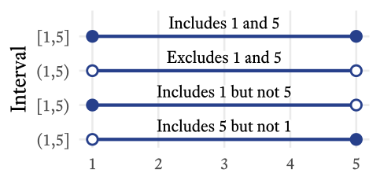
<!--
<p class="caption marginnote">-->(\#fig:intervalnotation)Interval Notation<!--</p>-->
<!--</div>--></span></p>


With continuous variables, we can define sets in terms of intervals. Whereas the discrete set $\{0,1\}$ refers just to the numbers 0 and 1, the interval set $(0,1)$ refers to all the numbers between 0 and 1. As shown in (Figure&nbsp;\@ref(fig:intervalnotation)), some intervals include their endpoints and others do not.

<div class="wrap-collapsible" style="margin-top: 1em">
<input id="collapsible-intervalnotationCode" class="toggle" type="checkbox">
<label for="collapsible-intervalnotationCode" class="lbl-toggle">R Code</label><div class="collapsible-content">
<div class="content-inner">

```r
# Interval notation
tibble(lb = 1L,
       ub = 5L,
       y = 1:4,
       meaning = c("Includes 1 and 5",
                   "Excludes 1 and 5",
                   "Includes 1 but not 5",
                   "Includes 5 but not 1"),
       l_bracket = c("[", "(", "[", "("),
       u_bracket = c("]", ")", ")", "]")) %>% 
  mutate(Interval = paste0(l_bracket, lb, ",", ub, u_bracket) %>% 
           fct_inorder() %>% 
           fct_rev,
         l_fill = ifelse(l_bracket == "[", myfills[1], "white"),
         u_fill = ifelse(u_bracket == "]", myfills[1], "white")) %>% 
  ggplot(aes(lb, Interval)) + 
  geom_segment(aes(xend = ub, yend = Interval), 
               size = 2, 
               color = myfills[1]) +
  geom_point(aes(fill = l_fill), 
             size = 5, 
             pch = 21, 
             stroke = 2, color = myfills[1]) + 
  geom_point(aes(fill = u_fill, x = ub), 
             size = 5, 
             pch = 21, 
             stroke = 2, 
             color = myfills[1]) +
  geom_label(aes(label = meaning, x = 3), 
             vjust = -.65, 
             label.padding = unit(0,"lines"), 
             label.size = 0, 
             family = bfont, 
             size = ggtext_size(27)) +
  scale_fill_identity() +
  scale_y_discrete(expand = expansion(c(0.08, 0.25))) +
  scale_x_continuous(NULL, minor_breaks = NULL) +
  theme_minimal(base_size = 27, 
                base_family = bfont)
```

</div></div></div>


## Sample Spaces {#sec:SampleSpace}

The set of all possible outcomes of a random variable is the [sample space]{class=defword}.<label for="tufte-mn-" class="margin-toggle">&#8853;</label><input type="checkbox" id="tufte-mn-" class="margin-toggle"><span class="marginnote">A **sample space** is the set of all possible values that a random variable can assume.</span> Continuing with our example, the sample space of a single throw of a six-sided die is the set $\{1,2,3,4,5,6\}$. *Sample space* is a curious term. Why *sample* and why *space*? With random variables, [populations]{class=defword}<label for="tufte-mn-" class="margin-toggle">&#8853;</label><input type="checkbox" id="tufte-mn-" class="margin-toggle"><span class="marginnote">A **population** consists of all entities under consideration.</span> are infinitely large, at least theoretically. Random variables just keep spitting out numbers forever! So any time we actually observe numbers generated by a random variable, we are always observing a [sample]{class=defword};<label for="tufte-mn-" class="margin-toggle">&#8853;</label><input type="checkbox" id="tufte-mn-" class="margin-toggle"><span class="marginnote">A **sample** is a subset of a population.</span> actual infinities cannot be observed in their entirety. A *space* is a set that has mathematical structure. Most random variables generate either integers or real numbers, both of which are structured in many ways (e.g., order).

Unlike distributions having to do with dice, many distributions have a sample space with an infinite number of elements. Interestingly, there are two kinds of infinity we can consider. A distribution's sample space might be the set of whole numbers: $\{0,1,2,...\}$, which extends to positive infinity. The sample space of all integers extends to infinity in both directions: $\{...-2,-1,0,1,2,...\}$.

The sample space of continuous variables is infinitely large for another reason. Between any two points in a continuous distribution, there is an infinite number of other points. For example, in the beta distribution, the sample space consists of all real numbers between 0 and 1: $(0,1)$. Many continuous distributions have sample spaces that involve both kinds of infinity. For example, the sample space of the [normal distribution](#sec:normal) consists of all real numbers from negative infinity to positive infinity: $(-\infty, +\infty)$.

## Probability Distributions {#sec:ProbabilityDistribution}

<p><span class="marginnote shownote">
<!--
<div class="figure">-->
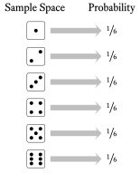
<!--
<p class="caption marginnote">-->(\#fig:dice)The probability distribution of a throw of a single die<!--</p>-->
<!--</div>--></span></p>

Each element of a random variable's sample space occurs with a particular probability. When we list the probabilities of each possible outcome, we have specified the variable's [probability distribution]{class=defword}<label for="tufte-mn-" class="margin-toggle">&#8853;</label><input type="checkbox" id="tufte-mn-" class="margin-toggle"><span class="marginnote">In a **probability distribution**, there is an assignment of a probability to each possible element in a variable's sample space.</span>. In other words, if we know the probability distribution of a variable, we know how probable each outcome is. In the case of a throw of a single die, each outcome is equally likely (Figure&nbsp;\@ref(fig:dice)). 

<div class="wrap-collapsible" style="margin-top: 1em">
<input id="collapsible-DicePMF" class="toggle" type="checkbox">
<label for="collapsible-DicePMF" class="lbl-toggle">$\rm\LaTeX~Code$</label><div class="collapsible-content">
<div class="content-inner">

```tikz
% Dice PMF

\documentclass[tikz = true, border = 2pt]{standalone}
\usepackage{tikz}
\usepackage{xfrac}
\usetikzlibrary{shapes,calc}
\usepackage{fontspec}
\setmainfont{Equity Text A Tab}
\tikzset{
	dot hidden/.style={},
	line hidden/.style={},
	dot colour/.style={dot hidden/.append style={color=#1}},
	dot colour/.default=black,
	line colour/.style={line hidden/.append style={color=#1}},
	line colour/.default=black
}

\usepackage{xparse}
\NewDocumentCommand{\drawdie}{O{}m}{
	\begin{tikzpicture}[x=1em,y=1em,radius=0.1,#1]
	\draw[rounded corners=2,line hidden] (0,0) rectangle (1,1);
	\ifodd#2
	\fill[dot hidden] (0.5,0.5) circle;
	\fi
	\ifnum#2>1
	\fill[dot hidden] (0.25,0.25) circle;
	\fill[dot hidden] (0.75,0.75) circle;
	\ifnum#2>3
	\fill[dot hidden] (0.25,0.75) circle;
	\fill[dot hidden] (0.75,0.25) circle;
	\ifnum#2>5
	\fill[dot hidden] (0.75,0.5) circle;
	\fill[dot hidden] (0.25,0.5) circle;
	\ifnum#2>7
	\fill[dot hidden] (0.5,0.75) circle;
	\fill[dot hidden] (0.5,0.25) circle;
	\fi
	\fi
	\fi
	\fi
	\end{tikzpicture}
}  

\begin{document}	
	\begin{tikzpicture}
	\foreach \n in {1,...,6} {
		\node at ($(0,7)-(0,\n)$) {\drawdie [scale = 2]{\n}};
		\node [fill=gray!50,
		       minimum height = 2cm,
		       minimum width = 0.1cm,
		       single arrow,
		       single arrow head extend =.15cm,
		       single arrow head indent =.08cm,
		       inner sep=1mm] at ($(1.55,7)-(0,\n)$) {};
		\node  (p1) at (3,\n) {\large{$\sfrac{\text{1}}{\text{6}}$}};
	}
	\node [text centered,
	       anchor=south,
	       text height = 1.5ex,
	       text depth = .25ex] (p3) at (0,6.6) {\large{{Sample Space}}};
	\node [text centered,
	       anchor = south,
	       text height = 1.5ex,
	       text depth = .25ex] (p4) at (3,6.6) {\large{{Probability}}};
	\end{tikzpicture}	
\end{document}
```

</div></div></div>

There is an infinite variety of probability distributions, but a small subset of them have been given names. Now, one can manage one's affairs quite well without ever knowing what a Bernoulli distribution is, or what a $\chi{^2}$ distribution is, or even what a normal distribution is. However, sometimes life is a little easier if we have names for useful things that occur often. Most of the distributions with names are not really single distributions, but families of distributions. The various members of a family are unique but they are united by the fact that their probability distributions are generated by a particular mathematical function (more on that later). In such cases, the probability distribution is often represented by a graph in which the sample space is on the $X$-axis and the associated probabilities are on the $Y$-axis. In Figure&nbsp;\@ref(fig:pdfIllustration), 16 probability distributions that might be interesting and useful to clinicians are illustrated. Keep in mind that what are pictured are only particular members of the families listed; some family members look quite different from what is shown in Figure&nbsp;\@ref(fig:pdfIllustration).

<div class="figure fullwidth">

<p class="caption marginnote shownote">(\#fig:pdfIllustration)A gallery of useful distributions</p>
</div>


<div class="wrap-collapsible" style="margin-top: 1em">
<input id="collapsible-pdfIllustrationCode" class="toggle" type="checkbox">
<label for="collapsible-pdfIllustrationCode" class="lbl-toggle">R Code</label><div class="collapsible-content">
<div class="content-inner">

```r
# A gallery of useful distributions
# Run output file pdfIllustration.tex in LaTeX
# pdflatex --enable-write18 --extra-mem-bot=10000000 --synctex=1 pdfIllustration.tex
tikzpackages <- paste(
  "\\usepackage{tikz}",
  "\\usepackage{amsmath}",
  "\\usepackage[active,tightpage,psfixbb]{preview}",
  "\\PreviewEnvironment{pgfpicture}",
  collapse = "\n"
)

tikzDevice::tikz('pdfIllustration.tex',
                 standAlone = TRUE, 
                 packages = tikzpackages, 
                 width = 11, 
                 height = 11)
par(
  mar = c(1.75, 1.3, 1.75, 0),
  mfrow = c(4, 4),
  las = 1,
  xpd = TRUE,
  family = 'serif',
  pty = "s",
  mgp = c(2, 0.5, 0),
  tcl = -0.3,
  cex = 1.35
)

# Bernoulli
plot(
  c(0.2, 0.8) ~ seq(0, 1),
  type = "b",
  ylim = c(0, 1),
  bty = "n",
  col = myfills[1],
  lwd = 1,
  xlab = "",
  ylab = "",
  main = "Bernoulli",
  lty = 3,
  pch = 19,
  xaxp = c(0, 1, 1),
  xlim = c(-0.1, 1)
)
text(x = .7, y = .8, "$p=0.8$")

# Binomial
plot(
  dbinom(seq(0, 5), 5, 0.2) ~ seq(0, 5),
  type = "b",
  xlim = c(-0.1, 5),
  bty = "n",
  col = myfills[1],
  lwd = 1,
  xlab = "",
  ylab = "",
  main = "Binomial",
  lty = 3,
  pch = 19
)
text(
  x = c(3.5, 3.5),
  y = c(.35, .25),
  c("$p=0.2$", "$n=5$"),
  adj = 0
)

# Poisson
plot(
  dpois(0:10, 3) ~ seq(0, 10),
  type = "b",
  xlim = c(-0.1, 10),
  bty = "n",
  col = myfills[1],
  lwd = 1,
  xlab = "",
  ylab = "",
  main = "Poisson",
  lty = 3,
  pch = 19
)
text(x = 7, y = .15, r"($\lambda=3$)")

# Geometric
plot(
  dgeom(0:4, prob = 0.8) ~ seq(0, 4),
  type = "b",
  ylim = c(0, .8),
  xlim = c(-0.1, 4),
  bty = "n",
  col = myfills[1],
  lwd = 1,
  xlab = "",
  ylab = "",
  main = "Geometric",
  lty = 3,
  pch = 19
)
text(x = 2, y = .6, "$p=0.8$")

# Discrete Uniform
plot(
  rep(1 / 4, 4) ~ seq(1, 4),
  type = "b",
  ylim = c(0, 1),
  xlim = c(0, 5),
  bty = "n",
  col = myfills[1],
  lwd = 1,
  xlab = "",
  ylab = "",
  main = "Discrete Uniform",
  lty = 3,
  pch = 19
)
text(
  x = c(1, 4),
  y = c(.5, .5),
  c("$a=1$", "$b=4$"),
  adj = 0.5
)

# Continuous
plot(
  c(0, 1 / 3, 1 / 3, 0) ~ c(1, 1, 4, 4),
  type = "n",
  ylim = c(0, 1),
  xlim = c(0, 5),
  bty = "n",
  col = myfills[1],
  lwd = 2,
  xlab = "",
  ylab = "",
  main = "Continuous Uniform"
)
polygon(
  c(1, 1, 4, 4),
  c(0, 1 / 3, 1 / 3, 0),
  col = myfills[1],
  xpd = FALSE,
  border = NA
)
text(
  x = c(1, 4),
  y = c(.5, .5),
  c("$a=1$", "$b=4$"),
  adj = 0.5
)

# Normal
x <- seq(-4, 4, 0.02)
plot(
  dnorm(x) ~ x,
  type = "n",
  col = myfills[1],
  xlab = "",
  ylab = "",
  main = "Normal",
  lwd = 2,
  bty = "n",
  axes = F
)
polygon(
  c(min(x), x, max(x)),
  c(0, dnorm(x), 0),
  col = myfills[1],
  lwd = 1,
  xpd = FALSE,
  border = NA
)
axis(2)

text(
  x = c(-1.5, -1.5),
  y = c(.35, .25),
  c("$\\mu=0$", "$\\sigma^2=1$"),
  adj = 1
)


center_neg <- function(x) {
  signs <- sign(x)
  paste0(ifelse(signs < 0,"$",""), x, ifelse(signs < 0,"\\phantom{-}$",""))
}

all_tick_labels <- function(side = 1, at, labels = at) {
  axis(side, labels = rep("",length(at)), at = at)
for (i in 1:length(at)) axis(side, at = at[i], labels = labels[i],tick = F)
}
axis_ticks <- seq(-4,4,2)
axis_labs <- center_neg(axis_ticks)
all_tick_labels(1, at = axis_ticks, labels = axis_labs)


# Student t
x <- seq(-6, 6, 0.02)
plot(
  dt(x, 2) ~ x,
  type = "n",
  col = myfills[1],
  xlab = "",
  ylab = "",
  main = "Student's $\\boldsymbol{t}$",
  lwd = 2,
  bty = "n",
  ylim = c(0, 0.4),
  axes = F
)
polygon(
  c(min(x), x, max(x)),
  c(0, dt(x, 2), 0),
  col = myfills[1],
  lwd = 1,
  xpd = FALSE,
  border = NA
)
text(x = 3, y = .3, "$\\nu=2$")
axis(2)
axis_ticks <- seq(-6,6,2)
axis_labs <- center_neg(axis_ticks)
all_tick_labels(1, at = axis_ticks, labels = axis_labs)

# Chi-Square
x <- seq(0, 40, 0.05)
plot(
  dchisq(x, 13) ~ x,
  type = "n",
  col = myfills[1],
  xlab = "",
  ylab = "",
  main = "$\\boldsymbol{\\chi^2}$",
  lwd = 2,
  bty = "n",
  ylim = c(0, 0.1)
)
polygon(
  c(min(x), x, max(x)),
  c(0, dchisq(x, 13), 0),
  col = myfills[1],
  lwd = 1,
  xpd = FALSE,
  border = NA
)
text(x = 20, y = .08, "$k=2$", adj = 0)

# F
x <- seq(0, 6, 0.01)
plot(
  df(x, 3, 120) ~ x,
  type = "n",
  col = myfills[1],
  xlab = "",
  ylab = "",
  main = "$\\boldsymbol{F}$",
  lwd = 2,
  bty = "n",
  ylim = c(0, 0.8)
)
polygon(
  c(min(x), x, max(x)),
  c(0, df(x, 3, 120), 0),
  col = myfills[1],
  lwd = 1,
  xpd = TRUE,
  border = NA
)
text(
  x = c(2, 2),
  y = c(.6, .4),
  c("$d_1=3$", "$d_2=120$"),
  adj = 0
)

# Weibull
x <- seq(6.5, 11.5, 0.01)
plot(
  dweibull(x, 20, 10) ~ x,
  type = "n",
  col = myfills[1],
  xlab = "",
  ylab = "",
  main = "Weibull",
  lwd = 2,
  bty = "n",
  ylim = c(0, 0.8)
)
polygon(
  c(min(x), x, max(x)),
  c(0, dweibull(x, 20, 10), 0),
  col = myfills[1],
  lwd = 1,
  xpd = TRUE,
  border = NA
)
text(
  x = c(7, 7),
  y = c(.6, .4),
  c("$k=20$", "$\\lambda=10$"),
  adj = 0
)

# Beta
x <- seq(0, 1, 0.01)
plot(
  dbeta(x, 2, 2.5) ~ x,
  type = "n",
  col = myfills[1],
  xlab = "",
  ylab = "",
  main = "Beta",
  lwd = 2,
  bty = "n",
  ylim = c(0, 2),
  xaxp = c(0, 1, 1)
)
polygon(
  c(min(x), x, max(x)),
  c(0, dbeta(x, 2, 2.5), 0),
  col = myfills[1],
  lwd = 1,
  xpd = TRUE,
  border = NA
)
text(
  x = c(0.75, 0.75),
  y = c(1.75, 1.25),
  c("$\\alpha=2$", "$\\beta=2.5$"),
  adj = 0
)

# Log Normal
x <- c(seq(0, .999, 0.001), seq(1, 15, .05))
plot(
  dlnorm(x, 2, .5) ~ x,
  type = "n",
  col = myfills[1],
  xlab = "",
  ylab = "",
  main = "Log Normal",
  lwd = 2,
  bty = "n",
  ylim = c(0, 0.4)
)
polygon(
  c(min(x), x, max(x)),
  c(0, dlnorm(x, 1, 0.5), 0),
  col = myfills[1],
  lwd = 1,
  xpd = TRUE,
  border = NA
)
text(
  x = c(7, 7),
  y = c(.3, .2),
  c("$\\mu=2$", "$\\sigma=0.5$"),
  adj = 0
)


# Skew Normal
x <- seq(-4, 4, 0.01)
plot(
  sn::dsn(x, 2, 2.5) ~ x,
  type = "n",
  col = myfills[1],
  xlab = "",
  ylab = "",
  main = "Skew Normal",
  lwd = 2,
  bty = "n",
  ylim = c(0, 0.5),
  axes = F
)
polygon(
  c(min(x), x, max(x)),
  c(0, sn::dsn(
    x,
    xi = 1,
    omega = 1.5,
    alpha = -4
  ), 0),
  col = myfills[1],
  lwd = 1,
  xpd = TRUE,
  border = NA
)
text(
  x = c(-3.9, -3.9, -3.9),
  y = c(.45, .35, .25),
  c("$\\xi=1$", "$\\omega=1.5$", "$\\alpha=-4$"),
  adj = 0
)

axis(2)
axis_ticks <- seq(-4,4,2)
axis_labs <- center_neg(axis_ticks)
all_tick_labels(1, at = axis_ticks, labels =axis_labs)

# Normal Mixture
x <- seq(-4, 4, 0.01)
y <- (dnorm(x, -2, 0.5) * .25 + dnorm(x))
plot(
  y ~ x,
  type = "n",
  col = "violet",
  xlab = "",
  ylab = "",
  main = "Normal Mixture",
  lwd = 4,
  bty = "n",
  ylim = c(0, 0.5),
  axes = F
)
polygon(
  c(min(x), x, max(x)),
  c(0, y, 0),
  col = myfills[1],
  lwd = 1,
  xpd = TRUE,
  border = NA
)
polygon(
  c(min(x), x, max(x)),
  c(0, dnorm(x, -2, 0.5) * .25, 0),
  col = myfills[2],
  lwd = 1,
  xpd = TRUE,
  border = NA
)
text(
  x = c(-0.85, -0.85),
  y = c(.45, .35),
  c("$\\mu_1=-2$", "$\\sigma_1^2=0.5$"),
  adj = 1
)
text(
  x = c(3.5, 3.5),
  y = c(.45, .35),
  c("$\\mu_2=0$", "$\\sigma_2^2=1$"),
  adj = 1
)
axis(2)
axis_ticks <- seq(-4,4,2)
axis_labs <- center_neg(axis_ticks)
all_tick_labels(1, at = axis_ticks, labels =axis_labs)
# Bivariate Normal

x = seq(-4, 4, 0.1)
X = fMultivar::grid2d(x)
z = fMultivar::dnorm2d(X$x, X$y, rho = 0.6)
Z = list(x = x,
         y = x,
         z = matrix(z, ncol = length(x)))
persp(
  Z,
  theta = 20,
  phi = 25,
  col = "royalblue1",
  xlab = "\nX",
  ylab = "\nY",
  zlab = "",
  zlim = c(0, .20),
  border = NA,
  expand = .7,
  box = FALSE,
  ticktype = "simple",
  ltheta = 0,
  shade = 0.5,
  main = "Bivariate Normal",
  lwd = 0.5
)
text(c(-.11, .32), c(-.42, -.25), c("X", "Y"))
text(0, 0.25, "$\\rho_{XY}=0.6$")
dev.off()
```

</div></div></div>

## Discrete Uniform Distributions {#sec:DiscreteUniform}

The throw of a single die is a member of a family of distributions called the [discrete uniform distribution]{class=defword}.<label for="tufte-mn-" class="margin-toggle">&#8853;</label><input type="checkbox" id="tufte-mn-" class="margin-toggle"><span class="marginnote">A **discrete uniform distribution** is a family of random variable distributions in which the sample space is an evenly spaced sequence of numbers, each of which is equally likely to occur.</span> It is "discrete" because the elements in the sample space are countable, with evenly spaced gaps between them. For example, there might be a sequence of 8, 9, 10, and 11 in the sample space but there are no numbers in between. It is "uniform" because all outcomes are equally likely. With dice, the numbers range from a lower bound of 1 to an upper bound of 6. In the family of discrete uniform distributions, the lower and upper bounds are typically integers, mostly likely starting with 1. However, any real number $a$ can be the lower bound and the spacing $k$ between numbers can be any positive real number. For the sake of simplicity and convenience, I will assume that the discrete uniform distribution refers to consecutive integers ranging from a lower bound of $a$ and an upper bound of $b$. 

This kind of discrete uniform distribution has a number of characteristics listed in Table&nbsp;\@ref(tab:uniformfeatures). I will explain each of them in the sections that follow. As we go, I will also explain the mathematical notation. For example, $a \in \{\ldots,-1,0,1,\ldots\}$ means that $a$ is an integer because $\in$ means *is a member of* and $\{\ldots,-1,0,1,\ldots\}$ is the set of all integers.^[Sometimes the set of all integers is referred to with the symbol $\mathbb{Z}$] $x \in \{a,a+1,\ldots,b\}$ means that the each member of the sample space $x$ is a member of the set of integers that include $a$, $b$, and all the integers between $a$ and $b$. The notation for the [probability mass function](#sec:pmf) and the [cumuluative distribution function](#sec:CumDist) function will be explained later in this chapter.


<table>
<caption>(\#tab:uniformfeatures)Features of Discrete Uniform Distributions</caption>
<col width="400">
 <thead>
  <tr>
   <th style="text-align:left;"> Feature </th>
   <th style="text-align:left;"> Symbol </th>
  </tr>
 </thead>
<tbody>
  <tr>
   <td style="text-align:left;"> Lower Bound </td>
   <td style="text-align:left;"> $a \in \{\ldots,-1,0,1,\ldots\}$ </td>
  </tr>
  <tr>
   <td style="text-align:left;"> Upper Bound </td>
   <td style="text-align:left;"> $b \in \{a + 1, a + 2,  \ldots\}$ </td>
  </tr>
  <tr>
   <td style="text-align:left;"> Sample Space </td>
   <td style="text-align:left;"> $x \in\{a, a + 1,\ldots,b\}$ </td>
  </tr>
  <tr>
   <td style="text-align:left;"> Number of points </td>
   <td style="text-align:left;"> $n=b-a+1$ </td>
  </tr>
  <tr>
   <td style="text-align:left;"> Mean </td>
   <td style="text-align:left;"> $\mu=\frac{a+b}{2}$ </td>
  </tr>
  <tr>
   <td style="text-align:left;"> Variance </td>
   <td style="text-align:left;"> $\sigma^2=\frac{n^2-1}{12}$ </td>
  </tr>
  <tr>
   <td style="text-align:left;"> Skewness </td>
   <td style="text-align:left;"> $\gamma_1=0$ </td>
  </tr>
  <tr>
   <td style="text-align:left;"> Kurtosis </td>
   <td style="text-align:left;"> $\gamma_2=-\frac{6(n^2+1)}{5(n^2-1)}$ </td>
  </tr>
  <tr>
   <td style="text-align:left;"> Probability Mass Function </td>
   <td style="text-align:left;"> $f_X(x;a,b)=\frac{1}{n}$ </td>
  </tr>
  <tr>
   <td style="text-align:left;"> Cumulative Distribution Function </td>
   <td style="text-align:left;"> $F_X(x;a,b)=\frac{x-a+1}{n}$ </td>
  </tr>
</tbody>
</table>

### Parameters of Random Variables 

The lower bound $a$ and the upper bound $b$ are the discrete uniform distribution's [parameters]{class=defword}.<label for="tufte-mn-" class="margin-toggle">&#8853;</label><input type="checkbox" id="tufte-mn-" class="margin-toggle"><span class="marginnote">A **parameter** is a defining feature of a random variable's probability distribution.</span> The word *parameter* has many meanings, but here it refers to a characteristic of a distribution family that helps us identify precisely which member of the family we are talking about. Most distribution families have one, two, or three parameters. 

If you have taken an algebra class, you have seen parameters before, though the word *parameter* many not have been used. Think about the formula of a line:

\begin{equation*}\label{eq:linear}
y=mx+b
\end{equation*}


Both $x$ and $y$ are variables, but what are $m$ and $b$? Well, you probably remember that $m$ is the slope of the line and that $b$ is the $y$-intercept. If we know the slope and the intercept of a line, we know exactly which line we are talking about. No additional information is needed to graph the line. Therefore, $m$ and $b$ are the line's *parameters*, because they uniquely identify the line.^[What about other mathematical functions? Do they have parameters? Yes! Most do! For example, in the equation for a parabola ($y=ax^2+bx+c$), $a$, $b$, and $c$ determine its precise shape.] All lines have a lot in common but there is an infinite variety of lines because the parameters, the slope and the intercept, can take on the value of any real number. Each unique combination of parameter values (slope and intercept) will produce a unique line. So it is with probability distribution families. All family members are alike in many ways but they also differ because of different parameter values.

The discrete uniform distribution (i.e., the typical variety consisting of consecutive integers) is defined by the lower and upper bound. Once we know the lower bound and the upper bound, we know exactly which distribution we are talking about.^[If we allow the lower bound to be any real number and the spacing to be any positive real number, the discrete uniform distribution can be specified by three parameters: the lower bound $a$, the spacing between numbers $k$ ($k>0$), and the number of points $n$ ($n$>1). The upper bound $b$ of such a distribution would be $b=a+k(n-1)$] Not all distributions are defined by their lower and upper bounds. Indeed, many distribution families are unbounded on one or both sides. Therefore, other features are used to characterize the distributions, such as the population mean (&mu;).

### Probability Mass Functions {#sec:pmf}

Many distribution families are united by the fact that their probability distributions are generated by a particular mathematical function. For discrete distributions, those functions are called [probability mass functions]{class=defword}.<label for="tufte-mn-" class="margin-toggle">&#8853;</label><input type="checkbox" id="tufte-mn-" class="margin-toggle"><span class="marginnote">A **probability mass function** is a mathematical expression that gives the probability that a discrete random variable will equal a particular element of the variable's sample space.</span> In general, a mathematical function is an expression that takes one or more constants (i.e., parameters) and one or more input variables, which are then transformed according to some sort of rule to yield a single number.

A probability mass function transforms a random variable's sample space elements into probabilities. In Figure&nbsp;\@ref(fig:dice), the probability mass function can be thought of as the arrows between the sample space and the probabilities. That is, the probability mass function is the thing that was done to the sample space elements to calculate the probabilities. In Figure&nbsp;\@ref(fig:dice), each outcome of a throw of the the die was mapped onto a probability of &frac16;. Why &frac16;, and not some other number? The probability mass function of the discrete uniform distribution tells us the answer. 

<div class="figure" style="text-align: center">
<p class="caption">(\#fig:pmf)Probability mass functions tell us how probable each sample space element is. That is, they are functions that convert samples spaces $(\boldsymbol{x})$ into probabilities $(\boldsymbol{p})$ according to specific parameters $(\boldsymbol{\theta}).$</p></div>


<div class="wrap-collapsible" style="margin-top: 1em">
<input id="collapsible-scarymath" class="toggle" type="checkbox">
<label for="collapsible-scarymath" class="lbl-toggle">$\rm\LaTeX~Code$</label><div class="collapsible-content">
<div class="content-inner">

```tikz
% Probability mass functions tell us how probable each sample space element is

\documentclass[tikz = true, border = 2pt]{standalone}

\usepackage{amsmath}
\usepackage{tikz}
\usetikzlibrary{decorations.text, arrows}
\usetikzlibrary{shapes}
\usepackage{fontspec}
\setmainfont{Equity Text A}

\begin{document}
\begin{tikzpicture}[>=stealth,scale=0.9]
\definecolor{royalblue2}{RGB}{39,64,139};
\node [rectangle,
       draw, 
       rounded corners= 2pt,
       text depth=0.25ex, 
       minimum height = 7mm](ss) at (0,0) {$\boldsymbol{x}=x_1,x_2,x_3,\ldots,x_n$};
\node [rectangle,
       draw, 
       rounded corners= 2pt,
       text depth=0.25ex, 
       minimum height = 7mm](ps) at (7,0) {$\boldsymbol{p}=p_1,p_2,p_3,\ldots,p_n$};
\node [single arrow,
       fill=royalblue2,
       single arrow head extend=1.1ex,
       transform shape,
       minimum height=0.9cm,
       text depth=0.25ex, text=white] (fx) at (3.5,0) {$\quad\;\; f_X\quad\;\;$};
\node [text depth=2.25ex,
       text height= 5ex,
       anchor=south,
       yshift=-3.5ex](sst) at (0,0.75) {\textbf{Sample Space}};
\node [text depth=2.25ex,
       text height= 5ex,
       anchor=south,
       yshift=-3.5ex](pst) at (7,0.75) {\textbf{Probabilities}};
\node [shape=rectangle,
       text depth=2.25ex,
       color=royalblue2,
       align=center,
       text height= 5ex,
       anchor=south,
       yshift=-3.5ex](pmf) at (3.5,0.75) {\textbf{Probability}\\
	\textbf{Mass Function}};
\node [text depth=2.25ex,
       text height= 5ex,
       anchor=south,
       yshift=-3.5ex] (pt) at (3.5,-1.5) {\textbf{Parameters}};
\node [rectangle,
       draw, 
       rounded corners = 2pt,
       text depth=0.25ex, 
       minimum height = 7mm] (pts) at (3.5,-2.25) {$\boldsymbol{\theta}=\theta_1,\theta_2,\theta_3,\ldots,\theta_k$};
%\node [align=center,
%       shape=rectangle,
%       rounded corners = 3pt,
%       draw](formula) at (3.5,4) {\textbf{\Large{Scary~Math!}}\\
%	$f_X\!\left(\boldsymbol{x};\boldsymbol{\theta}\right)=\boldsymbol{p}$};
%\draw [rounded corners=5pt] (-2.5,-3) rectangle (9.5,2.65);
\node at (3.5,2) {$f_X\!\left(\boldsymbol{x};\boldsymbol{\theta}\right)=\boldsymbol{p}$};
\draw[->,>=latex', very thick] (3.5,-1.15) to (3.5,-0.5);
\end{tikzpicture}
\end{document}
```

</div></div></div>

The probability mass function of the discrete uniform distribution is fairly simple but the notation can be intimidating at first (Figure&nbsp;\@ref(fig:pmf)). By convention, a single random variable is denoted by a capital letter $X$. Any particular value of $X$ in its sample space is represented by a lowercase $x$. In other words, $X$ represents the variable in its totality whereas $x$ is merely one value that $X$ can take on. Confusing? Yes, statisticians work very hard to confuse us---and most of the time they succeed! 

The probability mass function of random variable $X$ is denoted by $f_X(x)$. This looks strange at first. It means, "When random variable $X$ generates a number, what is the probability that the outcome will be a particular value $x$?" That is, $f_X(x)=P(X=x)$, where $P$ means "What is the probability that...?" Thus, $P(X=x)$ reads, "What is the probability that random variable $X$ will generate a number equal to a particular value $x$?" So, $f_X(7)$ reads, "When random variable $X$ generates a number, what is the probability that the outcome will be 7?"

Most probability mass functions also have parameters, which are listed after a semi-colon. In the case of the discrete uniform distribution consisting of consecutive integers, the lower and upper bounds $a$ and $b$ are included in the function's notation like so: $f_X(x;a,b)$. This reads, "For random variable $X$ with parameters $a$ and $b$, what is the probability that the outcome will be $x$?" Some parameters can be derived from other parameters, as was the case with the number of points $n$ in the sample space of a discrete uniform distribution: $n=b-a+1$. The probability for each outcome in the sample space is the same and there are $n$ possible outcomes. Therefore, the probability associated with each outcome is $\frac{1}{n}$.

Putting all of this together, if $a$ and $b$ are integers and $a<b$, for all $n$ integers $x$ between $a$ and $b$, inclusive:

\begin{equation*}
f_X(x;a,b)=\frac{1}{b-a+1}=\frac{1}{n}
\end{equation*}
Where
\begin{align*}
X  &= \text{A random variable with a discrete uniform distribution}\\
f_X &= \text{The probability mass function of}~X\\
x &= \text{Any particular member of the sample space of}~X\\
a &= \text{The lower bound of the sample space}\\
b &= \text{The upper bound of the sample space}\\
n &= b-a+1~\text{(The number of points in the sample space)}
\end{align*}

You might notice that $x$ is not needed to calculate the probability. Why? Because this is a *uniform* distribution. No matter which sample space element $x$ we are talking about, the probability associated with it is always the same. In distributions that are not uniform, the position of $x$ matters and thus influences the probability of its occurrence.

### Cumulative Distribution Functions {#sec:CumDist}

The [cumulative distribution function]{class=defword}<label for="tufte-mn-" class="margin-toggle">&#8853;</label><input type="checkbox" id="tufte-mn-" class="margin-toggle"><span class="marginnote">A **cumulative distribution function** is a mathematical expression that gives the probability that a random variable will equal a particular element of the variable's sample space or less.</span> tells us where a sample space element ranks in a distribution. Whereas the probability mass function tells us the probability that a random variable will generate a particular number, the cumulative distribution function tells us the probability that a random variable will generate a particular number or less. 

$$F_X(x) = P(X \le x)=p$$


<p><span class="marginnote shownote">
<!--
<div class="figure">-->

<!--
<p class="caption marginnote">-->(\#fig:cdfDie)The cumulative distribution function of the roll of a die is $F_X(x)=\frac{x}{6}$<!--</p>-->
<!--</div>--></span></p>

The cumulative distribution function of the roll of a die (Figure&nbsp;\@ref(fig:cdfDie)) tells us that the probability of rolling at least a 4 is 4&frasl;6 (i.e., &frac23;).


<div class="wrap-collapsible" style="margin-top: 1em">
<input id="collapsible-cdfDice" class="toggle" type="checkbox">
<label for="collapsible-cdfDice" class="lbl-toggle">$\rm\LaTeX~Code$</label><div class="collapsible-content">
<div class="content-inner">

```tikz
% CDF Dice

\documentclass[tikz = true, border = 2pt]{standalone}
\usepackage{tikz}
\usepackage{xfrac}
\usepackage{fontspec}
\setmainfont{Equity Text A Tab}

\definecolor{firebrick}{RGB}{205,38,38}
\definecolor{royalblue}{RGB}{67,110,238}

\tikzset{
	dot hidden/.style={},
	line hidden/.style={},
	dot colour/.style={dot hidden/.append style={color=#1}},
	dot colour/.default=black,
	line colour/.style={line hidden/.append style={color=#1}},
	line colour/.default=black
}

\NewDocumentCommand{\drawdie}{O{}m}{
	\begin{tikzpicture}[x=1em,y=1em,radius=0.1,#1]
	\draw[rounded corners=2,line hidden] (0,0) rectangle (1,1);
	\ifodd#2
	\fill[dot hidden] (0.5,0.5) circle;
	\fi
	\ifnum#2>1
	\fill[dot hidden] (0.25,0.25) circle;
	\fill[dot hidden] (0.75,0.75) circle;
	\ifnum#2>3
	\fill[dot hidden] (0.25,0.75) circle;
	\fill[dot hidden] (0.75,0.25) circle;
	\ifnum#2>5
	\fill[dot hidden] (0.75,0.5) circle;
	\fill[dot hidden] (0.25,0.5) circle;
	\ifnum#2>7
	\fill[dot hidden] (0.5,0.75) circle;
	\fill[dot hidden] (0.5,0.25) circle;
	\fi
	\fi
	\fi
	\fi
	\end{tikzpicture}
}  

\begin{document}
	
\begin{tikzpicture}
\foreach \i in {1,...,6} {
	\node at (0.1,\i){$\sfrac{\text{\i}}{\text{6}}$};
	\node at (\i,0.1){\large{\i}};
	\foreach \j in {1,...,6} {
		\ifnum \j>\i
		\node at (\i,\j) {\drawdie [scale=2]{\j}};
		\else
		\node at (\i,\j) {\drawdie [scale=2,line colour=royalblue,dot colour=royalblue]{\j}};
		\fi
	}
}

\draw [firebrick,
       very thick,
       rounded corners] 
       (0.55,0.5)-- ++
       (0,1)-- ++
       (1,0)-- ++
       (0,1)-- ++
       (1,0)-- ++
       (0,1)-- ++
       (1,0)-- ++
       (0,1)-- ++
       (1,0)-- ++
       (0,1)-- ++
       (1,0)-- ++
       (0,1)-- ++
       (1,0)-- ++
       (0,-6)--cycle;
\node[rotate=90] at (-0.6,3.5) {{Probability}};
\node at (3.5,-0.5) {{Die roll is this value or less}};
\end{tikzpicture}

\end{document}
```

</div></div></div>

The cumulative distribution function is often distinguished from the probability mass function with a capital $F$ instead of a lowercase $f$. In the case of a discrete uniform distribution consisting of $n$ consecutive integers from $a$ to $b$, the cumulative distribution function is:

\begin{equation*}
F_X(x;a,b)=\frac{x-a+1}{b-a+1}=\frac{x-a+1}{n}
\end{equation*}
Where
\begin{align*}
X &= \text{A random variable with a discrete uniform distribution}\\
F_X &= \text{The cumulative distribution function of}~X\\
x &= \text{Any particular member of the sample space of}~X\\
a &= \text{The lower bound of the sample space}\\
b &= \text{The upper bound of the sample space}\\
n &= b-a+1~\text{(The number of points in the sample space)}
\end{align*}

In the case of the the six-sided die, the cumulative distribution function is 

$$F_X(x;a=1,b=6)=\frac{x-a+1}{b-a+1}=\frac{x-1+1}{6-1+1}=\frac{x}{6}$$

The cumulative distribution function is so-named because it adds all the probabilities in the probability mass function up to and including a particular member of the sample space. Figure&nbsp;\@ref(fig:pmf2cdf) shows how the each probability in the cumulative distribution function of the roll of a six-sided die is the sum of the current and all previous probabilities in the probability mass function.. 

<div class="figure" style="text-align: center">
<p class="caption">(\#fig:pmf2cdf)The cumulative distribution function is the sum of the current and all previous elements of the probability mass function.</p></div>


<div class="wrap-collapsible" style="margin-top: 1em">
<input id="collapsible-pmf2cdfCode" class="toggle" type="checkbox">
<label for="collapsible-pmf2cdfCode" class="lbl-toggle">R Code</label><div class="collapsible-content">
<div class="content-inner">

```r
# The cumulative distribution function is the sum of the current 
# and all previous elements of the probability mass function
p <- crossing(id = 1:6,
         x = 1:6) %>% 
  mutate(pmf = 1 / 6) %>% 
  mutate(cdf = ifelse(id < x, 1 / 6, x / 6)) %>% 
  ggplot(aes(x = x, y = cdf)) + 
  geom_segment(aes(yend = cdf - pmf, xend = x), 
               color = myfills[2]) + 
  geom_segment(aes(y = 0, yend = pmf, xend = x), 
               color = myfills[1]) + 
  geom_line(aes(y = pmf), lty = "dotted", color = myfills[1]) +
  geom_line(data = . %>% dplyr::filter(x <= id), 
            lty = "dotted", 
            color = myfills[2] ) +
  geom_point(aes(y = pmf),
             color = myfills[1],
             size = 5) +
  geom_point(data = . %>% dplyr::filter(x <= id), 
             color = myfills[2],
             size = 3.5) +
  scale_x_continuous("Sample Space", 
                     breaks = 1:6,
                     expand = c(0.03,0),
                     minor_breaks = NULL) +
  scale_y_continuous("Probability",
                     breaks = 0:6 / 6, 
                     labels = c(0, paste0(1:5, "/", 6),1),
                     expand = c(0.03,0),
                     minor_breaks = NULL) +
  theme_minimal(base_size = 18, base_family = bfont) +
  coord_fixed(6) + 
  annotate("point",
           size = 5, 
           x = 1.2,  
           y = 5.33 / 6, 
           color = myfills[1]) + 
  annotate("point",
           size = 3.5, 
           x = 1.2,  
           y = 5.66 / 6, 
           color = myfills[2])  + 
  annotate("label",
           size = 6, 
           x = 1.33,  
           y = 5.33 / 6, 
           color = myfills[1],
           label = "Probability Mass Function",
           hjust = 0,
           family = bfont, 
           label.padding = unit(0, "lines"), 
           label.size = 0
           ) + 
  annotate("label",
           size = 6, 
           x = 1.33,  
           y = 5.66 / 6, 
           color = myfills[2],
           label = "Cumulative Distribution Function",
           hjust = 0,
           family = bfont, 
           label.padding = unit(0, "lines"), 
           label.size = 0) +
  transition_states(id,2,1) +
  ease_aes("sine-in-out")

animate(p, 
        device = "svg",
        renderer = magick_renderer(), 
        width = 8,
        height = 8)
```

</div></div></div>

### Quantile functions {#sec:Quantile}

The inverse of the cumulative distribution function is the [quantile function]{class=defword}.<label for="tufte-mn-" class="margin-toggle">&#8853;</label><input type="checkbox" id="tufte-mn-" class="margin-toggle"><span class="marginnote">A **quantile function** tells us which value in the sample space of a random variable is greater than a particular proportion of the values the random variable generates.</span> The cumulative distribution starts with a value $x$ in the sample space and tells us $p$, the proportion of values in that distribution that are less than or equal to $x$. A quantile function starts with a proportion $p$ and tells us the value $x$ that splits the distribution such that the proportion $p$ of the distribution is less than or equal to $x$. 

<p><span class="marginnote shownote">
<!--
<div class="figure">-->
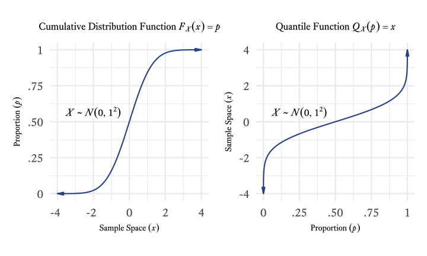
<!--
<p class="caption marginnote">-->(\#fig:cdfvquantile)The quantile function is the inverse of the cumulative distribution function: Just flip the X and Y axes!<!--</p>-->
<!--</div>--></span></p>

$$
\begin{array}{rc}
\text{Cumulative Distribution Function:} & F_X(x) = p \\
\text{Quantile Function:} & Q_X(p) = x
\end{array}
$$

As seen in Figure&nbsp;\@ref(fig:cdfvquantile), if you see a graph of a continuous distribution function, just flip the $X$ and $Y$ axes and you have a graph of a quantile function!

<div class="wrap-collapsible" style="margin-top: 1em">
<input id="collapsible-cdfvquantileCode" class="toggle" type="checkbox">
<label for="collapsible-cdfvquantileCode" class="lbl-toggle">R Code</label><div class="collapsible-content">
<div class="content-inner">

```r
# The quantile function is the inverse of the cumulative distribution function
d <- tibble(x = seq(-4, 4, 0.01)) %>%
  mutate(p = pnorm(x))

p1 <- ggplot(d, aes(x, p)) +
  geom_path(
    arrow = arrow(type = "closed",
                  ends = "both",
                  angle = 12,
                  length = unit(0.15, "inches")),
    color = myfills[1],
    lwd = 1
  ) +
  scale_x_continuous("Sample Space (*x*)") +
  scale_y_continuous("Proportion (*p*)", labels = prob_label) +
  theme_minimal(base_size = 26, base_family = bfont) +
  coord_fixed(8) +
  annotate(
    "richtext",
    x = -2,
    y = .5 + .25 / 4,
    label = "*X* ~ <span style=\"font-family:'Lucida Calligraphy'\">N</span>(0, 1<sup>2</sup>)",
    family = bfont,
    label.size = 0,
    label.padding = unit(0, "mm"),
    size = ggtext_size(26)
  ) +
  ggtitle("Cumulative Distribution Function *F<sub>X</sub>*(*x*) = *p*") +
  theme(
    plot.title = ggtext::element_markdown(size = 26 * 0.8), 
    plot.title.position = "plot",
    axis.title.x = ggtext::element_markdown(),
    axis.title.y = ggtext::element_markdown(),
    axis.text.x = element_text(hjust = c(0.7, 0.7, 0.5, 0.5, 0.5))
  )

p2 <- ggplot(d, aes(p, x)) +
  geom_path(
    arrow = arrow(type = "closed",
                  ends = "both",
                  angle = 12,
                  length = unit(0.15, "inches")),
    color = myfills[1],
    lwd = 1
  ) +
  scale_y_continuous("Sample Space (*x*)") +
  scale_x_continuous("Proportion (*p*)", labels = prob_label) +
  theme_minimal(base_size = 26, base_family = bfont) +
  coord_fixed(1 / 8) +
  annotate(
    "richtext",
    y = 0.5,
    x = .25,
    label = "*X* ~ <span style=\"font-family:'Lucida Calligraphy'\">N</span>(0, 1<sup>2</sup>)",
    family = bfont,
    label.size = 0,
    label.padding = unit(0, "mm"),
    size = ggtext_size(26)
  ) +
  ggtitle("Quantile Function *Q*<sub>*X*</sub>(*p*) = *x*") +
  theme(plot.title = ggtext::element_markdown(size = 26 * 0.8), 
        plot.title.position = "plot",
        axis.title.x = ggtext::element_markdown(),
        axis.title.y = ggtext::element_markdown())

p1 / p2
```

</div></div></div>


### Generating a Random Sample in R

In R, the `sample` function generates numbers from the discrete uniform distribution. 


<p><span class="marginnote shownote">
<!--
<div class="figure">-->
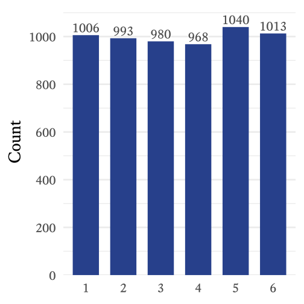
<!--
<p class="caption marginnote">-->(\#fig:discreteplot)Frequency distribution of a discrete uniform random variable from 1 to 6 ($n$ = 6,000)<!--</p>-->
<!--</div>--></span></p>


```r
# n = the sample size
n <- 6000
# a = the lower bound
a <- 1
# b = the upper bound
b <- 6
# The sample space is the sequence of integers from a to b
sample_space <- seq(a, b)
# X = the sample with a discrete uniform distribution
# The sample function selects n values
# from the sample space with replacement at random
X <- sample(sample_space, 
            size = n, 
            replace = TRUE)
```

The frequencies of the random sample can be seen in Figure&nbsp;\@ref(fig:discreteplot). Because of [sampling error]{class=defword}<label for="tufte-mn-" class="margin-toggle">&#8853;</label><input type="checkbox" id="tufte-mn-" class="margin-toggle"><span class="marginnote">Samples imperfectly represent the population from which they are drawn. **Sampling error** refers to differences between sample statistics and population parameters.</span>, the frequencies are approximately the same, but not exactly the same.

<div class="wrap-collapsible" style="margin-top: 1em">
<input id="collapsible-discreteplotCode" class="toggle" type="checkbox">
<label for="collapsible-discreteplotCode" class="lbl-toggle">R Code</label><div class="collapsible-content">
<div class="content-inner">

```r
# Frequency distribution of a discrete uniform random variable from 1 to 6 

tibble(X = factor(X)) %>% 
  group_by(X) %>% 
  summarise(Frequency = n()) %>% 
  ggplot(aes(X,Frequency, fill = X)) + 
  geom_col(width = 0.7, fill = myfills[1]) + 
  geom_label(aes(label = Frequency), 
             vjust = -0.3, 
             label.size = 0,
             label.padding = unit(0,"mm"), 
             family = bfont,
             size = 8,
             color = "gray30",
             fill = "white") + 
  theme_minimal(base_size = 28, 
                base_family = bfont) + 
  scale_y_continuous("Count", 
                     expand = expansion(c(0,0.075)), 
                     breaks = seq(0,1000,200)) + 
  scale_x_discrete(NULL) +
  theme(panel.grid.major.x = element_blank(), 
        legend.position = "none") 
```

</div></div></div>


## Bernoulli Distributions {#sec:BernoulliDist}

<p><span class="marginnote shownote">
<!--
<div class="figure">-->

<!--
<p class="caption marginnote">-->(\#fig:bernoullipic)Jakob Bernoulli (1654--1705)<br>[Image Credits](https://en.wikipedia.org/wiki/File:Jakob_Bernoulli.jpg)<!--</p>-->
<!--</div>--></span></p>


<label for="tufte-mn-" class="margin-toggle">&#8853;</label><input type="checkbox" id="tufte-mn-" class="margin-toggle"><span class="marginnote"><span style="display: block;"><strong>Notation note:</strong> Whereas <span class="math inline">\(\{a,b\}\)</span> is the set of just two numbers, <span class="math inline">\(a\)</span> and <span class="math inline">\(b\)</span>, <span class="math inline">\([a,b]\)</span> is the set of all real numbers between <span class="math inline">\(a\)</span> and <span class="math inline">\(b\)</span>.</span></span>


<table>
<caption>(\#tab:bernoullifeatures)Features of Bernoulli Distributions</caption>
<col width="400">
 <thead>
  <tr>
   <th style="text-align:left;"> Feature </th>
   <th style="text-align:left;"> Symbol </th>
  </tr>
 </thead>
<tbody>
  <tr>
   <td style="text-align:left;"> Sample Space: </td>
   <td style="text-align:left;"> $x \in \{0,1\}$ </td>
  </tr>
  <tr>
   <td style="text-align:left;"> Probability that $x=1$ </td>
   <td style="text-align:left;"> $p \in {[0,1]}$ </td>
  </tr>
  <tr>
   <td style="text-align:left;"> Probability that $x=0$ </td>
   <td style="text-align:left;"> $q = 1 - p$ </td>
  </tr>
  <tr>
   <td style="text-align:left;"> Mean </td>
   <td style="text-align:left;"> $\mu = p$ </td>
  </tr>
  <tr>
   <td style="text-align:left;"> Variance </td>
   <td style="text-align:left;"> $\sigma^2 = pq$ </td>
  </tr>
  <tr>
   <td style="text-align:left;"> Skewness </td>
   <td style="text-align:left;"> $\gamma_1 = \frac{1 - 2p}{\sqrt{pq}}$ </td>
  </tr>
  <tr>
   <td style="text-align:left;"> Kurtosis </td>
   <td style="text-align:left;"> $\gamma_2 = \frac{1}{pq} - 6$ </td>
  </tr>
  <tr>
   <td style="text-align:left;"> Probability Mass Function </td>
   <td style="text-align:left;"> $f_X(x;p) = p^xq^{1 - x}$ </td>
  </tr>
  <tr>
   <td style="text-align:left;"> Cumulative Distribution Function </td>
   <td style="text-align:left;"> $F_X(x;p) = x+p(1 - x)$ </td>
  </tr>
</tbody>
</table>

<p><span class="marginnote shownote">
<!--
<div class="figure">-->

<!--
<p class="caption marginnote">-->(\#fig:coin)The probability distribution of a coin toss<!--</p>-->
<!--</div>--></span></p>

The toss of a single coin has the simplest probability distribution that I can think of---there are only two outcomes and each outcome is equally probable (Figure&nbsp;\@ref(fig:coin)). This is a special case of the [Bernoulli distribution]{class=defword}.<label for="tufte-mn-" class="margin-toggle">&#8853;</label><input type="checkbox" id="tufte-mn-" class="margin-toggle"><span class="marginnote">In the **Bernoulli distribution**, there are only two outcomes: a &ldquo;success&rdquo; (1) and a &ldquo;failure&rdquo; (0). If a success has a probability $p$ then a failure has a probability of $q = 1 - p$.</span> The Bernoulli distribution can describe any random variable that has two outcomes, one of which has a probability $p$ and the other has a probability $q=1-p$. In the case of a coin flip, $p=0.5$. For other variables with a Bernoulli distribution, $p$ can range from 0 to 1.

<div class="wrap-collapsible" style="margin-top: 1em">
<input id="collapsible-coinbernoulli" class="toggle" type="checkbox">
<label for="collapsible-coinbernoulli" class="lbl-toggle">$\rm\LaTeX~Code$</label><div class="collapsible-content">
<div class="content-inner">

```tikz
% Coin toss Bernoulli
\documentclass[tikz = true, border = 2pt]{standalone}
\usepackage{fontspec}
\setmainfont{Equity Text A Tab}
\usepackage{tikz}
\usetikzlibrary{shapes}
\usepackage{xfrac}

\begin{document}
		\begin{tikzpicture}[scale=0.9]
		\node (H) at (0,2) {
			\includegraphics [width=1.5cm]{../QuarterHeads.png}
		};
		\node (T) at (0,0) {
			\includegraphics [width=1.5cm]{../QuarterTails.png}
		};
		\node [fill=gray!50, 
		       minimum height=1.5cm, 
		       minimum width=0.1cm, 
		       single arrow, 
		       single arrow head extend=.15cm, 
		       single arrow head indent=.08cm, 
		       inner sep=1mm] (arrowtails1) at (1.9,2) {};
		\node [fill=gray!50, 
		       minimum height=1.5cm, 
		       minimum width=0.1cm, 
		       single arrow, 
		       single arrow head extend=.15cm, 
		       single arrow head indent=.08cm, 
		       inner sep=1mm] (arrowheads2) at (1.9,0) {};
		\node  (p1) at (3.4,2) {\huge{$\sfrac{\text{1}}{\text{2}}$}};
		\node  (p2) at (3.4,0) {\huge{$\sfrac{\text{1}}{\text{2}}$}};
		\node [text centered,
		       anchor=south,
		       text height=1.5ex,
		       text depth=.25ex] (p3) at (0,3) {\large{Sample Space}};
		\node [text centered,
		       anchor=south,
		       text height=1.5ex,
		       text depth=.25ex] (p4) at (3.4,3) {\large{Probability}};
		\end{tikzpicture}

\end{document}
```

</div></div></div>

In psychological assessment, many of the variables we encounter have a Bernoulli distribution. In ability test items in which there is no partial credit, examinees either succeed or fail. The probability of success on an item (in the whole population) is $p$. In other words, $p$ is the proportion of the entire population that correctly answers the question. Some ability test items are very easy and the probability of success is high. In such cases, $p$ is close to 1. When $p$ is close to 0, few people succeed and items are deemed hard. Thus, in the context of ability testing, $p$ is called the [difficulty parameter]{class=defword}.<label for="tufte-mn-" class="margin-toggle">&#8853;</label><input type="checkbox" id="tufte-mn-" class="margin-toggle"><span class="marginnote">The **difficulty parameter** is the proportion of people who succeed on an item (or say 'Yes' or 'True' or otherwise score a 1 on a random variable with a Bernoulli distribution.).</span> This is confusing because when $p$ is high, the item is easy, not difficult. Many people have suggested that it would make more sense to call it the "easiness parameter" but the idea has never caught on.

True/False and Yes/No items on questionnaires also have Bernoulli distributions. If an item is frequently endorsed as true ("I like ice cream."), $p$ is high. If an item is infrequently endorsed ("I like black licorice and mayonnaise in my ice cream."), $p$ is very low. Oddly, the language of ability tests prevails even here. Frequently endorsed questionnaire items are referred to as "easy" and infrequently endorsed items are referred to as "difficult," even though there is nothing particularly easy or difficult about answering them either way.

### Generating a Random Sample from the Bernoulli Distribution

In R, there is no specialized function for the Bernoulli distribution because it turns out that the Bernoulli distribution is a special case of the [binomial distribution](#sec:binomial), which will be described in the next section. With the function `rbinom`, we can generate data with a Bernoulli distribution by setting the `size` parameter equal to 1.

<p><span class="marginnote shownote">
<!--
<div class="figure">-->
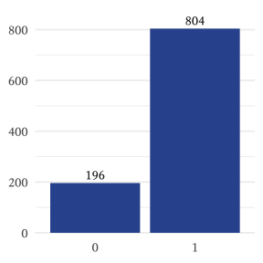
<!--
<p class="caption marginnote">-->(\#fig:BernoulliSample)Counts of a Random Variable with a Bernoulli Distribution $(p = 0.8, n = 1000)$<!--</p>-->
<!--</div>--></span></p>


```r
# n = sample size
n <- 1000
# p = probability
p <- 0.8
# X = sample
X <- rbinom(n, size = 1, prob = p)
# Make a basic plot
barplot(table(X))
```

<div class="wrap-collapsible" style="margin-top: 1em">
<input id="collapsible-BernoulliSampleCodeFigure" class="toggle" type="checkbox">
<label for="collapsible-BernoulliSampleCodeFigure" class="lbl-toggle">R Code</label><div class="collapsible-content">
<div class="content-inner">

```r
# Counts of a Random Variable with a Bernoulli Distribution
set.seed(4)
# n = sample size
n <- 1000
# p = probability
p <- 0.8
# X = sample
X <- rbinom(n, size = 1, prob = p)
# Make a basic plot
ggplot(tibble(X = factor(X)), aes(X)) +
  geom_bar(fill = myfills[1]) +
  scale_x_discrete(NULL) + 
  scale_y_continuous(NULL, expand = expansion(c(0.01,0.1))) +
  geom_text(aes(label = ..count..), 
            stat = "count", 
            vjust = -0.4, 
            size = ggtext_size(18),
            family = bfont,
            color = "gray10") + 
    theme_minimal(18, bfont) + 
  theme(panel.grid.major.x = element_blank())
```

</div></div></div>


## Binomial Distributions {#sec:binomial}

<table>
<caption>(\#tab:binomialfeatures)Features of Binomial Distributions</caption>
<col width="400">
 <thead>
  <tr>
   <th style="text-align:left;"> Feature </th>
   <th style="text-align:left;"> Symbol </th>
  </tr>
 </thead>
<tbody>
  <tr>
   <td style="text-align:left;"> Number of Trials </td>
   <td style="text-align:left;"> $n \in \{1,2,3,\ldots\}$ </td>
  </tr>
  <tr>
   <td style="text-align:left;"> Sample Space </td>
   <td style="text-align:left;"> $x \in \{0,...,n\}$ </td>
  </tr>
  <tr>
   <td style="text-align:left;"> Probability of success in each trial </td>
   <td style="text-align:left;"> $p \in [0,1]$ </td>
  </tr>
  <tr>
   <td style="text-align:left;"> Probability of failure in each trial </td>
   <td style="text-align:left;"> $q = 1 - p$ </td>
  </tr>
  <tr>
   <td style="text-align:left;"> Mean </td>
   <td style="text-align:left;"> $\mu = np$ </td>
  </tr>
  <tr>
   <td style="text-align:left;"> Variance </td>
   <td style="text-align:left;"> $\sigma = npq$ </td>
  </tr>
  <tr>
   <td style="text-align:left;"> Skewness </td>
   <td style="text-align:left;"> $\gamma_1 = \frac{1-2p}{\sqrt{npq}}$ </td>
  </tr>
  <tr>
   <td style="text-align:left;"> Kurtosis </td>
   <td style="text-align:left;"> $\gamma_2 = \frac{1}{npq} - \frac{6}{n}$ </td>
  </tr>
  <tr>
   <td style="text-align:left;"> Probability Mass Function </td>
   <td style="text-align:left;"> $f_X(x;n,p)=\frac{n!}{x!\left(n-x\right)!}p^x q^{n-x}$ </td>
  </tr>
  <tr>
   <td style="text-align:left;"> Cumulative Distribution Function </td>
   <td style="text-align:left;"> $F_X(x;n,p)=\sum_{i=0}^{x}{\frac{n!}{i!(n-i)!} p^i q^{n-i}}$ </td>
  </tr>
</tbody>
</table>

<p><span class="marginnote shownote">
<!--
<div class="figure">-->

<!--
<p class="caption marginnote">-->(\#fig:twocoin)Probability distribution of the number of heads observed when two coins are tossed<!--</p>-->
<!--</div>--></span></p>


Let's extend the idea of coin tosses and see where it leads. Imagine that two coins are tossed at the same time and we count how many heads there are. The outcome we might observe will be zero, one, or two heads. Thus, the sample space for the outcome of the tossing of two coins is the set $\{0,1,2\}$ heads. There is only one way that we will observe no heads (both coins tails) and only one way that we will observe two heads (both coins heads). In contrast, as seen in Figure&nbsp;\@ref(fig:twocoin), there are two ways that we can observe one head (heads-tails \& tails-heads).


<div class="wrap-collapsible" style="margin-top: 1em">
<input id="collapsible-twocoinCode" class="toggle" type="checkbox">
<label for="collapsible-twocoinCode" class="lbl-toggle">$\rm\LaTeX~Code$</label><div class="collapsible-content">
<div class="content-inner">

```tikz
% Probability distribution of the number of heads observed when two coins are tossed
\documentclass[tikz = true,border = 2pt]{standalone}
\usepackage{tikz}
\usepackage{fontspec}
\setmainfont{Equity Text A Tab}
\definecolor[named]{fillColor}{RGB}{39,64,139}
\begin{document}
\begin{tikzpicture}[x=1pt,
                      y=1pt,
                      xscale=.4,
                      yscale=.66,
                      axisline/.style={
                      	draw=black,
                      	line width= 0.4pt,
                      	line join=round,
                      	line cap=round},
                      axislabel/.style={
                      	text=black,
                      	inner sep=0pt, 
                      	outer sep=0pt,
                      	anchor=east},
                      xaxislabel/.style={
                      	text=black,
                      	inner sep=0pt, 
                      	outer sep=0pt},
                       bar/.style={
                      	draw=white,
                      	line width= 0.4pt,
                      	line join=round,
                      	line cap=round,
                      	fill=fillColor,
                        rounded corners = 1.5pt}                ]

% X-axis
\node[xaxislabel] at (100, 39) {0};
\node[xaxislabel] at (200, 39) {1};
\node[xaxislabel] at (300, 39) {2};
\node[scale= 1.14] at (204.07, 19) {Number of Heads};

% Y-axis
\path[axisline] ( 42, 50) -- ( 42,250);
\path[axisline] ( 40, 50) -- ( 42, 50);
\path[axisline] ( 40,150) -- ( 42,150);
\path[axisline] ( 40,250) -- ( 42,250);
\node[axislabel] at ( 37, 50) {0};
\node[axislabel] at ( 37,150) {.25};
\node[axislabel] at ( 37,250) {.50};

% Bars
\path[bar] (50, 50.00) rectangle (150,150);
\path[bar] (150, 50.00) rectangle (250,250);
\path[bar] (250, 50.00) rectangle (350,150);
\node at (100,  80) {\includegraphics [width=36pt]{../QuarterTails.png}};
\node at (100, 120) {\includegraphics [width=36pt]{../QuarterTails.png}};
\node at (200,  80) {\includegraphics [width=36pt]{../QuarterHeads.png}};
\node at (200, 120) {\includegraphics [width=36pt]{../QuarterTails.png}};
\node at (200, 180) {\includegraphics [width=36pt]{../QuarterTails.png}};
\node at (200, 220) {\includegraphics [width=36pt]{../QuarterHeads.png}};
\node at (300,  80) {\includegraphics [width=36pt]{../QuarterHeads.png}};
\node at (300, 120) {\includegraphics [width=36pt]{../QuarterHeads.png}};

\end{tikzpicture}
\end{document}
```

</div></div></div>


The probability distribution of the number of heads observed when two coins are tossed at the same time is a member of the *binomial distribution* family. The binomial distribution occurs when *independent*<label for="tufte-mn-" class="margin-toggle">&#8853;</label><input type="checkbox" id="tufte-mn-" class="margin-toggle"><span class="marginnote">Two random variable are said to be *independent* if the outcome of one variable does not alter the probability of any outcome in the other variable.</span> random variables with the same [Bernoulli distribution](#sec:BernoulliDist) are added together. In fact, Bernoulli discovered the binomial distribution as well as the Bernoulli distribution.

Imagine that a die is rolled 10 times and we count how often a 6 occurs.^[Wait! Hold on! I thought that throwing dice resulted in a (discrete) *uniform* distribution. Well, it still does. However, now we are asking a different question. We are only concerned with two outcomes each time the die is thrown: 6 and not 6. This is a Bernoulli distribution, not a uniform distribution, because the probability of the two events is unequal: {&frac16;,&frac56;}] Each roll of the die is called a [trial]{class=defword}.<label for="tufte-mn-" class="margin-toggle">&#8853;</label><input type="checkbox" id="tufte-mn-" class="margin-toggle"><span class="marginnote">Every time a random variable generates a number, that instance of the variable is called a **trial**, which is also known as an **experiment**.</span> The sample space of this random variable is $\{0,1,2,...,10\}$. What is the probability that a 6 will occur 5 times? or 1 time? or not at all? Such questions are answered by the binomial distribution's [probability mass function](#sec:pmf):


\begin{equation*}
f_X(x;n,p)=\frac{n!}{x!\left(n-x\right)!}p^x\left(1-p\right)^{n-x}
\end{equation*}

Applied to this example, 

\begin{align*}
X &= \text{The random variable (the number of sixes from 10 throws of the die)}\\
x &= \text{Any particular member of the sample space (i.e., } x \in \{0,1,2,...,10\}\text{)}\\
n &= \text{The number of times that the die is thrown (i.e., } n=10 \text{)}\\
p &= \text{The probability that a six will occur on a single throw of the die (i.e., } p=\frac{1}{6}\text{)}.
\end{align*}


<p><span class="marginnote shownote">
<!--
<div class="figure">-->
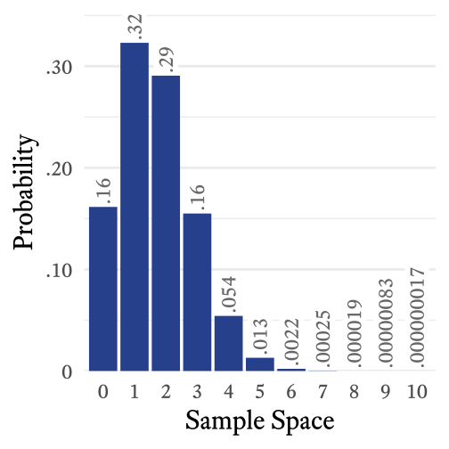
<!--
<p class="caption marginnote">-->(\#fig:pmf6)The probability distribution of the number of sixes observed when a six-sided die is thrown 10 times.<!--</p>-->
<!--</div>--></span></p>


Since $n=10$ and $p=\frac{1}{6}$, the probability mass function simplifies to:

\begin{equation*}
f_X(x)=\frac{n!}{x!\left(n-x\right)!}\left(\frac{1}{6}\right)^x\left(\frac{5}{6}\right)^{10-x}
\end{equation*}


If we take each element $x$ of the sample space from 0 to 10 and plug it into the equation above, the probability distribution will look like Figure&nbsp;\@ref(fig:pmf6).

<div class="wrap-collapsible" style="margin-top: 1em">
<input id="collapsible-pmf6Code" class="toggle" type="checkbox">
<label for="collapsible-pmf6Code" class="lbl-toggle">R Code</label><div class="collapsible-content">
<div class="content-inner">

```r
# Probability of sixes

tibble(sample_space = 0:10) %>% 
  mutate(
    probability = dbinom(
      sample_space, 
      size = max(sample_space), 
      prob = 1 / 6),
    probabiltiy_label = prob_label(probability, digits = 2)) %>% 
  ggplot(aes(factor(sample_space), probability)) +
  geom_col(fill = myfills[1]) + 
  ggtext::geom_richtext(aes(label = probabiltiy_label), 
                       size = ggtext_size(30),
                       angle = 90, 
                       hjust = 0,
                       family = bfont, 
                       label.margin = unit(c(0,0,0,1), "mm"),
                       label.padding = unit(c(1.6,0,0,0),"mm"), 
                       label.colour = NA,
                       color = "gray40") +
  theme_minimal(base_family = bfont, base_size = 30) + 
  scale_y_continuous("Probability", 
                     expand = expansion(c(0,.09)), 
                     labels = prob_label) + 
  scale_x_discrete("Sample Space") + 
  theme(panel.grid.major.x = element_blank()) 
```

</div></div></div>

### Clinical Applications of the Binomial Distribution 

When would a binomial distribution be used by a clinician? One particularly important use of the binomial distribution is in the detection of [malingering]{class=defword}.<label for="tufte-mn-" class="margin-toggle">&#8853;</label><input type="checkbox" id="tufte-mn-" class="margin-toggle"><span class="marginnote">A person who **malingers** is pretending to be sick to avoid work or some other responsibility.</span> Sometimes people pretend to have memory loss or attention problems in order to win a lawsuit or collect insurance benefits. There are a number of ways to detect malingering but a common method is to give a very easy test of memory in which the person has at least a 50\% chance of getting each test item correct even if the person guesses randomly. 

Suppose that there are 20 questions. Even if a person has the worst memory possible, that person is likely to get about half the questions correct. However, it is possible for someone with a legitimate memory problem to guess randomly and by bad luck answer fewer than half of the questions correctly. Suppose that a person gets 4 questions correct. How likely is it that a person would, by random guessing, only answer 4 or fewer questions correctly?

We can use the binomial distribution's cumulative distribution function. However, doing so by hand is rather tedious. Using R, the answer is found with the `pbinom` function:


```r
p <- pbinom(4,20,0.5)
```

We can see that the probability of randomly guessing and getting 4 or fewer items correct out of 20 items total is approximately 0.006, which is so low that the hypothesis that the person is malingering seems plausible. Note here that there is a big difference between these two questions:

* If the person is guessing at random (i.e., not malingering), what is the probability of answering correctly 4 questions or fewer out of 20?
* If the person answers 4 out of 20 questions correctly, what is the probability that the person is guessing at random (and therefore not malingering)?

Here we answer only the first question. It is an important question, but the answer to the second question is probably the one that we really want to know. We will answer it in another chapter when we discuss positive predictive power. For now, we should just remember that the questions are different and that the answers can be quite different.

### Graphing the binomial distribution

Suppose that there are $n=10$ trials, each of which have a probability of $p=0.8$. The sample space is the sequence of integers from 0 to 10, which can be generated with the `seq` function (i.e., `seq(0,10)`) or with the colon operator `0:10`.  First, the sample space is generated (a sequence from 0 to 10.), using the `seq` function. The associated probability mass function probabilities are found using the `dbinom` function. The cumulative distribution function probabilities are found using the `pbinom` function.


```r
# Make a sequence of numbers from 0 to 10
SampleSpace <- seq(0, 10)
# Probability mass distribution for binomial distribution (n = 10, p = 0.8)
pmfBinomial <- dbinom(SampleSpace, size = 10, prob = 0.8)
# Generate a basic plot of the probability mass distribution
plot(pmfBinomial ~ SampleSpace, type = "b")
```


```r
# Cumulative distribution function for binomial distribution (n = 10, p = 0.8)
cdfBinomial <- pbinom(SampleSpace, size = 10, prob = 0.8)
# Generate a basic plot of the cumulative distribution function
plot(cdfBinomial ~ SampleSpace, type = "b")
```


However, making the graph look professional involves quite a bit of code that can look daunting at first. However, the results are often worth the effort. Try running the code below to see the difference. For presentation-worthy graphics, export the graph to the .pdf or .svg format. An .svg file can be imported directly into MS Word or MS PowerPoint. 

<div class="figure" style="text-align: center">
<p class="caption">(\#fig:BinomialDistribution)Probability Mass Function and Cumulative Distribution Function of the Binomial Distribution $(n = 10,~p = 0.8)$</p>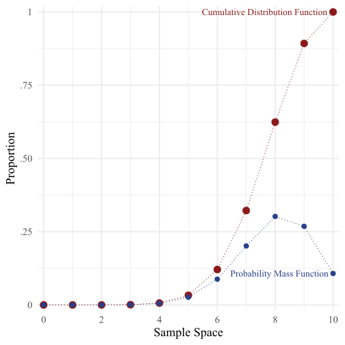</div>

<div class="wrap-collapsible" style="margin-top: 1em">
<input id="collapsible-BinomialDistributionCode" class="toggle" type="checkbox">
<label for="collapsible-BinomialDistributionCode" class="lbl-toggle">R Code</label><div class="collapsible-content">
<div class="content-inner">

```r
tibble(SampleSpace = 0:10,
       pmf = dbinom(SampleSpace, 10, 0.8),
       cdf = pbinom(SampleSpace, 10, 0.8)) %>%
  gather(key = "Function", value = "Proportion",-SampleSpace) %>%
  mutate(Function = factor(Function, levels = c("pmf", "cdf")) ) %>%
  arrange(desc(Function)) %>%
  ggplot(aes(x = SampleSpace,
             y = Proportion,
             color = Function)) +
  geom_line(lty = "dotted") +
  geom_point(aes(size = Function)) +
  theme_minimal(base_family = "serif",
                base_size = 18) +
  scale_color_manual(values = myfills) +
  scale_x_continuous("Sample Space",
                     breaks = seq(0, 10, 2),
                     expand = expansion(0.02)) +
  scale_y_continuous(expand = expansion(0.02), labels = prob_label, breaks = seq(0,1,0.2)) +
  scale_size_manual(values = c(3, 4.5)) +
  theme(legend.position = "none") +
  annotate(
    x = 10 - 0.16,
    y = dbinom(10, 10, 0.8),
    geom = "label",
    label = "Probability Mass Function",
    hjust = 1,
    size = 4.75,
    color = myfills[1],
    label.size = 0,
    family = "serif",
    label.padding = unit(0, "mm")
  ) +
  annotate(
    x = 10 - 0.2,
    y = 1,
    geom = "label",
    label = "Cumulative Distribution Function",
    hjust = 1,
    size = 4.75,
    color = myfills[2],
    label.size = 0,
    family = "serif",
    label.padding = unit(0, "mm")
  )
```

</div></div></div>


## Poisson Distributions

<label for="tufte-mn-" class="margin-toggle">&#8853;</label><input type="checkbox" id="tufte-mn-" class="margin-toggle"><span class="marginnote"><span style="display: block;"><strong>Notation note</strong>: The notation <span class="math inline">\((0,\infty)\)</span> means all real numbers greater than 0.</span></span>


<table>
<caption>(\#tab:PoissonFeatures)Features of Poisson Distributions</caption>
<col width="400">
 <thead>
  <tr>
   <th style="text-align:left;"> Feature </th>
   <th style="text-align:left;"> Symbol </th>
  </tr>
 </thead>
<tbody>
  <tr>
   <td style="text-align:left;"> Parameter </td>
   <td style="text-align:left;"> $\lambda \in (0,\infty)$ </td>
  </tr>
  <tr>
   <td style="text-align:left;"> Sample Space </td>
   <td style="text-align:left;"> $x\in \{0,1,2,\ldots\}$ </td>
  </tr>
  <tr>
   <td style="text-align:left;"> Mean </td>
   <td style="text-align:left;"> $\mu = \lambda$ </td>
  </tr>
  <tr>
   <td style="text-align:left;"> Variance </td>
   <td style="text-align:left;"> $\sigma^2 = \lambda$ </td>
  </tr>
  <tr>
   <td style="text-align:left;"> Skewness </td>
   <td style="text-align:left;"> $\gamma_1 = \frac{1}{\sqrt{\lambda}}$ </td>
  </tr>
  <tr>
   <td style="text-align:left;"> Kurtosis </td>
   <td style="text-align:left;"> $\gamma_2 = \frac{1}{\lambda}$ </td>
  </tr>
  <tr>
   <td style="text-align:left;"> Probability Mass Function </td>
   <td style="text-align:left;"> $f_X(x;\lambda) = \frac{\lambda^x}{e^{\lambda} x!}$ </td>
  </tr>
  <tr>
   <td style="text-align:left;"> Cumulative Distribution Function </td>
   <td style="text-align:left;"> $F_X(x;\lambda) =  \sum_{i=0}^{x}{\frac{\lambda^i}{e^{\lambda} i!}}$ </td>
  </tr>
</tbody>
</table>

Imagine that an event happens sporadically at random and we measure how often it occurs in regular time intervals (e.g., events per hour). Sometimes the event does not occur in the interval, sometimes just once, and sometimes more than once. However, we notice that over many intervals, the average number of events is constant. The distribution of the number of events in each interval will follow a [Poisson distribution]{class=defword}.<label for="tufte-mn-" class="margin-toggle">&#8853;</label><input type="checkbox" id="tufte-mn-" class="margin-toggle"><span class="marginnote">The **Poisson distribution** is a discrete distribution used to model how often an event will occur during a partiuclar interval of time.</span> Although "Poisson" means "fish" in French, fish have nothing to do with it. This distribution was named after the scholar who discovered it, Siméon Denis Poisson. 

<p><span class="marginnote shownote">
<!--
<div class="figure">-->

<!--
<p class="caption marginnote">-->(\#fig:PoissonPortrait)Siméon Denis Poisson (1781--1840)<br>[Image Credits](https://en.wikipedia.org/wiki/File:Simeon_Poisson.jpg)<!--</p>-->
<!--</div>--></span></p>


The Poisson distribution has a single parameter *&lambda;*, the average number of events per time interval. Interestingly, *&lambda;* is both the mean and the variance of this distribution. The distribution shape will differ depending on how long our interval is. If an event occurs on average 30 times per hour, *&lambda;* = 30. If we count how often the event occurs in 10-minute intervals, the same even will occur about 5 times per interval, on average (i.e., *&lambda;* = 1). If we choose to count how often the same event occurs every minute, then *&lambda;* = 0.5.

<div class="figure" style="text-align: center">
<p class="caption">(\#fig:samelambda)The shape of the Poisson Distribution depends on the interval used for counting events. Here, the event occurs once per minute, on average.</p>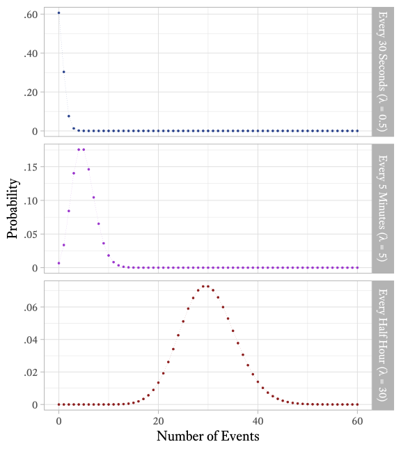</div>


<div class="wrap-collapsible" style="margin-top: 1em">
<input id="collapsible-samelambdaCode" class="toggle" type="checkbox">
<label for="collapsible-samelambdaCode" class="lbl-toggle">R Code</label><div class="collapsible-content">
<div class="content-inner">

```r
# The shape of the Poisson Distribution
crossing(lambda = c(0.5, 5, 30), x = 0:60) %>%
  mutate(p = dpois(x, lambda)) %>%
  mutate(lambda = factor(lambda, labels = paste0(
    "Every ",
    c("30 Seconds", "5 Minutes", "Half Hour"),
    " (\u03BB = ",
    c(0.5, 5, 30),
    ")"
  ))) %>%
  ggplot(aes(x, p, color = lambda)) +
  geom_point(size = 1) +
  geom_line(lty = 3, lwd = 0.1) +
  facet_grid(lambda ~ ., scales = "free") +
  scale_x_continuous("Number of Events", breaks = seq(0, 120, 20)) +
  scale_color_manual(values = c(myfills[1], "darkorchid", myfills[2])) +
  theme_light(base_size = 20, base_family = bfont) +
  theme(legend.position = "none") +
  scale_y_continuous("Probability", labels = prob_label)
```

</div></div></div>


### A clinical application of the the Poisson distribution

Suppose that you begin treating an adult male client who has panic attacks that come at unpredictable times.  Some weeks there are no panic attacks and some weeks there are many, but on average he has 2 panic attacks each week. The client knows this because he has kept detailed records in a spreadsheet for the last 5 years. The client had sought treatment once before, but terminated early and abruptly because, according to him, "It wasn't working." After sensitive querying, you discover that he expected that treatment should have quickly reduced the frequency of panic attacks to zero. When that did not happen, he became discouraged and stopped the treatment.

Because your client is well educated and quantitatively inclined, you decide to to use the data he has collected as part of the intervention and to set a more realistic set of expectations.

You plot the frequency of how often he had 0 panic attacks in a week, 1 panic attack in a week, 2 panic attacks in a week, and so forth, as shown in red in Figure&nbsp;\@ref(fig:PanicFrequency). Because you have read this book, you immediately recognize that this is a Poisson distribution with *&lambda;* = 2. When you graph an actual Poison distribution and compare it with your client's data, you see that it is almost a perfect match.^[Note that I am **not** claiming that all clients' panic attack frequencies have this kind of distribution. It just so happens to apply in this instance.] Then you explain that although the goal is permanent cessation of the panic attacks, sometimes an intervention can be considered successful if the frequency of panic attacks is merely reduced. For example, suppose that in the early stages of treatment the frequency of panic attacks were reduced from twice per week to once every other week (*&lambda;* = 0.5), on average. If such a reduction were achieved, there would still be weeks in which two or more panic attacks occur. According to Figure&nbsp;\@ref(fig:PanicCumulativeFrequency), this will occur about 9\% of the time.

<div class="figure" style="text-align: center">
<p class="caption">(\#fig:PanicFrequency)The variability of a hypothetical client's panic attack frequency before and after treatment</p>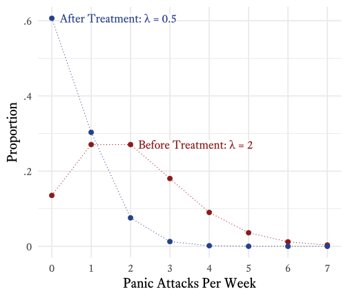</div>


<div class="wrap-collapsible" style="margin-top: 1em">
<input id="collapsible-PanicFrequencyCode" class="toggle" type="checkbox">
<label for="collapsible-PanicFrequencyCode" class="lbl-toggle">R Code</label><div class="collapsible-content">
<div class="content-inner">

```r
# The variability of a hypothetical client's panic attack frequency
d_label <- tibble(
  x = c(0, 2),
  Time = c("After", "Before"),
  Proportion = dpois(x, lambda = c(0.5, 2)),
  Label = c("After Treatment: \u03BB = 0.5",
            "Before Treatment: \u03BB = 2")
)

tibble(
  x = seq(0, 7),
  Before = dpois(x, lambda = 2),
  After = dpois(x, lambda = 0.5)
) %>%
  gather(key = Time, value = Proportion,-x) %>%
  ggplot(aes(x, Proportion, color = Time)) +
  geom_line(linetype = "dotted") +
  geom_point(size = 3) +
  geom_label(
    data = d_label,
    aes(label = Label),
    hjust = 0,
    nudge_x = 0.2,
    family = bfont,
    label.padding = unit(0, "lines"),
    label.size = 0,
    size = 6
  ) +
  scale_color_manual(values = myfills) +
  scale_x_continuous("Panic Attacks Per Week",
                     breaks = 0:7,
                     minor_breaks = NULL) +
  scale_y_continuous(labels = . %>% prob_label(., 0.1)) +
  theme_minimal(base_size = 20, base_family = bfont) +
  theme(legend.position = "none")
```

</div></div></div>


In R, you can use the `dpois` function to plot the Poisson probability mass function. For example, if the average number of events per time period is &lambda; = 2, then the probability that there will be 0 events is `dpois(x = 0, lambda = 2)`, which evaluates to 0.1353.

To calculate the cumulative distribution function of Poisson distribution in R, use the `ppois` function. For example, if we want to estimate the probability of having 4 panic attacks or more in a week if &lambda; = 2, we must subtract the probability of having 3 panic attacks or less from 1, like so:


```r
1 - ppois(q = 3, lambda = 2)
```

$p = 0.143$

Here is a simple way to plot the probability mass function and the cumulative distribution function using the `dpois` and `ppois` functions:


```r
# Make a sequence of integers from 0 to 7
PanicAttacks <- seq(0, 7)

# Generate the probability mass function with lambda = 2
Probability <- dpois(PanicAttacks, 2)

# Basic plot of the Poisson distribution's probability mass function
plot(Probability ~ PanicAttacks, type = "b") 
```

<div class="figure" style="text-align: center">
<p class="caption">(\#fig:Panicpmf)Poisson Probability Mass Function $(\lambda=2)$</p></div>


```r
# Generate the cumulative distribution function with lambda = 2
CumulativeProbability <- ppois(PanicAttacks, 2)

# Basic plot of the Poisson distribution's cumulative distribution function
plot(CumulativeProbability ~ PanicAttacks, type = "b") 
```

<div class="figure" style="text-align: center">
<p class="caption">(\#fig:PanicCDF)Poisson Cumulative Distribution Function $(\lambda=2)$</p>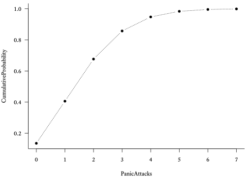</div>

With an additional series with $\lambda = 0.5$, the plot can look like Figure&nbsp;\@ref(fig:PanicCumulativeFrequency).

<div class="figure" style="text-align: center">
<p class="caption">(\#fig:PanicCumulativeFrequency)The cumulative distribution function of a hypothetical client's panic attack frequency before and after treatment</p>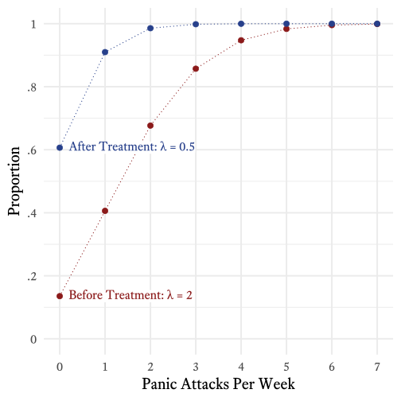</div>


<div class="wrap-collapsible" style="margin-top: 1em">
<input id="collapsible-unnamed-chunk-6" class="toggle" type="checkbox">
<label for="collapsible-unnamed-chunk-6" class="lbl-toggle">R Code</label><div class="collapsible-content">
<div class="content-inner">

```r
# The cumulative distribution function of a hypothetical client's
# panic attack frequency before and after treatment
d_label <- tibble(
  x = c(0, 0),
  Time = c("After", "Before"),
  Proportion = ppois(x, lambda = c(0.5, 2)),
  Label = c("After Treatment: *&lambda;* = 0.5",
            "Before Treatment: *&lambda;* = 2")
)

tibble(
  x = seq(0, 7),
  Before = ppois(x, lambda = 2),
  After = ppois(x, lambda = 0.5)
) %>%
  gather(key = Time, value = Proportion,-x) %>%
  ggplot(aes(x, Proportion, color = Time)) +
  geom_line(linetype = "dotted") +
  geom_point(size = 3) +
  geom_richtext(
    data = d_label,
    aes(label = Label),
    hjust = 0,
    nudge_x = 0.2,
    family = bfont,
    label.padding = unit(0, "lines"),
    label.size = 0,
    size = ggtext_size(20)
  ) +
  scale_color_manual(values = myfills) +
  scale_y_continuous(breaks = seq(0, 1, 0.2), 
                     limits = c(0, 1),
                     labels = . %>% prob_label(., 0.1)) +
  scale_x_continuous("Panic Attacks Per Week",
                     breaks = 0:7,
                     minor_breaks = NULL) +
  theme_minimal(base_size = 20, base_family = bfont) +
  theme(legend.position = "none")
```

</div></div></div>

## Geometric Distributions

<table>
<caption>(\#tab:GeometricFeatures)Features of Geometric Distributions</caption>
<col width="400">
 <thead>
  <tr>
   <th style="text-align:left;"> Feature </th>
   <th style="text-align:left;"> Symbol </th>
  </tr>
 </thead>
<tbody>
  <tr>
   <td style="text-align:left;"> Probability of success in each trial </td>
   <td style="text-align:left;"> $p\in[0,1]$ </td>
  </tr>
  <tr>
   <td style="text-align:left;"> Sample Space </td>
   <td style="text-align:left;"> $x \in \{1,2,3,\ldots\}$ </td>
  </tr>
  <tr>
   <td style="text-align:left;"> Mean </td>
   <td style="text-align:left;"> $\mu = \frac{1}{p}$ </td>
  </tr>
  <tr>
   <td style="text-align:left;"> Variance </td>
   <td style="text-align:left;"> $\sigma^2 = \frac{1-p}{p^2}$ </td>
  </tr>
  <tr>
   <td style="text-align:left;"> Skewness </td>
   <td style="text-align:left;"> $\gamma_1 = \frac{2-p}{\sqrt{1-p}}$ </td>
  </tr>
  <tr>
   <td style="text-align:left;"> Kurtosis </td>
   <td style="text-align:left;"> $\gamma_2 = 6 + \frac{p^2}{1-p}$ </td>
  </tr>
  <tr>
   <td style="text-align:left;"> Probability Mass Function </td>
   <td style="text-align:left;"> $f_X(x;p) = (1-p)^{x-1}p^x$ </td>
  </tr>
  <tr>
   <td style="text-align:left;"> Cumulative Distribution Function </td>
   <td style="text-align:left;"> $F_X(x;p) = 1-(1-p)^x$ </td>
  </tr>
</tbody>
</table>

Atul Gawande [-@gawande2007better, pp. 219--223] tells a marvelous anecdote about how a doctor used some statistics to help a young patient with cystic fibrosis to return to taking her medication more regularly. Because the story is full of pathos and masterfully told, I will not repeat a clumsy version of it here. However, unlike Gawande, I *will* show how the doctor's statistics were calculated. 

According to the story, if a patient fails to take medication, the probability that a person with cystic fibrosis will develop a bad lung illness on any particular day is .005. If medication is taken, the risk is .0005. Although these probabilities are both close to zero, over the the course of a year, they result in very different levels of risk. Off medication, the patient has about an 84% chance of getting sick within a year's time. On medication, the patient's risk falls to 17%. As seen in Figure&nbsp;\@ref(fig:WithMedicationCDF), the cumulative risk over the course of 10 years is quite different. Without medication, the probability of becoming seriously ill within 10 years at least once is almost certain. With medication, however, a small but substantial percentage (~16%) of patients will go at least 10 years without becoming ill. 


<div class="figure" style="text-align: center">
<p class="caption">(\#fig:WithMedicationCDF)The cumulative risk of serious lung disease with and without medication</p></div>


<div class="wrap-collapsible" style="margin-top: 1em">
<input id="collapsible-WithMedicationCDFCode" class="toggle" type="checkbox">
<label for="collapsible-WithMedicationCDFCode" class="lbl-toggle">R Code</label><div class="collapsible-content">
<div class="content-inner">

```r
# The cumulative risk of serious lung 
# disease with and without medication
total_years <- 10

tibble(Days = seq(0, total_years * 365, 10),
       WithoutMeds = pgeom(Days, 0.005),
       WithMeds = pgeom(Days, 0.0005)) %>% 
  gather(Meds, p, -Days) %>% 
  mutate(Years = Days / 365) %>% 
  ggplot(aes(Years, p, color = Meds)) + 
  geom_line() + 
  theme_minimal(base_size = 18, base_family = bfont) + 
  theme(legend.position = "none") +
  scale_x_continuous(breaks = seq(0,total_years,2)) + 
  scale_y_continuous("Cumulative Risk", breaks = seq(0,1,0.2),
                     labels = . %>% prob_label(., 0.1)) +
  scale_color_manual(values = myfills) +
  coord_fixed(ratio = 10) +
  annotate(x = 4, y = 0.93, 
           label = "Without Medication\nDaily Risk = .005",
           geom = "label", 
           color = myfills[2],
           label.padding = unit(0,"lines"),
           label.size = 0,
           family = bfont,
           size = 5.2
           ) +
  annotate(x = 6.25, y = 0.535, 
           label = "With Medication\nDaily Risk = .0005",
           geom = "label", 
           color = myfills[1],
           label.padding = unit(0,"lines"),
           label.size = 0,
           family = bfont,
           size = 5.2
           )
```

</div></div></div>


Such calculations make use of the *geometric distribution*. Consider a series of [Bernoulli trials](#sec:BernoulliDist) in which an event has a probability $p$ of occurring on any particular trial. The probability mass function of the geometric distribution will tell us the probability that the x^th^ trial will be the first time the event occurs. 

\begin{equation*}
f_X(x;p)=(1-p)^{x-1}p^x
\end{equation*}
Where
\begin{align*}
X &= \text{A random variable with a geometric distribution}\\
f_X &= \text{The probability mass function of}~X\\
x &= \text{The number of Bernoulli trials on which the event first occurs}\\
p &= \text{The probability of an event occurring on a single Bernoulli trial}\\
\end{align*}

In R, the probability mass function of the geometric distribution is calculated with the `dgeom` function:


```r
# Make a sequence of integers from 1 to 10
x <- seq(1, 10)

# Generate the probability mass function with p = 0.6
Probability <- dgeom(x, prob = 0.6)

# Basic plot of the geometric distribution's probability mass function
plot(Probability ~ x, type = "b") 
```

<div class="figure" style="text-align: center">
<p class="caption">(\#fig:GeometricPMF)Geometric Probability Mass Function (*p*&nbsp;=&nbsp;.6)</p></div>

The cumulative distribution function of the geometric distribution was used to create Figure&nbsp;\@ref(fig:WithMedicationCDF). It tells us the probability that the event will occur on the $x^{th}$ trial or earlier:

\begin{equation*}
F_X(x;p)=1-(1-p)^x
\end{equation*}

In R, the cumulative distribution function of the geometric distribution uses the `pgeom` function:


```r
# Generate the cumulative distribution function with p = 0.6
CumulativeProbability <- pgeom(x, prob = 0.6)

# Basic plot of the geometric distribution's cumulative distribution function
plot(CumulativeProbability ~ x, type = "b") 
```

<div class="figure" style="text-align: center">
<p class="caption">(\#fig:GeometricCDF)Geometric Cumulative Distribution Function (*p*&nbsp;=&nbsp;.6)</p></div>

## Probability Density Functions {#sec:pdf}

Although there are many more discrete distribution families, we will now consider some continuous distribution families. Most of what we have learned about discrete distributions applies to continuous distributions. However, there is a need of a name change for the probability mass function. In a discrete distribution, we can calculate an actual probability for a particular value in the sample space. In continuous distributions, doing so can be tricky. We can always calculate the probability that a score in a particular interval will occur. However, in continuous distributions, the intervals can become very small, approaching a width of 0. When that happens, the probability associated with that interval also approaches 0. Yet, some parts of the distribution are more probable than others. Therefore, we need a measure of probability that tells us the probability of a value *relative* to other values: the [probability density function]{class=defword}.<label for="tufte-mn-" class="margin-toggle">&#8853;</label><input type="checkbox" id="tufte-mn-" class="margin-toggle"><span class="marginnote">The **probability density function** is function that can show relative likelihoods of sample space elements of a continuous random variable.</span> 

Considering the entire sample space of a discrete distribution, all of the associated probabilities from the probability mass function sum to 1. In a probability density function, it is the area under the curve that must sum to 1. That is, there is a 100\% probability that a value generated by the random variable will be somewhere under the curve. There is nowhere else for it to go!

However, unlike probability mass functions, probability density functions do not generate probabilities. Remember, the probability of any value in the sample space of a continuous variable is infinitesimal. We can only compare the probabilities to each other. To see this, compare the discrete uniform distribution and continuous uniform distribution in Figure&nbsp;\@ref(fig:pdfIllustration). Both distributions range from 1 to 4. In the discrete distribution, there are 4 points, each with a probability of 0.25. It is easy to see that these probabilities sum to 1. Because of the scale of the figure, it is not easy to see exactly how high the probability density function is in the continuous distribution. It happens to be &frac13;. Why? First, it does not mean that each value has a &frac13; probability. There are an infinite number of points between 1 and 4 and it would be absurd if each of them had a &frac13; probability. The distance between 1 and 4 is 3. In order for the rectangle to have an area of 1, its height must be &frac13;. What does that &frac13; mean, then? In the case of a single value in the sample space, it does not mean much at all. It is simply a value that we can compare to other values in the sample space. It could be scaled to any value but for the sake of convenience it is scaled such that the area under the curve is 1. 

Note that some probability density functions can produce values greater than 1. If the range of a continuous uniform distribution is less than 1, at least some portions of the curve must be greater than 1 to make the area under the curve equal 1. For example, if the bounds of a continuous distribution are 0 and &frac13;, the average height of the probability density function would need to be 3 so that the total area is equal to 1.

## Continuous Uniform Distributions {#sec:Uniform}

<table>
<caption>(\#tab:discretefeatures)Features of Continuous Discrete Distributions</caption>
 <thead>
  <tr>
   <th style="text-align:left;"> Feature </th>
   <th style="text-align:left;"> Symbol </th>
  </tr>
 </thead>
<tbody>
  <tr>
   <td style="text-align:left;"> Lower Bound </td>
   <td style="text-align:left;"> $a  \in (-\infty,\infty)$ </td>
  </tr>
  <tr>
   <td style="text-align:left;"> Upper Bound </td>
   <td style="text-align:left;"> $b \in (a,\infty)$ </td>
  </tr>
  <tr>
   <td style="text-align:left;"> Sample Space </td>
   <td style="text-align:left;"> $x \in \lbrack a,b\rbrack$ </td>
  </tr>
  <tr>
   <td style="text-align:left;"> Mean </td>
   <td style="text-align:left;"> $\mu = \frac{a+b}{2}$ </td>
  </tr>
  <tr>
   <td style="text-align:left;"> Variance </td>
   <td style="text-align:left;"> $\sigma^2 = \frac{(b-a)^2-1}{12}$ </td>
  </tr>
  <tr>
   <td style="text-align:left;"> Skewness </td>
   <td style="text-align:left;"> $\gamma_1 = 0$ </td>
  </tr>
  <tr>
   <td style="text-align:left;"> Kurtosis </td>
   <td style="text-align:left;"> $\gamma_2 = -\frac{6}{5}$ </td>
  </tr>
  <tr>
   <td style="text-align:left;"> Probability Density Function </td>
   <td style="text-align:left;"> $f_X(x;a,b) = \frac{1}{b-a}$ </td>
  </tr>
  <tr>
   <td style="text-align:left;"> Cumulative Distribution Function </td>
   <td style="text-align:left;"> $F_X(x;a,b) = \frac{x-a}{b-a}$ </td>
  </tr>
</tbody>
</table>


Unlike the [discrete uniform distribution](#sec:DiscreteUniform), the uniform distribution is [continuous](#sec:DiscreteVsContinuous).^[For the sake of clarity, the uniform distribution is often referred to as the *continuous uniform distribution*.] In both distributions, there is an upper and lower bound and all members of the sample space are equally probable.

### Generating random samples from the continuous uniform distribution

To generate a sample of $n$ numbers with a continuous uniform distribution between $a$ and $b$, use the `runif` function like so:

<p><span class="marginnote shownote">
<!--
<div class="figure">-->
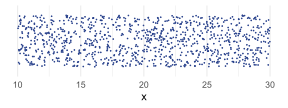
<!--
<p class="caption marginnote">-->(\#fig:uniformdist)Random sample (*n* = 1000) of a continuous uniform distribution between 10 and 30. Points are randomly jittered to show the distribution more clearly.<!--</p>-->
<!--</div>--></span></p>

```r
# Sample size
n <- 1000
# Lower and upper bounds
a <- 10
b <- 30
# Sample
x <- runif(n, min = a, max = b)
# Plot
tibble(x) %>% 
ggplot(aes(x, y = 0.5)) + 
  geom_jitter(size = 0.1, 
              color = myfills[1], 
              height = 0.4) +
  scale_y_continuous(NULL, 
                     breaks = NULL, 
                     limits = c(0,1)) + 
  theme_minimal()
```


### Using the continuous uniform distribution to generate random samples from other distributions

Uniform distributions can begin and end at any real number but one member of the uniform distribution family is particularly important---the uniform distribution between 0 and 1. If you need to use Excel instead of a statistical package, you can use this distribution to generate random numbers from many other distributions. 

The cumulative distribution function of any continuous distribution converts into a continuous uniform distribution. A distribution's [quantile function](#sec:Quantile) converts a continuous uniform distribution into that distribution. Most of the time, this process also works for discrete distributions. This process is particularly useful for generating random numbers with an unusual distribution. If the distribution's quantile function is known, a sample with a continuous uniform distribution can easily be generated and converted.

For example, the `RAND` function in Excel generates random numbers between 0 and 1 with a continuous uniform distribution. The `BINOM.INV` function is the binomial distribution's quantile function. Suppose that $n$ (number of Bernoulli trials) is 5 and $p$ (probability of success on each Bernoulli trial) is 0.6. A randomly generated number from the binomial distribution with $n=5$ and $p=0.6$ is generated like so:

`=BINOM.INV(5,0.6,RAND())`

Excel has quantile functions for many distributions (e.g., `BETA.INV, BINOM.INV, CHISQ.INV, F.INV, GAMMA.INV, LOGNORM.INV, NORM.INV, T.INV`). This method of combining `RAND` and a quantile function works reasonably well in Excel for quick-and-dirty projects, but when high levels of accuracy are needed, random samples should be generated in a dedicated statistical package .

## Normal Distributions {#sec:normal}

<p><span class="marginnote shownote">
<!--
<div class="figure">-->

<!--
<p class="caption marginnote">-->(\#fig:GaussImage)Carl Friedrich Gauss (1777--1855)<br>[Image Credits](https://en.wikipedia.org/wiki/File:Carl_Friedrich_Gauss_1840_by_Jensen.jpg)<!--</p>-->
<!--</div>--></span></p>


<table>
<caption>(\#tab:normalfeatures)Features of Normal Distributions</caption>
<col width="400">
 <thead>
  <tr>
   <th style="text-align:left;"> Feature </th>
   <th style="text-align:left;"> Symbol </th>
  </tr>
 </thead>
<tbody>
  <tr>
   <td style="text-align:left;"> Sample Space </td>
   <td style="text-align:left;"> $x \in (-\infty,\infty)$ </td>
  </tr>
  <tr>
   <td style="text-align:left;"> Mean </td>
   <td style="text-align:left;"> $\mu = \text{E}\left(X\right)$ </td>
  </tr>
  <tr>
   <td style="text-align:left;"> Variance </td>
   <td style="text-align:left;"> $\sigma^2 = \text{E}\left(\left(X - \mu\right)^2\right)$ </td>
  </tr>
  <tr>
   <td style="text-align:left;"> Skewness </td>
   <td style="text-align:left;"> $\gamma_1 = 0$ </td>
  </tr>
  <tr>
   <td style="text-align:left;"> Kurtosis </td>
   <td style="text-align:left;"> $\gamma_2 = 0$ </td>
  </tr>
  <tr>
   <td style="text-align:left;"> Probability Density Function </td>
   <td style="text-align:left;"> $f_X(x;\mu,\sigma^2) = \frac{1}{\sqrt{2 \pi \sigma ^ 2}} e^{-\frac{1}{2}\left(\frac{x-\mu}{\sigma}\right)^2}$ </td>
  </tr>
  <tr>
   <td style="text-align:left;"> Cumulative Distribution Function </td>
   <td style="text-align:left;"> $F_X(x;\mu,\sigma^2) = \frac{1}{\sqrt{2\pi\sigma^2}} {\displaystyle \int_{-\infty}^{x} e ^ {-\frac{1}{2}\left(\frac{x-\mu}{\sigma}\right)^2}dx}$ </td>
  </tr>
</tbody>
</table>

The normal distribution is probably the most important distribution in statistics and in psychological assessment. In the absence of other information, assuming that an individual difference variable is normally distributed is a good bet. Not a sure bet, of course, but a good bet. Why? What is so special about the normal distribution? To get a sense of the answer to this question, consider what happens to the binomial distribution as the number of events ($n$) increases. To make the example more concrete, let's assume that we are tossing coins and counting the number of heads ($p=0.5$). In Figure&nbsp;\@ref(fig:ManyCoins), the first plot shows the probability mass function for the number of heads when there is a single coin ($n=1$). In the second plot, $n=2$ coins. That is, if we flip 2 coins, there will be 0, 1, or 2 heads. In each subsequent plot, we double the number of coins that we flip simultaneously. Even with as few as 4 coins, the distribution begins to resemble the normal distribution, although the resemblance is very rough. With 128 coins, however, the resemblance is very close.

This resemblance to the normal distribution in the example is not coincidental to the fact that $p=0.5$, making the binomial distribution symmetric. If $p$ is extreme (close to 0 or 1), the binomial distribution is asymmetric. However, if $n$ is large enough, the binomial distribution eventually becomes very close to normal.

Many other distributions (e.g., Poisson, Student's T, F, and $\chi^2$) have distinctive shapes under some conditions but approximate the normal distribution in others. Why? In the conditions in which non-normal distributions approximate the normal distribution, it is because, like in Figure&nbsp;\@ref(fig:ManyCoins), many independent events are summed.


<div class="figure" style="text-align: center">
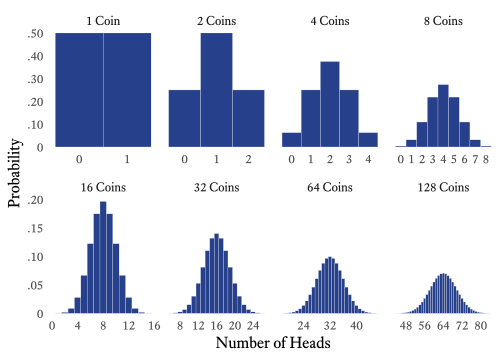
<p class="caption marginnote shownote">(\#fig:ManyCoins)The binomial distribution begins to resemble the normal distribution when the number of events is large.</p>
</div>


In the distribution in Figure&nbsp;\@ref(fig:twocoin), because there is a 50\% chance of heads, $p = 0.5$. Because there are two coins, $n = 2$. We can use the [binomial distribution's probability mass function](#sec:binomial) to see how the shape of the distribution changes as we increase the number of coins tossed (Figure&nbsp;\@ref(fig:ManyCoins)).


### Notation for Normal Variates

Statisticians write about variables with normal distributions so often that a compact notation for specifying a normal variable's parameters was useful to develop. There are several common variations to this notation, but I will use this one: 

$$X \sim \mathcal{N}(\mu, \sigma^2)$$ 

* $X$ is a random variable.
* $\sim$ means "is distributed as." It can be applied to any kind of distribution, not just the normal distribution.
* $\mathcal{N}$ means that the variable has a normal distribution. Instead of $\mathcal{N}$, the notation for a normal variable is often simply $N$.
* $\mu$ is the mean.
* $\sigma^2$ is the variance. 

Many authors list the standard deviation $\sigma$ instead of the variance $\sigma^2$. When I specify normal distributions with specific means and variances, I will avoid ambiguity by always showing the variance as the standard deviation squared. For example, a normal variate with a mean of 10 and a standard deviation of 3 will be written as $X \sim \mathcal{N}(10,3^2)$.

<div class="figure" style="text-align: center">
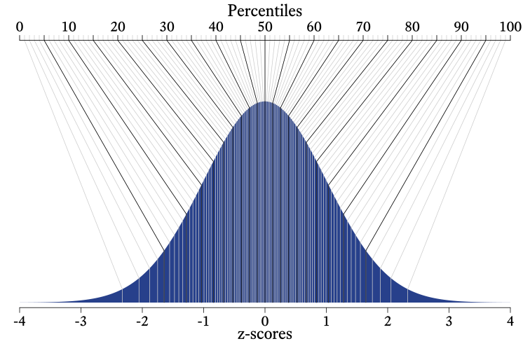
<p class="caption marginnote shownote">(\#fig:PercentileContinuous)Percentiles convert a distribution into a uniform distribution</p>
</div>


## Half-Normal Distribution

<p><span class="marginnote shownote">
<!--
<div class="figure">-->

<!--
<p class="caption marginnote">-->(\#fig:halfnormal)The half-normal distribution is the normal distribution with the left half of the distribution stacked on top of the right half of the distribution.<!--</p>-->
<!--</div>--></span></p>

Suppose that $X$ is a normally distributed variable such that $X \sim \mathcal{N}(\mu, \sigma^2)$. Variable $Y$ then has a half-normal distribution such that $Y = |X-\mu|+\mu$. In other words, imagine that a normal distribution is folded at the mean with the left half of the distribution now stacked on top of the right half of the distribution (See Figure&nbsp;\@ref(fig:halfnormal)).


<div class="wrap-collapsible" style="margin-top: 1em">
<input id="collapsible-halfnormalCode" class="toggle" type="checkbox">
<label for="collapsible-halfnormalCode" class="lbl-toggle">R Code</label><div class="collapsible-content">
<div class="content-inner">

```r
# Half normal distribution
xlim <- 4
n <- length(seq(-xlim, 0, 0.01))
t1 <- tibble(
  x = c(0,-xlim,
        seq(-xlim, 0, 0.01),
        0,
        0,
        seq(0, xlim, 0.01),
        xlim,
        0),
  y = c(0,
        0,
        dnorm(seq(-xlim, 0, 0.01)),
        0,
        0,
        dnorm(seq(0, xlim, 0.01)),
        0,
        0),
  side = c(rep(F, n + 3), rep(T, n + 3)),
  Type = 1
)
t2 <- t1 %>%
  mutate(y = if_else(side, y, 2 * y)) %>%
  mutate(x = abs(x),
         Type = 2)

bind_rows(t1, t2) %>%
  mutate(Type = factor(Type)) %>%
  ggplot(aes(x, y, fill = side)) +
  geom_polygon() +
  geom_text(
    data = tibble(
      x = 0,
      y = dnorm(0) * c(1, 2) + 0.14,
      Type = c(1,2),
      label = c(
        "Normal",
        "Half-Normal"),
      side = T),
    aes(label = label),
    family = bfont, fontface = "bold",
    size = ggtext_size(30), 
    vjust = 1
  ) +
  geom_richtext(
    data = tibble(
      x = 0,
      y = dnorm(0) * c(1, 2) + 0,
      Type = c(1,2),
      label = c(
        "*X* ~ <span style=\"font-family:'Lucida Calligraphy'\">N</span>(*<span style=\"font-family:'Times New Roman'\">&mu;</span>*, *<span style=\"font-family:'Times New Roman'\">&sigma;</span>*<sup>2</sup>)",
        "*X* ~ |<span style=\"font-family:'Lucida Calligraphy'\">N</span>(0, *<span style=\"font-family:'Times New Roman'\">&sigma;</span>*<sup>2</sup>)| + *<span style=\"font-family:'Times New Roman'\">&mu;</span>*"),
      side = T),
    aes(label = label),
    family = c("Equity Text A"),
    size = ggtext_size(30), 
    vjust = 0, 
    label.padding = unit(0,"lines"), 
    label.color = NA,
    fill = NA) +
  theme_void(base_size = 30,
                base_family = bfont) +
  theme(
    legend.position = "none",
    strip.text = element_blank()
  ) +
  scale_fill_manual(values = myfills) +
  facet_grid(Type ~ ., space = "free_y", scales = "free_y") 
```

</div></div></div>


<table>
<caption>(\#tab:halfnormalfeatures)Features of Half-Normal Distributions</caption>
<col width="400">
 <thead>
  <tr>
   <th style="text-align:left;"> Feature </th>
   <th style="text-align:left;"> Symbol </th>
  </tr>
 </thead>
<tbody>
  <tr>
   <td style="text-align:left;"> Sample Space </td>
   <td style="text-align:left;"> $x \in [\mu,\infty)$ </td>
  </tr>
  <tr>
   <td style="text-align:left;"> Mu </td>
   <td style="text-align:left;"> $\mu \in (-\infty,\infty)$ </td>
  </tr>
  <tr>
   <td style="text-align:left;"> Sigma </td>
   <td style="text-align:left;"> $\sigma \in [0,\infty)$ </td>
  </tr>
  <tr>
   <td style="text-align:left;"> Mean </td>
   <td style="text-align:left;"> $\mu + \sigma\sqrt{\frac{2}{\pi}}$ </td>
  </tr>
  <tr>
   <td style="text-align:left;"> Variance </td>
   <td style="text-align:left;"> $\sigma^2\left(1-\frac{2}{\pi}\right)$ </td>
  </tr>
  <tr>
   <td style="text-align:left;"> Skewness </td>
   <td style="text-align:left;"> $\sqrt{2}(4-\pi)(\pi-2)^{-\frac{3}{2}}$ </td>
  </tr>
  <tr>
   <td style="text-align:left;"> Kurtosis </td>
   <td style="text-align:left;"> $8(\pi-3)(\pi-2)^{-2}$ </td>
  </tr>
  <tr>
   <td style="text-align:left;"> Probability Density Function </td>
   <td style="text-align:left;"> $f_X(x;\mu,\sigma) = \sqrt{\frac{2}{\pi \sigma ^ 2}} e^{-\frac{1}{2}\left(\frac{x-\mu}{\sigma}\right)^2}$ </td>
  </tr>
  <tr>
   <td style="text-align:left;"> Cumulative Distribution Function </td>
   <td style="text-align:left;"> $F_X(x;\mu,\sigma) = \sqrt{\frac{2}{\pi\sigma}} {\displaystyle \int_{\mu}^{x} e ^ {-\frac{1}{2}\left(\frac{x-\mu}{\sigma}\right)^2}dx}$ </td>
  </tr>
</tbody>
</table>


## The Student's *t* Distribution

<p><span class="marginnote shownote">
<!--
<div class="figure">-->

<!--
<p class="caption marginnote">-->(\#fig:gosset)"Student" statistician, William Sealy Gosset (1876--1937)<br>[Image Credit](https://en.wikipedia.org/wiki/File:William_Sealy_Gosset.jpg)<!--</p>-->
<!--</div>--></span></p>

Guinness Beer gets free advertisement every time the origin story of the Student *t* distribution is retold, and statisticians retell the story often. The fact that original purpose of the *t* distribution was to brew better beer seems too good to be true. 

William Sealy Gosset (1876--1937), self-trained statistician and head brewer at Guinness Brewery in Dublin, continually experimented on small batches to improve and standardize the brewing process. With some help from statistician Karl Pearson, Gosset used then-current statistical methods to analyze his experimental results. Gosset found that Pearson's methods required small adjustments when applied to small samples. With Pearson's help and encouragement (and later from Ronald Fisher), Gosset published a series of innovative papers about a wide range of statistical methods, including the *t* distribution, which can be used to describe the distribution of sample means.

Worried about having its trade secrets divulged, Guinness did not allow its employees to publish scientific papers. Thus, Gosset published his papers under the pseudonym, "A Student." The straightforward names of most statistical concepts need no historical treatment. Few of us who regularly use the Bernoulli, Pareto, Cauchy, and Gumbell distributions could tell you anything about the people who discovered them. But the oddly named "Student's *t* distribution" cries out for explanation. Thus, in the long run, it was Gosset's anonymity that made him famous. 

<label for="tufte-mn-" class="margin-toggle">&#8853;</label><input type="checkbox" id="tufte-mn-" class="margin-toggle"><span class="marginnote"><span style="display: block;"><strong>Notation note</strong>: <span class="math inline">\(\Gamma\)</span> is the gamma function. <span class="math inline">\(_2F_1\)</span> is the hypergeometric function.</span></span>

<table>
<caption>(\#tab:tfeatures)Features of *t* Distributions</caption>
<col width="400">
 <thead>
  <tr>
   <th style="text-align:left;"> Feature </th>
   <th style="text-align:left;"> Symbol </th>
  </tr>
 </thead>
<tbody>
  <tr>
   <td style="text-align:left;"> Sample Space </td>
   <td style="text-align:left;"> $x \in (-\infty,\infty)$ </td>
  </tr>
  <tr>
   <td style="text-align:left;"> Degrees of Freedom </td>
   <td style="text-align:left;"> $\nu \in (0,\infty)$ </td>
  </tr>
  <tr>
   <td style="text-align:left;"> Mean </td>
   <td style="text-align:left;"> $\left\{
\begin{array}{ll}
      0 & \nu > 1 \\
      \text{Undefined} & \nu \le 1 \\
\end{array} 
\right.$ </td>
  </tr>
  <tr>
   <td style="text-align:left;"> Variance </td>
   <td style="text-align:left;"> $\left\{
\begin{array}{ll}
      \frac{\nu}{\nu-2} & \nu>2 \\
      \infty & 1<\nu \le 2\\
      \text{Undefined} & \nu \le 1 \\
\end{array} 
\right.$ </td>
  </tr>
  <tr>
   <td style="text-align:left;"> Skewness </td>
   <td style="text-align:left;"> $\left\{
\begin{array}{ll}
      0 & \nu > 3 \\
      \text{Undefined} & \nu \le 3 \\
\end{array} 
\right.$ </td>
  </tr>
  <tr>
   <td style="text-align:left;"> Kurtosis </td>
   <td style="text-align:left;"> $\left\{
\begin{array}{ll}
      \frac{6}{\nu-4} & \nu>4 \\
      \infty & 2<\nu \le 4\\
      \text{Undefined} & \nu \le 2 \\
\end{array} 
\right.$ </td>
  </tr>
  <tr>
   <td style="text-align:left;"> Probability Density Function </td>
   <td style="text-align:left;"> $f_X(x; \nu) = \frac{\Gamma(\frac{\nu+1}{2})} {\sqrt{\nu\pi}\,\Gamma(\frac{\nu}{2})} \left(1+\frac{x^2}{\nu} \right)^{-\frac{\nu+1}{2}}$ </td>
  </tr>
  <tr>
   <td style="text-align:left;"> Cumulative Distribution Function </td>
   <td style="text-align:left;"> $F_X(x; \nu)=\frac{1}{2} + x \Gamma \left( \frac{\nu+1}{2} \right)  \frac{\,_2F_1 \left(\frac{1}{2},\frac{\nu+1}{2};\frac{3}{2};-\frac{x^2}{\nu} \right)} {\sqrt{\pi\nu}\,\Gamma \left(\frac{\nu}{2}\right)}$ </td>
  </tr>
</tbody>
</table>


<div class="figure" style="text-align: center">
<p class="caption">(\#fig:tnorm)The *t* distribution approaches the standard normal distribution as the degrees of freedom (*df*) parameter increases.</p>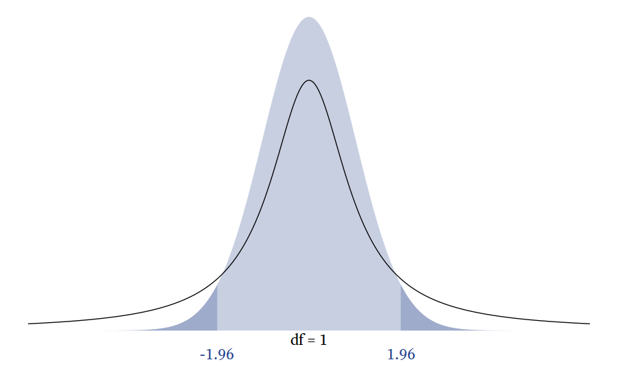</div>

<div class="wrap-collapsible" style="margin-top: 1em">
<input id="collapsible-tnormCode" class="toggle" type="checkbox">
<label for="collapsible-tnormCode" class="lbl-toggle">R Code</label><div class="collapsible-content">
<div class="content-inner">

```r
# The t distribution approaches the normal distribution
d <- crossing(x = seq(-6,6,0.02), 
         df = c(seq(1,15,1),
                seq(20,45,5),
                seq(50,100,10),
                seq(200,700,100))) %>%
  mutate(y = dt(x,df),
         Normal = dnorm(x)) 

d_label <- d %>% 
  select(df) %>% 
  unique() %>% 
  mutate(lb = qt(.025, df),
         ub = qt(0.975, df)) %>% 
  pivot_longer(c(lb, ub), values_to = "x", names_to = "bounds") %>% 
  mutate(label_x = scales::number(x, .01),
         y = 0,
         yend = dt(x, df))

p <- ggplot(d, aes(x, y)) + 
  geom_area(aes(y = Normal), alpha = 0.25, fill = myfills[1]) +
  geom_line() +
  geom_area(data = . %>% filter(x >= 1.96), 
            alpha = 0.25, 
            fill = myfills[1],
            aes(y = Normal)) +
  geom_area(data = . %>% filter(x <= -1.96), 
            alpha = 0.25, 
            fill = myfills[1],
            aes(y = Normal)) +
  geom_text(data = d_label, 
            aes(label = label_x), 
            family = bfont, 
            vjust = 1.25,
            size = ggtext_size(24)) + 
  geom_text(data = d_label %>% select(df) %>% unique,
            aes(x = 0, y = 0, label = paste0("df = ", df)), 
            vjust = 1.25, 
            family = bfont,
            size = ggtext_size(24)) + 
  geom_segment(data = d_label, aes(xend = x, yend = yend)) +
  transition_states(states = df, 
                    transition_length =  1, 
                    state_length = 2) +
  theme_void(base_size = 24, base_family = bfont) +
  # labs(title = "df = {closest_state}") +
  annotate(x = qnorm(c(0.025, 0.975)), 
           y = 0, 
           label = round(qnorm(c(0.025, 0.975)), 2), 
           geom = "text", 
           size = ggtext_size(24),
           color = myfills[1],
           vjust = 2.5, 
           family = bfont) + 
  coord_cartesian(xlim = c(-6,6), ylim = c(-.03, NA)) 
animate(p, 
        renderer = magick_renderer(), 
        device = "svglite", 
        fps = 2, 
        height = 6, 
        width = 10)
gganimate::anim_save("tdist_norm.gif")
```

</div></div></div>


<!--chapter:end:03-Distributions.Rmd-->


# Descriptives

When we encounter large lists of unsorted numbers, we have no natural capacity to perceive the list's fundamental characteristics such its average or its variability. Therefore, we need [descriptive statistics]{.defword}<label for="tufte-mn-" class="margin-toggle">&#8853;</label><input type="checkbox" id="tufte-mn-" class="margin-toggle"><span class="marginnote">**Descriptive statistics** summarize noteworthy characteristics of samples.</span> to quantify salient characteristics of distributions, or we need to display the numbers in a plot, making them easier to understand and communicate.

## Frequency Distribution Tables

A simple way to describe a distribution is to list how many times each value in the distribution occurs. For example, in this distribution: $\{10, 3, 4, 10, 6, 4, 6, 4\}$, there is 1 three, 3 fours, 2 sixes, and 2 tens. The value that occurs most often is four. A [frequency distribution table]{.defword}<label for="tufte-mn-" class="margin-toggle">&#8853;</label><input type="checkbox" id="tufte-mn-" class="margin-toggle"><span class="marginnote">A **frequency distribution table** summarises a sample by showing the frequency counts of each member of the sample space.</span> displays the number of times each value occurs, as in Table&nbsp;\@ref(tab:frequencydistributiontable).

<table>
<caption>(\#tab:frequencydistributiontable)Frequency Distribution Table<br>The median is 5, halfway between the two middle scores of 4 and 6.</caption>
 <thead>
  <tr>
   <th style="text-align:right;"> $X$ </th>
   <th style="text-align:right;"> Frequency </th>
   <th style="text-align:right;"> Cumulative<br>Frequency </th>
   <th style="text-align:right;"> Proportion </th>
   <th style="text-align:right;"> Cumulative<br>Proportion </th>
  </tr>
 </thead>
<tbody>
  <tr>
   <td style="text-align:right;"> 3 </td>
   <td style="text-align:right;"> 1 </td>
   <td style="text-align:right;"> 1 </td>
   <td style="text-align:right;"> .125 </td>
   <td style="text-align:right;"> .125 </td>
  </tr>
  <tr>
   <td style="text-align:right;"> 4 </td>
   <td style="text-align:right;"> 3 </td>
   <td style="text-align:right;"> 4 </td>
   <td style="text-align:right;"> .375 </td>
   <td style="text-align:right;"> .500 </td>
  </tr>
  <tr>
   <td style="text-align:right;"> 6 </td>
   <td style="text-align:right;"> 2 </td>
   <td style="text-align:right;"> 6 </td>
   <td style="text-align:right;"> .250 </td>
   <td style="text-align:right;"> .750 </td>
  </tr>
  <tr>
   <td style="text-align:right;"> 10 </td>
   <td style="text-align:right;"> 2 </td>
   <td style="text-align:right;"> 8 </td>
   <td style="text-align:right;"> .250 </td>
   <td style="text-align:right;"> 1 </td>
  </tr>
</tbody>
</table>

It is common to include alongside the frequencies of each value the proportion (or percentage) of times a value occurs. If the frequency of sample space element $i$ is $f_i$, and the total sample size is $n$, then the proportion of sample space element $i$ is

$$p_i = \frac{f_i}{n}$$

In Table&nbsp;\@ref(tab:frequencydistributiontable), the frequency of sixes is $f=2$ and there are $n = 8$ numbers in the distribution, thus the proportion of sixes is $p = \frac{2}{8} = .25$.

It is also common to supplement frequency distribution tables with additional information such as the [cumulative frequency]{.defword}<label for="tufte-mn-" class="margin-toggle">&#8853;</label><input type="checkbox" id="tufte-mn-" class="margin-toggle"><span class="marginnote">The **cumulative frequency** tells us the number of scores in a distribution that are equal to or lower than a particular sample space element.</span>. For each sample space element, the cumulative frequency $(cf)$ is the sum of the frequencies $(f)$ of the current and all previous sample space elements.

$$cf_i= \sum_{j=1}^{i}{f_j}$$

Ordinal, interval, and ratio variables can have cumulative frequencies, but not nominal variables. To calculate cumulative frequencies, the sample space needs to be sorted in a meaningful way, which is not possible with true nominal variables. That is, there are no scores "below" any other scores in nominal variables.

The cumulative proportion ($cp$) is the proportion of scores less than or equal to a particular sample space element.

$$cp_i = \frac{cf_i}{n}$$

### Frequency Distribution Tables in R

Let's start with a data set from @garcia2010women, which can accessed via the psych package. 


```r
# Get the Garcia data set from the psych package
d <- psych::Garcia
```

The sjmisc package [@R-sjmisc] provides a quick and easy way to create a frequency distribution table with the `frq` function.


```r
sjmisc::frq(d$anger)
```

```
## 
## x <numeric>
## # total N=129  valid N=129  mean=2.12  sd=1.66
## 
## Value |  N | Raw % | Valid % | Cum. %
## -------------------------------------
##     1 | 73 | 56.59 |   56.59 |  56.59
##     2 | 24 | 18.60 |   18.60 |  75.19
##     3 |  4 |  3.10 |    3.10 |  78.29
##     4 |  8 |  6.20 |    6.20 |  84.50
##     5 | 12 |  9.30 |    9.30 |  93.80
##     6 |  7 |  5.43 |    5.43 |  99.22
##     7 |  1 |  0.78 |    0.78 | 100.00
##  <NA> |  0 |  0.00 |    <NA> |   <NA>
```

Typically we use frequency distribution tables to check whether the values of a variable are correct and that the distribution makes sense to us. Thus the `frq` function is all we need most of the time. However, if you need a publication-ready frequency distribution table, you will probably have to make it from scratch (See Table&nbsp;\@ref(tab:freqtablepub)).

<table>
<caption>(\#tab:freqtablepub)Frequency Distribution Table for Anger<br>
        *f*&nbsp;=&nbsp;Frequency, *cf*&nbsp;=&nbsp;Cumulative Frequency
        , *p*&nbsp;=&nbsp;Proportion, and *cp*&nbsp;=&nbsp;Cumulative Proportion</caption>
<col width="30">
<col width="100">
<col width="100">
<col width="100">
<col width="100">
<col width="20">
 <thead>
  <tr>
   <th style="text-align:right;"> X </th>
   <th style="text-align:right;"> *f* </th>
   <th style="text-align:right;"> *cf* </th>
   <th style="text-align:right;"> *p* </th>
   <th style="text-align:right;"> *cp* </th>
   <th style="text-align:right;">   </th>
  </tr>
 </thead>
<tbody>
  <tr>
   <td style="text-align:right;"> 1 </td>
   <td style="text-align:right;"> 73 </td>
   <td style="text-align:right;"> 73 </td>
   <td style="text-align:right;"> .57 </td>
   <td style="text-align:right;"> .57 </td>
   <td style="text-align:right;">  </td>
  </tr>
  <tr>
   <td style="text-align:right;"> 2 </td>
   <td style="text-align:right;"> 24 </td>
   <td style="text-align:right;"> 97 </td>
   <td style="text-align:right;"> .19 </td>
   <td style="text-align:right;"> .75 </td>
   <td style="text-align:right;">  </td>
  </tr>
  <tr>
   <td style="text-align:right;"> 3 </td>
   <td style="text-align:right;"> 4 </td>
   <td style="text-align:right;"> 101 </td>
   <td style="text-align:right;"> .03 </td>
   <td style="text-align:right;"> .78 </td>
   <td style="text-align:right;">  </td>
  </tr>
  <tr>
   <td style="text-align:right;"> 4 </td>
   <td style="text-align:right;"> 8 </td>
   <td style="text-align:right;"> 109 </td>
   <td style="text-align:right;"> .06 </td>
   <td style="text-align:right;"> .84 </td>
   <td style="text-align:right;">  </td>
  </tr>
  <tr>
   <td style="text-align:right;"> 5 </td>
   <td style="text-align:right;"> 12 </td>
   <td style="text-align:right;"> 121 </td>
   <td style="text-align:right;"> .09 </td>
   <td style="text-align:right;"> .94 </td>
   <td style="text-align:right;">  </td>
  </tr>
  <tr>
   <td style="text-align:right;"> 6 </td>
   <td style="text-align:right;"> 7 </td>
   <td style="text-align:right;"> 128 </td>
   <td style="text-align:right;"> .05 </td>
   <td style="text-align:right;"> .99 </td>
   <td style="text-align:right;">  </td>
  </tr>
  <tr>
   <td style="text-align:right;"> 7 </td>
   <td style="text-align:right;"> 1 </td>
   <td style="text-align:right;"> 129 </td>
   <td style="text-align:right;"> .01 </td>
   <td style="text-align:right;"> 1.00 </td>
   <td style="text-align:right;">  </td>
  </tr>
</tbody>
</table>


<div class="wrap-collapsible" style="margin-top: 1em">
<input id="collapsible-freqtablepubCode" class="toggle" type="checkbox">
<label for="collapsible-freqtablepubCode" class="lbl-toggle">R Code</label><div class="collapsible-content">
<div class="content-inner">

```r
# Publication-quality frequency table
d %>% 
  rename(X = anger) %>% 
  count(X, name = "f") %>% 
  mutate(cf = cumsum(f),
         p = f / sum(f),
         cp = cumsum(p)) %>% 
  mutate(across(.cols = p:cp, 
                .fns = function(x) scales::number(x, .01) %>% 
                  str_remove("^0"))) %>% 
  rename_with(.fn = function(x) paste0("*",x,"*"), .cols = -X) %>% 
  mutate(` ` = "") %>% 
  kable(caption = "Frequency Distribution Table for Anger<br>
        *f*&nbsp;=&nbsp;Frequency, *cf*&nbsp;=&nbsp;Cumulative Frequency
        , *p*&nbsp;=&nbsp;Proportion, and *cp*&nbsp;=&nbsp;Cumulative Proportion", 
        digits = 2, align = "r", 
        format = "html") %>% 
  html_table_width(c(30, rep(100, 4), 20))
```

</div></div></div>

### Frequency Distribution Bar Plots

<p><span class="marginnote shownote">
<!--
<div class="figure">-->

<!--
<p class="caption marginnote">-->(\#fig:freqbarplot)Frequency Distribution Bar Plot<!--</p>-->
<!--</div>--></span></p>


<p><span class="marginnote shownote">
<!--
<div class="figure">-->

<!--
<p class="caption marginnote">-->(\#fig:freqstackedbarplot)Cumulative Frequency Stacked Bar Plot<!--</p>-->
<!--</div>--></span></p>


<p><span class="marginnote shownote">
<!--
<div class="figure">-->

<!--
<p class="caption marginnote">-->(\#fig:freqstepplot)Cumulative Frequency Step Plot<!--</p>-->
<!--</div>--></span></p>

In Figure&nbsp;\@ref(fig:freqbarplot), the frequency distribution from Table&nbsp;\@ref(tab:freqtablepub) is translated into a standard bar plot. A column bar plot allows for easy comparison of the frequency of each category. For example, in Figure&nbsp;\@ref(fig:freqbarplot), it is clear that by far the most frequent level of Anger is 1.


<div class="wrap-collapsible" style="margin-top: 1em">
<input id="collapsible-freqbarplotCode" class="toggle" type="checkbox">
<label for="collapsible-freqbarplotCode" class="lbl-toggle">R Code</label><div class="collapsible-content">
<div class="content-inner">

```r
# Make frequency data
d_freq <- d %>% 
  rename(Anger = anger) %>% 
  count(Anger, name = "f") %>% 
  mutate(cf = cumsum(f),
         p = f / sum(f),
         cp = cumsum(p))

# Frequency Bar Plot
d_freq %>% 
  ggplot(aes(Anger, f)) + 
  geom_col(fill = myfills[1]) + 
  geom_text_fill(aes(label = f), vjust = -0.5, size = ggtext_size(30)) +
  scale_x_continuous(breaks = 1:7, minor_breaks = NULL) + 
  scale_y_continuous("Frequency", expand = expansion(c(0, 0.09))) +
  theme_minimal(base_size = 30, base_family = bfont) + 
  theme(panel.grid.major.x = element_blank())       
```

</div></div></div>


A stacked bar chart emphasizes the proportions of each category compared to the whole. It also allows for the visual display of the cumulative frequencies and proportions. For example, in Figure&nbsp;\@ref(fig:freqstackedbarplot), it is easy to see that more than half of participants have an anger level of 1, and three quarters have an anger level of 2 or less.


<div class="wrap-collapsible" style="margin-top: 1em">
<input id="collapsible-freqstackedbarplotCode" class="toggle" type="checkbox">
<label for="collapsible-freqstackedbarplotCode" class="lbl-toggle">R Code</label><div class="collapsible-content">
<div class="content-inner">

```r
# Stacked Frequency Bar Plot
d_freq %>% 
  ggplot(aes(factor("Anger"), cf - f / 2)) + 
  geom_tile(aes(height = f, fill = factor(Anger)), 
            width = 1.2) +
  geom_text(aes(label = paste0(Anger, 
                               " (", 
                               f, ", ", 
                               scales::percent(p, accuracy = 1),
                               ")"))) + 
  scale_y_continuous("Cumulative Frequency", 
                     breaks = c(0, d_freq$cf), 
                     minor_breaks = NULL, 
                     expand = expansion(c(0,.04)),
                     sec.axis = sec_axis(
                       trans = ~ .x, 
                       labels = scales::percent(c(0,d_freq$cp), accuracy = 1), 
                       breaks = c(0, d_freq$cf),
                       name = NULL))  +
  scale_fill_manual(values = tinter::tinter(myfills[1], 9)) +
  scale_x_discrete(NULL) +
  theme(legend.position = "none", 
        panel.grid = element_blank(), 
        axis.text.y = element_text(vjust = c(rep(0.5, 7), -0.3))) 
```

</div></div></div>

A step line plot can show the cumulative frequency's relationship with the variable. For example, in  Figure&nbsp;\@ref(fig:freqstepplot), it appears that the cumulative frequency rises quickly at first but then rises slowly and steadily thereafter.

<div class="wrap-collapsible" style="margin-top: 1em">
<input id="collapsible-freqstepplotCode" class="toggle" type="checkbox">
<label for="collapsible-freqstepplotCode" class="lbl-toggle">R Code</label><div class="collapsible-content">
<div class="content-inner">

```r
# Frequency Step Plot
d_freq %>% 
  ggplot(aes(Anger, cf)) + 
  geom_step(direction = "mid", color = myfills[1], size = 0.5) +
  geom_text_fill(aes(label = cf), 
                 vjust = -0.5, 
                 color = myfills[1],
                 size = ggtext_size(30)) + 
  geom_text_fill(aes(label = signs::signs(f, accuracy = 1, add_plusses = T)), 
                 vjust = 1.5,
                 color = "gray40",
                 size = ggtext_size(30)) + 
  scale_x_continuous(breaks = 1:7, 
                     expand = expansion()) + 
  scale_y_continuous("Cumulative Frequency", 
                     limits = c(0, NA), 
                     breaks = 0, 
                     minor_breaks = NULL,
                     expand = expansion(mult = c(0.001, 0.07))) +
  theme_minimal(base_size = 30, base_family = bfont) + 
  theme(panel.grid.major.x = element_blank()) +
  annotate(geom = "segment", 
           x = 0.5,
           y = 0, 
           xend = 0.5, 
           yend = 73, 
           color = myfills[1], 
           size = 1) +
  annotate(geom = "segment", 
           x = 0.5, 
           y = 73, 
           xend = 1, 
           yend = 73, 
           color = myfills[1], 
           size = 0.5) +
  annotate(geom = "segment", 
           x = 7, 
           y = 129, 
           xend = 7.5, 
           yend = 129, 
           color = myfills[1], 
           size = 0.5) 
```

</div></div></div>

## Measures of Central Tendency

### Mode

The [mode]{.defword}<label for="tufte-mn-" class="margin-toggle">&#8853;</label><input type="checkbox" id="tufte-mn-" class="margin-toggle"><span class="marginnote">The **mode** is the value in a distribution that occurs most often.</span> is the most frequent score in a distribution. Suppose we have a distribution that looks like this: 

$$\{1,2,2,2,2,3,3\}$$

Because 2 occurs more frequently than the other values in the distribution, the mode is 2. 


In a frequency distribution table, the mode is the value with the highest value in the $f$ (frequency) column. In Table&nbsp;\@ref(tab:freqtablepub), the mode is 1 because it has the highest frequency (&#8239;*f*&nbsp;=&nbsp;73). 

In a bar plot, histogram, or probability density plot, the mode is the value that corresponds to the highest point in the plot. For example, in Figure&nbsp;\@ref(fig:freqbarplot), the modal value is 1 because its frequency of 73 is the highest point in the bar plot. In Figure&nbsp;\@ref(fig:bimodal), the mode is &minus;1 because that is the highest point in the density plot. 

If two values tie, both values are the mode and the distribution is [bimodal]{.defword}<label for="tufte-mn-" class="margin-toggle">&#8853;</label><input type="checkbox" id="tufte-mn-" class="margin-toggle"><span class="marginnote">A **bimodal** distribution has two modes.</span>. Sometimes a distribution has two distinct clusters, each with its own local mode. The greater of these two modes is the *major mode*, and the lesser is the *minor mode* (See Figure&nbsp;\@ref(fig:bimodal)).

<p><span class="marginnote shownote">
<!--
<div class="figure">-->
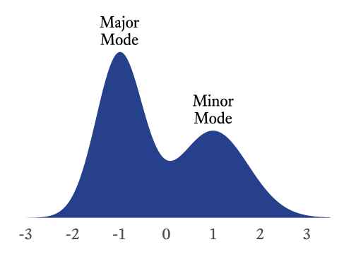
<!--
<p class="caption marginnote">-->(\#fig:bimodal)A bimodal distribution<!--</p>-->
<!--</div>--></span></p>

<div class="wrap-collapsible" style="margin-top: 1em">
<input id="collapsible-bimodalCode" class="toggle" type="checkbox">
<label for="collapsible-bimodalCode" class="lbl-toggle">R Code</label><div class="collapsible-content">
<div class="content-inner">

```r
# A bimodal distribution
tibble(x = seq(-3, 3.5, .01),
       y = dnorm(x, -1, 0.5) / 0.8 + dnorm(x, 1, 0.75)) %>% 
  ggplot(aes(x, y)) + 
  geom_area(fill = myfills[1]) +
  geom_text(data = . %>% dplyr::filter(x == -1), 
            vjust = -0.25, 
            label = "Major\nMode", 
            size = 8, 
            lineheight = 0.9) +
  geom_text(data = . %>% dplyr::filter(x == 1), 
            vjust = -0.25, 
            label = "Minor\nMode", 
            size = 8, 
            lineheight = 0.9) +
  scale_x_continuous(NULL, minor_breaks = NULL, breaks = seq(-3, 3)) +
  scale_y_continuous(NULL, breaks = NULL, expand = expansion(c(0,.25))) + 
  theme_minimal(base_size = 30, base_family = bfont) + 
  theme(panel.grid.major.x = element_blank()) 
```

</div></div></div>

To compute the mode of a variable, use the `mfv` (most frequent value) function from the modeest package [@R-modeest]:


```r
library(modeest)
mfv(c(1,2,2,2,2,3,3))
```

```
## [1] 2
```


### Median

The [median]{.defword}<label for="tufte-mn-" class="margin-toggle">&#8853;</label><input type="checkbox" id="tufte-mn-" class="margin-toggle"><span class="marginnote">The **median** is the point that divides the lower 50 percent of a distribution from the upper 50 percent.</span> is midpoint of a distribution, the point that divides the lower half of the distribution from the upper half. To calculate the median, you first need to sort the scores. If there is an odd number of scores, the median is the middle score. If there an even number of scores, it is the mean of the two middle scores. There are other definitions of the median that are a little more complex, but rarely is precision needed for calculating the median.

To find the median using a frequency distribution table, find the first sample space element with a cumulative proportion greater than 0.5. For example, in the distribution shown in Table&nbsp;\@ref(tab:mediantable), the first cumulative proportion greater than 0.5 occurs at 5, which is therefore the median.

<table>
<caption>(\#tab:mediantable)Finding the Median in a Frequency Distribution Table.<br>In this case, the median is 5 because it has the first cumulative proportion that is greater than 0.5.</caption>
 <thead>
  <tr>
   <th style="text-align:right;"> *X* </th>
   <th style="text-align:right;"> Frequency </th>
   <th style="text-align:right;"> Cumulative Frequency </th>
   <th style="text-align:right;"> Proportion </th>
   <th style="text-align:right;"> Cumulative Proportion </th>
  </tr>
 </thead>
<tbody>
  <tr>
   <td style="text-align:right;"> 1 </td>
   <td style="text-align:right;"> 1 </td>
   <td style="text-align:right;"> 1 </td>
   <td style="text-align:right;"> .14 </td>
   <td style="text-align:right;"> .14 </td>
  </tr>
  <tr>
   <td style="text-align:right;"> 5 </td>
   <td style="text-align:right;"> 3 </td>
   <td style="text-align:right;"> 4 </td>
   <td style="text-align:right;"> .43 </td>
   <td style="text-align:right;"> .57 </td>
  </tr>
  <tr>
   <td style="text-align:right;"> 7 </td>
   <td style="text-align:right;"> 1 </td>
   <td style="text-align:right;"> 5 </td>
   <td style="text-align:right;"> .14 </td>
   <td style="text-align:right;"> .71 </td>
  </tr>
  <tr>
   <td style="text-align:right;"> 9 </td>
   <td style="text-align:right;"> 2 </td>
   <td style="text-align:right;"> 7 </td>
   <td style="text-align:right;"> .29 </td>
   <td style="text-align:right;"> 1.00 </td>
  </tr>
</tbody>
</table>

If a sample space element's cumulative proportion is exactly 0.5, average that sample space element with the next highest value. For example, in the distribution in Table&nbsp;\@ref(tab:frequencydistributiontable), the cumulative proportion for 4 is exactly 0.5 and the next value is 6. Thus the median is $\frac{4+6}{2}=5$.

The median can be computed for ordinal, interval, and ratio variables, but not for nominal variables. Because they have no order, nominal variables have no middle score.

The `median` function can compute the median:


```r
median(c(1,2,3))
```

```
## [1] 2
```


### Mean

The [arithmetic mean]{.defword}<label for="tufte-mn-" class="margin-toggle">&#8853;</label><input type="checkbox" id="tufte-mn-" class="margin-toggle"><span class="marginnote">The **arithmetic mean** is the balance point of a disribution.</span> is the sum of all values of a distribution divided by the size of the distribution.

$$\mu_X = \frac{\sum_{i = 1}^n {X_i}}{n}$$

Where \begin{align*}
  \mu_X &= \text{The population mean of } X\\
  n &= \text{The number of values in } X
\end{align*}

The arithmetic mean can only be calculated with interval or ratio variables. Why? The formula for the mean requires adding numbers, and the operation of addition is not defined for ordinal and nominal values.

The arithmetic mean is usually the preferred measure of central tendency for interval and ration variables because it is usually more stable from sample to sample than the median and the mode.


<table>
<caption>(\#tab:proconCT)Comparing Central Tendency Measures</caption>
 <thead>
  <tr>
   <th style="text-align:left;"> Feature </th>
   <th style="text-align:left;"> Mode </th>
   <th style="text-align:left;"> Median </th>
   <th style="text-align:left;"> Mean </th>
  </tr>
 </thead>
<tbody>
  <tr>
   <td style="text-align:left;"> Standard Error </td>
   <td style="text-align:left;"> Larger </td>
   <td style="text-align:left;"> Smaller </td>
   <td style="text-align:left;"> Smallest </td>
  </tr>
  <tr>
   <td style="text-align:left;"> Algebraic Formula </td>
   <td style="text-align:left;"> No </td>
   <td style="text-align:left;"> No </td>
   <td style="text-align:left;"> Yes </td>
  </tr>
  <tr>
   <td style="text-align:left;"> Unique Value </td>
   <td style="text-align:left;"> No </td>
   <td style="text-align:left;"> Yes </td>
   <td style="text-align:left;"> Yes </td>
  </tr>
  <tr>
   <td style="text-align:left;"> Sensitive to Outliers/Skewness </td>
   <td style="text-align:left;"> No </td>
   <td style="text-align:left;"> No </td>
   <td style="text-align:left;"> Yes </td>
  </tr>
  <tr>
   <td style="text-align:left;"> Computable for Nominal Variables </td>
   <td style="text-align:left;"> Yes </td>
   <td style="text-align:left;"> No </td>
   <td style="text-align:left;"> No </td>
  </tr>
  <tr>
   <td style="text-align:left;"> Computable for Ordinal Variables </td>
   <td style="text-align:left;"> Yes </td>
   <td style="text-align:left;"> Yes </td>
   <td style="text-align:left;"> No </td>
  </tr>
  <tr>
   <td style="text-align:left;"> Computable for Interval Variables </td>
   <td style="text-align:left;"> Yes </td>
   <td style="text-align:left;"> Yes </td>
   <td style="text-align:left;"> Yes </td>
  </tr>
  <tr>
   <td style="text-align:left;"> Computable for Ratio Variables </td>
   <td style="text-align:left;"> Yes </td>
   <td style="text-align:left;"> Yes </td>
   <td style="text-align:left;"> Yes </td>
  </tr>
</tbody>
</table>

## Expected Values

At one level, the concept of the [expected value]{.defword}<label for="tufte-mn-" class="margin-toggle">&#8853;</label><input type="checkbox" id="tufte-mn-" class="margin-toggle"><span class="marginnote">The **expected value** of a random variable is the population mean of the values that the random variable generates.</span> of a random variable is really simple; it is just the population mean of the variable. So why don't we just talk about population means and be done with this "expected value" business? It just complicates things! True. In this case, however, there is value in letting some simple things appear to become complicated for a while so that later we can show that some apparently complicated things are actually simple.

Why can't we just say that the expected value of a random variable is the population mean? You are familiar, of course, with the formula for a mean. You just add up the numbers and divide by the number of numbers $n$:

$$
m_X=\frac{\sum_{i=1}^{n} {x_i}}{n}
$$

Fine. Easy. Except...hmm...random variables generate an infinite number of numbers. Dividing by infinity is tricky. We'll have to approach this from a different angle...

The expected value of a random variable is a weighted mean. A mean of what? Everything in the sample space. How are the sample space elements weighted? Each element in the sample space is multiplied by its probability of occurring.

<p><span class="marginnote shownote">
<!--
<div class="figure">-->
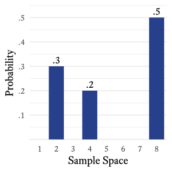
<!--
<p class="caption marginnote">-->(\#fig:pmfX)Probability distribution of a hypothetical random variable<!--</p>-->
<!--</div>--></span></p>


Suppose that the sample space of a random variable *X* is {2, 4, 8} with respective probabilities of {0.3, 0.2, 0.5}, as shown in Figure&nbsp;\@ref(fig:pmfX). 

<div class="wrap-collapsible" style="margin-top: 1em">
<input id="collapsible-pmfXCode" class="toggle" type="checkbox">
<label for="collapsible-pmfXCode" class="lbl-toggle">R Code</label><div class="collapsible-content">
<div class="content-inner">

```r
tibble(x = factor(c(2,4,8), levels = 1:8),
       p = c(0.3, 0.2, 0.5)) %>% 
  ggplot(aes(x,p)) + 
  geom_col(fill = myfills[1]) + 
  geom_text(aes(label = prob_label(p)), 
            vjust = -0.4, 
            family = bfont, 
            size = ggtext_size(18)) + 
  theme_minimal(base_family = bfont, 
                base_size = 18) + 
  scale_y_continuous("Probability", 
                     expand = expansion(mult = c(.01, .10)),
                     breaks = seq(0,1,.1),
                     labels = prob_label
                     ) + 
  scale_x_discrete("Sample Space", drop = F ) + 
  theme(panel.grid.major.x = element_blank())
```

</div></div></div>


The notation for taking the expected value of a random variable $X$ is $\mathcal{E}(X)$. Can we find the mean of this variable $X$ even if we do not have any samples it generates? Yes. To calculate the expected value of $X$, multiply each sample space element by its associated probability and then take the sum of all resulting products. Thus,

$$
\begin{align*}
\mathcal{E}(X)&=\sum_{i=1}^{3}{p_i x_i}\\
&= p_1x_1+p_2x_2+p_3x_3\\
&= (.3\times 2)+(.2\times 4)+(.5\times 8)\\
&=5.4
\end{align*}
$$


The term *expected value* might be a little confusing. In this case, 5.4 is the expected value of $X$ but $X$ never once generates a value of 5.4. So the expected value is not "expected" in the sense that we expect to see it often. It is expected to be close to the mean of any randomly selected sample of the variable that is sufficiently large:

$$
\mathcal{E}(X)=\lim_{n \to \infty} \frac{1}{n}\sum_{i=1}^{n} {x_i}
$$

If a random variable $X$ is discrete, its expected value $\mathcal{E}(X)$ is the sum of each member of the sample space $x_i$ multiplied by its probability of occurring $p_i$. The probability of occurring is the output of $X$'s probability density function at that location ($p_i=f_X(x_i)$. Thus,

$$
\mathcal{E}(X)=\sum_{i=-\infty}^{\infty}{x_i f_X(x_i)}
$$

With continuous variables, the number of elements in a sample is infinite. Fortunately, calculus was designed to deal with this kind of infinity. The trick is to imagine that the continuous variable is sliced into bins and that the bins are sliced ever more thinly. If a continuous random variable has probability density function $f_X(x)$, the expected value is

$$
\mathcal{E}(X)=\int_{-\infty}^{\infty} {x f_X(x)\,\mathrm{d}x}
$$


If we multiply each value of $X$ by the height of its bin ($p$), we get the mean of the binned distribution. If the bins become ever thinner, as in Figure \@ref(fig:thinbins), the product of $X$ and $p$ approximates the expected value of the smooth continuous distribution.

<div class="figure" style="text-align: center">

<p class="caption marginnote shownote">(\#fig:thinbins)Slicing the standard normal distribution into ever thinner bins</p>
</div>

<div class="wrap-collapsible" style="margin-top: 1em">
<input id="collapsible-thinbinsCode" class="toggle" type="checkbox">
<label for="collapsible-thinbinsCode" class="lbl-toggle">R Code</label><div class="collapsible-content">
<div class="content-inner">

```r
# Slicing the standard normal distribution into ever thinner bins
make_bins <- function(binPower, binWidth, LowerBound, UpperBound) {
  tibble(x = seq(LowerBound, UpperBound, binWidth), binPower, binWidth)
}

pmap_df(tibble(binPower = 0:4, 
               binWidth = 2 ^ (-1 * binPower), 
               LowerBound = -4, 
               UpperBound = 4), 
        make_bins) %>% 
  mutate(p = pnorm(x + binWidth / 2) - pnorm(x - binWidth / 2),
         width_label = factor(2 ^ binPower, 
                              levels = 2 ^ (0:4),
                              labels = c("Width = 1",
                                         paste0("Width = 1/",
                                                2 ^ (1:4))))) %>%
  ggplot(aes(x, p)) + 
  geom_col(aes(width = binWidth), 
           fill = myfills[1], 
           color = "white", 
           lwd = 0.1) + 
  facet_grid(width_label ~ .,  
             scales = "free") + 
  theme_light(base_size = 24, 
              base_family = bfont) + 
  scale_x_continuous(NULL, 
                     breaks = -4:4, 
                     labels = function(x) signs::signs(x, accuracy = 1),
                     # labels =  paste0(if_else(-4:4 < 0,"−",""), abs(-4:4)),
                     # sec.axis = dup_axis(),
                     expand = c(0.01,0)) + 
  scale_y_continuous(NULL, 
                     breaks = NULL) +
  theme(panel.grid = element_blank(), 
        # strip.text.y = element_blank(), 
        strip.placement = "outside",
        strip.text.y = element_text(angle = 0),
        axis.text.x = element_text(hjust = c(rep(.75,4),rep(0.5,5))))
```

</div></div></div>


## Measures of Variability

### Variability of Nominal Variables

For most purposes, the visual inspection of a frequency distribution table or bar plot is all that is needed to understand a nominal variable's variability. I have never needed a statistic that measures the variability of a nominal variable, but if you need one, there are [many from which to choose](https://en.wikipedia.org/wiki/Qualitative_variation). For example, @Wilcox1973 presented this analog to variance for nominal variables:

$$
\text{VA} = 1-\frac{1}{n^2}\frac{k}{k-1}\sum_{i=1}^k\left(f_i-\frac{n}{k}\right)^2
$$

The qualvar package [@R-qualvar] can compute the primary indices of qualitative variation presented by Wilcox.


```r
library(qualvar)

# Frequencies
frequencies =  c(A = 60, B = 10, C = 25, D = 5)

# VA
VA(frequencies)
```

```
## [1] 0.7533333
```


<p><span class="marginnote shownote">
<!--
<div class="figure">-->
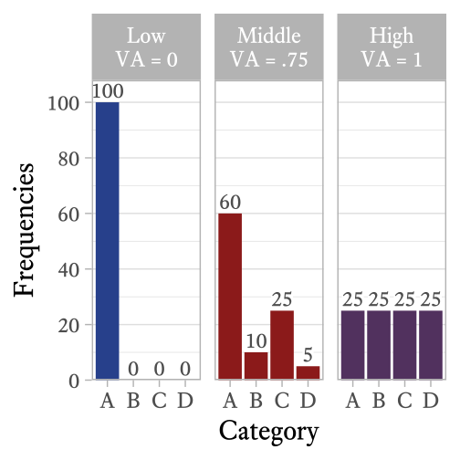
<!--
<p class="caption marginnote">-->(\#fig:nominalvar)The Variance Analog (VA) index of qualitative variation ranges from 0 to 1. It equals 0 when every data point is assigned to the same category and 1 when each category has the same frequency.<!--</p>-->
<!--</div>--></span></p>


<div class="wrap-collapsible" style="margin-top: 1em">
<input id="collapsible-nominalvarCode" class="toggle" type="checkbox">
<label for="collapsible-nominalvarCode" class="lbl-toggle">R Code</label><div class="collapsible-content">
<div class="content-inner">

```r
# The Variance Analog (VA) index of qualitative variation
low_var <- c(A = 100, B = 0, C = 0, D = 0)
mid_var =  c(A = 60, B = 10, C = 25, D = 5)
high_var = c(A = 25, B = 25, C = 25, D = 25)


tibble(Variability = c("Low", "Middle", "High"),
       Frequency = list(low_var, mid_var, high_var),
       VA = map_dbl(Frequency, VA)) %>% 
  mutate(Frequency = map(Frequency, function(d) as.data.frame(d) %>% 
                           tibble::rownames_to_column("Category")),
         Variability = paste0(Variability, 
                              "\nVA = ", 
                              prob_label(VA)) %>% 
           fct_inorder()) %>% 
  unnest(Frequency) %>%  
  rename(Frequencies = d) %>% 
  ggplot(aes(Category, Frequencies)) +
  geom_col(aes(fill = Variability)) + 
  geom_text_fill(aes(label = Frequencies), 
             vjust = -.3, 
             color = "gray30", 
             size = ggtext_size(30)) +
  scale_y_continuous(expand = expansion(mult = c(0, 0.08)), 
                     breaks = seq(0,100,20), 
                     minor_breaks = seq(0,100,10)) +
  scale_fill_manual(values = myfills) +
  facet_grid(cols = vars(Variability)) + 
  theme_light(base_family = bfont, base_size = 30) + 
  theme(panel.grid.major.x = element_blank(), 
        legend.position = "none")
```

</div></div></div>


In all of these indices of qualitative variation, the lowest value is 0 when every data point belongs to the same category (See Figure&nbsp;\@ref(fig:nominalvar), left panel). Also, the maximum value is 1 when the data points are equally distributed across categories (See Figure&nbsp;\@ref(fig:nominalvar), right panel).

### Variability of Ordinal Variables

As with nominal variables, a bar plot or frequency distribution table can tell you most of what you want to know about the variability of an ordinal variable. If you need a quantitative measure of how much an ordinal variable varies, you have many options.


<!--chapter:end:04-Descriptive-Statistics.Rmd-->


# Notation {-}

## Random variables, vectors, and matrices

* Random variables are capital letters such as $X$ and $Y$.
* A particular value of $X$ is $x$.
* Vectors are bold lowercase symbols (e.g., $\boldsymbol{a}$,  $\boldsymbol{\theta}$).
* Matrices are bold uppercase symbols (e.g., $\boldsymbol{A}$, $\boldsymbol{\Theta}$).

Unfortunately, if vectors are lowercase and random variables are uppercase, my notation comes in conflict when discussing a vector of random variables (i.e., the variables as theoretical entities, not their particular scores). Such a vector will be a bold uppercase letter, (e.g., $\boldsymbol{X}$). A vector of particular scores from the variables in $\boldsymbol{X}$ will be shown as $\boldsymbol{x}$.

## Sets and intervals

A *set* is a collection of distinct objects. 

Expression | Meaning
:----------|:--------------------------------------
$\{a,b\}$ | A set consisting of two numbers, $a$ and $b$
$\lbrack a,b\rbrack$ | The set of real numbers in the interval between $a$ and $b$, inclusive
$(a,b)$ | The set of real numbers in the interval between $a$ and $b$, exclusive
$(a,b\rbrack$ | The set of real numbers in the interval between $a$ and $b$, excluding $a$ but including $b$
$\mathbb{R}$ | The set of all real numbers $[-\infty,\infty]$
$\mathbb{Z}$ | The set of all integers $\{\ldots,-2,-1,0,1,2,\ldots\}$
$\mathbb{N}_0$ | The set of all non-negative integers: $\{ 0,1,2,...\}$
$\mathbb{N}_1$ | The set of all positive integers: $\{ 1,2,3,...\}$
$\in$ | Is a member of (i.e., $X \in (a,b)$ means that $X$ is a member of the set of numbers between $a$ and $b$)

## Summation 

There are several ways to show that a variable is to be summed. The summation sign looks like a really big &Sigma;, the capital Greek letter sigma. 

$$\sum_{i = 1}^k X_i$$


## Other 

Expression | Meaning
:----------|:--------------------------------------
$\{a,b\}$ | A set consisting of two numbers, $a$ and $b$
$\lbrack a,b\rbrack$ | The set of real numbers in the interval between $a$ and $b$, inclusive
$(a,b)$ | The set of real numbers in the interval between $a$ and $b$, exclusive
$(a,b\rbrack$ | The set of real numbers in the interval between $a$ and $b$, excluding $a$ but including $b$
$\mathbb{R}$ | The set of all real numbers $[-\infty,\infty]$
$\mathbb{Z}$ | The set of all integers $\{\ldots,-2,-1,0,1,2,\ldots\}$
$\mathbb{N}_0$ | The set of all non-negative integers: $\{ 0,1,2,...\}$
$\mathbb{N}_1$ | The set of all positive integers: $\{ 1,2,3,...\}$
$\in$ | Is a member of
$\binom{n}{k}$ | The \emph{binomial coefficient}. It is just a shortcut notation for $\binom{n}{k}=\frac{n!}{k!\left(n-k\right)!}$. Read aloud, $\binom{n}{k}$ is ``$n$ choose $k$'' or the number of combinations that $n$ things have when taken $k$ at a time.
$f_X(x;\boldsymbol{\theta})$ | The probability density function or probability mass function of $X$ with parameters $\boldsymbol{\theta}$
$F_X(x;\boldsymbol{\theta})$ | The cumulative distribution function of $X$ with parameters $\boldsymbol{\theta}$
$E(X)$ | The expected value of $X$
$\mu_X, m_X$ | The population and sample mean of $X$
$\sigma_X, s_X$ | The population and sample standard deviation of $X$
$\sigma_X^2, s_X^2$ | The population and sample variance of $X$
$\gamma_1, g_1$ | The population and sample skewness
$\gamma_2, g_2$ | The population and sample kurtosis
$\boldsymbol{R_A}$ | The correlation matrix of the column variables in matrix $\boldsymbol{A}$
$\boldsymbol{A'}$ | The transpose of matrix $\boldsymbol{A}$
$\boldsymbol{A}^{-1}$ | The inverse of matrix $\boldsymbol{A}$
$\mathtt{diag}(\boldsymbol{A})$ | The column vector formed from the diagonal of matrix $\boldsymbol{A}$
$\mathtt{diag}(\boldsymbol{a})$ | The diagonal matrix formed from column vector $\boldsymbol{a}$
$\boldsymbol{1}$ | A column vector of ones. Its length can be inferred by context.
$\boldsymbol{I}$ | An identity matrix. Its dimensions can be inferred by context.

<!--chapter:end:20-notation.Rmd-->


# References {-}


<!--chapter:end:99-references.Rmd-->

