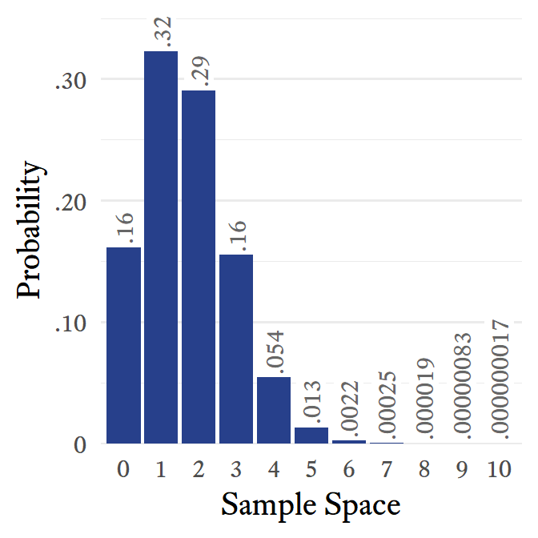
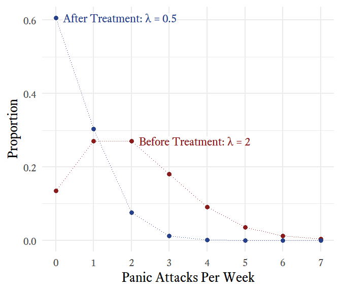
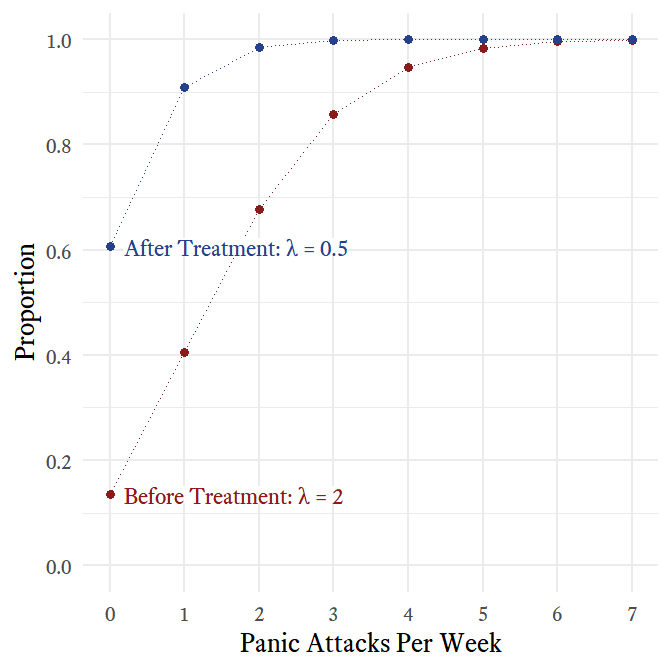
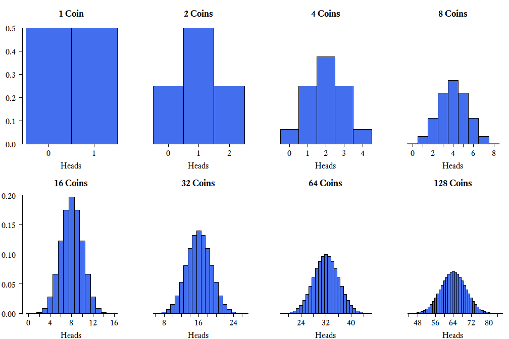
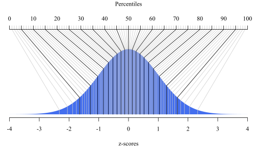

--- 
title: "Practical Psychometrics: A Psychological Assessment Toolkit"
author: "W. Joel Schneider"
date: "2018-07-30"
site: bookdown::bookdown_site
output:
  bookdown::tufte_html_book:
    toc: yes
    css: toc.css
    margin_references: true
    tufte_features: []
    keep_md: true
    split_by: chapter
documentclass: book
bibliography: [book.bib, packages.bib]
biblio-style: apalike
csl: apa.csl
link-citations: yes
github-repo: wjschne/psychtoolkit
description: "This is a minimal example of using the bookdown package to write a book. The output format for this example is bookdown::gitbook."
---

# Preface {-}

Placeholder


<!--chapter:end:index.Rmd-->


# Notation {-}

Placeholder


<!--chapter:end:01-notation.Rmd-->

# Introduction {#intro}

Although great painters can make good art with cheap brushes, they need high quality tools to work at the upper limits of their craft. On the other hand, giving an untrained person an expensive set of brushes is unlikely to result in noticeably better art. So it is with these tools. They are of little use to unprepared hands---and in foolish hands, they might even be dangerous. But in hands caring and competent, they can make reasoning more rigorous, results more robust, and recommendations more relevant.

It takes a really long time to complete a comprehensive psychological assessment. Interviews, test administration, and behavioral observations take many hours. Scoring tests and integrating test information can take even more time. Then there is the considerable task of actually writing the report.^[Putting together my first psychological evaluation report one summer in Texas, I labored, fretted, and sweated for more than 30 hours! Even now, at my fastest, it still takes me about 3 hours of uninterrupted work to write what I consider to be a good report.] Finally, the results of the report are presented to the client and other decision-makers. If this much time is put into the process, it makes sense to make the most of it. Unfortunately, while making the most of it, it is easy to go too far---making reckless recommendations from iffy inferences and flights of fancy.

Humans are very very good at some things that are extraordinarily complex, such as pattern recognition. Humans are not so great at combining numeric data in their heads to come to valid conclusions. When Andy  @clark2004natural [p. 5] said that biological brains are "to put it bluntly, bad at logic, good at Frisbee," it was no insult to Frisbee aficionados---robots are no match for humans at the sport. Furthermore, certain kinds of formal logic, though once considered to be the pinnacle of human intellect, are actually fairly simple for computers. Thus, we should let computers do what they do best: calculate. We humans have the job of deciding which calculations the computers should perform, interpreting what the results mean, and deciding how the new information should be used.

Most introductory psychometrics textbooks are designed to help researchers create well constructed tests and therefore cover many details that are not useful to clinicians and fail to cover many practical issues that clinicians should know about. This book is intended to help you extract useful information from the data you already have in ways that you may not have known were possible. That my emphasis is on the practical in no way implies that this book is dumbed down. My aim is to make psychometrics useful to clinicians. If some useful ideas are complex, I hope to make them accessible---but without resorting to superficial glossing. Some background knowledge of psychometrics is necessary to understand how these tools work and, more importantly, when their underlying assumptions have been violated.

This book probably never would have been written had I not several years ago stumbled across @ley1972quantitative *Quantitative aspects of psychological assessment*. I admire the book's blend of clarity, practicality, and depth. Why did I write my own book instead of recommending that clinicians download and use Ley's book?^[Although *Quantitative aspects of psychological assessment* is out of print, Ley has been made it freely available for download: [www.psychassessment.com.au/](http://www.psychassessment.com.au/)] Well, I do recommend reading Ley's book. In contrast to my approach, Ley often takes time to gently lay out mathematical proofs of many ideas. Thus Ley's book is a great introduction to the often considerably less accessible corpus of academic writings on psychometrics. I wanted to present much of the same material but with more of an eye to application. I also wanted to present many ideas not included in Ley's book. In addition, I chose to write this book because I believe that Ley had the right idea but that in an era in which no one had a home computer, few clinicians would have the knowledge, motivation, and stamina to use his equations on a regular basis. Now that computers are used by all clinicians, equations like those presented by Ley can be be made easy to use. All of the ``tools'' in this toolkit have been made into computer programs which can be downloaded for free at my website:

http://mysite.com

<!--chapter:end:02-intro.Rmd-->


# Variables

Placeholder


## Nominal scales {#nominal}
## Ordinal scales
## Interval scales}
## Ratio scales
## Discrete vs. Continuous Variables {#sec:DiscreteVsContinuous}

<!--chapter:end:03-variables.Rmd-->

# Probability Distributions

## Random Variables

Because we first learn about variables in an algebra class, we tend to think of variables as having values that can be solved for---if we have enough information about them. If I say that $x$ is a variable and that $x+6=8$, we can use algebra to find that $x$ must equal 2.

*Random variables*<label for="tufte-mn-" class="margin-toggle">&#8853;</label><input type="checkbox" id="tufte-mn-" class="margin-toggle"><span class="marginnote">*Random variables* have values that are determined by a random process.</span> are not like algebraic variables. Random variables simply take on values because of some random process. If we say that the outcome of a throw of a six-sided die is a random variable, there is nothing to "solve for." There is no equation that determines the value of the die. Instead, it is determined by chance and the physical constraints of the die. That is, the outcome must be one of the numbers printed on the die and the six numbers are equally likely to occur. This illustrates an important point. The word *random* here does not mean "anything can happen." Random variables have outcomes that are subject to random processes, but those random processes *do*  have constraints on them such that some outcomes are more likely than others---and some outcomes never occur at all.

When we say that the throw of a six-sided die is a random variable, we are not talking about any particular throw of a particular die but, in a sense, *every* throw (that has ever happened or ever could happen) of *every* die (that has ever existed or could exist). Imagine an immense, roaring, neverending, cascading flow of dice falling from the sky. As each die lands and disappears, a giant scoreboard nearby records the relative frequencies of ones, twos, threes, fours, fives, and sixes. That's a random variable.

## Sample Spaces {#sec:SampleSpace}

The set of all possible outcomes of a random variable is the *sample space*.<label for="tufte-mn-" class="margin-toggle">&#8853;</label><input type="checkbox" id="tufte-mn-" class="margin-toggle"><span class="marginnote">A *sample space* is the set of all possible values that a random variable can assume.</span> Continuing with our example, the sample space of a single throw of a six-sided die is the set $\big\{$\tikz [baseline=.125ex]{\drawdie [scale=0.8]{1}},\tikz [baseline=.125ex]{\drawdie [scale=0.8]{2}},\tikz [baseline=.125ex]{\drawdie [scale=0.8]{3}},\tikz [baseline=.125ex]{\drawdie [scale=0.8]{4}},\tikz [baseline=.125ex]{\drawdie [scale=0.8]{5}},\tikz [baseline=.125ex]{\drawdie [scale=0.8]{6}}$\big\}$. *Sample space} is a curious term. Why *sample} and why *space}? With random variables, *populations*<label for="tufte-mn-" class="margin-toggle">&#8853;</label><input type="checkbox" id="tufte-mn-" class="margin-toggle"><span class="marginnote">A *population* consists of all entities under consideration.</span> are infinitely large, at least theoretically. Random variables just keep spitting out numbers forever! So any time we actually observe numbers generated by a random variable, we are always observing a *sample*;<label for="tufte-mn-" class="margin-toggle">&#8853;</label><input type="checkbox" id="tufte-mn-" class="margin-toggle"><span class="marginnote">A *sample* is a subset of a population.</span> actual infinites cannot be observed in their entirety. A *space* is a set that has mathematical structure. Most random variables generate either integers or real numbers, both of which are structured in many ways (e.g., order).

Unlike distributions having to do with dice, many distributions have a sample space with an infinite number of elements. Actually there are two kinds of infinity we can consider. One distribution we will discuss later is the Poisson distribution. Its sample space is the set of whole numbers: $\{0,1,2,...\}$, which extends to positive infinity. The sample space of continuous variables is infinitely large for another reason. Between any two points in a continuous distribution, there is an infinite number of other points. For example, in the continuous uniform distribution, the sample space consists of all real numbers between two points. Many continuous distributions have sample spaces that involve both kinds of infinity. For example, the sample space of the normal distribution consists of all real numbers from negative infinity to positive infinity.

## Probability Distributions {#sec:ProbabilityDistribution}

\begin{marginfigure}
\begin{center}
\begin{tikzpicture}
\foreach \n in {1,...,6} {
\node at ($(0,7)-(0,\n)$) {\drawdie [scale=2]{\n}};
\node [fill=gray!50, minimum height=2cm, minimum width=0.1cm, single arrow, single arrow head extend=.2cm, single arrow head indent=.1cm, inner sep=1mm] at ($(1.5,7)-(0,\n)$) {};
\node  (p1) at (3,\n) {\large{$\sfrac{1}{6}$}};
}
  \node [text centered,anchor=south,text height=1.5ex,text depth=.25ex] (p3) at (0,7) {\large{\textbf{Sample Space}}};
  \node [text centered,anchor=south,text height=1.5ex,text depth=.25ex] (p4) at (3,7) {\large{\textbf{Probability}}};
 \end{tikzpicture}
\caption{The probability distribution of a throw of a single die}
\label{fig:dice}
\end{center}
\end{marginfigure}

Each element of a random variable's sample space has some probability associated with it. When we list the probabilities of each possible outcome, we have specified the variable's *probability distribution*<label for="tufte-mn-" class="margin-toggle">&#8853;</label><input type="checkbox" id="tufte-mn-" class="margin-toggle"><span class="marginnote">In a *probability distribution*, there is an assignment of a probability to each possible element in a variable's sample space.</span>. In other words, if we know the probability distribution of a variable, we know how probable each outcome is. In the case of a throw of a single die, each outcome is equally likely (Figure \@reg(fig:dice)). 

There is an infinite variety of probability distributions, but a small subset of them have been given names. Now, one can manage one's affairs quite well without ever knowing what a Bernoulli distribution is, or what a $\chi{^2}$ distribution is, or even what a normal distribution is. However, sometimes life is a little easier if we have names for useful things that occur often. Most of the distributions with names are not really single distributions, but families of distributions. The various members of a family are unique but they are united by the fact that their probability distributions are generated by a particular mathematical function (more on that later). In such cases, the probability distribution is often represented by a graph in which the sample space is on the $X$-axis and the associated probabilities are on the $Y$-axis. In Figure \@reg(fig:pdfIllustration), 16 probability distributions that might be interesting and useful to clinicians are illustrated. Keep in mind that what are pictured are only particular members of the families listed; some family members look quite different from what is shown in Figure \@reg(fig:pdfIllustration).

\begin{figure*}
\centering


\caption{A gallery of useful distributions}
\label{fig:pdfIllustration}
\end{figure*}

## Discrete Uniform Distributions {#sec:DiscreteUniform}

The throw of a single die is a member of a family of distributions called the *discrete uniform distribution*.<label for="tufte-mn-" class="margin-toggle">&#8853;</label><input type="checkbox" id="tufte-mn-" class="margin-toggle"><span class="marginnote">A *discrete uniform distribution* is a family of random variable distributions in which the sample space is an evenly spaced sequence of numbers, each of which is equally likely to occur.</span> It is "discrete" because the elements in the sample space are countable, with evenly spaced gaps between them. For example, there might be a sequence of 8, 9, 10,and 11 in the sample space but there are no numbers in between. It is "uniform" because all outcomes are equally likely. With dice, the numbers range from a lower bound of 1 to an upper bound of 6. In the family of discrete uniform distributions, the lower and upper bounds are typically integers, mostly likely starting with 1. However, any real number $a$ can be the lower bound and the spacing $k$ between numbers can be any positive real number. For the sake of simplicity and convenience, I will assume that the discrete uniform distribution refers to consecutive integers ranging from a lower bound of $a$ and an upper bound of $b$. 

This kind of discrete uniform distribution has a number of characteristics listed below. I will explain each of them in the sections that follow.<label for="tufte-mn-" class="margin-toggle">&#8853;</label><input type="checkbox" id="tufte-mn-" class="margin-toggle"><span class="marginnote">As we go, I will also explain the mathematical notation. For example, $a \in \mathbb{Z}$ means that $a$ is an integer because $\in$ means *is a member of* and $\mathbb{Z}$ is the set of all integers.</span>

\begin{equation*}
\boxed{
\setlength{\extrarowheight}{3pt}
\begin{array}{rccc}
%\text{\textbf{Discrete Uniform Distribution}}&&\\
\text{Lower Bound:} & a  & \hyperref [note:In]{\in} &\hyperref [note:Z]{\mathbb{Z}}\\
\text{Upper Bound:} & b & \in & \mathbb{Z}\\
&&&b>a\\
\text{Sample Space:} & x &\in&\{a,a+1,\hdots,b\}\\
\text{Number of points:} & n&=&b-a+1 \\
\text{Mean:} & \mu&=&\frac{a+b}{2} \\
\text{Variance:} & \sigma^2&=&\frac{n^2-1}{12} \\
\text{Skewness:} & \gamma_1&=&0 \\
\text{Kurtosis:} & \gamma_2&=&-\frac{6(n^2+1)}{5(n^2-1)} \\
\text{Probability Mass Function:} & f_X(x;a,b)&=&\frac{1}{n} \\
\text{Cumulative Distribution Function:} & F_X(x;a,b)&=&\frac{x-a+1}{n} \\
\end{array}
}
\end{equation*}

## Parameters of Random Variables 

The lower bound $a$, the spacing between numbers $k$, and the number of points $n$ are the discrete uniform distribution's *parameters*.<label for="tufte-mn-" class="margin-toggle">&#8853;</label><input type="checkbox" id="tufte-mn-" class="margin-toggle"><span class="marginnote">A *parameter* is a defining feature of a random variable's probability distribution.</span> If we restrict ourselves to the more common case in which the sample space consists of consecutive integers, we can say that the parameters are simply the lower bound $a$ and the upper bound $b$. The word *parameter* has many meanings but here it refers to a characteristic of a distribution family that helps us identify precisely which member of the family we are talking about. Most distribution families have one, two, or three parameters. 

If you have taken an algebra class, you have seen parameters before, though the word *parameter* many not have been used. Think about the formula of a line:
\begin{equation*}\label{eq:linear}
y=mx+b
\end{equation*}
Both $x$ and $y$ are variables, but what are $m$ and $b$? Well, you probably remember that $m$ is the slope of the line and that $b$ is the $y$-intercept. If we know the slope and the intercept of a line, we know exactly which line we are talking about. No additional information is needed to graph the line. Therefore, $m$ and $b$ are the line's *parameters*, because they uniquely identify the line.^[What about other mathematical functions? Do they have parameters? Yes! All of them do! For example, in the equation for a parabola ($y=ax^2+bx+c$), $a$, $b$, and $c$ determine its precise shape.] All lines have a lot in common but there is an infinite variety of lines because the parameters, the slope and the intercept, can take on the value of any real number. Each unique combination of parameter values (slope and intercept) will produce a unique line. So it is with probability distribution families. All family members are alike in many ways but they also differ because of different parameter values.

The discrete uniform distribution (i.e., the typical variety consisting of consecutive integers) is defined by the lower and upper bound. Once we know the lower bound and the upper bound, we know exactly which distribution we are talking about.^[If we allow the lower bound to be any real number and the spacing to be any positive real number, the discrete uniform distribution can be specifed by three parameters: the lower bound $a$, the spacing between numbers $k$ ($k>0$), and the number of points $n$ ($n$>1). The upper bound $b$ of such a distribution would be $b=a+k(n-1)$] Not all distributions are defined by their lower and upper bounds. Indeed, many distribution families are unbounded on one or both sides. Therefore, other features are used to characterize the distributions, such as the population mean.

## Probability Mass Functions {#sec:pmf}

Many distribution families are united by the fact that their probability distributions are generated by a particular mathematical function. For discrete distributions, those functions are called *probability mass functions*.<label for="tufte-mn-" class="margin-toggle">&#8853;</label><input type="checkbox" id="tufte-mn-" class="margin-toggle"><span class="marginnote">A *probability mass function (pmf)* is a mathematical expression that gives the probability that a discrete random variable will equal a particular element of the variable's sample space.</span> In general, a mathematical function is an expression that takes one or more constants (i.e., parameters) and one or more input variables, which are then transformed according to some sort of rule to yield a single number.

A probability mass function transforms a random variable's sample space elements into probabilities. In Figure \@reg(fig:dice), the probability mass function can be thought of as the arrows between the sample space and the probabilities. That is, the probability mass function is the thing that was done to the sample space elements to calculate the probabilities. In Figure \@reg(fig:dice), each outcome of a throw of the the die was mapped onto a probability of  $\sfrac{1}{6}$. Why $\sfrac{1}{6}$, and not some other number? The probability mass function of the discrete uniform distribution tells us the answer. 

\begin{figure}
\centering
\begin{tikzpicture}[>=stealth,scale=0.9]
\definecolor{firebrick2}{RGB}{205,38,38};
\definecolor{royalblue2}{RGB}{67,110,238};
\node [rectangle,draw, rounded corners,text depth=0.25ex](ss) at (0,0) {$\boldsymbol{x}=x_1,x_2,x_3,\ldots,x_n$};
\node [rectangle,draw, rounded corners,text depth=0.25ex](ps) at (7,0) {$\boldsymbol{p}=p_1,p_2,p_3,\ldots,p_n$};
\node [single arrow,fill=royalblue2,single arrow head extend=1.2ex,transform shape,minimum height=0.9cm,text depth=0.25ex] (fx) at (3.5,0) {$\quad\;\; f_X\quad\;\;$};
\node [text depth=2.25ex,text height= 5ex,anchor=south,yshift=-3.5ex](sst) at (0,0.75) {\textbf{Sample Space}};
\node [text depth=2.25ex,text height= 5ex,anchor=south,yshift=-3.5ex](pst) at (7,0.75) {\textbf{Probabilities}};
\node [shape=rectangle,text depth=2.25ex,color=royalblue2,align=center,text height= 5ex,anchor=south,yshift=-3.5ex](pmf) at (3.5,0.75) {\textbf{Probability}\\
\textbf{Mass Function}};
\node [text depth=2.25ex,text height= 5ex,anchor=south,yshift=-3.5ex] (pt) at (3.5,-1.5) {\textbf{Parameters}};
\draw[->] (3.5,-1.15) to (3.5,-0.5);
\node [rectangle,draw, rounded corners,text depth=0.25ex] (pts) at (3.5,-2.25) {$\boldsymbol{\theta}=\theta_1,\theta_2,\theta_3,\ldots,\theta_k$};
\node [align=center,shape=rectangle,rounded corners,draw](formula) at (3.5,4) {\textbf{\Large{Scary~Math!}}\\
$f_X\left(\boldsymbol{x};\boldsymbol{\theta}\right)=\boldsymbol{p}$};
\draw [rounded corners] (-2.5,-3) rectangle (9.5,2.65);
\node at (3.5,2) {\textbf{\large{Slightly Less Scary Math:}}};
\end{tikzpicture}
\caption{Though one may be scarier than the other, both boxes mean the same thing: Probability mass functions tell us how probable each sample space element is.}
\label{fig:pmf}
\end{figure}

The probability mass function of the discrete uniform distribution is fairly simple but the notation can be intimidating at first (Figure \@reg(fig:pmf)). By convention, a single random variable is denoted by a capital letter $X$. Any particular value of $X$ in its sample space is represented by a lowercase $x$. In other words, $X$ represents the variable in its totality whereas $x$ is merely one value that $X$ can take on. Confusing? Yes, statisticians very work hard to confuse us---and most of the time they succeed! 

The probability mass function of random variable $X$ is denoted by $f_X(x)$. This looks strange at first. It means, "When random variable $X$ generates a number, what is the probability that the outcome will be a particular value $x$?" That is, $f_X(x)=P(X=x)$, where $P$ means "What is the probability that...?" Thus, $P(X=x)$ reads, "What is the probability that random variable $X$ will generate a number equal to a particular value $x$?" So, $f_X(7)$ reads, "When random variable $X$ generates a number, what is the probability that the number will equal 7?"

Most probability mass functions also have parameters, which are listed after a semi-colon. In the case of the discrete uniform distribution consisting of consecutive integers, the lower and upper bounds $a$ and $b$ are included in the function's notation like so: $f_X(x;a,b)$. This reads, "For random variable $X$ with parameters $a$ and $b$, what is the probability that the outcome will be $x$?" Some parameters can be derived from other parameters, as was the case with the number of points $n$ in the sample space of a discrete uniform distribution: $n=b-a+1$. The probability for each outcome in the sample space is the same and there are $n$ possible outcomes. Therefore, the probability associated with each outcome is $\sfrac{1}{n}$.

Putting all of this together, if $a$ and $b$ are integers and $a<b$, for all $n$ integers $x$ between $a$ and $b$,inclusive:
\begin{equation}
f_X(x;a,b)=\frac{1}{b-a+1}=\frac{1}{n}
\end{equation}
Where
\begin{conditions*}
X & A random variable with a discrete uniform distribution\\
f_X & The probability mass function of $X$\\
x & Any particular member of the sample space of $X$\\
a & The lower bound of the sample space\\
b & The upper bound of the sample space\\
n & The number of points in the sample space
\end{conditions*}
You might notice that $x$ is not needed to calculate the probability. Why? Because this is a *uniform} distribution. No matter which sample space element $x$ we are talking about, the probability associated with it is always the same. In all distributions that are not uniform, the position of $x$ matters and thus influences the probability of its occurrence.

## Cumulative Distribution Functions {#sec:CumDist}

The *cumulative distribution function (cdf)*<label for="tufte-mn-" class="margin-toggle">&#8853;</label><input type="checkbox" id="tufte-mn-" class="margin-toggle"><span class="marginnote">A *cumulative distribution function (cdf)* is a mathematical expression that gives the probability that a random variable will equal a particular element of the variable's sample space or less.</span> tells us where a sample space element ranks in a distribution. Whereas the probability mass function tells us the probability that a random variable will generate a particular number, the cumulative distribution function tells us the probability that a random variable will generate a particular number or less. The cumulative distribution function of the roll of a die (Figure \@reg(fig:cdfDie)) tells us that the probability of rolling at least a \drawdie [scale=0.8]{4} is $\sfrac{4}{6}$ (i.e., $\sfrac{2}{3}$).
\begin{figure}
\centering
\begin{tikzpicture}
\foreach \i in {1,...,6} {
  \node at (0,\i){$\sfrac{\i}{6}$};
  \node at (\i,0){\Large{\i}};
  \foreach \j in {1,...,6} {
  \ifnum \j>\i
    \node at (\i,\j) {\drawdie [scale=2]{\j}};
  \else
    \node at (\i,\j) {\drawdie [scale=2,line colour=royalblue,dot colour=royalblue]{\j}};
  \fi
  }
}

\draw [firebrick,very thick,rounded corners] (0.55,0.5)-- ++(0,1)-- ++(1,0)-- ++(0,1)-- ++(1,0)-- ++(0,1)-- ++(1,0)-- ++(0,1)-- ++(1,0)-- ++(0,1)-- ++(1,0)-- ++(0,1)-- ++(1,0)-- ++(0,-6)--cycle;
\node[rotate=-90] at (-0.75,3.5) {\textbf{Probability}};
\node at (3.5,-0.75) {\textbf{Die roll is this value or less}};
\end{tikzpicture}
\caption{The cumulative distribution function of the roll of a die is $F_X(x)=\frac{x}{6}$}.
\label{fig:cdfDie}
\end{figure}

The cumulative distribution function is often distinguished from the probability mass function with a capital $F$ instead of a lowercase $f$. In the case of a discrete uniform distribution consisting of $n$ consecutive integers from $a$ to $b$, the cumulative distribution function is:
\begin{equation}
F_X(x;a,b)=\frac{x-a+1}{b-a+1}=\frac{x-a+1}{n}
\end{equation}
Where
\begin{conditions*}
X & A random variable with a discrete uniform distribution\\
F_X & The cumulative distribution function of $X$\\
x & Any particular member of the sample space of $X$\\
a & The lower bound of the sample space\\
b & The upper bound of the sample space\\
n & The number of points in the sample space
\end{conditions*}

## Quantile functions {#sec:Quantile}

The inverse of the cumulative distribution function is the *quantile function*.<label for="tufte-mn-" class="margin-toggle">&#8853;</label><input type="checkbox" id="tufte-mn-" class="margin-toggle"><span class="marginnote">A *quantile function* tells us which value in the sample space of a random variable is greater than a particular proportion of the values the random variable generates.</span> The cumulative distribution starts with a value $X$ in the sample space and tells us $p$, the proportion of values in that distribution that are less than or equal to $X$. A quantile function starts with a proportion $p$ and tells us the value $X$ that splits the distribution such that the proportion $p$ of the distribution is less than or equal to $X$. As seen in Figure \@reg(fig:quantile), if you see a graph of a continuous distribution function, just flip the X and Y axes and you have a graph of a quantile function!

\begin{figure*}
\centering

\caption{The quantile function is the inverse of the cumulative distribution function: Just flip the X and Y axes!}
\label{fig:quantile}
\end{figure*}

## Generating a Random Sample in Excel and R}

To generate a number from the discrete uniform distribution in Excel, use the \textsf{RANDBETWEEN} function. For example, to generate a random number between 1 and 100, in any cell type:\\
\textsf{=RANDBETWEEN(1,100)}\\
This cell can be copied as many times as is needed to generate a random sample.

In R, the `runif` function generates numbers from the \hyperref [sec:Uniform] {continuous uniform distribution}. To make the distribution discrete, the `ceiling` function rounds the numbers up to the nearest integer.^[A common mistake is to use traditional rounding (up \textsc{or} down to the nearest integer), which makes the lower and upper bounds only half as likely to occur as all the numbers in between.]


```r
# n = the sample size
n <- 1000
# a = the lower bound
a <- 1
# b = the upper bound
b <- 100
# s = the sample with a discrete uniform distribution The runif function
# generates a number from the continuous uniform distribution.  The ceiling
# function rounds up to the nearest integer.
s <- ceiling(runif(n, a - 1, b))
# Generate a bare-bones plot of the frequency distribution of the sample
hist(s)
```

## Bernoulli Distributions {#sec:BernoulliDist}
\marginpar{\textbf{Notation notes:}\\
$\lbrack a,b\rbrack $ is the set of all real numbers in the interval between $a$ and $b$.}

\begin{equation*}
\boxed{
\setlength{\extrarowheight}{3pt}
\begin{array}{rccc}
% \text{\textbf{Bernoulli Distribution}}&&\\
\text{Sample Space:} & x&\in&\{0,1\}\\ 
\text{Probability of success in each trial:}  &p&\in&\hyperref [note:Interval]{[0,1]} \\
\text{Mean:} & \mu&=&p \\
\text{Variance:} & \sigma^2&=&p(1-p) \\
\text{Skewness:} & \gamma_1&=&\frac{1-2p}{\sqrt{p(1-p)}} \\
\text{Kurtosis:} & \gamma_2&=&\frac{1}{p(1-p)}-6 \\
\text{Probability Mass Function:} & f_X(x;p)&=&p^x(1-p)^{1-x} \\
\text{Cumulative Distribution Function:} & F_X(x;p)&=&x+p(1-x) \\
\end{array}
}
\end{equation*}

The toss of a single coin has the simplest probability distribution that I can think of---there are only two outcomes and each outcome is equally probable (Figure \@reg(fig:coin)). This is a special case of the *Bernoulli distribution*.<label for="tufte-mn-" class="margin-toggle">&#8853;</label><input type="checkbox" id="tufte-mn-" class="margin-toggle"><span class="marginnote">In the *Bernoulli distribution*, there are only two outcomes: a "success" (1) and a "failure" (0). If a success has a probability $p$ then a failure has a probability of $1-p$.</span> The Bernoulli distribution can describe any random variable that has two outcomes, one of which has a probability $p$ and the other has a probability $q=1-p$. In the case of a coin flip, $p=0.5$. For other variables with a Bernoulli distribution, $p$ can range from 0 to 1. 

\begin{marginfigure}
\begin{center}
\begin{tikzpicture}[scale=0.9]
 \usetikzlibrary{positioning}
\usetikzlibrary{decorations.pathreplacing}
\usetikzlibrary{arrows,shapes,backgrounds, shadows}
  \node (H) at (0,2) {\includegraphics [width=36pt ]{QuarterHeads.png}};
  \node (T) at (0,0) {\includegraphics [width=36pt ]{QuarterTails.png}};
  \node [fill=gray!50, minimum height=1.5cm, minimum width=0.1cm, single arrow, single arrow head extend=.2cm, single arrow head indent=.1cm, inner sep=1mm] (arrowtails1) at (1.65,2) {};
  \node [fill=gray!50, minimum height=1.5cm, minimum width=0.1cm, single arrow, single arrow head extend=.2cm, single arrow head indent=.1cm, inner sep=1mm] (arrowheads2) at (1.65,0) {};
  \node  (p1) at (3,2) {\large{$0.5$}};
  \node  (p2) at (3,0) {\large{$0.5$}};
  \node [text centered,anchor=south,text height=1.5ex,text depth=.25ex] (p3) at (0,3) {\large{\textbf{Sample Space}}};
  \node [text centered,anchor=south,text height=1.5ex,text depth=.25ex] (p4) at (3,3) {\large{\textbf{Probability}}};
 \end{tikzpicture}
\caption{The probability distribution of a coin toss}
\label{fig:coin}
\end{center}
\end{marginfigure}

In psychological assessment, many of the variables we encounter have a Bernoulli distribution. In ability test items in which there is no partial credit, examinees either succeed or fail. The probability of success on an item (in the whole population) is *p*. In other words, *p* is the proportion of the entire population that correctly answers the quesiton. Some ability test items are very easy and the probability of success is high. In such cases, $p$ is close to 1. When $p$ is close to 0, few people succeed and items are deemed hard. Thus, in the context of ability tesing, $p$ is called the *difficulty parameter*.<label for="tufte-mn-" class="margin-toggle">&#8853;</label><input type="checkbox" id="tufte-mn-" class="margin-toggle"><span class="marginnote">The *difficulty parameter* is the proportion of people who succeed on an item (or say 'Yes' or 'True' or otherwise score a 1 on a random variable with a Bernoulli distribution.).</span> This is confusing because when $p$ is high, the item is easy, not difficult. Many people have suggested that it would make more sense to call it the "easiness parameter" but the idea has never caught on.

True/False and Yes/No items on questionnaires also have Bernoulli distributions. If an item is frequently endorsed as true ("I like ice cream."), $p$ is high. If an item is infrequently endorsed ("I like black licorice and mayonnaise in my ice cream."), $p$ is very low. Oddly, the language of ability tests prevails even here. Frequently endorsed questionnaire items are referred to as "easy" and infrequently endorsed items are referred to as "difficult," even though there is nothing particularly easy or difficult about answering them either way.


\subsection{Generating a sample from the Bernoulli distribution}

In Excel, the \textsf{RAND} function generates a random real number between 0 and 1. The \textsf{INT} function rounds down to the nearest integer. To generate either a 0 or a 1, with 1 having a probability of $p$:\\
\textsf{=INT(RAND()+p)}

In R, the same idea is used but the names of functions are different. We have already used the `runif`, which generates real numbers between two values. By default, `runif` has a lower bound of 0 and an upper bound of 1. The `floor` function rounds round to the nearest integer. Using the `runif` and `floor` functions together produces the Bernoulli distribution.


```rbernoullisample
# n = sample size
n <- 1000
# p = probability
p <- 0.8
# s = sample
s <- floor(runif(n) + p)
# bare-bones plot
barplot(table(s))
```

## Binomial Distributions

\begin{equation*}
\boxed{
\setlength{\extrarowheight}{3pt}
\begin{array}{rccc}
% \text{\textbf{Binomial Distribution}}&&\\
\text{Number of Trials:} & n & \in & \hyperref [note:N1]{\mathbb{N}_1}\\
\text{Sample Space:} & x&\in&\{0,...,n\}\\
\text{Probability of success in each trial:}  &p&\in&[0,1] \\
\text{Probability of failure in each trial:}  &q&=&1-p\\
\text{Mean:} & \mu&=&np\\
\text{Variance:} & \sigma^2&=&npq\\
\text{Skewness:} & \gamma_1&=&\frac{1-2p}{\sqrt{npq}} \\
\text{Kurtosis:} & \gamma_2&=&\frac{1}{npq}-\frac{6}{n} \\
\text{Probability Mass Function:} & f_X(x;n,p)&=&\hyperref [note:binomial]{\binom{n}{x}}p^x q^{n-x} \\
\text{Cumulative Distribution Function:} & F_X(x;n,p)&=&\sum_{i=0}^{x}{\binom{n}{i}p^i q^{n-i}} \\
\end{array}
}
\end{equation*}

Let's extend the idea of coin tosses and see where it leads. Imagine that two coins are tossed at the same time and we count how many heads there are. The outcome we might observe will be zero, one, or two heads. Thus, the sample space for the outcome of the tossing of two coins is the set $\{0,1,2\}$ heads. There is only one way that we will observe no heads (both coins tails) and only one way that we will observe two heads (both coins heads). In contrast, as seen in Figure \@reg(fig:twocoin), there are two ways that we can observe one head (heads-tails \& tails-heads).

\begin{marginfigure}[4mm]
\centering
\begin{tikzpicture}[x=1pt,y=1pt,xscale=.4,yscale=.66]
\definecolor[named]{fillColor}{rgb}{1.00,1.00,1.00}
\begin{scope}
\definecolor[named]{drawColor}{rgb}{0.00,0.00,0.00}
\definecolor[named]{fillColor}{rgb}{0.26,0.43,0.93}
\path[draw=drawColor,line width= 0.4pt,line join=round,line cap=round,fill=fillColor] (50, 50.00) rectangle (150,150);
\path[draw=drawColor,line width= 0.4pt,line join=round,line cap=round,fill=fillColor] (150, 50.00) rectangle (250,250);
\path[draw=drawColor,line width= 0.4pt,line join=round,line cap=round,fill=fillColor] (250, 50.00) rectangle (350,150);
\end{scope}
\begin{scope}
\definecolor[named]{drawColor}{rgb}{0.00,0.00,0.00}
\node[text=drawColor,anchor=base,inner sep=0pt, outer sep=0pt, scale=  1] at (100, 30.00) {0};
\node[text=drawColor,anchor=base,inner sep=0pt, outer sep=0pt, scale=  1] at (200, 30.00) {1};
\node[text=drawColor,anchor=base,inner sep=0pt, outer sep=0pt, scale=  1] at (300, 30.00) {2};
\end{scope}
\begin{scope}
\definecolor[named]{drawColor}{rgb}{0.00,0.00,0.00}
\node[text=drawColor,anchor=base,inner sep=0pt, outer sep=0pt, scale=  1.14] at (204.07, 10) {Number of Heads};
\end{scope}
\begin{scope}
\definecolor[named]{drawColor}{rgb}{0.00,0.00,0.00}
\path[draw=drawColor,line width= 0.4pt,line join=round,line cap=round] ( 42, 50) -- ( 42,250);
\path[draw=drawColor,line width= 0.4pt,line join=round,line cap=round] ( 40, 50) -- ( 42, 50);
\path[draw=drawColor,line width= 0.4pt,line join=round,line cap=round] ( 40,150) -- ( 42,150);
\path[draw=drawColor,line width= 0.4pt,line join=round,line cap=round] ( 40,250) -- ( 42,250);
\node[text=drawColor,inner sep=0pt, outer sep=0pt,anchor=east] at ( 37, 50) {0.00};
\node[text=drawColor,inner sep=0pt, outer sep=0pt,anchor=east] at ( 37,150) {0.25};
\node[text=drawColor,inner sep=0pt, outer sep=0pt,anchor=east] at ( 37,250) {0.50};
\end{scope}
\begin{scope}
\definecolor[named]{drawColor}{rgb}{0.00,0.00,0.00}
\node[inner sep=0pt,outer sep=0pt] at ( 100,  80) {\includegraphics [width=36pt ]{QuarterTails.png}};
\node[inner sep=0pt,outer sep=0pt] at ( 100, 120) {\includegraphics [width=36pt ]{QuarterTails.png}};
\node[inner sep=0pt,outer sep=0pt] at (200,  80) {\includegraphics [width=36pt ]{QuarterHeads.png}};
\node[inner sep=0pt,outer sep=0pt] at (200, 120) {\includegraphics [width=36pt ]{QuarterTails.png}};
\node[inner sep=0pt,outer sep=0pt] at (200, 180) { \includegraphics [width=36pt ]{QuarterTails.png}};
\node[inner sep=0pt,outer sep=0pt] at (200, 220) {\includegraphics [width=36pt ]{QuarterHeads.png}};
\node[inner sep=0pt,outer sep=0pt] at (300,  80) {\includegraphics [width=36pt ]{QuarterHeads.png}};
\node[inner sep=0pt,outer sep=0pt] at (300, 120) {\includegraphics [width=36pt ]{QuarterHeads.png}};
\end{scope}
\end{tikzpicture}
\caption{Probability distribution of the number of heads observed when two coins are tossed}
\label{fig:twocoin}
\end{marginfigure}

The probability distribution of the number of heads observed when two coins are tossed at the same time is a member of the *binomial distribution* family. The binomial distribution occurs when *independent*<label for="tufte-mn-" class="margin-toggle">&#8853;</label><input type="checkbox" id="tufte-mn-" class="margin-toggle"><span class="marginnote">Two random variable are said to be *independent* if the outcome of one variable does not alter the probability of any outcome in the other variable.</span> random variables with the same \hyperref [sec:BernoulliDist]{Bernoulli distribution} are added together. 

Imagine that a die is rolled 10 times and we count how often a \drawdie{6} occurs.^[Wait! Hold on! I thought that throwing dice resulted in a (discrete) *uniform* distribution. Well, it still does. However, now we are asking a different question. We are only concerned with two outcomes each time the die is thrown: \drawdie{6} and not \drawdie{6}. This is a Bernoulli distribution, not a uniform distribution, because the probability of the two events is unequal: \{$\sfrac{1}{6},\sfrac{5}{6}$\}] Each roll of the die is called a *trial*.<label for="tufte-mn-" class="margin-toggle">&#8853;</label><input type="checkbox" id="tufte-mn-" class="margin-toggle"><span class="marginnote">Every time a random variable generates a number, that instance of the variable is called a *trial*, which is also known as an *experiment*.</span> The sample space of this random variable is $\{0,1,2,...,10\}$. What is the probability that a \drawdie{6} will occur 5 times? or 1 time? or not at all? Such questions are answered by the binomial distribution's \hyperref [sec:pmf]{probability mass function}:
\begin{equation}\label{eq:binomialpmf}
f_X(x;n,p)=\binom{n}{x}p^x\left(1-p\right)^{n-x}
\end{equation}
Applied to this example, 
\begin{conditions*}
X & The random variable (i.e., the number of times that \drawdie{6} occurs when the die is thrown 10 times)\\
x & Any particular member of the sample space (i.e., $x \in \{0,1,2,...,10\}$.)\\
n & The number of times that the die is thrown (i.e., $n=10$).\\
p & The probability that a \drawdie{6} will occur on a single throw of the die (i.e., $p=\sfrac{1}{6}$).\\
\binom{n}{x} & The *binomial coefficient}. It is just a shortcut notation for $\binom{n}{x}=\frac{n!}{x!\left(n-x\right)!}$. Read aloud, $\binom{n}{x}$ is "$n$ choose $x$" or the number of combinations that $n$ things have when taken $x$ at a time.
\end{conditions*}

Since $n=10$ and $p=\sfrac{1}{6}$, the probability mass function from Equation~\@reg(eq:binomialpmf) simplifies to:

\begin{equation*}\label{eq:pmf6}
f_X(x)=\binom{10}{x}\left(\frac{1}{6}\right)^x\left(\frac{5}{6}\right)^{10-x}
\end{equation*}

\begin{marginfigure}

\caption{The probability distribution of the number of sixes observed when a six-sided die is thrown 10 times.}
\label{fig:pmf6}
\end{marginfigure}

If we take each element $x$ of the sample space from 0 to 10 and plug it into the equation above, the probability distribution will look like Figure \@reg(fig:pmf6).

\subsection{Clinical Applications of the Binomial Distribution}
When would a binomial distribution be used by a clinician? One particularly important use of the binomial distribution is in the detection of *malingering*.<label for="tufte-mn-" class="margin-toggle">&#8853;</label><input type="checkbox" id="tufte-mn-" class="margin-toggle"><span class="marginnote">A person who *malingers* is pretending to be sick to avoid work or some other responsibility.</span> Sometimes people pretend to have memory loss or attention problems in order to win a lawsuit or collect insurance benefits. There are a number of ways to detect malingering but a common method is to give a very easy test of memory in which the person has at least a 50\% chance of getting each test item correct even if the person guesses randomly. 

Suppose that there are 20 questions. Even if a person has the worst memory possible, that person is likely to get about half the questions correct. However, it is possible for someone with a legitimate memory problem to guess randomly and by bad luck answer fewer than half of the questions correctly. Suppose that a person gets 4 questions correct. How likely is that that a person would, by random guessing, only answer 4 or fewer questions correctly?

We can use the binomial distribution's cumulative distribution function. However, doing so by hand is rather tedious. In Excel, the answer can be found quite easily:^[In Excel, all the probability distribution functions have a final argument which determines whether the function is a cumulative distribution function or a probability mass function (or probability density function for continous variables). If the final argument of the function is \textsf{TRUE}, then it is a cumulative distribution function. If \textsf{FALSE}, it is a probability mass function (or probability density function).]

\textsf{=BINOM.DIST(4,20,0.5,TRUE})

Using R, the answer is found with the `pbinom` function:

```r
p <- pbinom(4,20,0.5)
```

Using either method, we can see that the probability of randomly guessing and getting 4 or fewer items correct out of 20 items total is approximately $\Sexpr{round(p,3)}$, which is so low that the hypothesis that the person is malingering seems plausible.^[Note here that there is big difference between these two questions:
\begin{enumerate}
\item If the person is guessing at random (i.e., not malingering), what is the probability of answering correctly 4 questions or fewer out of 20?
\item If the person answers 4 out of 20 questions correctly, what is the probability that the person is guessing at random (and therefore not malingering)?
\end{enumerate}

Here we answer only the first question. It is an important one, but the answer to the second question is probably the one that we really want to know. We will answer it in another chapter when we discuss positive predictive power. For now, we should just remember that the questions are different and that the answers can be quite different from each other.]

\subsection{Graphing the binomial distribution in Excel and R}

In Excel, the \textsf{BINOM.DIST} function will calculate the binomial distribution's probability mass function and the cumulative distribution function. Let's say that $n=10$ and $p=0.8$. 

First we need a series of integers from 0 to 10 (the number of Bernoulli trials) arranged in a column.  We could enter each number one by one but there is a faster way. In cell \textsf{A2}, enter 0. In cell \textsf{A3}, enter 1. Now select both cells (Click down on cell \textsf{A2}, drag to cell \textsf{A3}, and release.). Position the mouse over the lower right corner of cell \textsf{A3} and the mouse cursor icon will change from a thick white plus to thin black plus. Now, click and drag to cell \textsf{A12} and release. Now you should see the a column of integers from 0 to 10.

In cell \textsf{B1}, type *Probability Mass Function}. In cell \textsf{B2}, type:\\
\textsf{=BINOM.DIST({\color{xBlue}A2},10,0.8,FALSE)}\\
and press \textsc{enter}. It would be tedious to type the same fomula ten more times. Fortunately, Excel has many shortcuts. Click cell \textsf{B2}. Position the mouse icon over the lower right corner of cell \textsf{B2} (The cursor will change to a thin black plus again.) and double-click. Excel has extended the series all to the down to cell \textsf{B12}! 

Now, in cell \textsf{C1}, type *Cumulative Distribution Function}. In cell \textsf{C}, type:\\
\textsf{=BINOM.DIST({\color{xBlue}A2},10,0.8,TRUE)}\\
and press \textsc{enter}. This is the same formula as was in cell \textsf{B2} except that the \textsf{FALSE} argument has been changed to \textsf{TRUE}. Extend the series by double-clicking the lower right corner of cell \textsf{C2}. 

To create the graph, select the range \textsf{A1:C12} (Click down on cell \textsf{A1}, drag to cell \textsf{C12}, and release.). The next step depends on which version of Excel you have but basically you insert a scatterplot. The default graph probably does not look very good but with some playing around, you can produce a graph to your liking. You can see a graph that looks good to me in Figure \@reg(fig:BinomialDist). I put the legend at the top, added major and minor gridlines on both axes, set the axis limits manually, increased the font sizes, changed the colors of the lines and markers, changed the markers to circles, set the dash type of lines to dashed, and resized the graph.

\begin{marginfigure}
\centering
\includegraphics[width=\maxwidth]{BinomialDistribution} 
\caption{Excel graph of the Binomial Distribution's pmf and cdf ($n=10$ and $p=0.8$)}
\label{fig:BinomialDist}
\end{marginfigure}

In R, graphing the binomial distribution is fairly simple if a barebones plot is needed. First, the sample space is generated (a sequence from 0 to 10.), usding the \textsf{seq} function. The associated probability mass function probabilities are found using the \textsf{dbinom} function. The cumulative distribution function probabilities are found using the \textsf{pbinom} function.


```r
# Make a sequence of numbers from 0 to 10
SampleSpace <- seq(0, 10)
# Probability mass distribution for binomial distribution with n = 10, p =
# 0.8
pmfBinomial <- dbinom(SampleSpace, size = 10, prob = 0.8)
# Cumulative distribution function for binomial distribution with n = 10, p
# = 0.8
cdfBinomial <- pbinom(SampleSpace, size = 10, prob = 0.8)
# Generate a bare-bones plot of the probability mass distribution
plot(pmfBinomial ~ SampleSpace)
# Generate a bare-bones plot of the cumulative distribution function
plot(cdfBinomial ~ SampleSpace)
```

However, making the graph look professional involves quite a bit of code that can look daunting at first. However, the results are often worth the effort. At first glance, it might not seem that much different from Excel graphs. However, a closer look reveals many subtle differences that make for a more aesthetically pleasing graph. Try running the code below to see the difference. Make sure to export the graph to .pdf to make it look truly presentation-worthy!


```r
# Generate a graph for presentation or publication; The pdf function makes a
# .pdf file that will look better than most other formats.
pdf(file = "BinomialDistribution.pdf")
# The par function sets many different kinds of graphic parameters; Set the
# 4 margin sizes with the mar parameter
par(mar = c(5, 5, 4, 1) + 0.1)
# Make the plot; NA in the first position means that nothing will be plotted
# at first; xlim=c(0,10) means the x-axis limits are 0 and 10; ylim=c(0,1)
# means the y-axis limits are 0 and 1; main is the plot title; xlab is the
# x-axis title; ylab is the y-axis title; axes=FALSE means to not display
# the default axes; font.lab=2 means that the axis titles are bold The
# expression function allows for equations and text formatting
plot(NA, xlim = c(0, 10), ylim = c(0, 1), pch = 19, main = expression("Binomial Distribution" ~ 
    group("(", list(italic(n) == 10, italic(p) == 0.8), ")")), xlab = "Sample Space", 
    ylab = "Probability", axes = FALSE, font.lab = 2)
# Make gridlines; v=seq(0,10) means make vertical lines at 0 through 10;
# h=seq(0,1,0.1) means make horizontal lines at 0 through 1 at 0.1
# intervals; col='lightgray' means that the gridlines are light gray; lty=3
# means that the gridlines have a dotted line type;
abline(v = seq(0, 10), col = "lightgray", lty = 3)
abline(h = seq(0, 1, 0.1), col = "lightgray", lty = 3)
# Add the probability mass function; type = 'b' means to plot both lines and
# points; lty=2 means line type is dashed; lwd=2 means line width is 2
# points; col='blue' means make the lines and points blue; pch=19 means that
# the points should be filled circles;
lines(x = SampleSpace, y = pmfBinomial, type = "b", lty = 3, lwd = 2, col = "blue", 
    pch = 19)
# Add the cumulative distribution function; cex=0.7 means make the dots at
# 70% the default size so that they do not completely cover the pmf series
lines(x = SampleSpace, y = cdfBinomial, type = "b", lty = 3, lwd = 2, col = "red", 
    pch = 19, cex = 0.7)
# Add custom x-axis; at=SampleSpace means to label each point in the
# SampleSpace variable (0 to 10); cex.axis=0.8 means to size the axis labels
# at 80% of the default size;
axis(1, at = SampleSpace, cex.axis = 0.8)
# Add custom y-axis; at=seq(0,1,0.1) means to label each point from 0 to 1,
# at 0.1 intervals; las=1 means to make the labels horizontal
axis(2, at = seq(0, 1, 0.1), las = 1, cex.axis = 0.8)
# xpd=NA allows for text to appear outside the plot region. Otherwise it is
# clipped.
par(xpd = NA)
# Add text at point (x,y); cex=0.8 means size the text at 80% of the default
# text size; adj=0 means left justify the text (0.5 means center and 1 means
# right justify);
text(x = 7, y = dbinom(7, 10, 0.8), col = "blue", labels = "Probability Mass Function", 
    adj = c(0.575, 2), cex = 0.8, srt = 45)
text(x = 8, y = pbinom(8, 10, 0.8), col = "red", labels = "Cumulative Distribution Function", 
    adj = c(0.5, 2), cex = 0.8, srt = 69)
dev.off()  #Ends pdf function
pander::openFileInOS("BinomialDistribution.pdf")
```

## Poisson Distributions}

\begin{equation*}
\boxed{
\setlength{\extrarowheight}{3pt}
\begin{array}{rccc}
% \text{\textbf{Poisson Distribution}}&&\\
\text{Parameter:} & \lambda & \in & \mathbb{R}\\
& & & \lambda>0\\
\text{Sample Space:} & x&\in& \hyperref [note:N0]{\mathbb{N}_0}\\
\text{Mean:} & \mu&=& \lambda\\
\text{Variance:} & \sigma^2&=&\lambda\\
\text{Skewness:} & \gamma_1&=&\frac{1}{\sqrt{\lambda}} \\
\text{Kurtosis:} & \gamma_2&=&\frac{1}{\lambda}\\
\text{Probability Mass Function:} & f_X(x;\lambda)&=&\frac{\lambda^x}{e^{\lambda} x!} \\
\text{Cumulative Distribution Function:} & F_X(x;\lambda)&=& \sum_{i=0}^{x}{\frac{\lambda^i}{e^{\lambda} i!}} \\
\end{array}
}
\end{equation*}

If an event occurs at random, is equally likely to occur at any moment, and on average occurs a certain number of times per interval, then the probability distribution of the number of times that the event will occur during any particular interval will have a *Poisson distribution*.<label for="tufte-mn-" class="margin-toggle">&#8853;</label><input type="checkbox" id="tufte-mn-" class="margin-toggle"><span class="marginnote">The *Poisson distribution* is a discrete distribution used to model how often an event will occur during a partiuclar interval of time.</span> As seen in the box below, the Poisson distribution has a single parameter $\lambda$, which is the mean (and, interestingly, also the variance).


\subsection{A clinical application of the the Poisson distribution}

Suppose that you begin treating an adult male client who has panic attacks that come at unpredictable times.  Some weeks there are no panic attacks and some weeks there are many, but on average he has 2 panic attacks each week. The client knows this because he has kept detailed records in a spreadsheet for the last 5 years. The client had sought treatment once before, but terminated early and abruptly because, according to him, "It wasn't working." After sensitive querying, you discover that he expected that treatment should have quickly reduced the frequency of panic attacks to zero. When that did not happen, he became discouraged and stopped the treatment.

Because your client is well educated and quantitatively inclined, you decide to to use the data he has collected as part of the intervention and to set a more realistic set of expectations.

You plot the frequency of how often he had 0 panic attacks in a week, 1 panic attack in a week, 2 panic attacks in a week, and so forth, as shown in blue in Figure \@reg(fig:PanicFrequency). Because you have read this book, you immediately recognize that this is a Poisson distribution with $\lambda=2$. When you graph an actual Poison distribution and compare it with your client's data, you see that it is almost a perfect match.^[Note that I am **not** claiming that all clients' panic attack frequencies have this kind of distribution. It just so happens to apply in this instance.] Then you explain that although the goal is permanent cessation of the panic attacks, sometimes an intervention can be considered successful if the frequency of panic attacks is merely reduced. For example, suppose that in the early stages of treatment the frequency of panic attacks were reduced from twice per week to once every other week ($\lambda=0.5$), on average. If such a reduction were achieved, there would still be weeks in which two or more panic attacks occur. According to Figure \@reg(fig:PanicFrequency), this will occur about $\Sexpr{round(100-100*ppois(1,0.5))}$\% of the time.

\begin{figure}

\caption{The variability of a hypothetical client's panic attack frequency}
\label{fig:PanicFrequency}
\end{figure}

Excel, you can use the \textsf{POISSON.DIST} function to plot the Poisson probability mass function. For example, if the average number of events per time period is ${\color{xGreen}2}$, then the probability that there will be ${\color{xBlue}0}$ events is \\
\textsf{=POISSON.DIST({\color{xBlue}0},{\color{xGreen}2},FALSE)}\\
Although the Poisson distribution extends to positive infinity, it often approaches zero probability fairly quickly. In this case, the client never had more than 7 panic attacks in a week. Thus, we need to repeat this calculation seven more times (i.e., \textsf{=POISSON.DIST(1,2,FALSE)}, \textsf{=POISSON.DIST(2,2,FALSE)},...\textsf{=POISSON.DIST(7,2,FALSE)}) as seen in Figure \@reg(fig:ExcelPanic). Veteran Excel users know shortcuts such that this process it not at all tedious and can be done in just a few seconds.^[I recommend the video tutorials by \href{http://learnmrexcel.wordpress.com/}{Bill Jelen AKA Mr. Excel} to readers wishing to take their Excel skills to the next level.] 

\begin{marginfigure}
\begin{center}
\includegraphics [width=\marginparwidth]{Panic.png}
\caption {Using Excel to Calculate the Poisson Distribution}
\label{fig:ExcelPanic}
\end{center}
\end{marginfigure} 

In R, we use the `dpois` function:

```r
# Make a sequence of integers from 0 to 7
PanicAttacks <- seq(0,7)

# Generate the probability mass function with lambda = 2
Probability <- dpois(PanicAttacks,2)

# Bare-bones plot of the Poisson distribution's probability mass function
plot(Probability~PanicAttacks) 
```

To calculate the cumulative distribution function of Poisson distribution in Excel, just change the last argument of the \textsf{POISSON.DIST}  function to \textsf{TRUE}. For example, if we want to estimate the probability of having 4 panic attacks or more in a week if $\lambda={\color{xGreen}2}$, we must subtract the probability of having {\color{xBlue}3} panic attacks or less from 1, like so:\\
\textsf{=1-POISSON.DIST({\color{xBlue}3},{\color{xGreen}2})}

Graphing the cumulative distribution function in R makes use of the `ppois` function.

```r
# Generate the cumulative distribution function with lambda = 2
CumulativeProbability <- ppois(PanicAttacks,2)

# Bare-bones plot of the Poisson distribution's cumulative distribution function
plot(CumulativeProbability~PanicAttacks) 
```

With some cosmetic changes and an additional series with $\lambda=0.5$, the plot can look like Figure \@reg(fig:PoissonCumulative)

\begin{figure}

\caption{The cumulative distribution function of a hypothetical client's panic attack frequency}
\label{fig:PoissonCumulative}
\end{figure}

## Geometric Distributions}

\begin{equation*}
\boxed{
\setlength{\extrarowheight}{3pt}
\begin{array}{rccc}
% \text{\textbf{Geometric Distribution}}&&\\
\text{Probability of success in each trial:}  &p&\in&[0,1] \\
\text{Sample Space:} & x&\in& \hyperref [note:N1]{\mathbb{N}_1}\\
\text{Mean:} & \mu&=& \frac{1}{p}\\
\text{Variance:} & \sigma^2&=&\frac{1-p}{p^2}\\
\text{Skewness:} & \gamma_1&=&\frac{2-p}{\sqrt{1-p}} \\
\text{Kurtosis:} & \gamma_2&=&6+\frac{p^2}{1-p}\\
\text{Probability Mass Function:} & f_X(x;p)&=&(1-p)^{x-1}p^x \\
\text{Cumulative Distribution Function:} & F_X(x;p)&=& 1-(1-p)^x \\
\end{array}
}
\end{equation*}

Atul Gawande \citeyearpar[p. 219--223]{gawande2007better} tells a marvelous anecdote about how a doctor used some statistics to help a young patient with cystic fibrosis to return to taking her medication more regularly. Because the story is full of pathos and masterfully told, I will not repeat a clumbsy version of it here. However, unlike Gawande, I *will* show how the doctor's statistics were calculated. 

According to the story, if a patient fails to take medication, the risk of a person with cystic fibrosis getting a bad lung illness on any particular day is 0.005. If medication is taken, the risk is 0.0005. Although these probabilities are both close to zero, over the the course of a year, they result in very different levels of risk. Off medication, the patient has about a $\Sexpr{round(pgeom(365,0.005),2)}$\% chance of getting sick within a year's time. On medication, the patient's risk falls to $\Sexpr{round(pgeom(365,0.0005),2)}$\%. As seen in Figure \@reg(fig:CysticFibrosisRisk), the cumulative risk over the course of 10 years is quite different. Without medication, the probability of becoming seriously ill within 10 years at least once is almost certain. With medication, however, a small but substantial percentage (\textasciitilde$\Sexpr{100-round(100*pgeom(10*365,0.0005))}$\%) of patients will go at least 10 years without becoming ill. 

\begin{figure}
<embed src="toolkit_files/figure-html/WithMedicationCDF-1.pdf"  type="application/pdf" />
\caption{The cumulative risk of a getting sick with and without medication}
\label{fig:CysticFibrosisRisk}
\end{figure}

Such calculations make use of the *geometric distribution*. Consider a series of \hyperref [sec:BernoulliDist]{Bernoulli trials} in which an event has a probability $p$ of occurring on any particular trial. The probability mass function of the geometric distribution will tell us the probability that the $x^{th}$ trial will be the first time the event occurs. 

\begin{equation}
f_X(x;p)=(1-p)^{x-1}p^x
\end{equation}
Where
\begin{conditions*}
X & A random variable with a geometric distribution\\
f_X & The probability mass function of $X$\\
x & The number of Bernoulli trials on which the event first occurs\\
p & The probability of an event occurring on a single Bernoulli trial\\
\end{conditions*}

Although Excel does not have specialized functions related to the geometric distribution, the probability mass function is easy to calculate. For example, if $p={\color{xBlue}0.6}$ and $x={\color{xGreen}5}$, then the probability that the first "success" will occur on the $5^{th}$ trial is calculated like so:\\
\textsf{=(1-{\color{xBlue}0.6})\text{\textasciicircum}({\color{xGreen}5}-1)*({\color{xBlue}0.6}\text{\textasciicircum}{\color{xGreen}5})}

In R, the probability mass function of the geometric distribution uses the `dgeom` function:

```r
# Make a sequence of integers from 1 to 10
x <- seq(1,10)

# Generate the probability mass function with p = 0.6
Probability <- dgeom(x,prob=0.6)

# Bare-bones plot of the geometric distribution's probability mass function
plot(Probability~x) 
```

The cumulative distribution function of the geometric distribution was used to create Figure \@reg(fig:CysticFibrosisRisk). It tells us the probability that the event will occur on the $x^{th}$ trial or earlier:

\begin{equation}
F_X(x;p)=1-(1-p)^x
\end{equation}

Using Excel, we can calculate the probability that an event with a $p={\color{xBlue}0.6}$ probability will occur for the first time on the $x={\color{xGreen}5}^{th}$ trial or earlier like so:\\
\textsf{=1-(1-{\color{xBlue}0.6})\text{\textasciicircum}{\color{xGreen}5}}

In R, the cumulative distribution function of the geometric distribution uses the `pgeom` function:

```r
# Generate the cumulative distribution function with p = 0.6
CumulativeProbability <- pgeom(x,prob=0.6)

# Bare-bones plot of the geometric distribution's cumulative distribution function
plot(CumulativeProbability~x) 
```

## Probability Density Functions {#sec:pdf}

Although there are many more discrete distribution families, we will now consider some continuous distribution families. Most of what we have learned about discrete distributions applies to continuous distributions. However, there is a need of a name change for the probability mass function. In a discrete distribution, we can calculate an actual probability for a particular value in the sample space. In continuous distributions, doing so can be tricky. We can always calculate the probability that a score in a particular interval will occur. However, in continuous distributions, the intervals can become very small, approaching a width of 0. When that happens, the probability associated with that interval also approaches 0. Yet, some parts of the distribution are more probable than others. Therefore, we need a measure of probability that tells us the probability of a value *relative* to other values: the *probability density function (pdf)*}.<label for="tufte-mn-" class="margin-toggle">&#8853;</label><input type="checkbox" id="tufte-mn-" class="margin-toggle"><span class="marginnote">The *probability density function (pdf)* is function that can show relative likelihoods of sample space elements of a continuous random variable.</span> 

Considering the entire sample space of a discrete distribution, all of the associated probabilities from the probability mass function sum to 1. In a probability density function, it is the area under the curve that must sum to 1. That is, there is a 100\% probability that a value generated by the random variable will be somewhere under the curve. There is nowhere else for it to go!

However, unlike probability mass functions, probability density functions do not generate probabilties. Remember, the probability of any value in the sample space of a continuous variable is infinitesimal. We can only compare the probabilities to each other. To see this, compare the discrete uniform distribution and continuous uniform distribution in Figure \@reg(fig:pdfIllustration). Both distributions range from 1 to 4. In the discrete distribution, there are 4 points, each with a probability of 0.25. It is easy to see that these probabilities sum to 1. Because of the scale of the figure, it is not easy to see exactly how high the probability density function is in the continuous distribution. It happens to be $\sfrac{1}{3}$. Why? First, it does not mean that each value has a $\sfrac{1}{3}$ probability. There are an infinite number of points between 1 and 4 and it would be absurd if each of them had a $\sfrac{1}{3}$ probability. The distance between 1 and 4 is 3. In order for the rectangle to have an area of 1, its height must be $\sfrac{1}{3}$. What does that $\sfrac{1}{3}$ mean, then? In the case of a single value in the sample space, it does not mean much at all. It is simply a value that we can compare to other values in the sample space. It could be scaled to any value but for the sake of convenience it is scaled such that the area under the curve is 1. 

Note that some probability density functions can produce values greater than 1. If the range of a continuous uniform distribution is less than 1, at least some portions of the curve must be greater than 1 to make the area under the curve equal 1. For example, if the bounds of a continous distribution are 0 and $\sfrac{1}{3}$, the average height of the probability density function would need to be 3 so that the total area is equal to 1.

## Continuous Uniform Distributions {#sec:Uniform}

\marginpar{\textbf{Notation notes:}\\
$\mathbb{R} $ is the set of all real numbers.}


\begin{equation*}
\boxed{
\setlength{\extrarowheight}{3pt}
\begin{array}{rccc}
%\text{\textbf{Uniform Distributions}}&&\\
\text{Lower Bound:} & a  & \hyperref [note:In]{\in} &\hyperref [note:R]{\mathbb{R}}\\
\text{Upper Bound:} & b & \in & \mathbb{R}\\
&&&b>a\\
\text{Sample Space:} & x &\in&\hyperref [note:Interval]{\lbrack a,b\rbrack}\\
\text{Mean:} & \mu&=&\frac{a+b}{2} \\
\text{Variance:} & \sigma^2&=&\frac{(b-a)^2-1}{12} \\
\text{Skewness:} & \gamma_1&=&0 \\
\text{Kurtosis:} & \gamma_2&=&-\frac{6}{5} \\
\text{Probability Density Function:} & f_X(x;a,b)&=&\frac{1}{b-a} \\
\text{Cumulative Distribution Function:} & F_X(x;a,b)&=&\frac{x-a}{b-a} \\
\end{array}
}
\end{equation*}

Unlike the \hyperref [sec:DiscreteUniform]{discrete uniform distribution}, the uniform distribution is \hyperref [sec:DiscreteVsContinuous]{continuous}.^[For the sake of clarity, the uniform distribution is often referred to as the *continuous uniform distribution}.] In both distributions, there is an upper and lower bound and all members of the sample space are equally probable.

\subsection{Generating random samples from the continuous uniform distribution in Excel and R}

In Excel, the \textsf{RAND} function generates a random number from the continuous uniform distribition with a lower bound of 0 and an upper bound of 1. To make the distribution have different lower and upper bounds, $a$ and $b$, use this formula:

\textsf{=$a$+($b$-$a$)*RAND()}

Thus, to generate a number from the continuous uniform distribution ranging from 1 to 99, use:

\textsf{=$1$+($99$-$1$)*RAND()}

\subsection{Using the continuous uniform distribution to generate random samples from other distributions}

Uniform distributions can begin and end at any real number but one member of the uniform distribution family is particularly important. The cumulative distribution function of any continous distribution converts into a continuous uniform distribution. A distribution's \hyperref[sec;Quantile]{quantile function} converts a continuous uniform distribution into that distribution. Most of the time, this process also works for discrete distributions. This process is particularly useful for generating random numbers with an unusual distribution. If the distribution's quantile function is known, a sample with a continuous uniform distribution can easily be generated and converted.

For example, the \textsf{RAND} function in Excel generates random numbers between 0 and 1 with a continuous uniform distribution. The \textsf{BINOM.INV} function is the binomial distribution's quantile function. Suppose that $n$ (number of Bernoulli trials) is 5 and $p$ (probability of success on each Bernoulli trial) is 0.6. A randomly generated number from the binomial distribution with $n=5$ and $p=0.6$ is generated like so:

\textsf{=BINOM.INV(5,0.6,RAND())}

Excel has quantile functions for many distributions (e.g., \textsf{BETA.INV, BINOM.INV, CHISQ.INV, F.INV, GAMMA.INV, LOGNORM.INV, NORM.INV, T.INV}). This method of combinding \textsf{RAND} and a quantile function works reasonably well in Excel for quick-and-dirty projects but when high levels of accuracy are needed, random samples should be generated in a dedicated statistical package.

## Normal Distributions

\begin{equation*}
\boxed{
\setlength{\extrarowheight}{3pt}
\begin{array}{rccc}
\text{Sample Space:} & x &\in&\hyperref [note:R]{\mathbb{R}}\\
\text{Mean:} & \mu&=&\frac{a+b}{2} \\
\text{Variance:} & \sigma^2&=&\frac{(b-a)^2-1}{12} \\
\text{Skewness:} & \gamma_1&=&0 \\
\text{Kurtosis:} & \gamma_2&=&-\frac{6}{5} \\
\text{Probability Density Function:} & f_X(x;a,b)&=&\frac{1}{b-a} \\
\text{Cumulative Distribution Function:} & F_X(x;a,b)&=&\frac{x-a}{b-a} \\
\end{array}
}
\end{equation*}

The normal distribution is probably the most important distribution in statistics and in psychological assessment. In the absence of other information, assuming that an individual difference variable is normally distributed is a good bet. Not a sure bet, of course, but a good bet. Why? What is so special about the normal distribution? To get a sense of the answer to this question, consider what happens to the binomial distribution as the number of events ($n$) increases. To make the example more concrete, let's assume that we are tossing coins and counting the number of heads ($p=0.5$). In Figure @/ref(fig:ManyCoins), the first plot shows the probability mass function for the number of heads when there is a single coin ($n=1$). In the second plot, $n=2$ coins. That is, if we flip 2 coins, there will be 0, 1, or 2 heads. In each subsequent plot, we double the number of coins that we flip simultaneously. Even with as few as 4 coins, the distribution begins to resemble the normal distribution, although the resemblance is very rough. With 128 coins, however, the resemblance is very close.

This resemblance to the normal distribution in the example is not coincidental to the fact that $p=0.5$, making the binomial distribution symmetric. If $p$ is extreme (close to 0 or 1), the binomial distribution is assymetric. However, if $n$ is large enough, the binomial distribution becomes very close to normal.

Many other distributions (e.g., Poisson, Student's T, F, and $\chi^2$) have distinctive shapes under some conditions but approximate the normal distribution in others. Why? In the conditions in which non-normal distributions approximate the normal distribution, it is because, like in Figure \@reg(fig:ManyCoins), many independent events are summed.


\begin{figure*}
\centering

\caption{The binomial distribution begins to resemble the normal distribution when the number of events is large.}
\label{fig:ManyCoins}
\end{figure*}

\begin{figure*}
\centering

\caption{Percentiles convert a distribution into a uniform distribution}
\label{fig:PercentileContinuous}
\end{figure*}


In the distribution in Figure \@reg(fig:twocoin), because there is a 50\% chance of heads, $p = 0.5$. Because there are two coins, $n = 2$. We can use the binomial distribution's probability mass function (Eq.~\@reg(eq:binomialpmf)) to see how the shape of the distribution changes as we increase the number of coins tossed (Figure \@reg(fig:ManyCoins)). 


<!--chapter:end:04-Distributions.Rmd-->

# Final Words

We have finished a nice book.

<!--chapter:end:05-summary.Rmd-->


# References {-}


<!--chapter:end:06-references.Rmd-->

